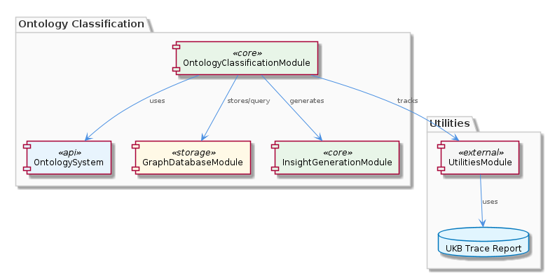
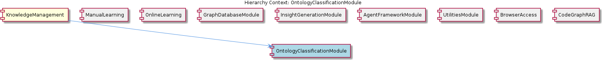

# OntologyClassificationModule

**Type:** SubComponent

OntologyClassificationModule relies on the constraint configuration guide in integrations/mcp-constraint-monitor/docs/constraint-configuration.md.

## What It Is  

The **OntologyClassificationModule** lives inside the **KnowledgeManagement** component and is the engine that assigns semantic classifications to incoming entities. It draws on the central **OntologySystem** to evaluate an entity’s declared type and its associated properties, producing a structured classification that downstream services can consume. The module’s behavior is governed by the constraint definitions found in the **integrations/mcp-constraint-monitor/docs/constraint-configuration.md** file, ensuring that only entities meeting the prescribed rules are accepted into the knowledge graph. Once classified, the module hands the results off to the **GraphDatabaseModule** for persistence and later retrieval, and it also supplies the classified payload to the **InsightGenerationModule**, which turns the raw classifications into higher‑level insights. Throughout this pipeline the **UtilitiesModule** provides the UKB trace report, a diagnostic artifact that records each processing step for auditability.

---

## Architecture and Design  

OntologyClassificationModule is built as a **modular, pipeline‑oriented component** that sits between raw data ingestion and downstream knowledge‑graph services.  Its design follows a clear **separation‑of‑concerns** strategy:

1. **Classification Layer** – leverages the OntologySystem to map entity types and properties to ontology concepts.  
2. **Constraint Layer** – consults the constraint‑configuration guide ( `integrations/mcp-constraint-monitor/docs/constraint-configuration.md` ) to enforce business rules before an entity is admitted.  
3. **Persistence Layer** – delegates storage and query responsibilities to the GraphDatabaseModule, which itself uses the GraphDatabaseAdapter described in the KnowledgeManagement parent component.  
4. **Insight Layer** – forwards classified data to InsightGenerationModule, which enriches it with actionable observations.  

The module also incorporates **observability** via the UKB trace report supplied by UtilitiesModule, allowing developers to trace the exact path an entity took through the classification pipeline.  

This arrangement yields a **layered architecture** where each responsibility is encapsulated behind a well‑defined interface, minimizing coupling and making it straightforward to swap or extend any layer independently.

### Architectural Patterns Identified  

- **Modular decomposition** – each functional concern (ontology lookup, constraint validation, persistence, insight generation) lives in its own module.  
- **Pipeline processing** – entities flow sequentially through classification → validation → storage → insight generation.  
- **Configuration‑driven validation** – constraints are externalized in a markdown file, allowing non‑code changes to affect runtime behavior.  

---

## Implementation Details  

Although the source repository does not expose concrete class or function names for OntologyClassificationModule, the observations reveal the key implementation touch‑points:

* **OntologySystem integration** – the module calls into the OntologySystem API (likely a service or library) to resolve an entity’s semantic type based on its properties. This step produces a canonical classification that other components understand.  

* **Constraint configuration** – before persisting a classification, the module reads the **constraint‑configuration.md** document. The file enumerates allowed type‑property combinations, required fields, and any business‑logic limits. By parsing this markdown at startup (or on‑demand), the module can enforce rules without recompilation.  

* **GraphDatabaseModule interaction** – once an entity passes validation, the module invokes GraphDatabaseModule’s storage APIs. Because GraphDatabaseModule relies on the **GraphDatabaseAdapter** (implemented in `integrations/mcp-server-semantic-analysis/src/storage/graph-database-adapter.ts`), OntologyClassificationModule indirectly benefits from the adapter’s automatic JSON export sync and LevelDB/Graphology consistency guarantees.  

* **InsightGenerationModule hand‑off** – the classified entity payload is forwarded to InsightGenerationModule, which uses the same UKB trace report (from UtilitiesModule) to enrich its output with provenance data.  

* **UKB trace report usage** – UtilitiesModule provides a trace report that logs each processing stage (e.g., “ontology lookup completed”, “constraint check passed”). The module captures this report and attaches it to the stored entity, enabling downstream debugging and audit trails.  

These interactions form a tightly coordinated workflow that maximizes reuse of existing infrastructure while keeping the classification logic focused and testable.

---

## Integration Points  

1. **Constraint Configuration (Integrations → mcp‑constraint‑monitor)** – the markdown file acts as the source of truth for validation rules. Any change to this file immediately influences classification outcomes.  

2. **GraphDatabaseModule** – the primary persistence partner. Because GraphDatabaseModule itself depends on the GraphDatabaseAdapter, OntologyClassificationModule indirectly inherits the adapter’s durability guarantees and JSON export sync behavior described in the KnowledgeManagement parent.  

3. **InsightGenerationModule** – consumes the classified entities to produce higher‑level insights. This sibling relationship means that any enhancements to InsightGenerationModule (e.g., new insight types) can be leveraged without altering OntologyClassificationModule.  

4. **UtilitiesModule (UKB trace report)** – provides observability data that both OntologyClassificationModule and InsightGenerationModule embed in their outputs, facilitating cross‑component tracing.  

5. **Parent Component – KnowledgeManagement** – the module contributes classified entities to the broader knowledge graph managed by KnowledgeManagement, aligning with the component’s overall goal of maintaining a consistent, queryable ontology‑driven data store.  

Developers integrating new entity sources should ensure that those sources produce data compatible with the OntologySystem’s expected schema and that any required constraints are reflected in the configuration markdown.

---

## Usage Guidelines  

* **Keep the constraint configuration up‑to‑date** – before deploying new entity types, edit `integrations/mcp-constraint-monitor/docs/constraint-configuration.md` to reflect the allowed property sets. This avoids runtime rejections and keeps validation logic transparent to non‑engineers.  

* **Leverage the UKB trace report** – when debugging classification failures, consult the trace attached to the entity. It pinpoints whether the failure occurred during ontology lookup, constraint validation, or persistence.  

* **Treat the module as a black‑box service** – callers should supply raw entities and rely on the module to return a classified object (or an error). Do not attempt to bypass the constraint checks; instead, adjust the configuration if a new rule is needed.  

* **Version‑control the ontology definitions** – because OntologyClassificationModule depends on the OntologySystem, any changes to the underlying ontology should be versioned and coordinated with the module’s deployment schedule.  

* **Monitor GraphDatabaseModule health** – since persistence is a downstream dependency, ensure that the GraphDatabaseAdapter’s LevelDB/Graphology store is healthy; otherwise, classification will succeed but storage will fail, leading to inconsistencies.  

---

### Summary of Key Insights  

| Aspect | Insight |
|--------|---------|
| **Architectural patterns identified** | Modular decomposition, pipeline processing, configuration‑driven validation |
| **Design decisions and trade‑offs** | Externalizing constraints to markdown enables rapid rule changes (trade‑off: runtime parsing overhead). Relying on shared GraphDatabaseAdapter centralizes persistence logic but creates an indirect dependency that must be kept stable. |
| **System structure insights** | OntologyClassificationModule sits at the nexus of ontology lookup, validation, persistence, and insight generation, acting as the semantic “gatekeeper” for KnowledgeManagement. |
| **Scalability considerations** | The pipeline can be parallelized per entity because each stage is stateless aside from the shared graph store; however, the GraphDatabaseAdapter’s LevelDB backend may become a bottleneck under very high write loads, suggesting the need for sharding or write‑batching strategies. |
| **Maintainability assessment** | High maintainability due to clear separation of concerns and configuration‑driven rules. The lack of hard‑coded constraints reduces code churn. The main maintenance burden lies in keeping the OntologySystem and constraint markdown in sync with evolving business requirements. |

By adhering to the guidelines above and respecting the documented integration contracts, developers can extend or replace parts of the OntologyClassificationModule with minimal impact on the surrounding KnowledgeManagement ecosystem.

## Hierarchy Context

### Parent
- [KnowledgeManagement](./KnowledgeManagement.md) -- [LLM] The KnowledgeManagement component utilizes a GraphDatabaseAdapter for persistence, which is implemented in the file integrations/mcp-server-semantic-analysis/src/storage/graph-database-adapter.ts. This adapter provides an interface for agents to interact with the central Graphology + LevelDB knowledge graph. The adapter also includes automatic JSON export sync, ensuring that the knowledge graph remains up-to-date. Furthermore, the migrateGraphDatabase script, located in scripts/migrate-graph-db-entity-types.js, is used to update entity types in the live LevelDB/Graphology database, demonstrating a clear focus on data consistency and integrity.

### Siblings
- [ManualLearning](./ManualLearning.md) -- ManualLearning relies on the migrateGraphDatabase script in scripts/migrate-graph-db-entity-types.js to update entity types in the live LevelDB/Graphology database.
- [OnlineLearning](./OnlineLearning.md) -- OnlineLearning uses the Code Graph RAG system in integrations/code-graph-rag to extract knowledge from codebases.
- [GraphDatabaseModule](./GraphDatabaseModule.md) -- GraphDatabaseModule uses the GraphDatabaseAdapter to interact with the Graphology + LevelDB knowledge graph.
- [InsightGenerationModule](./InsightGenerationModule.md) -- InsightGenerationModule uses the UKB trace report from the UtilitiesModule to generate insights.
- [AgentFrameworkModule](./AgentFrameworkModule.md) -- AgentFrameworkModule uses the agent development guide in integrations/copi/docs/hooks.md to provide a framework for agent development.
- [UtilitiesModule](./UtilitiesModule.md) -- UtilitiesModule uses the checkpoint system to track progress and ensure data consistency.
- [BrowserAccess](./BrowserAccess.md) -- BrowserAccess uses the browser access guide in integrations/browser-access/README.md to provide browser access to the MCP server.
- [CodeGraphRAG](./CodeGraphRAG.md) -- CodeGraphRAG uses the code-graph-rag guide in integrations/code-graph-rag/README.md to provide a graph-based RAG system.

---

*Generated from 5 observations*
