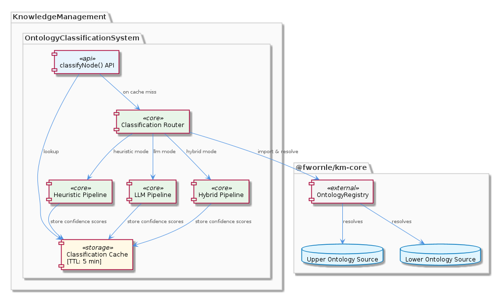
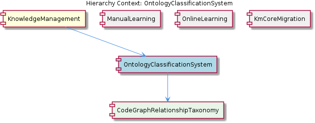

# OntologyClassificationSystem

**Type:** SubComponent

The classification cache within OntologyClassificationSystem applies a 5-minute TTL policy, meaning repeated calls to classifyNode() with identical input will return cached confidence scores rather than re-invoking the LLM or heuristic pipeline.

# OntologyClassificationSystem — Technical Insight Document

## What It Is

OntologyClassificationSystem is a SubComponent of KnowledgeManagement responsible for classifying graph nodes against both upper and lower ontologies sourced via the `OntologyRegistry` import from `@fwornle/km-core`. It serves as the dispatch layer that takes a classification request, resolves the appropriate ontology context, and routes the work to one of three configured classification methods: **heuristic**, **llm**, or **hybrid**. The component exposes a `classifyNode()` entry point whose results are memoized through an internal cache with a 5-minute TTL.

Within the broader KnowledgeManagement hierarchy, OntologyClassificationSystem sits alongside siblings ManualLearning, OnlineLearning, and KmCoreMigration, and it contains one child component, CodeGraphRelationshipTaxonomy, which supplies the two-tier ontological model (structural containment versus semantic definition) over which classification decisions are made.

## Architecture and Design

The architecture follows a **strategy dispatch pattern** layered behind a caching facade. At the front, `classifyNode()` acts as the single public surface; behind it, a registry resolution step (via the imported `OntologyRegistry` from `@fwornle/km-core`) fetches both upper and lower ontology sources before the request is dispatched to the configured strategy. The three strategies — heuristic, llm, and hybrid — are interchangeable at configuration time, which keeps lighter heuristic paths viable for cheap or offline classification while preserving LLM-driven precision when needed. The hybrid mode implies a composition of the two, though the observations do not specify its internal weighting policy.

A second architectural concern is the **time-bounded memoization layer**. The 5-minute TTL cache wraps `classifyNode()`, so identical inputs short-circuit to a stored confidence score rather than re-invoking the underlying heuristic or LLM pipeline. This is a deliberate trade-off: the design favors throughput and cost containment (especially valuable when the LLM strategy is active) over freshness guarantees within the 5-minute window. Because the cache key is the classification input itself, callers who require freshly computed scores must either wait out the TTL or vary their input.

The child component CodeGraphRelationshipTaxonomy contributes the canonical relationship vocabulary against which classification occurs — the seven documented types (CONTAINS_PACKAGE, CONTAINS_FOLDER, CONTAINS_FILE, CONTAINS_MODULE, DEFINES, DEFINES_METHOD, DEPENDS_ON_EXTERNAL) form the discrete output space that the strategies must map nodes into. This tight pairing between OntologyClassificationSystem (the runtime classifier) and CodeGraphRelationshipTaxonomy (the schema being classified against) is the core internal contract of the component.

## Implementation Details

The central runtime concern is the resolution flow inside `classifyNode()`. On invocation, the function consults the TTL cache first; on a miss, it uses `OntologyRegistry` (imported from `@fwornle/km-core`) to resolve both the upper ontology and the lower ontology relevant to the input. Once both ontology sources are in hand, the request is dispatched to the configured method:

- **heuristic** — deterministic rule-based classification, presumably cheap and offline.
- **llm** — model-driven classification, more expensive but more flexible.
- **hybrid** — combined application of both signals.

Each path returns a confidence score, which is what the cache ultimately stores. The 5-minute TTL is a uniform policy applied across all three strategies; there is no observed differentiation in cache lifetime by method, meaning even cheap heuristic results are cached as aggressively as expensive LLM results.

The classification target — the relationship taxonomy — is owned by the child CodeGraphRelationshipTaxonomy, which divides relationship types into two tiers: **structural containment** (the CONTAINS_* family plus DEPENDS_ON_EXTERNAL) and **semantic definition** (DEFINES, DEFINES_METHOD). Classifiers therefore implicitly operate over this bi-modal label space when assigning a node to a relationship type.

## Integration Points

The most important integration is the dependency on `@fwornle/km-core`, specifically its `OntologyRegistry` export. This coupling means OntologyClassificationSystem does not own its ontology sources — it consumes them — and any change in the km-core registry API directly affects how upper/lower ontologies are resolved here. This integration is consistent with the broader migration narrative implied by the sibling KmCoreMigration component, which suggests an ongoing consolidation of shared infrastructure into the km-core package.

Internally, OntologyClassificationSystem integrates downward with CodeGraphRelationshipTaxonomy, which defines the seven-type relationship vocabulary that classification outputs conform to. Upward, it lives under KnowledgeManagement, whose `GraphDatabaseAdapter` (at `src/storage/graph-database-adapter.ts`) governs how knowledge-management writes are routed — either through the VKB HTTP API or directly into LevelDB. While the observations do not explicitly state that OntologyClassificationSystem writes through this adapter, any persisted classification results within the KnowledgeManagement subsystem would inherit that adapter's dual-routing behavior.

The siblings serve complementary roles: ManualLearning and OnlineLearning likely produce the very nodes and edges that OntologyClassificationSystem then classifies, while KmCoreMigration tracks the broader transition that exposes shared types (like `OntologyRegistry`) through km-core.

## Usage Guidelines

When invoking `classifyNode()`, developers should be aware that **identical inputs within a 5-minute window will return cached confidence scores** rather than fresh classifications. This is the correct default for most pipelines — it eliminates redundant LLM calls and stabilizes scores across rapid re-<USER_ID_REDACTED> — but it means that any test or workflow that mutates an upstream ontology and immediately reclassifies must either wait out the TTL, invalidate the cache, or vary the input to bypass memoization.

The choice of classification method should be deliberate. The heuristic mode is appropriate when classification rules are well-understood and cost matters; the llm mode is appropriate when the input space is too varied for rules to cover; the hybrid mode is the natural choice when neither alone suffices. Because all three modes share the same cache and the same TTL, switching methods does not flush stored results — the cache is method-agnostic with respect to keying.

Because OntologyClassificationSystem relies on `OntologyRegistry` from `@fwornle/km-core`, developers extending or modifying this component should treat km-core as the source of truth for ontology shape. New ontology sources should be registered there, not added ad hoc inside OntologyClassificationSystem. Similarly, when the relationship vocabulary needs to evolve, changes should flow through the child CodeGraphRelationshipTaxonomy so that the two-tier structural/semantic distinction remains the canonical schema.

---

### Summary Findings

1. **Architectural patterns identified**: strategy dispatch (heuristic/llm/hybrid), TTL-based memoization facade, registry-driven resource resolution, and a two-tier taxonomy (structural vs. semantic) supplied by the child component.
2. **Design decisions and trade-offs**: the 5-minute TTL trades freshness for cost and throughput; method selection is configuration-driven rather than per-call, simplifying call sites but limiting fine-grained control; ontology ownership is externalized to `@fwornle/km-core`, reducing local responsibility but creating an upstream dependency.
3. **System structure insights**: classification is cleanly separated from taxonomy definition (CodeGraphRelationshipTaxonomy) and from ontology sourcing (`OntologyRegistry`), giving a three-layer composition — schema, sources, dispatch.
4. **Scalability considerations**: the TTL cache is the primary scalability lever, particularly under the llm strategy where per-call cost is non-trivial; uniform TTL across methods may overcache heuristic results unnecessarily but is unlikely to be a hotspot.
5. **Maintainability assessment**: maintainability is supported by the externalization of ontology definitions to km-core and the encapsulation of the relationship vocabulary in CodeGraphRelationshipTaxonomy; the chief risk is implicit coupling to the km-core `OntologyRegistry` API surface, which the sibling KmCoreMigration component appears to be actively shaping.

## Hierarchy Context

### Parent
- [KnowledgeManagement](./KnowledgeManagement.md) -- [LLM] The GraphDatabaseAdapter (src/storage/graph-database-adapter.ts) implements a lock-free dual-routing pattern that is central to the component's ability to run multiple concurrent processes without LevelDB file-lock collisions. At runtime, the adapter dynamically imports VkbApiClient and calls isServerAvailable() to probe whether a live VKB HTTP server is reachable. If the probe succeeds, all write and read operations are routed through the REST API, meaning the LevelDB file is exclusively owned by the VKB server process and agent workers never open it directly. If the probe fails—because the server is stopped or not yet started—the adapter falls back to direct GraphDatabaseService+LevelDB access. This design deliberately avoids any static configuration toggle, instead making the routing decision dynamically at call time, which means a developer starting the VKB server mid-session will transparently shift all subsequent operations to the API path without restarting agent workers. The practical consequence is that teams can run the VKB server in a long-lived terminal while agent workflows execute in parallel, and the system self-coordinates. The debounce-based GraphKnowledgeExporter (dynamically imported from src/knowledge-management/GraphKnowledgeExporter.js, 2000ms debounce) is only attached and triggered on the direct LevelDB path, ensuring JSON export files under .data/knowledge-export stay synchronized only when the adapter is writing directly, and are not double-written when the VKB server is managing its own export lifecycle.

### Children
- [CodeGraphRelationshipTaxonomy](./CodeGraphRelationshipTaxonomy.md) -- The project documentation explicitly enumerates seven core relationship types as key documented components — CONTAINS_PACKAGE, CONTAINS_FOLDER, CONTAINS_FILE, CONTAINS_MODULE, DEFINES, DEFINES_METHOD, and DEPENDS_ON_EXTERNAL — establishing a two-tier ontological classification of structural containment versus semantic definition.

### Siblings
- [ManualLearning](./ManualLearning.md) -- ManualLearning is a sub-component of KnowledgeManagement
- [OnlineLearning](./OnlineLearning.md) -- OnlineLearning is a sub-component of KnowledgeManagement
- [KmCoreMigration](./KmCoreMigration.md) -- KmCoreMigration is a sub-component of KnowledgeManagement

---

*Generated from 3 observations*
