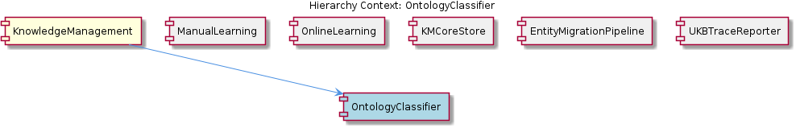

# OntologyClassifier

**Type:** SubComponent

PersistenceAgent (in the MCP server semantic analysis pipeline) pre-populates entityType and metadata.ontologyClass fields before storage, reducing redundant LLM classification calls for already-known types

# OntologyClassifier — Technical Reference

## What It Is

OntologyClassifier is a classification sub-component within the KnowledgeManagement system, operating as a discrete step inside the OnlineLearning batch analysis pipeline. Its core responsibility is to receive raw extracted entities and annotate each with an `ontologyClass` value drawn from the canonical ontology registry defined in `.data/ontologies/coding-ontology.json`. This JSON file serves as the authoritative source of valid ontology class paths — the vocabulary against which all incoming entity type strings are matched.

The component sits between raw entity extraction and durable storage: it consumes unclassified entity records and emits classified records that KMCoreStore can persist into the GraphKMStore (Graphology + LevelDB). Downstream, UKBTraceReporter consumes its output signals to record classification success and failure rates as part of the full pipeline lineage trace.

## Architecture and Design

OntologyClassifier embodies a **registry-driven classification pattern**: classification validity is entirely determined by a static, file-backed ontology definition (`.data/ontologies/coding-ontology.json`) rather than by dynamic inference alone. This is a deliberate design constraint — the ontology file enumerates the legal class paths, and the classifier's job is string matching against that closed vocabulary. This makes classification behavior predictable, auditable, and decoupled from model variability.

The pipeline position of OntologyClassifier reflects a clear separation of concerns within OnlineLearning's DAG-based step execution model. OnlineLearning describes its stages via explicit `depends_on` edges (as referenced in `batch-analysis.yaml`), and OntologyClassifier occupies the classification stage — after extraction but before persistence. This ordering ensures KMCoreStore only ever receives ontologically annotated records, keeping persistence concerns clean of classification logic.

A notable architectural trade-off is the **fail-soft approach to unmatched entities**: rather than rejecting or discarding entities that cannot be matched to a registered class, OntologyClassifier flags them with `metadata.ontologyClassUnregistered=true`. This preserves the record for triage while clearly marking it as incomplete. The flag is queryable via GraphDatabaseService, enabling operators to identify and remediate unregistered classes without losing data. The cost of this approach is that the knowledge graph can accumulate partially-classified nodes, which downstream consumers (including graph traversal <USER_ID_REDACTED> in GraphDatabaseService) must account for.

## Implementation Details

The ontology vocabulary is grounded in `.data/ontologies/coding-ontology.json`, which enumerates valid `ontologyClass` path strings. The classifier's matching logic operates against this registry: for each incoming entity, it attempts to resolve the entity's type string to an entry in the ontology. A successful match results in the `metadata.ontologyClass` field being populated on the outgoing record. A failed match results in `metadata.ontologyClassUnregistered=true` being set instead.

An important efficiency mechanism is the **pre-population contract with PersistenceAgent**. When entities pass through the MCP server's semantic analysis pipeline, PersistenceAgent pre-populates both `entityType` and `metadata.ontologyClass` fields prior to storage. This means OntologyClassifier can skip redundant LLM-based classification calls for entity types that are already known — it only needs to perform active classification for genuinely novel or ambiguous types. This is a meaningful optimization given that LLM calls are the expensive operation in the pipeline.

Classification output flows in two directions: forward into KMCoreStore for persistence via GraphKMStore, and laterally into UKBTraceReporter, which consumes per-run classification success/failure counts as part of its structured trace document. This dual-output design means classification <USER_ID_REDACTED> is automatically surfaced in every workflow's lineage record, giving operators ongoing visibility into ontology coverage gaps without requiring separate instrumentation.

## Integration Points

OntologyClassifier's primary upstream dependency is the OnlineLearning batch pipeline, which delivers raw extracted entities as input. Its primary downstream dependency is KMCoreStore — specifically GraphKMStore — which persists the annotated records into the Graphology/LevelDB store. The relationship to KMCoreStore is effectively a handoff: OntologyClassifier annotates, KMCoreStore persists.

The connection to UKBTraceReporter is a reporting integration rather than a data flow dependency. UKBTraceReporter's implementation in `ukb-trace-report.ts` consumes classification outcome signals to build the structured trace document for a workflow run. This makes OntologyClassifier's performance metrics a first-class part of the data lineage record maintained by KnowledgeManagement.

The `metadata.ontologyClassUnregistered=true` flag creates an implicit integration point with GraphDatabaseService: nodes carrying this flag are queryable via GraphDatabaseService APIs, establishing a triage workflow for ontology gaps. This connects OntologyClassifier's failure mode directly to the operational tooling used by both CLI tools and the MCP server pipeline to inspect the knowledge graph state. The parent KnowledgeManagement component's support for three canonical entity types — System, Project, and Pattern — also frames the ontology scope that `.data/ontologies/coding-ontology.json` must cover, linking OntologyClassifier's vocabulary directly to the consolidation work done by EntityMigrationPipeline.

## Usage Guidelines

Developers extending or maintaining OntologyClassifier should treat `.data/ontologies/coding-ontology.json` as the single source of truth for valid class paths. Any new entity type that should be classifiable must be registered in this file before the classifier can successfully match it — the classifier does not infer new classes, it only matches against registered ones. Unregistered types will be flagged rather than rejected, so omitting a registration will result in silent degradation (records stored but marked unregistered) rather than a hard error.

The `metadata.ontologyClassUnregistered=true` flag should be treated as a first-class operational signal. GraphDatabaseService <USER_ID_REDACTED> against this flag are the intended triage mechanism, and periodic review of flagged nodes is the expected workflow for keeping the ontology registry current with the evolving entity landscape.

Because PersistenceAgent pre-populates `ontologyClass` for known types before records reach the batch pipeline, developers should be careful not to double-classify entities that already carry valid annotations. The classifier should respect pre-populated `metadata.ontologyClass` values as authoritative when present, invoking active classification only when the field is absent or the type is unrecognized. This contract between PersistenceAgent and OntologyClassifier is what keeps LLM call volume bounded as the knowledge graph scales.

## Hierarchy Context

### Parent
- [KnowledgeManagement](./KnowledgeManagement.md) -- The KnowledgeManagement component provides the persistent knowledge graph infrastructure for the Coding project, combining Graphology (in-memory graph) with LevelDB (on-disk persistence) to store, query, and manage structured knowledge entities. It supports three consolidated entity types—System, Project, and Pattern—and handles the full lifecycle of knowledge including creation, decay tracking, and migration between schema versions. The component is accessed primarily through the GraphDatabaseService class, which exposes graph traversal, statistics, and direct node manipulation APIs used by both CLI tools and the MCP server semantic analysis pipeline.

### Siblings
- [ManualLearning](./ManualLearning.md) -- ManualLearning entities are distinguished from OnlineLearning entities by provenance metadata, allowing GraphDatabaseService to filter or weight human-curated knowledge separately during graph traversal <USER_ID_REDACTED>
- [OnlineLearning](./OnlineLearning.md) -- OnlineLearning is driven by a batch analysis pipeline (referenced as batch-analysis.yaml in project docs) that uses a DAG-based step execution model with explicit depends_on edges between analysis stages
- [KMCoreStore](./KMCoreStore.md) -- GraphKMStore is the central persistence class combining Graphology in-memory graph with LevelDB on-disk storage, accessed primarily through GraphDatabaseService for graph traversal and node manipulation
- [EntityMigrationPipeline](./EntityMigrationPipeline.md) -- migrate-graph-db-entity-types.js handles entity type consolidation, collapsing legacy type diversity into the three canonical types (System, Project, Pattern) during migration
- [UKBTraceReporter](./UKBTraceReporter.md) -- ukb-trace-report.ts is the primary implementation file, producing structured trace documents that record each pipeline stage's input/output counts for a given workflow run

---

*Generated from 5 observations*
