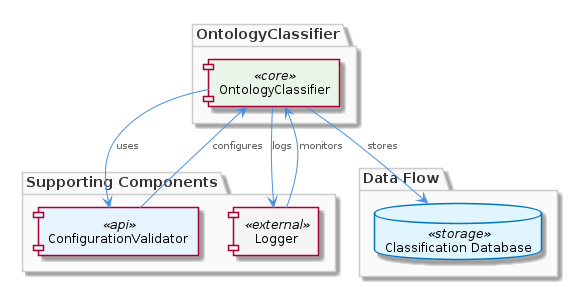
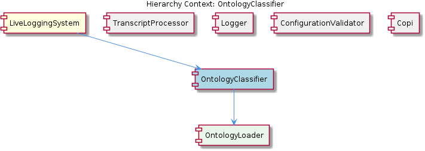

# OntologyClassifier

**Type:** SubComponent

The OntologyClassifier is configurable, allowing for customization of classification settings through the ConfigurationValidator component.

## What It Is  

The **OntologyClassifier** is a sub‑component of the **LiveLoggingSystem**.  It lives inside the LiveLoggingSystem package (the exact file path is not enumerated in the observations, but it is referenced as a child of *LiveLoggingSystem* and a parent of *OntologyLoader*).  Its primary responsibility is to take raw observations and produce a **standardized classification** that can be consumed by downstream services.  The classifier is deliberately **modular**: it can plug‑in different ontology back‑ends and classification algorithms without requiring changes to its public contract.  Configuration of the classification process is delegated to the **ConfigurationValidator** component, while all error and exception reporting is funneled through the shared **Logger** implementation used throughout the system.

## Architecture and Design  

The design of OntologyClassifier follows a **modular, plug‑in architecture**.  The component defines a **standardized classification interface** that abstracts away the specifics of any particular ontology system.  Because the LiveLoggingSystem already adopts a modular layout—evident from sibling components such as *TranscriptProcessor*, *Logger*, *ConfigurationValidator*, and *Copi*—OntologyClassifier inherits this philosophy, exposing clear extension points for new ontology loaders (see its child *OntologyLoader*).  

Interaction flows are straightforward:

1. A classification request arrives (often from the LiveLoggingSystem’s logging pipeline).  
2. The request is passed to OntologyClassifier, which consults its **configuration** validated by the *ConfigurationValidator* script in the `scripts` folder.  
3. OntologyClassifier delegates ontology‑specific loading to its child **OntologyLoader**.  
4. Classification is performed, results are **validated** for accuracy, and a **standardized format** is emitted.  
5. Any errors encountered during these steps are recorded via the **Logger** located at `integrations/mcp-server-semantic-analysis/src/logging.ts`.

This flow is illustrated in the architecture diagram below, which shows the internal modules of OntologyClassifier and their connections to sibling services.  

The relationship diagram further clarifies how OntologyClassifier sits within the broader LiveLoggingSystem hierarchy, linking to its parent, siblings, and child component.  

### Architectural Patterns Identified
- **Modular / Plug‑in architecture** – separate, interchangeable ontology loaders.  
- **Standardized interface pattern** – a common contract for classification results.  
- **Configuration‑validation pattern** – external validator (ConfigurationValidator) ensures settings are correct before execution.  
- **Unified logging** – all components use the shared Logger interface.  

## Implementation Details  

Although the source repository does not expose concrete symbols for OntologyClassifier, the observations describe its key functional pieces:

* **Classification Engine** – Implements the core logic that maps raw observations to ontology classes.  It is designed for **high‑volume throughput**, suggesting the use of efficient data structures (e.g., hash maps) and possibly asynchronous processing to avoid bottlenecks.  

* **Standardized Classification Format** – The output adheres to a consistent schema, making it easy for downstream parsers.  This format is likely defined as a JSON or protobuf contract that all consumers of the classifier agree upon.  

* **Configuration Integration** – Settings such as which ontology system to use, confidence thresholds, and fallback strategies are validated by the **ConfigurationValidator** (implemented in the `scripts` folder via the LSLConfigValidator).  The classifier reads these validated settings at startup or per‑request, enabling runtime customization without code changes.  

* **Error Handling & Logging** – All exceptions flow through the **Logger** (`integrations/mcp-server-semantic-analysis/src/logging.ts`).  This ensures a unified log stream across LiveLoggingSystem, facilitating observability and debugging.  

* **Result Validation** – After classification, OntologyClassifier runs a validation step to confirm that the predicted classes meet accuracy criteria.  This may involve cross‑checking against a known ontology schema or applying sanity rules (e.g., no empty classifications).  

* **Child Component – OntologyLoader** – OntologyLoader abstracts the retrieval of ontology data (e.g., loading RDF files, querying a knowledge graph, or interfacing with external services).  By delegating this responsibility, OntologyClassifier remains agnostic to the source of ontology definitions, reinforcing its modular nature.

## Integration Points  

OntologyClassifier is tightly coupled with several sibling components of LiveLoggingSystem:

* **LiveLoggingSystem (Parent)** – Acts as the orchestrator; classification results are typically injected back into the logging pipeline for enrichment of log entries.  

* **ConfigurationValidator (Sibling)** – Provides the validated configuration object that OntologyClassifier consumes.  Changes to validation rules directly affect classification behavior.  

* **Logger (Sibling)** – All diagnostic output, including classification errors, performance metrics, and audit trails, are emitted through this shared logger.  

* **TranscriptProcessor (Sibling)** – While primarily focused on transcript conversion, it may feed raw observations to OntologyClassifier when semantic analysis of transcript content is required.  

* **OntologyLoader (Child)** – Supplies the actual ontology definitions.  If a new ontology source is required (e.g., a proprietary knowledge graph), developers extend OntologyLoader without touching the classifier core.  

No explicit external APIs are mentioned, but the standardized classification format implies that downstream services can consume the output via simple HTTP/JSON interfaces or internal message queues used elsewhere in LiveLoggingSystem.

## Usage Guidelines  

1. **Configure Before Use** – Always run the *ConfigurationValidator* (the LSLConfigValidator script) after any change to classification settings.  The validator will surface missing parameters or invalid values before OntologyClassifier processes requests.  

2. **Leverage the Standard Interface** – When integrating new ontology systems, implement a concrete subclass of **OntologyLoader** that adheres to the loader contract expected by OntologyClassifier.  Register this loader through the configuration so the classifier can discover it at runtime.  

3. **Monitor Through Logger** – Because all errors funnel through the unified Logger, set up appropriate log aggregation (e.g., ELK stack) to capture classification failures and performance warnings.  This is essential for maintaining the high‑volume processing guarantees.  

4. **Validate Classification Results** – Do not bypass the built‑in result validation step.  If custom validation logic is required, extend the existing validation hook rather than removing it, to preserve reliability guarantees.  

5. **Respect Modularity** – Keep any custom classification logic isolated within plug‑in modules.  Direct modifications to the core OntologyClassifier code risk breaking the standardized format and may affect sibling components that rely on its contract.  

---

### Design Decisions and Trade‑offs  

* **Modularity vs. Complexity** – By abstracting ontology loading and classification behind interfaces, the system gains extensibility at the cost of additional indirection and the need for thorough contract testing.  
* **Standardized Output vs. Flexibility** – Enforcing a single classification schema simplifies downstream consumption but may limit expressive power for niche ontologies; extensions must map back to the standard format.  
* **Configuration Validation Up‑front** – Validating settings before execution prevents runtime errors but introduces a dependency on the *ConfigurationValidator* script, making deployment pipelines responsible for running validation steps.  
* **High‑Volume Processing** – Optimizing for throughput (e.g., async pipelines) improves scalability but can increase memory pressure; careful resource monitoring is required.  

### System Structure Insights  

OntologyClassifier sits at the intersection of **configuration**, **ontology data**, and **logging** within LiveLoggingSystem.  Its child *OntologyLoader* isolates data‑source concerns, while sibling components provide cross‑cutting services (validation, logging, transcript handling).  This layered structure mirrors the overall modular architecture of LiveLoggingSystem, promoting clear separation of concerns.  

### Scalability Considerations  

* **Asynchronous Request Handling** – To sustain high request rates, the classifier likely processes requests in a non‑blocking fashion, allowing the logging pipeline to continue ingesting data.  
* **Cacheable Ontology Data** – OntologyLoader can cache loaded ontologies, reducing I/O latency for repeated classifications.  
* **Horizontal Scaling** – Because classification logic is stateless aside from configuration, multiple instances of OntologyClassifier can be deployed behind a load balancer to distribute load.  

### Maintainability Assessment  

The emphasis on **modular design**, **standardized interfaces**, and **centralized logging** enhances maintainability.  Adding new ontologies or tweaking classification rules does not require changes to the core classifier, limiting the blast radius of updates.  However, the reliance on external validation scripts and the absence of visible unit tests (not mentioned in observations) could become maintenance bottlenecks if validation rules evolve rapidly.  Overall, the component’s clear contract and separation from sibling services position it for easy long‑term upkeep.

## Hierarchy Context

### Parent
- [LiveLoggingSystem](./LiveLoggingSystem.md) -- [LLM] The LiveLoggingSystem component utilizes a modular architecture, with separate components for logging, transcript processing, and configuration validation. This is evident in the directory structure, where the 'integrations' folder contains subfolders for 'browser-access', 'code-graph-rag', and 'copi', each representing a distinct aspect of the system. For instance, the 'copi' subfolder contains files such as 'INSTALL.md' and 'USAGE.md', which provide installation and usage guidelines for the Copi component. The 'lib/agent-api' folder contains the TranscriptAdapter abstract base class, which is responsible for reading and converting transcripts from different agent formats. The 'scripts' folder contains the LSLConfigValidator, which is used for validating and optimizing LSL configuration. The logging module, located in 'integrations/mcp-server-semantic-analysis/src/logging.ts', provides a unified logging interface and is used throughout the system.

### Children
- [OntologyLoader](./OntologyLoader.md) -- The parent analysis suggests the existence of an OntologyLoader class, which is responsible for loading ontology systems.

### Siblings
- [TranscriptProcessor](./TranscriptProcessor.md) -- The TranscriptProcessor uses the TranscriptAdapter abstract base class in 'lib/agent-api' to read and convert transcripts from various agent formats.
- [Logger](./Logger.md) -- The Logger component is implemented in 'integrations/mcp-server-semantic-analysis/src/logging.ts', providing a unified logging interface.
- [ConfigurationValidator](./ConfigurationValidator.md) -- The ConfigurationValidator is implemented in the 'scripts' folder, using the LSLConfigValidator script to validate and optimize configuration.
- [Copi](./Copi.md) -- The Copi component is implemented in the 'integrations/copi' folder, providing a GitHub Copilot CLI wrapper with logging and Tmux integration.

---

*Generated from 7 observations*
