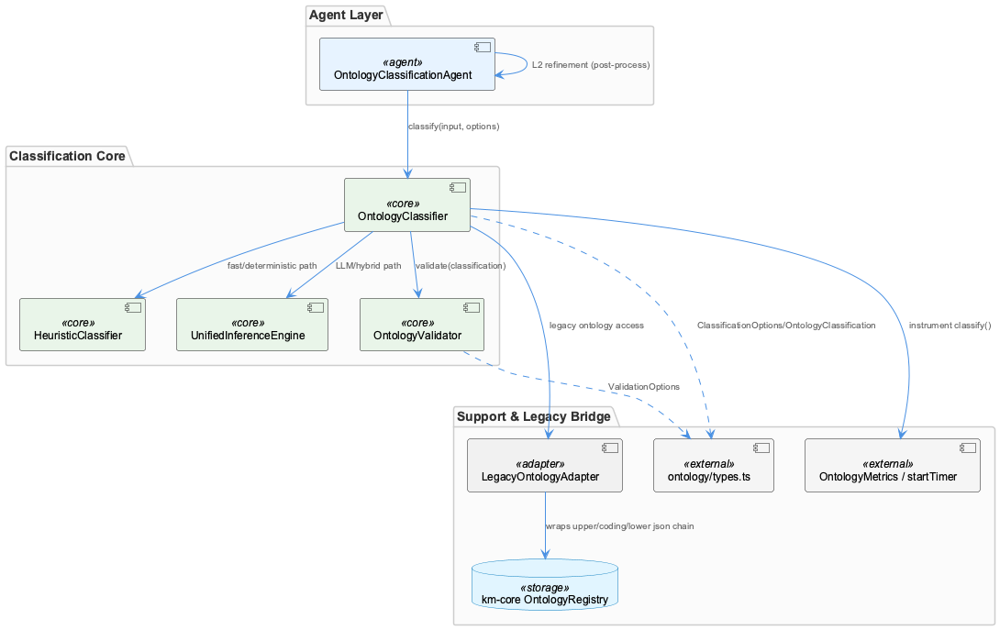
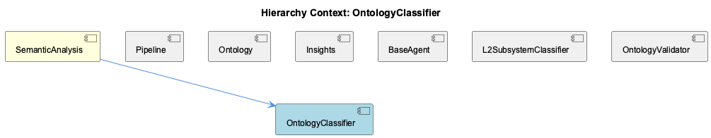

# OntologyClassifier

**Type:** SubComponent

# OntologyClassifier — Technical Insight Document

## What It Is

`OntologyClassifier` is a class defined in `OntologyClassifier.ts`, functioning as a SubComponent within the `SemanticAnalysis` pipeline. It acts as the L1 classification engine for observations moving through the pipeline, sitting directly below `OntologyClassificationAgent` in the call chain. Rather than implementing classification logic itself, it composes and dispatches to two collaborators: `HeuristicClassifier` (a deterministic, non-LLM strategy) and a `UnifiedInferenceEngine`-typed collaborator (an LLM-backed inference path), selecting between them — or blending both — based on `ClassificationOptions` supplied by callers such as `OntologyClassificationAgent.classifySingleObservation()`.

## Architecture and Design

The dominant pattern is **Strategy + Facade**: `OntologyClassifier` exposes a single `classify()` entry point while internally selecting among heuristic, LLM, and hybrid strategies. This mirrors the sibling `L2SubsystemClassifier`'s fallback-tolerant design philosophy, though at a different layer — L1 versus L2 refinement.

A second major pattern is the **Adapter**: `LegacyOntologyAdapter.ts` is imported to bridge km-core's `OntologyRegistry` (upper.json → coding-ontology.json → coding.lower.json chain) into the legacy interface shape `OntologyClassifier` and `OntologyValidator` were originally built against. This decouples the classifier from the km-core migration entirely — `OntologyClassifier` never consumes `OntologyRegistry` directly, so any future removal of the adapter requires changing the classifier's consumption contract directly, not just swapping data sources.

A third pattern is **two-stage pipeline**: classify (`OntologyClassifier`) then validate (`OntologyValidator`), sharing a common type contract (`ClassificationOptions`, `OntologyClassification`, `ValidationOptions`) from `ontology/types.ts`. This is distinct from and lower-level than the L2-refinement validation performed by the parent `OntologyClassificationAgent`.

Finally, a **tiered cost-avoidance** strategy spans the whole pipeline: hard-root-guard (agent layer, for the 5 `HIERARCHY_ROOTS`) → heuristic → LLM/hybrid (classifier layer) → optional L2 LLM refinement (agent layer, via `L2SubsystemClassifier`-adjacent logic). Cheap deterministic checks are layered in front of metered LLM calls throughout.

## Implementation Details

`OntologyClassifier.ts` imports `LegacyOntologyAdapter`, `HeuristicClassifier`, `OntologyValidator`, `OntologyMetrics`/`startTimer` from `metrics.ts`, and shared types from `ontology/types.ts`. `HeuristicClassifier` is a first-class imported collaborator, not an inline fallback — independently testable and mockable. Classification calls are instrumented directly at the dispatch point via `OntologyMetrics`/`startTimer`, meaning metrics capture only the cost of actual heuristic/LLM/hybrid work.

Critically, this means `OntologyMetrics` does not see the agent's hard-root-guard shortcut for `HIERARCHY_ROOTS` (CollectiveKnowledge, Coding, DynArch, Timeline, Normalisa) — that path never calls `classifier.classify()`, so dashboards built on classifier-level metrics will systematically undercount total classification attempts unless hard-root-guard hits are tracked separately upstream.

L2 refinement (narrowing L1 classes like Component/SubComponent/Detail to one of 10 specific `coding.lower.json` classes) is notably *not* part of `OntologyClassifier`'s own strategy abstraction — it's bolted on afterward at the agent layer (`loadL2Classes`, `buildL2RefinementPrompt`, `extractL2FromLLMResponse`), suggesting it was added later as a post-processing pass rather than integrated into the classifier's interface.

## Integration Points

`OntologyClassifier` is contained by `SemanticAnalysis` and is invoked by `OntologyClassificationAgent`, sibling to `BaseAgent`, `L2SubsystemClassifier`, `OntologyValidator`, `Pipeline`, `Ontology`, and `Insights`. It shares the `ontology/types.ts` type boundary with `OntologyValidator`, forming a coherent contract: `classify(input, options) -> OntologyClassification`, subsequently checked against `ValidationOptions`. Its dependency on km-core is fully indirected through `LegacyOntologyAdapter`, insulating it from upstream registry changes.

## Usage Guidelines

Developers extending classification behavior should recognize the L1/L2 layering split: strategy selection and validation belong in `OntologyClassifier`/`OntologyValidator`, while L2 refinement is agent-owned — a seam for potential future consolidation. When building metrics dashboards or budgets, account separately for hard-root-guard hits, since `OntologyMetrics` undercounts total classification volume. Any change to the km-core migration must go through `LegacyOntologyAdapter` rather than modifying `OntologyClassifier`'s consumption contract, preserving backward compatibility.

## Code Evidence

Key code artifacts grounding this entity's analysis:

**Structural:**
- OntologyClassifier (class) in OntologyClassifier.ts

**Relationships:**
- Imports: LegacyOntologyAdapter.ts, LegacyOntologyAdapter, HeuristicClassifier.ts, HeuristicClassifier, metrics.ts, OntologyMetrics, startTimer, OntologyValidator.ts, OntologyValidator, ontology/types.ts (+4 more)
- OntologyClassifier.ts imports both HeuristicClassifier.ts and a UnifiedInferenceEngine type from ontology/types.ts, which lines up with the parent-context description of OntologyClassifier supporting 'heuristic/LLM/hybrid' classification strategies. The class itself appears to act as a façade/strategy dispatcher: it does not itself implement token-boundary matching or embedding inference, but composes a HeuristicClassifier for fast/deterministic paths and delegates to a UnifiedInferenceEngine-typed collaborator for LLM-backed inference, selecting between them (or blending both) based on ClassificationOptions passed in by callers such as OntologyClassificationAgent.classifySingleObservation().
- OntologyClassifier.ts imports OntologyMetrics and startTimer from metrics.ts, indicating classification calls are instrumented at the point of dispatch rather than only at the agent layer. This is architecturally significant given the parent context's note that OntologyClassificationAgent short-circuits classification entirely for HIERARCHY_ROOTS via a 'hard-root-guard' path that never calls classifier.classify() — meaning OntologyMetrics captures only the cost of actual heuristic/LLM/hybrid work, not the free hard-root shortcut, so any dashboard or budget built on these metrics will systematically undercount total classification attempts unless it separately tracks hard-root-guard hits upstream in the agent.

**Other:**
- OntologyClassifier.ts (module) in OntologyClassifier.ts
- The dependency on OntologyValidator.ts (importing the OntologyValidator class) alongside OntologyClassifier.ts suggests classify-then-validate is a two-stage pipeline internal to this subcomponent, distinct from and lower-level than the L2-refinement validation described in the parent OntologyClassificationAgent observations. Because ValidationOptions is imported from the same ontology/types.ts module as ClassificationOptions and OntologyClassification, these three types likely form one coherent contract: OntologyClassifier.classify(input, options: ClassificationOptions) -> OntologyClassification, which OntologyValidator then checks against ValidationOptions before the result is trusted by the caller — a separation of concerns between 'produce a candidate classification' and 'confirm it is admissible against the loaded ontology chain'.
- The import of LegacyOntologyAdapter.ts into OntologyClassifier.ts is the concrete wiring point for the km-core migration described in the parent context: 'relies on km-core's OntologyRegistry ... wrapped via LegacyOntologyAdapter for backward compatibility with the existing OntologyValidator/OntologyClassifier.' This tells us OntologyClassifier was NOT rewritten to consume OntologyRegistry directly — it still expects the legacy interface shape, and LegacyOntologyAdapter is the sole seam translating km-core's upper.json → coding-ontology.json → coding.lower.json chain into whatever shape OntologyClassifier and OntologyValidator were originally built against. Any future removal of the adapter would require changing OntologyClassifier's constructor/consumption contract directly, not just swapping data sources.

## Hierarchy Context

### Parent
- [SemanticAnalysis](./SemanticAnalysis.md) -- SemanticAnalysis is a multi-agent pipeline (integrations/semantic-analysis/src/agents/) that processes git history, LSL sessions, and code-graph data to extract structured knowledge entities for the batch-analysis workflow. It centers on BaseAgent, an abstract class providing a standard execute() envelope (confidence scoring, issue detection, routing suggestions, corrections) that concrete agents like SemanticAnalysisAgent and OntologyClassificationAgent extend or compose with. The pipeline separates raw semantic extraction (SemanticAnalysisAgent, generating code analysis, cross-analysis insights, and LLM-derived architectural patterns) from ontology classification (OntologyClassificationAgent), which assigns ontology metadata to observations before persistence.

The OntologyClassificationAgent implements a layered classification strategy: a hard-root guard short-circuits LLM calls for the 5 fixed HIERARCHY_ROOTS (CollectiveKnowledge, Coding, DynArch, Timeline, Normalisa), assigning classificationMethod='hard-root-guard' without invoking the classifier. For non-root entities, classification flows through OntologyClassifier (heuristic/LLM/hybrid), and an additional L2 refinement step (loadL2Classes, buildL2RefinementPrompt, extractL2FromLLMResponse) attempts to narrow a generic L1 class (Component/SubComponent/Detail) to one of 10 specific L2 classes defined in .data/ontologies/coding.lower.json, falling back gracefully to L1 when the LLM declines or the lower-onto file is absent.

Architecturally, the component relies on km-core's OntologyRegistry for ontology chain resolution (upper.json → coding-ontology.json → coding.lower.json) wrapped via LegacyOntologyAdapter for backward compatibility with the existing OntologyValidator/OntologyClassifier. Tests (ontology-classification-agent.test.ts, ontology-classification-agent.hierarchy-roots.test.ts) use tmpdir-isolated ontology fixtures and mock classifiers to lock in behavior without live LLM calls, following the project's node:test + assert/strict convention.

### Siblings
- [Pipeline](./Pipeline.md) -- [CGR] pollKnowledgePipeline (function) in health-coordinator.js
- [Ontology](./Ontology.md) -- [CGR] ontology (variable) in knowledge-management.json
- [Insights](./Insights.md) -- [CGR] INSIGHTS (class) in kb-ab-sample-tasks.mjs
- [BaseAgent](./BaseAgent.md) -- [LLM] BaseAgent (base-agent.ts) is described as an abstract class implementing a template-method pattern: execute() is the fixed envelope that always runs process() → calculateConfidence() → detectIssues() → generateRouting() → applyCorrections() and folds the results into a single AgentResponse. This is a classic 'inversion of control' shape — concrete agents supply the domain-specific steps as overridable hooks, but the ORDER and the aggregation contract belong to the base class, not to each subclass. The practical consequence is that every agent in the pipeline (SemanticAnalysisAgent, OntologyClassificationAgent) produces a structurally identical response envelope regardless of what it actually analyzes, which is what lets downstream consumers (the batch-analysis workflow) treat agent output uniformly without per-agent branching.
- [L2SubsystemClassifier](./L2SubsystemClassifier.md) -- [LLM] The L2SubsystemClassifier's core mechanism is a fallback-tolerant refinement pass layered on top of OntologyClassificationAgent's primary L1 classification: loadL2Classes(registry) queries OntologyRegistry.classCatalog for any class whose `extends` field points at one of the three REFINABLE_L1_PARENTS (Component, SubComponent, Detail), and returns an empty array — rather than throwing — when coding.lower.json is absent from disk. This design choice means the L2 refinement step is architecturally optional and degrades to plain L1 classification silently, which trades discoverability of misconfiguration (a missing lower-ontology file produces no error, just quieter classification) for resilience across partial ontology deployments.
- [OntologyValidator](./OntologyValidator.md) -- [CGR] OntologyValidator (class) in ontology.ts

---

*Generated from 12 observations*
