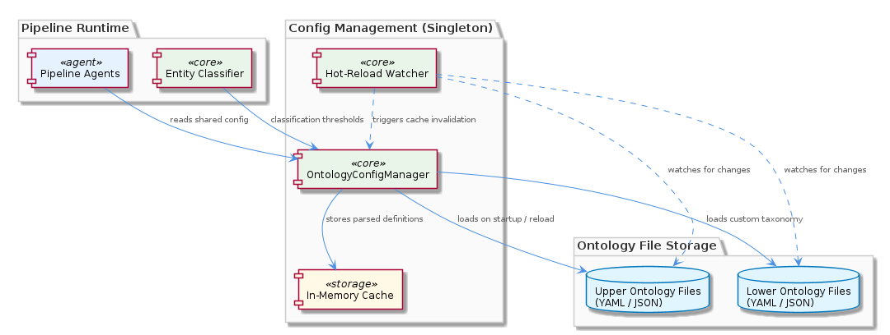
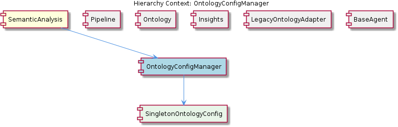

# OntologyConfigManager

**Type:** SubComponent

Hot-reload support allows updated ontology YAML/JSON files to be picked up at runtime, enabling taxonomy iteration without MCP server restarts—critical for iterative ontology development workflows

# OntologyConfigManager — Deep Technical Insight

## What It Is

`OntologyConfigManager` is a SubComponent within the `SemanticAnalysis` multi-agent pipeline housed in `integrations/mcp-server-semantic-analysis/`. As documented in `integrations/mcp-server-semantic-analysis/docs/configuration.md`, it is implemented as a singleton — materialized through its child entity `SingletonOntologyConfig` — and serves as the single authoritative source for ontology path resolution and classification threshold values used by every agent in the pipeline.

Functionally, the manager owns two distinct configurable file paths: one for the upper-ontology definition and one for the lower-ontology definition. This separation allows downstream projects to supply their own lower-ontology taxonomies (project-specific entity categories, custom classifiers, domain-specific vocabularies) without forcing modifications to the shared upper-ontology schema that all consumers depend on. Beyond path management, it caches parsed ontology definitions in memory and supports runtime hot-reloading so that taxonomy revisions become visible to running agents without an MCP server restart.

The component exists, in part, as the documented remediation for a problem captured in `CRITICAL-ARCHITECTURE-ISSUES.md`: prior to this centralization, ontology path references were scattered across multiple agents, producing inconsistent ontology loading and divergent classification behavior. `OntologyConfigManager` resolves that by making itself the only place where these settings are read, parsed, and cached.

## Architecture and Design

The dominant architectural pattern is the **Singleton pattern**, applied at the configuration layer. Within the broader `SemanticAnalysis` pipeline — which orchestrates specialized agents for git history ingestion, code graph construction, semantic insight generation, ontology classification, content validation, and persistence — every agent that needs to know "where is the ontology?" or "what is the classification threshold?" obtains those values from this one instance. The child component `SingletonOntologyConfig` is the concrete realization of that singleton contract, as described in `docs/configuration.md`.

A second pattern in evidence is **in-memory caching with event-driven invalidation**. Parsed ontology definitions (loaded from YAML or JSON files) are held in memory to eliminate redundant file I/O on the hot path of entity classification, which is called frequently by the ontology-classification agent. The cache is not stale-forever: hot-reload events trigger invalidation, after which the next access re-parses from disk. This trade-off — staleness windows bounded by reload events versus the cost of per-call file reads — is deliberately chosen to support iterative ontology development.

A third pattern is the **separation of upper and lower ontology configuration**. By exposing two independent paths rather than one monolithic ontology file, the design enforces a layered taxonomy model: a stable, shared upper ontology and a swappable, project-specific lower ontology. This is a classic configuration-by-composition decision that keeps the shared schema immutable from a consumer's perspective while still permitting taxonomy extension.

## Implementation Details

The implementation centers on the singleton instance materialized as `SingletonOntologyConfig`, the only child component of `OntologyConfigManager`. According to `docs/configuration.md`, this singleton is what guarantees that ontology paths and classification thresholds remain consistent across all pipeline agents without re-initialization — i.e., there is no per-agent bootstrap of configuration state that could drift between agents.

Internally, the manager exposes (a) the resolved upper-ontology path, (b) the resolved lower-ontology path, (c) configurable classification thresholds, and (d) accessors for parsed ontology definitions. The parsed-definition accessors are backed by the in-memory cache; on first call the underlying YAML/JSON is read and parsed, and on subsequent calls the parsed structure is returned directly. When a hot-reload signal fires (e.g., a watched file is updated), the cache entry is invalidated so the next access reloads fresh content. This is the mechanism that makes taxonomy iteration possible without restarting the MCP server.

Notably, the observations report 0 code symbols indexed for this entity, which suggests the implementation surface area is intentionally small — concentrated on path resolution, threshold storage, cache management, and reload signaling — and exists primarily as a configuration facade rather than as a logic-heavy module. The behavioral complexity it removes from elsewhere in the pipeline is its principal contribution.

## Integration Points

`OntologyConfigManager` sits directly under its parent component `SemanticAnalysis` (the multi-agent pipeline described in `integrations/mcp-server-semantic-analysis/`) and is consumed by sibling components that need ontology metadata. Most directly, the `Ontology` sibling — which `docs/architecture/agents.md` describes as exposing `OntologyClassifier` and `OntologyValidator` interfaces backed by `LegacyOntologyAdapter` wrapping `km-core`'s `OntologyRegistry` — reads its paths and thresholds from this manager. The `LegacyOntologyAdapter` sibling is itself a response to a related coupling issue from `CRITICAL-ARCHITECTURE-ISSUES.md`: where `LegacyOntologyAdapter` decouples agents from the concrete `km-core` registry API, `OntologyConfigManager` decouples them from the concrete file locations and threshold values.

Other siblings interact more loosely. The `Pipeline` sibling, defined by `batch-analysis.yaml` as a DAG of steps with explicit `depends_on` edges, can rely on the manager's singleton semantics because configuration is resolved once and shared across topologically ordered steps. The `Insights` sibling — the dedicated insight-generation agent — and any other agent extending the `BaseAgent<TInput, TOutput>` abstract class can pull threshold values from the manager without each having to reimplement configuration parsing. This is what allows the heterogeneous agent pipeline to remain type-safe (via `BaseAgent`'s generics) while still sharing runtime configuration state.

The child `SingletonOntologyConfig` is the concrete singleton object that consumers obtain; from the caller's perspective, interacting with `OntologyConfigManager` and obtaining `SingletonOntologyConfig` are effectively the same operation. External dependencies are the ontology files themselves (YAML/JSON on disk) and the filesystem watch / reload mechanism that drives cache invalidation.

## Usage Guidelines

Developers working in the `SemanticAnalysis` pipeline should **never read ontology paths or thresholds directly from environment variables, hard-coded constants, or local configuration parsing**. The entire reason `OntologyConfigManager` exists — per `CRITICAL-ARCHITECTURE-ISSUES.md` — is to eliminate the scattered, inconsistent path references that previously plagued the pipeline. Any new agent that needs ontology metadata should resolve it through the singleton accessor.

When introducing project-specific taxonomies, override the **lower-ontology path** only; do not modify the upper-ontology schema, since it is shared across consumers. This boundary is the contract that lets `OntologyClassifier` and `OntologyValidator` (in the `Ontology` sibling) behave predictably across deployments.

Treat hot-reload as a **development and iteration affordance**, not a transactional configuration mechanism. Because the cache invalidates on reload events, a change to an ontology file mid-pipeline can cause two agents in the same DAG run to see different ontology versions if a reload occurs between their executions. For production-grade reproducibility within a single batch run, ontology files should be stable for the duration of that run; for iterative development the hot-reload behavior is exactly what enables fast feedback.

Finally, because parsed ontology definitions are cached in memory, callers should not mutate the returned parsed structures. Any mutation would corrupt the cached state observed by every other agent in the pipeline, defeating the singleton's whole purpose. Treat all returned ontology data as immutable, and if transformation is needed, copy first.

## Summary of Key Insights

1. **Architectural patterns identified**: Singleton (via `SingletonOntologyConfig`), in-memory caching with event-driven invalidation, configuration facade, and layered taxonomy composition (upper + lower ontology).
2. **Design decisions and trade-offs**: Centralization over distribution (eliminates scattered config at the cost of a global instance); cached parsing over fresh reads (performance at the cost of staleness windows bounded by reload events); hot-reload over restart (iteration speed at the cost of intra-run consistency guarantees); split upper/lower ontology paths (extensibility at the cost of two configuration surfaces instead of one).
3. **System structure insights**: A small, focused configuration facade that sits at the boundary between filesystem-resident ontology definitions and the agent pipeline; complements `LegacyOntologyAdapter` (which decouples API surface) by decoupling location and threshold values.
4. **Scalability considerations**: The in-memory cache keeps classification calls O(1) with respect to file I/O, which matters because every entity processed by the pipeline triggers ontology lookups; singleton semantics mean memory cost is constant regardless of how many agents are active.
5. **Maintainability assessment**: High. The manager directly resolves a maintenance pain point recorded in `CRITICAL-ARCHITECTURE-ISSUES.md`, replaces N scattered configuration sites with one, and exposes a narrow surface area (paths, thresholds, parsed definitions, reload signal) that is easy to reason about and evolve.

## Hierarchy Context

### Parent
- [SemanticAnalysis](./SemanticAnalysis.md) -- SemanticAnalysis is a multi-agent pipeline in `integrations/mcp-server-semantic-analysis/` that processes git history, LSL/vibe sessions, and AST-parsed code graphs to extract and persist structured knowledge entities. The system orchestrates several specialized agents—covering git history ingestion, code graph construction, semantic insight generation, ontology classification, content validation, and persistence—coordinated through a batch-analysis workflow. Each agent extends a common `BaseAgent<TInput, TOutput>` abstract class that enforces a standard response envelope with confidence scoring, issue detection, routing suggestions, and corrections, enabling robust retry and <USER_ID_REDACTED>-gating across pipeline steps.

### Children
- [SingletonOntologyConfig](./SingletonOntologyConfig.md) -- Per integrations/mcp-server-semantic-analysis/docs/configuration.md, the OntologyConfigManager is implemented as a singleton so that ontology paths and classification thresholds remain consistent across all pipeline agents without re-initialization.

### Siblings
- [Pipeline](./Pipeline.md) -- batch-analysis.yaml defines the pipeline as a DAG of steps with explicit depends_on edges, enabling topological execution order across coordinator, observation, KG, dedup, and persistence agents
- [Ontology](./Ontology.md) -- docs/architecture/agents.md describes OntologyClassifier and OntologyValidator as distinct interfaces, both now backed by LegacyOntologyAdapter wrapping km-core OntologyRegistry
- [Insights](./Insights.md) -- docs/architecture/agents.md identifies a dedicated insight-generation agent responsible for authoring structured knowledge reports from aggregated code and history signals
- [LegacyOntologyAdapter](./LegacyOntologyAdapter.md) -- Resolves the architectural issue documented in CRITICAL-ARCHITECTURE-ISSUES.md where OntologyClassifier was tightly coupled to an internal registry; the adapter decouples pipeline agents from the km-core registry's concrete API
- [BaseAgent](./BaseAgent.md) -- BaseAgent<TInput, TOutput> is a generic abstract class (documented in docs/architecture/agents.md) parameterized on input and output types, enforcing type safety across the heterogeneous agent pipeline

---

*Generated from 5 observations*
