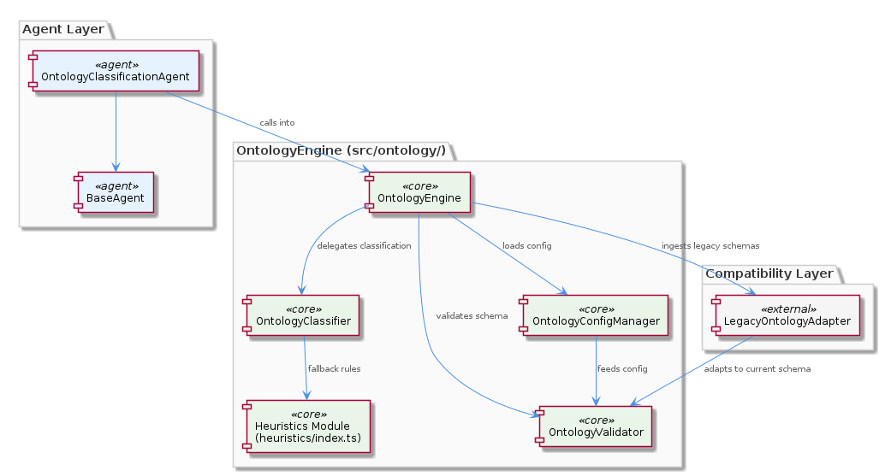
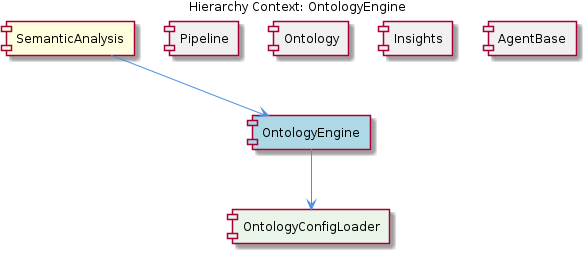

# OntologyEngine

**Type:** SubComponent

The heuristics/index.ts module under src/ontology/ provides rule-based fallback classification when LLM-based or exact-match classification is insufficient, referenced in the TIERED-MODEL-PROPOSAL.md under docs/

## What It Is

OntologyEngine is a service-layer subcomponent within SemanticAnalysis, implemented under `src/ontology/`. It encapsulates all ontology-related logic—configuration loading, validation, classification, and fallback heuristics—so that agents in the pipeline can perform entity classification without embedding domain logic directly. The engine is consumed primarily by `OntologyClassificationAgent`'s `process()` method, maintaining strict separation between the agent lifecycle (governed by AgentBase's template-method pattern) and ontology domain concerns.

## Architecture and Design

The engine follows a layered service architecture with clear responsibility boundaries:

1. **OntologyConfigManager** — loads and caches ontology definitions, abstracting file I/O from consumers. Its child component OntologyConfigLoader handles the actual file-system access.
2. **OntologyValidator** — enforces schema correctness before classification, failing fast on malformed configs.
3. **OntologyClassifier** — core classification algorithm for entity-to-type matching.
4. **LegacyOntologyAdapter** — backward-compatibility shim for older schema formats.
5. **`heuristics/index.ts`** — rule-based fallback when exact-match or LLM classification is insufficient (documented in `docs/TIERED-MODEL-PROPOSAL.md`).

This tiered classification approach (exact match → LLM → heuristics) provides graceful degradation. The service-layer design means agents call *into* OntologyEngine rather than owning classification logic, which aligns with the sibling Ontology agent (`OntologyClassificationAgent`) simply delegating to this engine within its `process()` implementation.

## Implementation Details

**OntologyConfigManager** centralizes definition loading so that multiple agents (or repeated classification calls) don't redundantly perform file I/O. OntologyConfigLoader, as a child component, handles the raw filesystem interaction.

**OntologyValidator** runs before any classification occurs. This is a deliberate fail-fast design: malformed configs raise configuration errors at startup/load time rather than causing silent misclassifications at runtime.

**OntologyClassifier** in `src/ontology/` implements entity-to-type matching and is the primary algorithm consumed by `OntologyClassificationAgent`. The classifier operates against validated, in-memory ontology definitions provided by the config manager.

**LegacyOntologyAdapter** allows ingestion of pre-existing classification data in older schema formats without breaking the current type system—important for incremental migration scenarios.

**`heuristics/index.ts`** provides rule-based fallback classification, forming the lowest tier in the classification strategy. This ensures every entity receives *some* classification even when higher-fidelity methods fail.

## Integration Points

- **Consumed by OntologyClassificationAgent** — which implements all five BaseAgent abstract methods and delegates its `process()` logic to OntologyClassifier.
- **Feeds downstream to Insights** — classified entities flow as enriched `AgentResponse` payloads to insight generation.
- **Contained within SemanticAnalysis** — respects the pipeline orchestration; the coordinator agent sequences when classification occurs.
- **OntologyConfigLoader** abstracts filesystem details, making the engine testable and decoupled from deployment-specific paths.

## Usage Guidelines

- Never embed classification logic directly in agents; always call through OntologyEngine's service interface.
- Ensure ontology config files pass OntologyValidator before deploying; validation errors are intentionally loud.
- When adding new entity types, update the ontology schema and verify LegacyOntologyAdapter still handles older formats gracefully.
- The heuristics module is the fallback of last resort—add rules there only for cases where structured classification genuinely cannot resolve a type.
- Since `execute()` on any agent is sealed, confidence scoring for classification <USER_ID_REDACTED> belongs in `calculateConfidence()` on the agent side, not within OntologyEngine itself.

## Hierarchy Context

### Parent
- [SemanticAnalysis](./SemanticAnalysis.md) -- [LLM] The `BaseAgent<TInput, TOutput>` class defined in `integrations/mcp-server-semantic-analysis/src/agents/base-agent.ts` establishes a rigid, template-method-style lifecycle that all concrete agents must honor. The public `execute()` method is not meant to be overridden; instead it sequences five protected steps—`process()`, `calculateConfidence()`, `detectIssues()`, `generateRouting()`, and `applyCorrections()`—before wrapping the result in a typed `AgentResponse<TOutput>` envelope that carries both the domain payload and pipeline metadata (timestamps, confidence score, detected issues, routing hints). This design choice enforces a consistent observability contract across all seven specialized agents (`GitHistoryAgent`, `VibeHistoryAgent`, `CodeGraphAgent`, `OntologyClassificationAgent`, `SemanticAnalysisAgent`, `ContentValidationAgent`, and `PersistenceAgent`). A new developer adding an agent must implement all five abstract methods even if some steps are trivial no-ops for their use case; skipping them is structurally impossible because `execute()` calls them unconditionally. The metadata envelope returned by every agent means the orchestrating `SemanticAnalysisAgent` can make routing decisions—such as skipping persistence when confidence is too low or re-running classification after corrections—without knowing anything about each agent's internal logic.

### Children
- [OntologyConfigLoader](./OntologyConfigLoader.md) -- Based on the parent context, OntologyConfigManager resides in src/ontology/ and centralizes ontology definition loading, abstracting file system access from individual agents in the SemanticAnalysis MCP server.

### Siblings
- [Pipeline](./Pipeline.md) -- The pipeline is orchestrated by a coordinator agent that sequences specialized agents (GitHistoryAgent, VibeHistoryAgent, CodeGraphAgent, etc.) defined in integrations/mcp-server-semantic-analysis/src/agents/
- [Ontology](./Ontology.md) -- OntologyClassificationAgent in integrations/mcp-server-semantic-analysis/src/agents/ implements all five BaseAgent abstract methods to classify entities against the defined ontology schema
- [Insights](./Insights.md) -- Insight generation operates downstream of classification, consuming enriched AgentResponse payloads from OntologyClassificationAgent and CodeGraphAgent to synthesize higher-level patterns
- [AgentBase](./AgentBase.md) -- BaseAgent<TInput, TOutput> in integrations/mcp-server-semantic-analysis/src/agents/base-agent.ts uses a template-method pattern where execute() is sealed and unconditionally calls all five abstract methods: process(), calculateConfidence(), detectIssues(), generateRouting(), and applyCorrections()

---

*Generated from 6 observations*
