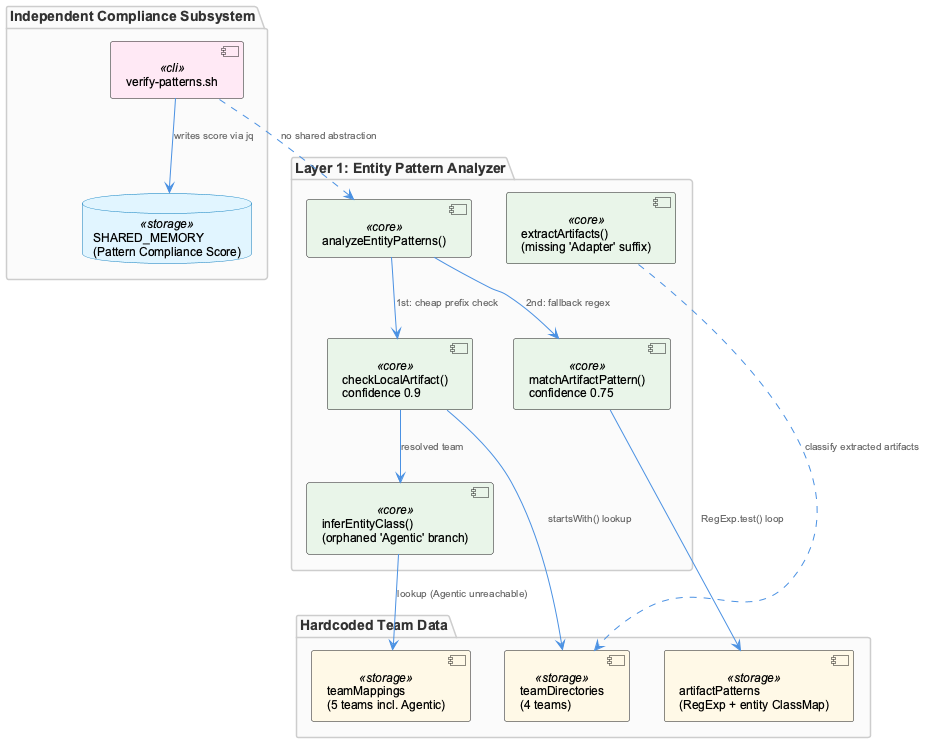
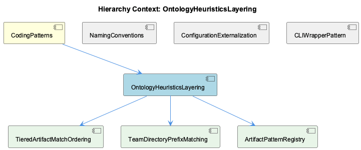

# OntologyHeuristicsLayering

**Type:** SubComponent

# OntologyHeuristicsLayering — Technical Insight Document

## What It Is

OntologyHeuristicsLayering is implemented primarily in `src/ontology/heuristics/EntityPatternAnalyzer.ts`, and represents "Layer 1" of a multi-layer, confidence-scored classification pipeline for attributing knowledge content to teams and entity classes. Its entry point, `analyzeEntityPatterns()` (line 66), is explicitly documented in its own docstring as "Layer 1: File/Artifact Detection" with a target execution budget of under 1ms, implying that later, presumably lower-precision or higher-cost layers exist above it in the broader ontology classification stack. As a SubComponent of the parent **CodingPatterns** component, it operationalizes conventions that CodingPatterns documents elsewhere — most notably the project's suffix-naming idioms (Manager/Service/Adapter) — turning human-readability conventions into machine-executable classification logic.

The component decomposes into three child pieces reflected in its structure: **TieredArtifactMatchOrdering** (the cheap-before-expensive match sequencing), **TeamDirectoryPrefixMatching** (the direct-prefix lookup mechanism), and **ArtifactPatternRegistry** (the regex-based extraction and pattern tables). Together these implement a cascading confidence model where a match found early short-circuits more expensive computation.

## Architecture and Design

The dominant architectural pattern is a **layered confidence-cascade**: `checkLocalArtifact()` (line 120) is always attempted before `matchArtifactPattern()` (line 139), returning confidence 0.9 for a direct team-directory prefix match versus 0.75 for a regex-based match. This ordering, implemented by child component TieredArtifactMatchOrdering, is not just a precision hierarchy but an explicit **performance optimization**: string-prefix checks over `teamDirectories` are cheap relative to `RegExp.test()` loops over `artifactPatterns`, so the sub-millisecond budget is protected by deferring regex work whenever a cheaper match already resolves the team ownership question.

A second, more subtle design decision is that team/directory/pattern mappings are **hardcoded as TypeScript literals in the constructor** rather than externalized to `config/*.yaml` or `.json` files — a divergence from the pattern documented by sibling component ConfigurationExternalization, which notes that the parent's broader convention favors config-driven tunability. Here, `teamDirectories` and `artifactPatterns` still function as declarative data tables that the classification logic (`checkLocalArtifact`, `matchArtifactPattern`) merely walks without branching on team names directly — so the *idiom* of externalization is honored in spirit, but the *mechanism* requires a source-code edit and rebuild to add a team or directory, rather than a config change.

## Implementation Details

`extractArtifacts()` (line 98) is the workhorse of the ArtifactPatternRegistry child component: it runs four independent regex passes — `filePathPattern`, `npmPattern`, `classPattern`, and `dirPattern` — over the same content string, populating a shared `Set<string>` before any team-matching begins. Since these four passes likely dominate the runtime, the documented <1ms budget is spent primarily on extraction, not on the matching logic that follows. Critically, `classPattern` (`/[A-Z][a-zA-Z]+(Service|Agent|Manager|Engine|Handler|Analyzer|Classifier|Filter|Monitor)/g`) omits the `Adapter` suffix — a gap inherited from the same regex noted by sibling NamingConventions and child ArtifactPatternRegistry — meaning any mention of `TranscriptAdapter` or `SpecstoryAdapter` in knowledge content is invisible to this extraction pass, even though the project itself treats `*Adapter` as an architecturally significant suffix.

`checkLocalArtifact()`, implemented by TeamDirectoryPrefixMatching, iterates `teamDirectories.entries()` and tests `dirs.some((dir) => artifact.startsWith(dir))` — a naive O(teams × dirs-per-team) linear scan with no memoization, trie, or sorted-prefix structure. For the current 4 teams (Coding, RaaS, ReSi, UI) and ~3-4 directories each, this is negligible, but it re-walks the full Map on every artifact for every analysis call. `checkLocalArtifact()` also invokes the private `inferEntityClass()` helper, which defines a `teamMappings` record containing an orphaned **'Agentic'** team entry (mapping Agent/RAG/LLM/Vector prefixes to AgentFramework/RAGSystem/LLMProvider/VectorStore) that has no corresponding entry in `teamDirectories` or `artifactPatterns` — since the team is already resolved before `inferEntityClass()` is called, this branch is unreachable dead code, a latent inconsistency between a 4-team public surface and a 5-team private inference table.

The tiering itself, per TieredArtifactMatchOrdering, operates **per-artifact rather than per-call**: `analyzeEntityPatterns()` loops over all extracted artifacts, trying the cheap path first for each one and returning on first hit. For content with many low-signal generic directory strings ahead of the one true match, both checks end up running repeatedly across the list, eroding the "fast path only" benefit the two-tier design intends.

## Integration Points

OntologyHeuristicsLayering's most direct external relationship is conceptual rather than structural: `scripts/knowledge-management/verify-patterns.sh` implements an entirely separate, shell-based "Pattern Compliance Score" system using `rg` to count `console.log` vs `Logger.*` calls and `useState` vs Redux hook usage, writing results back into `$SHARED_MEMORY` via `jq`. Both systems perform "pattern detection," but `EntityPatternAnalyzer.ts` classifies knowledge *content* by team ownership with confidence scores, while `verify-patterns.sh` measures codebase *compliance* against named patterns and persists a single aggregate score. They share no code, interface, or data model — an architectural gap where two independent pattern-detection subsystems coexist without a shared abstraction, as sibling component CLIWrapperPattern also notes regarding the script's placement in `scripts/` rather than `bin/` and its embedded business logic contrary to the thin-wrapper convention.

Within the ontology pipeline itself, this component is explicitly Layer 1 of a larger cascade (per the `layer: 1`, `layerName: 'EntityPatternAnalyzer'` fields in returned `LayerResult` objects), implying downstream layers consume its confidence-scored output. No later layers are described in these observations, but the naming and return-shape conventions suggest a well-defined contract for layer results that subsequent layers must honor.

Note: bundled fixture files under `integrations/graphify/tests/fixtures/xaml_viewmodel/` (DesignViewModel.cs, DesignView.xaml) are unrelated to this component and should not be treated as part of its integration surface — they appear to have been pulled in incidentally by retrieval rather than genuine structural relation.

## Usage Guidelines

Developers extending this component should treat `teamDirectories` and `artifactPatterns` as the canonical, though code-embedded, source of truth for team/directory/pattern ownership — adding a new team requires editing these constructor literals directly, and any change should also audit `inferEntityClass()`'s `teamMappings` table to avoid introducing further orphaned branches like the existing 'Agentic' entry. Given the discovered gap in `classPattern`, anyone introducing new suffix conventions (or relying on `*Adapter` classes being detected) should be aware that Layer 1 heuristics are currently blind to that suffix, and should consider updating the regex at line 98 alongside any project-wide naming-convention documentation. Because both `checkLocalArtifact()` and the extraction passes are simple linear/regex scans without indexing, this component should not be assumed to scale gracefully beyond the current small team/pattern counts without introducing a trie or precomputed index — a known limitation surfaced by TeamDirectoryPrefixMatching. Finally, developers should not conflate this TypeScript-based classification engine with `verify-patterns.sh`'s compliance scoring; they solve related but distinct problems and currently require separate maintenance and mental models.

## Hierarchy Context

### Parent
- [CodingPatterns](./CodingPatterns.md) -- [LLM] The '*Manager' suffix convention observed across GraphDatabaseManager, ProviderRegistryManager, ConnectionManager, MockModeManager, and CircuitBreakerManager signals a project-wide idiom for classes that own mutable, long-lived state and coordinate access to a shared resource (a database connection, a pool of LLM providers, a network connection, or a fault-tolerance mechanism). New developers should expect these classes to expose lifecycle methods (init/connect/close or similar), maintain internal state that must be protected from concurrent misuse, and typically be instantiated once and passed around or accessed via a singleton/registry rather than created ad hoc per call. When adding a new stateful coordination class to the Coding project, following this suffix convention (rather than inventing a new name like 'Handler' or 'Controller') keeps discoverability high, since grep-based searches for '*Manager' across the codebase double as an architectural map of all stateful coordination points, including CircuitBreakerManager's role in resilience patterns tied to RUNG_OFFLOADED-style degraded-mode operation.

### Children
- [TieredArtifactMatchOrdering](./TieredArtifactMatchOrdering.md) -- [LLM] The two-tier ordering inside `analyzeEntityPatterns()` (src/ontology/heuristics/EntityPatternAnalyzer.ts) always invokes `checkLocalArtifact()` before `matchArtifactPattern()` for every artifact in the loop, and returns immediately on the first hit. This means the tiering is per-artifact, not per-call: if the first extracted artifact fails both checks, the loop moves to the second artifact and again tries the cheap path first. For content containing many low-signal artifacts (e.g. several generic directory strings from the `dirPattern` regex) before the one that actually matches, the theoretical 'fast path only' benefit degrades because both checks run repeatedly across the artifact list rather than once globally.
- [TeamDirectoryPrefixMatching](./TeamDirectoryPrefixMatching.md) -- [LLM] `checkLocalArtifact()` in src/ontology/heuristics/EntityPatternAnalyzer.ts implements team-directory prefix matching by iterating `this.teamDirectories.entries()` and testing `dirs.some((dir) => artifact.startsWith(dir))`. This is a naive O(teams × dirs-per-team) linear scan rather than a trie or sorted-prefix binary search — for the current 4 teams and ~3-4 directories each (12 total prefixes) this is negligible, but the design does not scale: it re-walks the full Map on every artifact for every knowledge-content analysis call, with no memoization or precomputed prefix index (e.g., a sorted array with binary search, or a Trie keyed by path segment).
- [ArtifactPatternRegistry](./ArtifactPatternRegistry.md) -- [LLM] `EntityPatternAnalyzer.extractArtifacts()` (src/ontology/heuristics/EntityPatternAnalyzer.ts) runs four independent regex passes over the same content string — `filePathPattern`, `npmPattern`, `classPattern`, and `dirPattern` — each populated into a shared `Set<string>` before any matching begins. This means the documented '<1ms response time' budget in the file's header docstring is spent primarily on regex extraction, not on the team-matching logic in `checkLocalArtifact()`/`matchArtifactPattern()`. Because `classPattern` is `/[A-Z][a-zA-Z]+(Service|Agent|Manager|Engine|Handler|Analyzer|Classifier|Filter|Monitor)/g` and omits 'Adapter', any content mentioning `TranscriptAdapter` or `SpecstoryAdapter` is invisible to this layer even though `dirPattern` and `filePathPattern` might still catch a full path reference to the same class — the four extraction patterns have inconsistent recall depending on how the artifact is textually referenced.

### Siblings
- [NamingConventions](./NamingConventions.md) -- [LLM] `src/ontology/heuristics/EntityPatternAnalyzer.ts` operationalizes the project's suffix-naming conventions described in the parent context (Manager/Service/Adapter) as a machine-readable classification heuristic. Its `extractArtifacts()` method uses a regex `[A-Z][a-zA-Z]+(Service|Agent|Manager|Engine|Handler|Analyzer|Classifier|Filter|Monitor)` to pull class names directly out of free-text knowledge content, then `matchArtifactPattern()` maps those names to a team and an inferred `entityClass` via the `artifactPatterns` array. This means naming conventions in this codebase are not just a human-readability aid — they are load-bearing for an automated team/entity-attribution pipeline (Layer 1 of what is implied to be a multi-layer classification system, given `layer: 1` and `layerName: 'EntityPatternAnalyzer'` in the returned `LayerResult`). A class that doesn't follow the established suffix vocabulary becomes invisible to this classifier.
- [ConfigurationExternalization](./ConfigurationExternalization.md) -- [LLM] EntityPatternAnalyzer.ts (src/ontology/heuristics/EntityPatternAnalyzer.ts) externalizes team-ownership classification rules into two in-memory data structures built in the constructor: `teamDirectories` (a Map<string, string[]> of path prefixes like 'src/ontology', 'raas-service', 'virtual-target') and `artifactPatterns` (an array of {team, patterns: RegExp[], entityClassMap} objects). Although these are hardcoded as class fields rather than loaded from config/*.yaml or config/*.json, they represent the same declarative-externalization idiom described in the parent CodingPatterns observations — the classification logic itself (checkLocalArtifact, matchArtifactPattern) never branches on team name directly, it only walks these tables, so adding a new team or artifact convention is a data change to the constructor's literals rather than a new code path.
- [CLIWrapperPattern](./CLIWrapperPattern.md) -- [LLM] The 'CLIWrapperPattern' component's namesake convention is only partially borne out by the actual code sample provided: scripts/knowledge-management/verify-patterns.sh is placed under scripts/, not bin/, and rather than being a thin wrapper it embeds substantial business logic directly in the shell script itself — regex-based compliance checks (console.log vs Logger usage counts), a full Markdown report generator, a compliance scoring algorithm (PASSED_CHECKS * 100 / TOTAL_CHECKS), and direct jq mutation of a $SHARED_MEMORY JSON file. This is a concrete counter-example to the parent entity's stated bin/ thin-wrapper convention ('short, primarily responsible for argument parsing and delegating to library/service code') and suggests scripts/ and bin/ are governed by different, unstated conventions: bin/ for delegation-only entry points, scripts/ for heavier one-off operational tooling that is allowed to own its logic inline.

---

*Generated from 9 observations*
