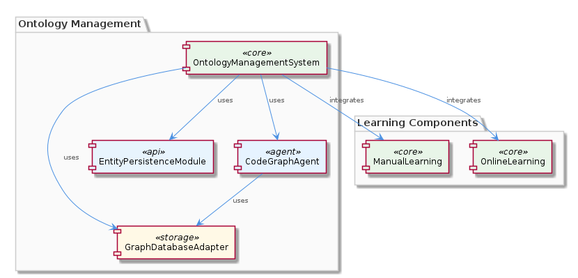
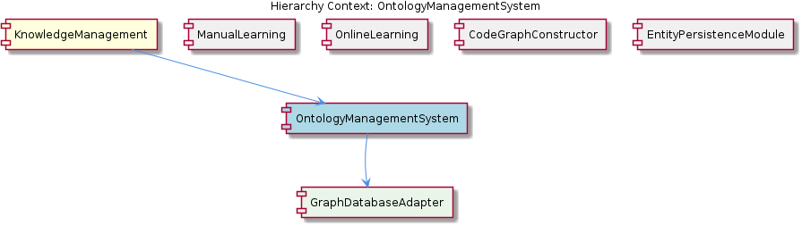

# OntologyManagementSystem

**Type:** SubComponent

OntologyManagementSystem may leverage the automatic JSON export sync feature provided by the GraphDatabaseAdapter to simplify the process of exporting ontology data in JSON format.

## What It Is  

The **OntologyManagementSystem** lives inside the **KnowledgeManagement** component and is implemented as a sub‑component that orchestrates the creation, persistence, and querying of the system’s ontology. Its core responsibilities are realized through the **GraphDatabaseAdapter** (found at `storage/graph-database-adapter.ts`), which provides the low‑level graph‑store operations, and through higher‑level collaborators such as the **CodeGraphAgent** (`integrations/mcp-server-semantic-analysis/src/agents/code‑graph‑agent.ts`) and the **EntityPersistenceModule**. The subsystem also leverages documentation‑driven configuration files – for example, `integrations/code-graph-rag/docs/claude-code-setup.md` to initialise Claude‑based code‑RAG pipelines, and `integrations/mcp-constraint-monitor/docs/semantic-constraint-detection.md` to enable semantic‑constraint detection. By sitting between the **ManualLearning** and **OnlineLearning** sub‑components, OntologyManagementSystem supplies the classification and inference backbone that both learning paths consume.

## Architecture and Design  

OntologyManagementSystem follows a **modular, adapter‑based architecture**. The central **GraphDatabaseAdapter** acts as an abstraction layer over the underlying graph engine (Graphology) and storage backend (LevelDB). This adapter pattern isolates the rest of the system from storage‑specific details, allowing components such as **CodeGraphAgent**, **EntityPersistenceModule**, and the sibling **CodeGraphConstructor** to interact with the ontology through a consistent API.  

Interaction is orchestrated through clear **component boundaries**: OntologyManagementSystem receives ontology‑related requests from **ManualLearning** and **OnlineLearning**, persists or updates graph entities via the adapter, and then makes the enriched graph available for downstream RAG (Retrieval‑Augmented Generation) workflows, as described in `integrations/code-graph-rag/README.md`. The use of **automatic JSON export sync** (exposed by the GraphDatabaseAdapter) demonstrates a design decision to simplify data interchange, enabling other services to consume a JSON snapshot of the ontology without custom serialization logic.  

The sibling components share the same persistence foundation, which reduces duplication and ensures a **single source of truth** for graph data. By keeping the adapter as a child component, OntologyManagementSystem delegates low‑level concerns while focusing on ontology‑specific policies such as semantic‑constraint detection (via the `semantic-constraint-detection.md` doc) and code‑graph integration (via the Claude setup doc).  

## Implementation Details  

At the heart of the implementation is the **GraphDatabaseAdapter** class defined in `storage/graph-database-adapter.ts`. This class encapsulates Graphology operations (node/edge creation, traversal, and queries) and persists the graph to LevelDB. It also implements an **automatic JSON export sync** routine that watches for graph mutations and writes a JSON representation to a configurable location, facilitating downstream analytics and RAG consumption.  

The **CodeGraphAgent** (`integrations/mcp-server-semantic-analysis/src/agents/code-graph-agent.ts`) interacts with the adapter to store analysis results such as function call graphs, dependency edges, and code‑entity annotations. The agent’s workflow typically: (1) analyse a codebase, (2) translate findings into graph entities, and (3) invoke the adapter’s `addNode`/`addEdge` methods.  

The **EntityPersistenceModule** works closely with OntologyManagementSystem to manage lifecycle events for ontology entities (creation, update, deletion). It provides higher‑level CRUD helpers that translate domain concepts (e.g., “Concept”, “Relation”) into the graph schema expected by the adapter.  

Configuration files play a crucial role: `integrations/code-graph-rag/docs/claude-code-setup.md` supplies the credentials and model parameters required for Claude‑based code retrieval, while `integrations/mcp-constraint-monitor/docs/semantic-constraint-detection.md` outlines the rules used to validate ontology consistency. These docs are read at startup by OntologyManagementSystem to initialise the corresponding validation and RAG pipelines.  

Finally, OntologyManagementSystem exposes an internal API (not explicitly named in the observations) that is consumed by **ManualLearning** and **OnlineLearning** for classification and inference. These learning modules query the graph through the adapter, apply machine‑learning models, and feed results back into the ontology, completing a feedback loop.

## Integration Points  

- **Parent Component – KnowledgeManagement**: OntologyManagementSystem is a child of KnowledgeManagement, inheriting the overall responsibility for knowledge persistence. The parent component’s documentation highlights the centrality of the GraphDatabaseAdapter, confirming that OntologyManagementSystem is the primary consumer of this adapter within the knowledge stack.  
- **Sibling Components**:  
  * **ManualLearning** and **OnlineLearning** both invoke OntologyManagementSystem to obtain a persisted ontology for classification and inference.  
  * **CodeGraphConstructor** and **EntityPersistenceModule** share the same adapter instance, ensuring that code‑graph construction and generic entity persistence operate on a unified graph.  
  * **GraphDatabaseAdapter** is the concrete child component that provides the storage engine for all siblings.  
- **External Agents**: The **CodeGraphAgent** uses the adapter to persist code analysis results, effectively feeding the ontology with execution‑time knowledge.  
- **Configuration Docs**: The Claude setup (`claude-code-setup.md`) and semantic‑constraint detection (`semantic-constraint-detection.md`) files are read by OntologyManagementSystem at initialization to configure RAG pipelines and constraint monitors respectively.  
- **Export Mechanism**: The automatic JSON export sync feature enables downstream services—such as reporting tools or external analytics pipelines—to consume a consistent snapshot of the ontology without direct graph access.

## Usage Guidelines  

1. **Persist via the Adapter** – All ontology modifications should go through the `GraphDatabaseAdapter` API. Direct manipulation of Graphology or LevelDB objects bypasses validation and export hooks, leading to inconsistent state.  
2. **Leverage JSON Export** – When an external system needs a read‑only view of the ontology, consume the JSON file generated by the adapter’s sync feature rather than querying the graph directly. This guarantees that the view reflects the latest committed transactions.  
3. **Configure RAG and Constraints Early** – Ensure that `claude-code-setup.md` and `semantic-constraint-detection.md` are present and correctly populated before starting OntologyManagementSystem. Missing configuration will disable Claude‑based retrieval and semantic validation, reducing the system’s inference quality.  
4. **Coordinate with Learning Modules** – ManualLearning and OnlineLearning expect the ontology to be stable during batch inference runs. Schedule heavy learning jobs during low‑traffic periods or employ the adapter’s transaction semantics (if available) to avoid race conditions.  
5. **Monitor Export Health** – The automatic JSON export runs asynchronously; monitor its logs for errors to guarantee that downstream consumers receive up‑to‑date data.  

---

### Architectural Patterns Identified  
- **Adapter Pattern** – `GraphDatabaseAdapter` abstracts Graphology/LevelDB details.  
- **Modular Component Architecture** – Clear separation between OntologyManagementSystem, its siblings, and child adapter.  
- **Configuration‑Driven Integration** – Docs (`claude-code-setup.md`, `semantic-constraint-detection.md`) drive external service setup.

### Design Decisions and Trade‑offs  
- **Single Graph Store** – Centralising all knowledge in one graph simplifies consistency but creates a potential bottleneck; scaling requires careful LevelDB tuning.  
- **Automatic JSON Export** – Improves interoperability at the cost of additional I/O overhead and possible latency between graph updates and export availability.  
- **File‑Based Configuration** – Easy to edit and version, but runtime changes require a restart or hot‑reload mechanism.

### System Structure Insights  
- OntologyManagementSystem sits at the nexus of knowledge persistence (via the adapter) and semantic processing (via learning modules and constraint monitors).  
- Siblings share the same persistence layer, reinforcing a unified data model across the KnowledgeManagement domain.  
- Child component (`GraphDatabaseAdapter`) encapsulates all low‑level storage concerns, allowing higher‑level modules to remain storage‑agnostic.

### Scalability Considerations  
- **Horizontal Scaling** is limited by LevelDB’s single‑process nature; scaling out would require sharding the graph or migrating to a distributed graph store.  
- **Export Load** can be mitigated by throttling the JSON sync or by incrementally exporting only changed sub‑graphs.  
- **Agent Concurrency** – Multiple agents (e.g., CodeGraphAgent, EntityPersistenceModule) may issue concurrent writes; the adapter must serialize or batch these operations to avoid write conflicts.

### Maintainability Assessment  
- The **adapter abstraction** isolates storage changes, making it straightforward to replace Graphology/LevelDB with another backend if needed.  
- **Configuration‑driven integrations** keep external service wiring declarative, easing updates to Claude or constraint definitions.  
- However, the reliance on a single JSON export point introduces a coupling that must be monitored; any breakage in the export pipeline could impact several downstream consumers. Regular tests of the export process and clear documentation of the expected file locations will mitigate this risk.

## Hierarchy Context

### Parent
- [KnowledgeManagement](./KnowledgeManagement.md) -- [LLM] The KnowledgeManagement component's utilization of the GraphDatabaseAdapter for persistence is a notable architectural aspect. This adapter, located in storage/graph-database-adapter.ts, enables the use of Graphology and LevelDB for storing and querying the knowledge graph. The automatic JSON export sync feature provided by this adapter simplifies the process of exporting graph data in JSON format, which can be beneficial for further analysis or integration with other components. For instance, the CodeGraphAgent, found in integrations/mcp-server-semantic-analysis/src/agents/code-graph-agent.ts, can leverage this adapter to store and retrieve code analysis results, thereby facilitating the management of entities and relationships within the knowledge graph.

### Children
- [GraphDatabaseAdapter](./GraphDatabaseAdapter.md) -- The integrations/code-graph-rag/README.md file mentions a Graph-Based RAG System, indicating the use of graph databases in the project.

### Siblings
- [ManualLearning](./ManualLearning.md) -- ManualLearning likely utilizes the GraphDatabaseAdapter for persistence, as seen in storage/graph-database-adapter.ts, to store and query the knowledge graph.
- [OnlineLearning](./OnlineLearning.md) -- OnlineLearning likely utilizes the batch analysis pipeline to extract knowledge from various sources, such as git history and LSL sessions.
- [CodeGraphConstructor](./CodeGraphConstructor.md) -- CodeGraphConstructor likely utilizes the GraphDatabaseAdapter to store and query the constructed code graph.
- [EntityPersistenceModule](./EntityPersistenceModule.md) -- EntityPersistenceModule likely utilizes the GraphDatabaseAdapter to store and query entities and relationships in the graph database.
- [GraphDatabaseAdapter](./GraphDatabaseAdapter.md) -- GraphDatabaseAdapter likely utilizes Graphology and LevelDB to store and query the knowledge graph.

---

*Generated from 7 observations*
