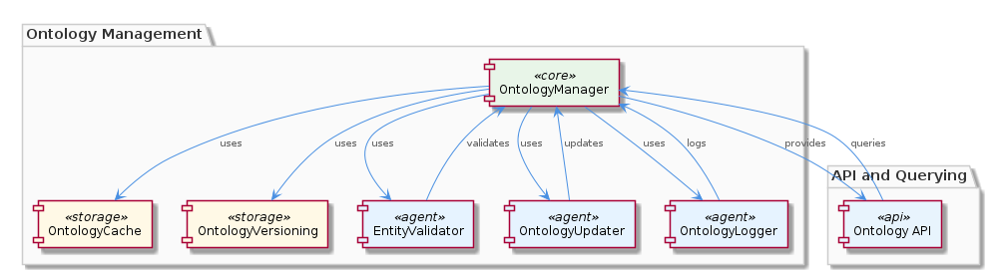

# OntologyManager

**Type:** SubComponent

The OntologyManager provides an API for querying the ontology system, allowing other sub-components to retrieve entity information, as referenced in the integrations/mcp-server-semantic-analysis/src/agents/ontology-manager.ts file.

## What It Is  

**OntologyManager** is the core sub‑component that governs the ontology system used throughout the **SemanticAnalysis** pipeline. Its implementation lives in the **integrations/mcp‑server‑semantic‑analysis/src/agents/** directory, most notably in the following files:  

* `ontology-manager.ts` – defines the hierarchical ontology model and exposes the public query API.  
* `ontology-cache.ts` – implements a cache for frequently accessed ontology metadata.  
* `entity-validator.ts` – contains the rule set that validates entity content and flags stale observations.  
* `ontology-versioning.ts` – tracks version identifiers for every change to the ontology.  
* `ontology-updater.ts` – provides the runtime mechanism for applying dynamic updates.  
* `ontology-logger.ts` – records all mutation events for audit and debugging.

Together these files give OntologyManager the responsibilities of **organizing**, **serving**, **validating**, **version‑controlling**, **updating**, and **logging** the ontology data that the rest of the SemanticAnalysis component (e.g., the OntologyClassificationAgent, SemanticAnalysisAgent, and CodeGraphAgent) relies on for accurate insight generation.

---

## Architecture and Design  

OntologyManager follows a **modular, layered architecture** built around a clear separation of concerns:

1. **Hierarchical Ontology Layer** – `ontology-manager.ts` stores the ontology as a tree of *upper* and *lower* definitions, enabling inheritance of properties and facilitating classification tasks performed by the OntologyClassificationAgent. This hierarchy mirrors the conceptual model of the domain and avoids flat, monolithic dictionaries.

2. **Cache‑Aside Layer** – `ontology-cache.ts` implements a local in‑memory cache that is consulted before any expensive lookup (e.g., reading from a persisted store). The cache is populated on first access and refreshed on updates, reducing latency for high‑frequency queries from sibling agents such as **CodeAnalyzer** and **InsightGenerator**.

3. **Rule‑Based Validation Layer** – `entity-validator.ts` houses a static set of validation rules. These rules are applied whenever an entity is retrieved or inserted, ensuring that stale observations are detected early and that only well‑formed data propagates downstream.

4. **Versioning Layer** – `ontology-versioning.ts` records a monotonically increasing version identifier each time the ontology changes. This version is exposed via the query API, allowing downstream components (e.g., **Pipeline** steps) to make deterministic decisions based on the exact ontology snapshot they processed.

5. **Update & Logging Layer** – `ontology-updater.ts` provides the only entry point for mutating the ontology. Every mutation passes through this updater, which subsequently invokes `ontology-logger.ts` to emit structured log entries. This design creates an implicit **audit trail** and supports rollback or replay scenarios.

The overall interaction pattern resembles a **Facade**: `ontology-manager.ts` presents a concise API (e.g., `getEntity(id)`, `search(term)`) while delegating to the underlying cache, validator, versioner, and logger. The component is **synchronously** invoked by sibling agents; there is no evidence of asynchronous messaging or micro‑service boundaries, keeping the design lightweight and tightly coupled within the same Node.js process.

---

## Implementation Details  

### Core Classes / Modules  

| File | Primary Export | Responsibility |
|------|----------------|----------------|
| `ontology-manager.ts` | `OntologyManager` | Holds the hierarchical ontology tree, resolves queries, and orchestrates cache, validation, and version checks. |
| `ontology-cache.ts` | `OntologyCache` | Implements a simple key‑value store (likely a `Map`) with `get`, `set`, and `invalidate` methods. Cache misses trigger a fetch from the underlying data source. |
| `entity-validator.ts` | `EntityValidator` | Exposes `validate(entity)` which runs the predefined rule set (e.g., required fields, freshness checks). Returns validation results or throws on failure. |
| `ontology-versioning.ts` | `OntologyVersioning` | Manages a numeric or semantic version string; provides `increment()`, `currentVersion()`, and `compare(a,b)` utilities. |
| `ontology-updater.ts` | `OntologyUpdater` | Offers `applyUpdate(patch)` that mutates the hierarchy, updates the version, clears relevant cache entries, and triggers logging. |
| `ontology-logger.ts` | `OntologyLogger` | Wraps a logging library (e.g., Winston) with methods like `logChange(action, details)` to capture who/what changed the ontology and when. |

### Query Flow  

1. **Request** – A consumer (e.g., `OntologyClassificationAgent` in `ontology-classification-agent.ts`) calls `OntologyManager.getEntity(id)`.  
2. **Cache Check** – `OntologyManager` first asks `OntologyCache` for the entity. If present, the cached copy is returned immediately.  
3. **Cache Miss** – The manager retrieves the raw entity from the hierarchical store, then passes it through `EntityValidator`.  
4. **Validation** – If the entity fails any rule (e.g., stale timestamp), the validator returns an error that bubbles up to the caller.  
5. **Version Tagging** – The successful result is annotated with the current version from `OntologyVersioning`.  
6. **Return** – The caller receives a fully validated, version‑aware entity.

### Update Flow  

When a new ontology fragment arrives (perhaps from an external knowledge‑graph ingestion pipeline), `OntologyUpdater.applyUpdate(patch)`:

* Merges `patch` into the hierarchy respecting parent‑child relationships.  
* Calls `OntologyVersioning.increment()` to produce a new version identifier.  
* Invokes `OntologyCache.invalidate(affectedKeys)` to evict stale entries.  
* Emits a structured log via `OntologyLogger.logChange('update', {patch, version})`.  

All downstream agents automatically see the new version on their next query, guaranteeing consistency without needing a restart.

---

## Integration Points  

* **Parent – SemanticAnalysis** – OntologyManager is a child of the **SemanticAnalysis** component, which coordinates multiple agents. SemanticAnalysis injects a singleton instance of OntologyManager into agents such as **OntologyClassificationAgent**, **SemanticAnalysisAgent**, and **CodeGraphAgent**. This enables those agents to classify code entities, generate insights, and build knowledge graphs against a single source of truth.

* **Sibling – Pipeline** – The **Pipeline** coordinator (see `ontology-classification-agent.ts`) declares explicit dependencies on OntologyManager for the classification step. Because Pipeline uses a DAG‑based execution model, it can schedule the ontology‑dependent steps only after the OntologyManager has been initialized and any pending updates have been applied.

* **Sibling – Ontology** – The **Ontology** sibling essentially mirrors the same functionality; both share the hierarchical design and caching strategy, indicating a deliberate reuse of the same implementation across the codebase.

* **Sibling – Insights / InsightGenerator** – InsightGenerator pulls enriched entity data from OntologyManager to augment raw code analysis results. The version tag supplied by OntologyManager allows InsightGenerator to tag insights with the exact ontology snapshot, supporting reproducibility.

* **Sibling – EntityValidator** – Although OntologyManager imports validation logic from `entity-validator.ts`, the **EntityValidator** sibling may also be used independently by other agents that need to validate raw observations before they ever touch the ontology.

* **Logging & Observability** – All mutation events flow through `ontology-logger.ts`, which integrates with the system‑wide logging infrastructure. This makes OntologyManager’s activity visible to operational dashboards and aids troubleshooting across the entire SemanticAnalysis pipeline.

---

## Usage Guidelines  

1. **Always Access via the Facade** – Call `OntologyManager`’s public methods (`getEntity`, `search`, `applyUpdate`) rather than reaching directly into the cache or hierarchy. This guarantees that validation, versioning, and logging are applied consistently.

2. **Treat the Cache as Transparent** – Do not manually manipulate `OntologyCache`. If you need to force a refresh (e.g., after a bulk import), use `OntologyUpdater.applyUpdate` which automatically invalidates the affected cache entries.

3. **Validate Before Insertion** – When constructing a new entity, run it through `EntityValidator.validate` first. Although the updater will re‑validate, early validation provides clearer error locations for developers.

4. **Version Awareness** – When persisting insight data that references ontology entities, store the accompanying `ontologyVersion` returned by the manager. This enables future audits and potential re‑processing if the ontology evolves.

5. **Logging Discipline** – Do not log ontology changes manually; rely on `OntologyUpdater` which encapsulates the logging call. Custom logs may bypass the structured format and break audit consistency.

6. **Thread‑Safety** – The component runs in a single Node.js process, but if you introduce worker threads or cluster mode, ensure that the singleton instance (and its in‑memory cache) is either shared via a message‑passing protocol or replaced with a distributed cache to avoid stale reads.

---

### Summary of Requested Analyses  

**1. Architectural patterns identified**  
* Hierarchical data model (tree‑structured ontology)  
* Cache‑aside pattern (`OntologyCache`)  
* Facade pattern (`OntologyManager` exposing a unified API)  
* Rule‑engine style validation (`EntityValidator`)  
* Versioning/audit pattern (`OntologyVersioning` + `OntologyLogger`)  

**2. Design decisions and trade‑offs**  
* *Hierarchical ontology* simplifies inheritance but can become deep and costly to traverse if not balanced.  
* *In‑process cache* gives low‑latency reads; however, it limits scalability across multiple processes or machines.  
* *Centralized updater* guarantees consistency and auditability but introduces a single point of contention for write‑heavy workloads.  
* *Rule‑based validator* provides clear extensibility (add new rules) at the cost of potential performance impact for complex rule sets.

**3. System structure insights**  
OntologyManager sits at the heart of the SemanticAnalysis component, acting as the authoritative source for entity definitions. Its sibling agents consume its API, while the Pipeline orchestrates execution order based on OntologyManager’s readiness. The hierarchical design aligns with the OntologyClassificationAgent’s need to map code observations onto upper‑ and lower‑level concepts.

**4. Scalability considerations**  
* **Read scalability** is strong due to the cache‑aside approach; most queries are served from memory.  
* **Write scalability** is limited by the single‑process updater; large batch updates may need to be throttled or broken into smaller patches.  
* To scale horizontally, the cache and version store would need to be externalized (e.g., Redis) and the updater made idempotent across nodes.

**5. Maintainability assessment**  
The clear separation into distinct modules (`ontology‑cache`, `entity‑validator`, `ontology‑versioning`, etc.) promotes high maintainability. Adding new validation rules or extending the hierarchy can be done in isolation. The only maintenance risk is the tight coupling to an in‑process cache; future refactoring to a distributed cache would require careful migration of the versioning and logging contracts. Overall, the design is well‑structured, testable, and aligns with the modular agent‑based philosophy of the broader SemanticAnalysis system.

## Hierarchy Context

### Parent
- [SemanticAnalysis](./SemanticAnalysis.md) -- [LLM] The SemanticAnalysis component employs a multi-agent architecture, utilizing agents such as the OntologyClassificationAgent, SemanticAnalysisAgent, and CodeGraphAgent, to perform tasks such as code analysis, ontology classification, and insight generation. The OntologyClassificationAgent, for instance, is implemented in the file integrations/mcp-server-semantic-analysis/src/agents/ontology-classification-agent.ts and is responsible for classifying observations against the ontology system. This agent-based approach allows for a modular and scalable design, enabling the component to handle large-scale codebases and provide meaningful insights.

### Siblings
- [Pipeline](./Pipeline.md) -- The Pipeline coordinator uses a DAG-based execution model with topological sort in batch-analysis steps, each step declaring explicit depends_on edges, as seen in the integrations/mcp-server-semantic-analysis/src/agents/ontology-classification-agent.ts file.
- [Ontology](./Ontology.md) -- The OntologyManager uses a hierarchical structure to organize the ontology system, with upper and lower ontology definitions, as seen in the integrations/mcp-server-semantic-analysis/src/agents/ontology-manager.ts file.
- [Insights](./Insights.md) -- The InsightGenerator utilizes the CodeAnalyzer to extract meaningful insights from code files and git history, as referenced in the integrations/mcp-server-semantic-analysis/src/agents/insight-generator.ts file.
- [CodeAnalyzer](./CodeAnalyzer.md) -- The CodeAnalyzer utilizes a parsing mechanism to extract insights from code files, as implemented in the integrations/mcp-server-semantic-analysis/src/agents/code-analyzer.ts file.
- [InsightGenerator](./InsightGenerator.md) -- The InsightGenerator utilizes the CodeAnalyzer to extract meaningful insights from code files and git history, as referenced in the integrations/mcp-server-semantic-analysis/src/agents/insight-generator.ts file.
- [KnowledgeGraphConstructor](./KnowledgeGraphConstructor.md) -- The KnowledgeGraphConstructor utilizes Memgraph to store and manage the knowledge graph, as implemented in the integrations/mcp-server-semantic-analysis/src/agents/knowledge-graph-constructor.ts file.
- [EntityValidator](./EntityValidator.md) -- The EntityValidator utilizes a set of predefined rules to validate entity content, as implemented in the integrations/mcp-server-semantic-analysis/src/agents/entity-validator.ts file.
- [CodeGraphRAG](./CodeGraphRAG.md) -- The CodeGraphRAG utilizes a graph database to store and manage the code graph, as implemented in the integrations/code-graph-rag/README.md file.

---

*Generated from 7 observations*
