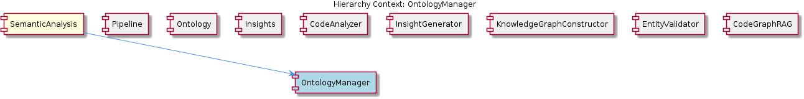

# OntologyManager

**Type:** SubComponent

The OntologyManager uses the OntologyClassificationAgent to classify observations against the ontology system, providing a standardized way of categorizing and understanding interactions within the Claude Code conversations.

## What It Is  

**OntologyManager** is a sub‑component that lives inside the **LiveLoggingSystem** (see the hierarchy context). Its primary responsibility is to expose a **standardized classification service** for observations that are generated during Claude Code conversations. The manager does not implement the classification logic itself; instead it **delegates** to the **OntologyClassificationAgent**, which is defined in  
`integrations/mcp-server-semantic-analysis/src/agents/ontology-classification-agent.ts`.  

The manager also **owns** an **OntologyConfigurationLoader** child component, which is responsible for locating and parsing the configuration files that drive the ontology system. By pulling the configuration at start‑up, OntologyManager guarantees that every classification request is evaluated against a **consistent, version‑controlled ontology**.

In short, OntologyManager is the façade that the rest of the LiveLoggingSystem (and any sibling components such as LoggingMechanism, TranscriptProcessor, and LSLConfigManager) uses to **validate, categorize, and retrieve semantic meaning** from raw observation data.

---

## Architecture and Design  

The observable design revolves around **composition** and **initialization‑on‑construction** patterns:

1. **Constructor‑Driven Initialization** – The `OntologyClassificationAgent` constructor **calls `initOntologySystem`** (Observation 7). This method loads configuration files and sets up classification models (Observations 1, 2). By performing this work in the constructor, the agent guarantees that it is always ready for use when injected into OntologyManager.

2. **Configuration‑Centric Design** – Both the agent and the manager rely on **external configuration files** (Observations 2, 6). The presence of a dedicated **OntologyConfigurationLoader** child reinforces a **separation of concerns**: loading/parsing configuration is isolated from classification logic.

3. **Facade/Delegation Pattern** – OntologyManager **uses** the OntologyClassificationAgent to perform the heavy lifting of classification (Observations 3, 4, 5). This creates a clear **facade** where callers interact only with OntologyManager, while the agent encapsulates the ontology system internals.

4. **Hierarchical Component Nesting** – The component tree (`LiveLoggingSystem → OntologyManager → OntologyConfigurationLoader`) reflects a **layered architecture**: the top‑level logging system coordinates high‑level concerns, OntologyManager focuses on semantic validation, and the loader handles low‑level data acquisition.

No evidence of event‑driven or micro‑service patterns appears in the observations, so the architecture should be described strictly in terms of the above composition and delegation relationships.

---

## Implementation Details  

### Core Classes  

| Class / Interface | Location (observed) | Role |
|-------------------|---------------------|------|
| `OntologyClassificationAgent` | `integrations/mcp-server-semantic-analysis/src/agents/ontology-classification-agent.ts` | Encapsulates the ontology system; loads configuration, builds classification models, and exposes a `classify(observation)` method (implied by its usage). |
| `OntologyManager` | (implicit – child of `LiveLoggingSystem`) | Provides a public API for other components to request classification and validation. Internally holds an instance of `OntologyClassificationAgent`. |
| `OntologyConfigurationLoader` | (child of OntologyManager) | Reads the configuration files required by `initOntologySystem`. The exact file path is not listed, but the loader is mentioned as a child component. |

### Initialization Flow  

1. **Construction** – When a new `OntologyClassificationAgent` is instantiated, its constructor immediately invokes `initOntologySystem`.  
2. **`initOntologySystem`** – This method **loads configuration files** (Observation 2) and **sets up classification models** (Observation 1). The loading step is performed by `OntologyConfigurationLoader`, which abstracts file‑system access and parsing logic.  
3. **Agent Ready** – After the configuration and model setup complete, the agent is ready to accept classification requests.  
4. **Manager Delegation** – `OntologyManager` receives an observation, forwards it to the agent, and returns the classification result to the caller (Observations 3, 5).  

Because the configuration loading occurs once during construction, the system avoids repeated I/O and model re‑initialization, which is a deliberate performance optimisation.

### Key Inter‑Component Mechanics  

- **Configuration Consistency** – By centralising configuration loading in `OntologyConfigurationLoader`, all downstream classification calls share the same ontology version, ensuring **data consistency and accuracy** (Observation 5).  
- **Standardised API** – OntologyManager offers a **single entry point** for classification, shielding callers from the details of model loading, versioning, or error handling.  

---

## Integration Points  

1. **Parent – LiveLoggingSystem**  
   - LiveLoggingSystem **contains** OntologyManager, meaning that any logging workflow that needs semantic enrichment will invoke OntologyManager’s API.  
   - The logging pipeline (e.g., LoggingMechanism) can therefore request classification before persisting logs, enabling richer search and analytics.

2. **Sibling – OntologyClassificationAgent**  
   - Although OntologyClassificationAgent is listed as a sibling, OntologyManager **depends on** it directly. The agent’s constructor pattern (calling `initOntologySystem`) is shared across the system, ensuring a uniform initialization contract for any component that needs ontology services.

3. **Child – OntologyConfigurationLoader**  
   - The loader is the **source of truth** for ontology definitions. Any change to the configuration files propagates automatically to the agent when the system restarts, because the loader is invoked during `initOntologySystem`.  

4. **Other Siblings**  
   - **LoggingMechanism**, **TranscriptProcessor**, and **LSLConfigManager** each have their own responsibilities (buffering, transcript unification, config validation). They may **consume** classification results from OntologyManager to augment their own data structures (e.g., adding semantic tags to transcripts).  

5. **External Dependencies**  
   - The only explicit external artifact is the set of **ontology configuration files** referenced by `initOntologySystem`. No third‑party services or network calls are mentioned, suggesting the classification pipeline is **in‑process** and self‑contained.

---

## Usage Guidelines  

1. **Instantiate Once, Reuse** – Because the `OntologyClassificationAgent` performs heavyweight loading in its constructor, create a **single shared instance** (typically owned by OntologyManager) and reuse it throughout the lifetime of the LiveLoggingSystem. Re‑instantiating per request would duplicate configuration loading and degrade performance.

2. **Load Configuration Before First Use** – Ensure that the `OntologyConfigurationLoader` can locate the required files before the system starts. Missing or malformed configuration will cause `initOntologySystem` to fail, preventing the agent from becoming operational.

3. **Pass Well‑Formed Observations** – OntologyManager expects observations that conform to the ontology’s schema. Validation is performed by the agent; therefore callers should avoid sending arbitrary data that could trigger classification errors.

4. **Handle Classification Errors Gracefully** – The agent may throw exceptions if a model cannot be applied (e.g., unknown observation type). OntologyManager should catch these and either return a default “unclassified” result or propagate a controlled error up the stack.

5. **Version Management** – When updating ontology configuration files, restart the LiveLoggingSystem (or at least re‑instantiate OntologyManager) so that `initOntologySystem` re‑loads the new definitions. This ensures all downstream components see a consistent version.

---

### Architectural patterns identified  

* **Constructor‑Driven Initialization** – Guarantees the ontology system is ready immediately after object creation.  
* **Facade / Delegation** – OntologyManager acts as a façade over the OntologyClassificationAgent.  
* **Configuration‑Centric Composition** – Separate loader component isolates file‑system concerns from business logic.  
* **Layered Component Hierarchy** – Parent (LiveLoggingSystem) → Sub‑component (OntologyManager) → Child (OntologyConfigurationLoader).

### Design decisions and trade‑offs  

* **Eager Loading vs. Lazy Loading** – The decision to load configuration in the constructor (eager) simplifies usage (no need for an explicit `init` call) but incurs a start‑up cost. This is acceptable because classification is a core, frequently used capability.  
* **Single Responsibility Separation** – By extracting configuration loading into its own child, the system gains testability and clearer responsibilities, at the cost of an extra indirection layer.  
* **In‑Process Classification** – Keeping the ontology system in‑process avoids network latency and simplifies deployment, but limits horizontal scaling to the resources of a single node.

### System structure insights  

* The **LiveLoggingSystem** orchestrates logging and semantic enrichment; OntologyManager is the dedicated semantic layer.  
* **OntologyClassificationAgent** is the only component that knows about the underlying classification models, keeping the rest of the system agnostic to model specifics.  
* **OntologyConfigurationLoader** serves as the bridge between static configuration assets and runtime behaviour, reinforcing a clear data‑flow direction: *files → loader → initOntologySystem → agent → manager*.

### Scalability considerations  

* Because the classification models are loaded once and kept in memory, the system can handle a high volume of classification calls with minimal per‑request overhead.  
* Scaling horizontally would require each node to maintain its own copy of the configuration and models; the current design does not provide a shared model cache, so memory consumption grows linearly with the number of nodes.  
* If future demand exceeds a single‑process capacity, the architecture could be extended by extracting the agent into a separate service, but such a change would be a **new architectural decision** not present in the current observations.

### Maintainability assessment  

* **High cohesion** – Each class has a narrowly defined purpose (manager, agent, loader), making the codebase easy to understand and modify.  
* **Clear initialization contract** – The constructor‑init pattern removes the need for external initialization code, reducing the chance of misuse.  
* **Configuration‑driven behaviour** – Updating classification rules or adding new ontology concepts only requires editing configuration files, not code, which improves maintainability.  
* **Potential risk** – The tight coupling of the agent’s constructor to configuration loading means that any change to the file format or loading mechanism must be carefully versioned, otherwise the entire subsystem could fail at start‑up.  

Overall, OntologyManager and its associated components exhibit a **well‑structured, composition‑based design** that balances ease of use with performance, while keeping future extensibility points (configuration loader, agent façade) clearly delineated.

## Diagrams

### Relationship

## Architecture Diagrams

## Hierarchy Context

### Parent
- [LiveLoggingSystem](./LiveLoggingSystem.md) -- [LLM] The LiveLoggingSystem component utilizes the OntologyClassificationAgent, which is defined in the integrations/mcp-server-semantic-analysis/src/agents/ontology-classification-agent.ts file, for classifying observations against the ontology system. This agent is crucial in providing a standardized way of categorizing and understanding the interactions within the Claude Code conversations. The OntologyClassificationAgent follows a specific constructor and initialization pattern to ensure proper setup of the ontology system and classification capabilities. For instance, the agent initializes the ontology system by loading the necessary configuration files and setting up the classification models. This is evident in the code, where the constructor of the OntologyClassificationAgent class calls the initOntologySystem method, which in turn loads the configuration files and sets up the classification models.

### Children
- [OntologyConfigurationLoader](./OntologyConfigurationLoader.md) -- The integrations/copi/README.md file mentions the importance of configuration files for the Copi integration, which could be related to the OntologyConfigurationLoader.

### Siblings
- [LoggingMechanism](./LoggingMechanism.md) -- The LoggingMechanism uses async buffering to handle high-volume logging scenarios.
- [TranscriptProcessor](./TranscriptProcessor.md) -- The TranscriptProcessor uses a unified format to represent transcripts from different agents.
- [LSLConfigManager](./LSLConfigManager.md) -- The LSLConfigManager uses a validation mechanism to ensure configuration data is correct and consistent.
- [OntologyClassificationAgent](./OntologyClassificationAgent.md) -- The OntologyClassificationAgent follows a specific constructor and initialization pattern to ensure proper setup of the ontology system and classification capabilities.

---

*Generated from 7 observations*
