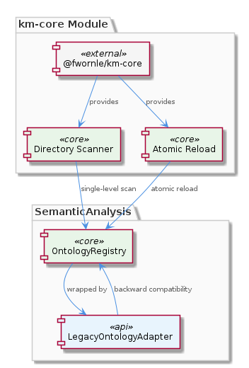
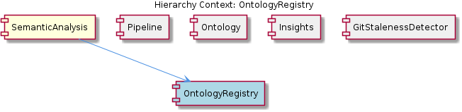

# OntologyRegistry

**Type:** SubComponent

Serves as km-core module (imported via @fwornle/km-core) providing single-level ontology directory scan and atomic reload, wrapped by LegacyOntologyAdapter for backward compatibility. within the SemanticAnalysis component at hierarchy path <AWS_SECRET_REDACTED>

# OntologyRegistry — Technical Insight Document

## What It Is

OntologyRegistry is an L2 SubComponent entity residing at the hierarchy path `<AWS_SECRET_REDACTED>`. It sits within the SemanticAnalysis component and is implemented as a **km-core module**, imported via the package identifier `@fwornle/km-core`. Its primary responsibilities are narrow and well-defined: performing a **single-level ontology directory scan** and supporting **atomic reload** of that directory's contents.

Although OntologyRegistry itself is a focused, minimal module, it does not operate in isolation. Its raw interface is wrapped by a `LegacyOntologyAdapter`, which exists expressly to preserve backward compatibility for consumers that predate the current km-core packaging. This two-layer arrangement — a lean core registry plus an adapter shim — reflects a deliberate architectural boundary between the registry's canonical behavior and the legacy contracts it must still honor.

Within the broader SemanticAnalysis hierarchy, OntologyRegistry sits alongside sibling sub-components Pipeline, Ontology, Insights, and GitStalenessDetector, each serving a distinct concern inside the multi-agent semantic pipeline.

## Architecture and Design

The dominant architectural pattern here is the **Adapter pattern**, explicitly instantiated through `LegacyOntologyAdapter`. The design decision is straightforward: the km-core module (`@fwornle/km-core`) evolves independently with a clean, modern API, while `LegacyOntologyAdapter` absorbs the backward-compatibility surface area. This separation means breaking changes to the core registry do not propagate to legacy consumers — they are intercepted and translated at the adapter boundary. The trade-off is an additional indirection layer, but this is justified when the alternative is either freezing the core API or forcing coordinated migrations across all consumers simultaneously.

The **single-level scan** constraint is an intentional scoping decision, not a limitation. By restricting the directory scan to one level of depth, the registry keeps its operational surface predictable and its reload semantics simple. An atomic reload — where the entire ontology state is replaced in one operation rather than incrementally patched — is a design choice that eliminates partial-state inconsistency during updates. This is particularly valuable in a classification pipeline like SemanticAnalysis, where agents such as OntologyClassificationAgent depend on a coherent, fully-loaded ontology to classify observations correctly. A partially-loaded ontology mid-reload could produce misclassifications that would be difficult to trace.

The placement of OntologyRegistry as an `@fwornle/km-core` module rather than as inline code within SemanticAnalysis signals a deliberate **packaging boundary**. The km-core designation implies this is considered foundational or shared infrastructure, potentially consumed by components beyond SemanticAnalysis itself, even though current observations confirm it within this hierarchy.

## Implementation Details

Concrete code symbols are not currently indexed for OntologyRegistry (0 symbols found, no key files resolved). What can be grounded from observations is the following mechanical picture:

The registry performs a **single-level directory scan**, meaning it reads the immediate children of a designated ontology directory without recursing into subdirectories. This produces a flat listing of ontology artifacts — likely files defining classification terms, hierarchy nodes, or taxonomy entries used by OntologyClassificationAgent during its classification passes.

The **atomic reload** mechanism replaces the in-memory ontology state as a unit. This is architecturally consistent with how the sibling Ontology sub-component would be expected to consume it — the consuming agent always sees either the old complete state or the new complete state, never a hybrid. Atomic reload also simplifies error handling: if a reload fails, the prior state remains intact and valid.

`LegacyOntologyAdapter` wraps the km-core module and translates between its interface and the contract expected by older callers. Without resolved source files, the precise translation logic is not available for analysis, but its existence confirms that the registry's current API has diverged from what was originally exposed — a sign of deliberate evolution.

## Integration Points

OntologyRegistry's primary integration is upward into SemanticAnalysis, which hosts it. Within the pipeline, the most directly dependent agent is **OntologyClassificationAgent**, which classifies observations against upper and lower ontology hierarchies — the exact classification vocabulary that OntologyRegistry loads and makes available. Any reload of the registry directly affects the classification results produced by that agent on subsequent pipeline runs.

The sibling **Ontology** sub-component likely holds the ontology definitions themselves (the artifact files), while OntologyRegistry handles the runtime loading and indexing of those definitions — a plausible division of concerns between a storage/definition concern and a runtime-access concern, though this relationship should be confirmed when source files are indexed.

The `@fwornle/km-core` import path means that other components in the broader `km` ecosystem could reference OntologyRegistry independently of SemanticAnalysis, giving it a wider potential integration surface than its current hierarchy position alone implies.

Legacy consumers access OntologyRegistry exclusively through `LegacyOntologyAdapter`, meaning the adapter is the only integration seam that must maintain a stable interface contract. New consumers should integrate directly against the km-core module interface.

## Usage Guidelines

**Always reload atomically.** The registry is designed around atomic reload semantics. Consumers should not attempt to trigger partial or incremental updates; the reload mechanism is the canonical way to refresh ontology state, and partial-state workarounds would undermine the consistency guarantees the design provides.

**New integrations should bypass the adapter.** `LegacyOntologyAdapter` exists to avoid breaking existing consumers, not as the preferred integration path. Any new component or agent integrating with OntologyRegistry should consume `@fwornle/km-core` directly, keeping the legacy adapter's responsibility surface from growing.

**Respect the single-level scan constraint.** Ontology artifacts expected to be discovered by the registry must be placed at the top level of the configured ontology directory. Nesting artifacts in subdirectories will cause them to be silently excluded from the registry's loaded state. This constraint should be communicated clearly to anyone managing the ontology directory structure.

**Coordinate reloads with pipeline execution.** Because OntologyClassificationAgent depends on the registry's loaded state, reloads should be timed to occur between pipeline runs or at a well-defined pipeline stage — not mid-execution. Reloading during active classification could cause a pipeline run's classifications to be based on an inconsistently timed ontology snapshot, even with atomic semantics at the registry level.

---

*This document reflects the current known state of OntologyRegistry. Source file indexing is incomplete (0 symbols resolved); sections on Implementation Details will benefit from re-analysis once `@fwornle/km-core` source files are indexed.*

## Hierarchy Context

### Parent
- [SemanticAnalysis](./SemanticAnalysis.md) -- SemanticAnalysis is a multi-agent pipeline within the mcp-server-semantic-analysis integration that processes git history, LSL (vibe) sessions, and AST-parsed code graphs to extract, classify, and persist structured knowledge entities. The system coordinates several specialized agents: CodeGraphAgent indexes repositories via Tree-sitter/Memgraph, SemanticAnalysisAgent performs LLM-driven cross-correlation of git/vibe/code data, OntologyClassificationAgent classifies observations against upper/lower ontology hierarchies, ContentValidationAgent detects stale entities via file-reference and git-commit correlation, and a BaseAgent abstract class provides the standard response envelope (confidence breakdown, issue detection, routing suggestions) used by all agents.

### Siblings
- [Pipeline](./Pipeline.md) -- Pipeline is a sub-component of SemanticAnalysis
- [Ontology](./Ontology.md) -- Ontology is a sub-component of SemanticAnalysis
- [Insights](./Insights.md) -- Insights is a sub-component of SemanticAnalysis
- [GitStalenessDetector](./GitStalenessDetector.md) -- GitStalenessDetector is a sub-component of SemanticAnalysis

---

*Generated from 3 observations*
