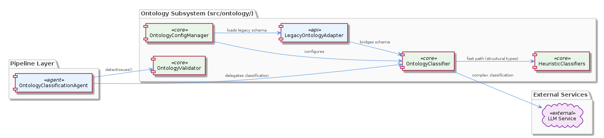
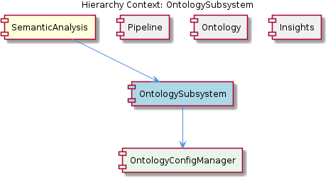

# OntologySubsystem

**Type:** SubComponent

The integrations/mcp-server-semantic-analysis/CRITICAL-ARCHITECTURE-ISSUES.md (marked RESOLVED) implies the ontology subsystem was a prior source of architectural coupling that was refactored, likely the motivation for separating OntologyConfigManager from inline agent configuration

# OntologySubsystem — Technical Insight Document

## What It Is

The `OntologySubsystem` is a `SubComponent` implemented under `src/ontology/` that encapsulates all entity classification, configuration management, and validation logic for the broader `SemanticAnalysis` system. It is composed of several cooperating modules — `OntologyConfigManager`, `OntologyClassifier`, `OntologyValidator`, heuristic classifiers, and `LegacyOntologyAdapter` — that together provide the runtime machinery for assigning entities to ontology types and verifying their structural correctness.

Architecturally, the subsystem sits *behind* the pipeline rather than *inside* it. The pipeline-facing `OntologyClassificationAgent` is a thin adapter that delegates its actual classification work to `OntologyClassifier` in `src/ontology/`. This separation means the subsystem owns the *domain logic* of ontology, while the agent layer owns the *lifecycle contract* defined by `BaseAgent<TInput, TOutput>` in `src/agents/base-agent.ts`.

## Architecture and Design

The dominant architectural pattern here is **separation of concerns through delegation**. `OntologyClassificationAgent` participates in the rigid five-method `BaseAgent` lifecycle (`process()`, `calculateConfidence()`, `detectIssues()`, `generateRouting()`, `applyCorrections()`), but it does not contain classification logic itself — it delegates to `OntologyClassifier`. Similarly, the agent's `detectIssues()` slot invokes `OntologyValidator` rather than performing validation inline. This keeps the ontology domain code free of pipeline orchestration concerns and free to evolve independently of `AgentResponse` envelope conventions.

A second clear pattern is the **centralized configuration entry point**. `OntologyConfigManager` is the sole loader of ontology configuration, ensuring that changes to entity type hierarchies flow through a single managed module instead of being scattered across individual agent files. This design is reinforced by the parent-child containment relationship: `OntologySubsystem contains OntologyConfigManager`, making the manager the canonical interface for any code needing to consult the ontology. The historical motivation for this centralization is recorded in `integrations/mcp-server-semantic-analysis/CRITICAL-ARCHITECTURE-ISSUES.md` (marked RESOLVED), which indicates that an earlier architecture coupled ontology configuration directly into agents and was refactored out.

A third pattern is the **tiered classification strategy**. Heuristic, rule-based classifiers act as a fast path that supplements LLM-based classification — for relationships like `CONTAINS_FILE` and `DEFINES_METHOD` whose types can be determined structurally, heuristics resolve the classification without invoking the model. This composition pattern reduces cost and latency while preserving LLM fallback for ambiguous cases. It also fits naturally with the sibling `Ontology` component's two-tier upper/lower ontology structure: heuristics tend to map cleanly onto lower-ontology concrete types, while LLM classification handles upper-ontology abstract categorization.

Finally, the presence of `LegacyOntologyAdapter` reveals a deliberate **adapter pattern for schema evolution**. The subsystem has undergone at least one breaking schema migration, and rather than forcing a global rewrite, the adapter bridges older ontology schemas to the current classification interface. This is a pragmatic trade-off: it adds a layer of indirection in exchange for backward compatibility with stored data and external integrations.

## Implementation Details

The runtime entry point for classification is `OntologyClassifier` under `src/ontology/`. It accepts batches of entities (matching the `TInput` shape that `OntologyClassificationAgent` passes through via its `BaseAgent` generic parameters) and produces classified output. Inside the classifier, heuristic classifiers run first as rule-based fast paths; only entities that cannot be confidently resolved structurally are forwarded to the LLM-backed classification path. The heuristic layer encodes domain knowledge about relationships such as `CONTAINS_FILE` and `DEFINES_METHOD`, which have deterministic type signatures and do not benefit from model inference.

`OntologyConfigManager` operates as a singleton-style loader for entity type hierarchies. Because it is the centralized entry point, any module that needs to know the set of valid entity types, parent-child relationships in the ontology, or upper-vs-lower tier assignments must route through it. This is what enables ontology changes to be made in one place rather than touching every agent.

`OntologyValidator` is invoked specifically from the pipeline agent's `detectIssues()` slot. Per the `BaseAgent` contract, `detectIssues()` is one of the five required lifecycle methods, and the validator's role is to populate the returned issues list with structural or semantic problems found in classified output. This means validation results surface through the standard `AgentResponse` envelope's issues channel, where downstream pipeline stages and self-healing corrections can consume them.

`LegacyOntologyAdapter` translates older schema shapes into the current classification interface. When the subsystem encounters configuration or data conforming to a prior schema version, the adapter normalizes it before downstream consumers (the classifier, validator, or config manager) see it. This isolates schema-migration logic from the core classification path.

## Integration Points

The most important integration is with the `Pipeline` sibling component. The pipeline coordinator sequences agents according to `batch-analysis.yaml` with explicit `depends_on` DAG edges, and `OntologyClassificationAgent` is one of the nodes in that DAG. The agent's `process()` method calls into `OntologyClassifier`, its `detectIssues()` method calls into `OntologyValidator`, and both calls cross the boundary from the pipeline layer into the `src/ontology/` subsystem.

A second integration is with the sibling `Ontology` component, which defines the upper and lower ontology categories that the subsystem operates on. `OntologyConfigManager` loads these definitions, the classifier maps entities into them, and the validator checks conformance to them. The two-tier structure (broad abstract categories on top, concrete entity types below) shapes how the heuristic vs. LLM split is implemented.

The subsystem also integrates indirectly with the `Insights` sibling. Because insights operate as a post-persistence concern, consuming already-written knowledge graph data, the <USER_ID_REDACTED> of classifications and the integrity of validation results produced by `OntologySubsystem` directly affect what insights can be derived later. Any classification error or unvalidated entity that reaches persistence becomes a defect that the insights stage must work around.

Externally, the `integrations/mcp-server-semantic-analysis/` directory references the subsystem in its architecture documentation, including the resolved critical-issues note that motivated the current separation between `OntologyConfigManager` and inline agent configuration.

## Usage Guidelines

When adding or modifying entity types, always make the change in `OntologyConfigManager` under `src/ontology/`. Never inline ontology configuration into a specific agent — doing so reverts the architectural fix that the resolved critical-issues document records, and reintroduces the scattered-configuration coupling that motivated the refactor.

When extending classification behavior, prefer adding a heuristic classifier for any rule that can be determined structurally. Heuristics avoid LLM calls, reduce cost and latency, and produce deterministic results. Reserve LLM-backed classification for genuinely ambiguous cases where structural rules cannot decide. Use the existing patterns for relationships like `CONTAINS_FILE` and `DEFINES_METHOD` as templates.

When working on the pipeline-facing agent, remember that `OntologyClassificationAgent` is intentionally thin. Resist the temptation to embed classification or validation logic in the agent's lifecycle methods; instead, delegate to `OntologyClassifier` and `OntologyValidator`. The agent's job is to fulfill the `BaseAgent<TInput, TOutput>` contract — wrapping subsystem calls into `process()`, `detectIssues()`, and the other three required slots — not to perform domain work.

When dealing with older data or external integrations using prior ontology schemas, route through `LegacyOntologyAdapter` rather than special-casing the classifier or validator. The adapter exists precisely to keep schema-migration concerns out of the core path. If a new breaking schema change is required in the future, the adapter is the right extension point.

Finally, treat `OntologyValidator` issues as first-class signals. Because validation results surface through the `AgentResponse` envelope's issues list, downstream pipeline stages and any self-healing `applyCorrections()` logic depend on them being populated accurately. Returning empty issue lists from the validator to "silence" warnings will compile and run, but will degrade the pipeline's ability to make branching decisions and propagate corrections.

---

### Summary of Key Insights

1. **Architectural patterns identified**: delegation from pipeline agent to subsystem; centralized configuration entry point (`OntologyConfigManager`); tiered classification (heuristic fast path + LLM fallback); adapter pattern (`LegacyOntologyAdapter`) for schema evolution.
2. **Design decisions and trade-offs**: separating `OntologyClassifier` from `OntologyClassificationAgent` adds indirection but isolates domain logic from pipeline lifecycle; heuristics trade implementation effort for cost/latency reduction; `LegacyOntologyAdapter` trades a layer of indirection for backward compatibility.
3. **System structure insights**: the subsystem is organized under `src/ontology/` as a cohesive module containing classifier, validator, config manager, heuristics, and legacy adapter, with a single thin pipeline-facing agent acting as its boundary.
4. **Scalability considerations**: heuristic fast paths bound LLM cost growth as entity volume scales; centralized config means hierarchy changes do not require touching multiple agents; the DAG-based pipeline allows the classification node to be parallelized within its dependency constraints.
5. **Maintainability assessment**: strong — separation of concerns between agent lifecycle and ontology logic is enforced structurally; centralized configuration eliminates a known prior coupling problem; the legacy adapter provides a clean extension point for future schema migrations.

## Hierarchy Context

### Parent
- [SemanticAnalysis](./SemanticAnalysis.md) -- [LLM] The `BaseAgent<TInput, TOutput>` abstract class defined in `src/agents/base-agent.ts` establishes a rigid, five-method execution contract that every agent in the pipeline must implement: `process()`, `calculateConfidence()`, `detectIssues()`, `generateRouting()`, and `applyCorrections()`. This is not a loose interface — each method is called sequentially within a standardized envelope, meaning an agent cannot skip confidence calculation or issue detection even if it has nothing meaningful to report for those phases. The resulting `AgentResponse` envelope carries not just the domain output but also metadata (timestamps, model usage), routing suggestions for downstream agents, and a corrections list for self-healing. For a new developer, this means that implementing a new agent is less about writing a single processing function and more about correctly filling all five lifecycle slots; an agent that returns empty stubs for `detectIssues()` or `generateRouting()` will still compile and run, but the orchestrating pipeline likely depends on those fields being populated to make branching decisions. The generic type parameters `<TInput, TOutput>` allow the base class to be reused across wildly different domains — from raw git commit arrays (SemanticAnalysisAgent) to ontology classification batches (OntologyClassificationAgent) — without sacrificing static type safety on the input/output contracts.

### Children
- [OntologyConfigManager](./OntologyConfigManager.md) -- Based on parent context, OntologyConfigManager acts as the sole entry point for ontology configuration under src/ontology/, preventing scattered entity hierarchy definitions across multiple agent files.

### Siblings
- [Pipeline](./Pipeline.md) -- The pipeline coordinator sequences agents in a fixed order defined in batch-analysis.yaml, with each step declaring explicit depends_on edges for DAG-based execution
- [Ontology](./Ontology.md) -- The upper ontology defines broad abstract categories while lower ontology definitions provide concrete entity types, creating a two-tier classification hierarchy referenced by OntologyClassificationAgent
- [Insights](./Insights.md) -- Insight generation operates as a post-persistence concern, consuming already-written KG data rather than raw pipeline input, as described in integrations/mcp-server-semantic-analysis/docs/architecture/agents.md

---

*Generated from 6 observations*
