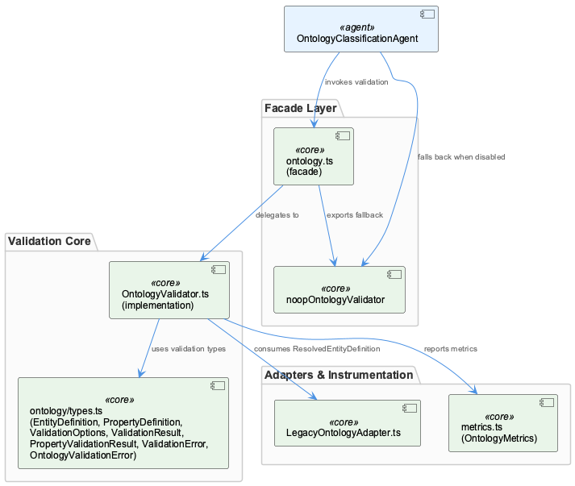
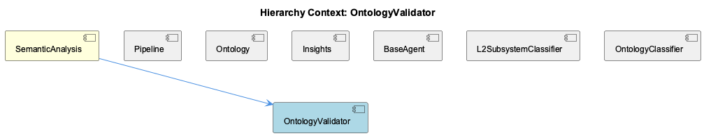

# OntologyValidator

**Type:** SubComponent

# OntologyValidator — Technical Insight Document

## What It Is

OntologyValidator is a validation component within the SemanticAnalysis pipeline, defined across two co-located files: `ontology.ts` and `OntologyValidator.ts`. Both define a class named `OntologyValidator`, and `ontology.ts` additionally exports a `noopOntologyValidator` variable. This is not an accidental duplication — the code structure indicates `ontology.ts` serves as a facade/legacy entry point while `OntologyValidator.ts` contains the canonical implementation. The component's job is to validate `EntityDefinition` and `PropertyDefinition` instances against ontology schemas, producing structured `ValidationResult` and `PropertyValidationResult` objects rather than throwing generic exceptions.

As a child of SemanticAnalysis, OntologyValidator sits alongside sibling components Ontology, OntologyClassifier, and L2SubsystemClassifier, all supporting the parent's broader mission of assigning ontology metadata to extracted knowledge entities before persistence.

## Architecture and Design

Several deliberate patterns emerge from the observations. First, a **Null Object pattern** is realized through `noopOntologyValidator`, a no-op stand-in that lets call sites avoid null/undefined checks when validation is optional or unconfigured — consistent with the parent component's graceful-degradation philosophy, mirrored in `OntologyClassificationAgent`'s L2→L1 fallback and `L2SubsystemClassifier`'s silent handling of a missing `coding.lower.json`.

Second, an **Adapter pattern** decouples OntologyValidator from km-core's `OntologyRegistry`. The validator imports `LegacyOntologyAdapter` and consumes `ResolvedEntityDefinition` objects, meaning it never touches raw ontology JSON or the resolution chain (upper.json → coding-ontology.json → coding.lower.json) directly. This insulates validation logic from upstream changes to ontology-loading mechanics.

Third, a **Facade/re-export separation** splits public surface (`ontology.ts`) from implementation (`OntologyValidator.ts`) — this dual-definition should be treated as an intentional legacy-compatibility boundary, not a bug.

Fourth, a **typed error hierarchy** (`ValidationError` specialized by `OntologyValidationError`) replaces string-based error handling, enabling structured, programmatic failure inspection.

## Implementation Details

The validator's imports from `ontology/types.ts` — `EntityDefinition`, `PropertyDefinition`, `ValidationOptions`, `ValidationResult`, `PropertyValidationResult`, `ValidationError`, `OntologyValidationError` — reveal a two-tier validation strategy. Individual properties are checked against `PropertyDefinition` schemas, producing per-property `PropertyValidationResult` objects, which are then aggregated into an entity-level `ValidationResult`. This tiered structure supports partial-validity outcomes (e.g., valid-with-warnings when only optional properties fail) instead of all-or-nothing pass/fail semantics.

The `ValidationOptions` import indicates validation behavior is configurable per call site — strict vs. lenient modes, or selective constraint enforcement — rather than hardcoded, allowing different treatment for hierarchy-root entities, freshly LLM-classified observations, or legacy/backfilled records.

Instrumentation is wired directly into the validator via `OntologyMetrics`, imported from `metrics.ts`. This mirrors `SemanticAnalysisAgent`'s `attachTokenLogger()` approach — metrics as a first-class collaborator rather than inline counters — though observability here is baked in at the module level rather than composed externally.

Test coverage includes `OntologyValidatorStub` in `graph-store.test.ts`, indicating the validator's interface is stable and mockable enough to substitute in isolated graph-store tests.

## Integration Points

OntologyValidator's principal upstream dependency is `LegacyOntologyAdapter.ts`, which wraps km-core's `OntologyRegistry` for backward compatibility with both OntologyValidator and its sibling `OntologyClassifier`. Downstream, `OntologyClassificationAgent` (the parent SemanticAnalysis's classification agent) likely consumes the validator's typed error objects to branch on structured failure reasons — a natural complement to its own layered classification strategy (hard-root-guard short-circuit for the 5 `HIERARCHY_ROOTS`, followed by heuristic/LLM/hybrid classification and L2 refinement).

The `noopOntologyValidator` fallback additionally suggests integration points where validation can be bypassed entirely, likely for hierarchy-root entities or legacy code paths that predate strict schema enforcement.

## Usage Guidelines

Developers should treat the `ontology.ts`/`OntologyValidator.ts` split as an intentional legacy boundary — do not attempt to merge or deduplicate these classes without understanding the facade's role. When validation is optional, prefer `noopOntologyValidator` over ad hoc null checks. Callers should leverage `ValidationOptions` to tune strictness per context rather than assuming one global validation policy, and should inspect `ValidationError`/`OntologyValidationError` structurally rather than parsing message strings. Finally, since OntologyValidator only consumes pre-resolved `ResolvedEntityDefinition` objects via `LegacyOntologyAdapter`, any changes to raw ontology data sources should route through the adapter layer rather than bypassing it.

## Code Evidence

Key code artifacts grounding this entity's analysis:

**Structural:**
- OntologyValidator (class) in ontology.ts
- OntologyValidator (class) in OntologyValidator.ts
- OntologyValidatorStub (class) in graph-store.test.ts

**Relationships:**
- Imports: LegacyOntologyAdapter.ts, ResolvedEntityDefinition, LegacyOntologyAdapter, metrics.ts, OntologyMetrics, ontology/types.ts, EntityDefinition, OntologyValidationError, PropertyDefinition, PropertyValidationResult (+3 more)
- OntologyValidator imports `LegacyOntologyAdapter` from `LegacyOntologyAdapter.ts` and `ResolvedEntityDefinition`, directly corroborating the parent component's documented architecture: km-core's `OntologyRegistry` resolves the ontology chain (upper.json → coding-ontology.json → coding.lower.json) and is wrapped via `LegacyOntologyAdapter` specifically 'for backward compatibility with the existing OntologyValidator/OntologyClassifier.' This means OntologyValidator does not talk to raw ontology JSON or km-core's registry directly — it consumes pre-resolved, adapter-normalized `ResolvedEntityDefinition` objects, decoupling validation logic from the underlying ontology-loading/merging mechanics and from any future km-core registry API changes.

**Other:**
- noopOntologyValidator (variable) in ontology.ts
- OntologyValidator.ts (module) in OntologyValidator.ts
- The code graph shows two distinct classes both named `OntologyValidator` — one in `ontology.ts` and one in `OntologyValidator.ts` — alongside a `noopOntologyValidator` variable exported from `ontology.ts`. This dual-definition pattern strongly suggests `ontology.ts` acts as a thin facade or re-export/legacy shim module that either wraps, aliases, or provides a null-object fallback for the 'real' implementation in `OntologyValidator.ts`. The `noopOntologyValidator` (a no-op/null-object implementation) is a classic guard against undefined-reference errors in code paths where validation is optional or not yet configured — consistent with the parent SemanticAnalysis component's broader pattern of graceful fallback (e.g. OntologyClassificationAgent's L2 refinement falling back to L1 when `coding.lower.json` is absent).
- The import list — `EntityDefinition`, `PropertyDefinition`, `ValidationOptions`, `ValidationResult`, `PropertyValidationResult`, `ValidationError`, `OntologyValidationError` — all drawn from `ontology/types.ts`, indicates OntologyValidator implements a structured, multi-stage validation pipeline: entity-level and property-level definitions are validated independently (`PropertyValidationResult` vs a top-level `ValidationResult`), and validation failures are represented as a typed error hierarchy (`ValidationError` extended/specialized by `OntologyValidationError`) rather than thrown generic exceptions or booleans. This typed-error-object pattern lets callers (e.g. OntologyClassificationAgent) inspect structured validation failures programmatically instead of parsing error strings.
- The import of `OntologyMetrics` from a dedicated `metrics.ts` module indicates OntologyValidator is instrumented for observability as a first-class concern, separate from its validation logic — likely tracking validation pass/fail rates, per-entity-type error counts, or L1/L2 classification-adjacent metrics. This mirrors the project's broader pattern (seen in `SemanticAnalysisAgent`'s `attachTokenLogger()`) of attaching metrics/telemetry collectors as a cross-cutting concern injected into or composed with core processing classes, rather than baking counters directly into validation methods.

## Hierarchy Context

### Parent
- [SemanticAnalysis](./SemanticAnalysis.md) -- SemanticAnalysis is a multi-agent pipeline (integrations/semantic-analysis/src/agents/) that processes git history, LSL sessions, and code-graph data to extract structured knowledge entities for the batch-analysis workflow. It centers on BaseAgent, an abstract class providing a standard execute() envelope (confidence scoring, issue detection, routing suggestions, corrections) that concrete agents like SemanticAnalysisAgent and OntologyClassificationAgent extend or compose with. The pipeline separates raw semantic extraction (SemanticAnalysisAgent, generating code analysis, cross-analysis insights, and LLM-derived architectural patterns) from ontology classification (OntologyClassificationAgent), which assigns ontology metadata to observations before persistence.

The OntologyClassificationAgent implements a layered classification strategy: a hard-root guard short-circuits LLM calls for the 5 fixed HIERARCHY_ROOTS (CollectiveKnowledge, Coding, DynArch, Timeline, Normalisa), assigning classificationMethod='hard-root-guard' without invoking the classifier. For non-root entities, classification flows through OntologyClassifier (heuristic/LLM/hybrid), and an additional L2 refinement step (loadL2Classes, buildL2RefinementPrompt, extractL2FromLLMResponse) attempts to narrow a generic L1 class (Component/SubComponent/Detail) to one of 10 specific L2 classes defined in .data/ontologies/coding.lower.json, falling back gracefully to L1 when the LLM declines or the lower-onto file is absent.

Architecturally, the component relies on km-core's OntologyRegistry for ontology chain resolution (upper.json → coding-ontology.json → coding.lower.json) wrapped via LegacyOntologyAdapter for backward compatibility with the existing OntologyValidator/OntologyClassifier. Tests (ontology-classification-agent.test.ts, ontology-classification-agent.hierarchy-roots.test.ts) use tmpdir-isolated ontology fixtures and mock classifiers to lock in behavior without live LLM calls, following the project's node:test + assert/strict convention.

### Siblings
- [Pipeline](./Pipeline.md) -- [CGR] pollKnowledgePipeline (function) in health-coordinator.js
- [Ontology](./Ontology.md) -- [CGR] ontology (variable) in knowledge-management.json
- [Insights](./Insights.md) -- [CGR] INSIGHTS (class) in kb-ab-sample-tasks.mjs
- [BaseAgent](./BaseAgent.md) -- [LLM] BaseAgent (base-agent.ts) is described as an abstract class implementing a template-method pattern: execute() is the fixed envelope that always runs process() → calculateConfidence() → detectIssues() → generateRouting() → applyCorrections() and folds the results into a single AgentResponse. This is a classic 'inversion of control' shape — concrete agents supply the domain-specific steps as overridable hooks, but the ORDER and the aggregation contract belong to the base class, not to each subclass. The practical consequence is that every agent in the pipeline (SemanticAnalysisAgent, OntologyClassificationAgent) produces a structurally identical response envelope regardless of what it actually analyzes, which is what lets downstream consumers (the batch-analysis workflow) treat agent output uniformly without per-agent branching.
- [L2SubsystemClassifier](./L2SubsystemClassifier.md) -- [LLM] The L2SubsystemClassifier's core mechanism is a fallback-tolerant refinement pass layered on top of OntologyClassificationAgent's primary L1 classification: loadL2Classes(registry) queries OntologyRegistry.classCatalog for any class whose `extends` field points at one of the three REFINABLE_L1_PARENTS (Component, SubComponent, Detail), and returns an empty array — rather than throwing — when coding.lower.json is absent from disk. This design choice means the L2 refinement step is architecturally optional and degrades to plain L1 classification silently, which trades discoverability of misconfiguration (a missing lower-ontology file produces no error, just quieter classification) for resilience across partial ontology deployments.
- [OntologyClassifier](./OntologyClassifier.md) -- [CGR] OntologyClassifier (class) in OntologyClassifier.ts

---

*Generated from 15 observations*
