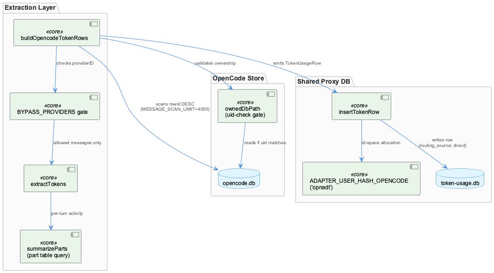
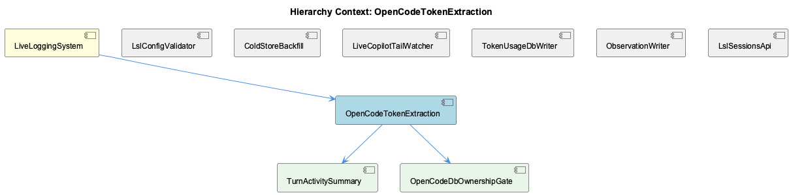

# OpenCodeTokenExtraction

**Type:** SubComponent

# OpenCodeTokenExtraction

## What It Is

OpenCodeTokenExtraction is implemented in `lib/lsl/token/opencode-token-rows.mjs`, centered on the entry-point function `buildOpencodeTokenRows`. It is a pure extraction layer that reads OpenCode's own SQLite store (`~/.local/share/opencode/opencode.db`, opened read-only via `better-sqlite3`) and reconstructs token-usage rows for assistant messages that were not already captured by the proxy's live wire-tap path. As a subcomponent of LiveLoggingSystem, it exists specifically to backfill token accounting for providers — like `github-copilot` — that bypass the rapid-llm-proxy daemon entirely, complementing the proxy's normal live-capture flow rather than duplicating it.

## Architecture and Design

The defining architectural decision is provider-gating instead of session-gating. `buildOpencodeTokenRows` performs a flat, bounded scan of the most recent `MESSAGE_SCAN_LIMIT` (4000) rows of the `message` table ordered by `rowid DESC`, filtering only for messages whose `providerID`/`provider` is present in `BYPASS_PROVIDERS = Set(['github-copilot'])`. This allow-list approach (rather than a blocklist) encodes invariant D-04: proxy-routed providers such as `anthropic` must never be reconstructed a second time from OpenCode's local store, and new proxy-routed providers are safe-by-default since they're excluded unless explicitly allow-listed.

Notably, the module has no concept of "the current OpenCode session." The unimplemented `currentOpencodeSession` / SessionWindowing filter (tracked separately as a SESSION work record) is explicitly out of scope here — session-window clamping is delegated downstream to `withinSpanWindow`, and `task_id` is deliberately left `''` for the caller (`captureForegroundTokens`) to stamp. This is a clean separation of concerns: extraction is session-agnostic, while attribution is layered on top by another component.

The component also embodies a "second-writer"/co-writer pattern relative to its sibling TokenUsageDbWriter: it writes into `token-usage.db`, a database primarily owned by the live proxy daemon, using the dedicated `ADAPTER_USER_HASH_OPENCODE = 'opnadt'` namespace so its `MAX(id)+1` allocation never collides with the daemon's own counter (D-06). Rows are stamped with `routing_source: DIRECT_ROUTING_SOURCE ('direct')` and `route_key: 'fg-chat/opencode'`, signaling to the routing dashboard that provider selection here was agent-driven, not router-resolved.

## Implementation Details

Two child components implement the core mechanics. `OpenCodeDbOwnershipGate`, realized as `ownedDbPath`, runs `fs.statSync` on the DB path and compares `st.uid` against `process.getuid()` before any read, returning `''` and logging a `[token-adapter-opencode]` stderr line on mismatch. Because this check is the very first line of `buildOpencodeTokenRows`, it is a pre-open gate — a non-owned or missing database short-circuits the entire pass before any `better-sqlite3` handle is created. This idiom mirrors `isOwnedByMe` in the sibling LiveCopilotTailWatcher's `lib/lsl/live/copilot-events-tail.mjs`, establishing a consistent defense-in-depth convention across both adapters.

`TurnActivitySummary`, implemented as `summarizeParts`, builds a bounded, human-readable per-turn activity string by querying the `part` table (via a prepared statement `partStmt`, ordered by `time_created ASC`, keyed on `message_id`). It concatenates a lead text snippet (capped at 140 chars via `snip`) with up to 8 tool-call descriptors (`tool(arg)`), plus a `+N` overflow marker, then re-clamps the whole joined string to 240 chars — a double-bounding scheme guaranteeing the summary can never grow unbounded. A prepare-time try/catch guards against databases predating the `part` table, allowing extraction to degrade gracefully to summary-less rows rather than failing outright.

Token values themselves are parsed by `extractTokens`, which pulls the tokens object out of each message's data blob into a `TokenUsageRow`-shaped object.

## Integration Points

The write path runs through the sibling TokenUsageDbWriter (`lib/lsl/token/token-db.mjs`), specifically `insertTokenRow`/`openTokenDb`, which shares column-ordering conventions (`BASE_COLUMNS`) with this module by convention rather than import. `insertTokenRow` wraps writes in a bounded retry loop (`INSERT_ID_RETRY_ATTEMPTS = 3`) on `SQLITE_CONSTRAINT` collisions and follows a best-effort, never-throw discipline (D-08) so a write failure cannot crash the LSL/observation path — consistent with the broader principle, seen also in ColdStoreBackfill and the LSL Session Continuity work, that observation output is treated as primary evidentiary input downstream and must never be corrupted by a schema mismatch. `ensureCacheColumns` and `insertShapeFor` probe the actual schema at runtime rather than assuming a fixed shape, since this module is a guest writer on a database it doesn't own.

Upstream, the module depends entirely on OpenCode's own SQLite schema (`message` and `part` tables) rather than intercepting the proxy's request path — it reconstructs history after the fact. Downstream, `task_id` attribution and session-window clamping are pushed to `captureForegroundTokens` (not shown in provided files), keeping this module decoupled from LiveLoggingSystem's higher-level continuity and attribution concerns.

## Usage Guidelines

Developers extending this module should preserve the allow-list philosophy of `BYPASS_PROVIDERS`: adding a provider here is a deliberate double-count risk decision and should only be done for providers confirmed to bypass proxy capture entirely. The uid ownership gate must remain the first check in any new entry point touching `opencode.db`, matching the same convention used in OpenCodeDbOwnershipGate and LiveCopilotTailWatcher. Since `summarizeParts`/TurnActivitySummary must tolerate schemas lacking a `part` table, any modification should retain the try/catch-based graceful degradation rather than treating summary generation as required for row emission. Finally, because session-scoping (`currentOpencodeSession`) is explicitly unimplemented, this module should not be treated as session-aware — any session-boundary logic belongs in a separate SessionWindowing layer, not folded into `buildOpencodeTokenRows`.

## Code Evidence

Key code artifacts grounding this entity's analysis:

- `buildOpencodeTokenRows` in lib/lsl/token/opencode-token-rows.mjs is the core extraction function: it opens `~/.local/share/opencode/opencode.db` read-only via better-sqlite3, scans the most recent `MESSAGE_SCAN_LIMIT` (4000) rows of the `message` table by `rowid DESC`, and for each assistant message whose `providerID`/`provider` field is in `BYPASS_PROVIDERS = Set(['github-copilot'])` emits one `TokenUsageRow`-shaped object via `extractTokens(d)`. Messages from proxy-routed providers (e.g. `anthropic`) are explicitly skipped — this is the D-04 no-double-count invariant stated in the file's header comment: a message already captured as a proxy wire row must never be reconstructed a second time from OpenCode's own store.
- The extraction function is deliberately provider-gated rather than session-gated: it has no notion of 'the current OpenCode session' and instead does a flat bounded scan across all recent messages in the DB, relying on `withinSpanWindow` (mentioned in the header comment as living downstream) to clamp to the caller's time window. `task_id` is left `''` on every emitted row — the header comment states the caller (`captureForegroundTokens`) is responsible for stamping it, so this module is a pure, session-agnostic extraction layer, not an attribution layer.
- `ownedDbPath` in opencode-token-rows.mjs performs a uid-check via `fs.statSync` before any read, returning `''` (and writing a `[token-adapter-opencode]` stderr line) if the DB's owner uid doesn't match `process.getuid()`. This mirrors the same-named ownership contract described for `copilot-token-rows.mjs` in the module's own comments, and is the same uid-gating idiom used by `isOwnedByMe` in lib/lsl/live/copilot-events-tail.mjs for session directories — a consistent defense-in-depth pattern across both the Copilot and OpenCode extraction adapters.
- Extracted rows are written into the proxy's shared `token-usage.db` via `insertTokenRow`/`openTokenDb` in lib/lsl/token/token-db.mjs, using the dedicated `ADAPTER_USER_HASH_OPENCODE = 'opnadt'` constant (declared in token-db.mjs and imported by opencode-token-rows.mjs) so the second-writer's `MAX(id)+1` allocation never collides with the live proxy daemon's own id counter (D-06). The insert also stamps `routing_source: DIRECT_ROUTING_SOURCE ('direct')` and `route_key: 'fg-chat/opencode'`, recording that this row's provider was chosen by the agent, not resolved by the router — a distinction the module's comments say the routing dashboard's 'Recent decisions' table depends on to avoid silently dropping these rows.
- `summarizeParts` in opencode-token-rows.mjs builds a bounded (240-char) human-readable per-turn activity string — lead text plus up to 8 tool-call descriptors (`tool(arg)`) — by querying the `part` table via a prepared statement (`partStmt`, ordered by `time_created ASC`) keyed on `message_id`, guarded so a database predating the `part` table (caught via a prepare-time try/catch) still emits token rows without summaries rather than failing the whole extraction pass.

## Work Record

What working sessions recorded about this entity — decisions taken, problems hit, and why things are the way they are:

- The work record 'opencode Session Filtering (currentOpencodeSession)' (about SessionWindowing) establishes that filter logic to correctly identify which OpenCode session is 'current' — based on permission markers and session metadata — has NOT yet been implemented, and that relevant context lives in the opencode database schema and session-handling code. This is the same `opencode.db` that `buildOpencodeTokenRows` reads via an unscoped, rowid-bounded scan rather than a session-scoped query, meaning the extraction adapter currently has no dependency on session identity to function correctly.

## Hierarchy Context

### Parent
- [LiveLoggingSystem](./LiveLoggingSystem.md) -- [SESSION] LSL Session Continuity Bootstrap (/sl command): re-establishes full project context at session start by loading the most recent LSL transcript files under .specstory/history/ and producing a structured continuity summary covering time range, projects touched, branch state, and pending work

### Children
- [TurnActivitySummary](./TurnActivitySummary.md) -- [LLM+CGR] `summarizeParts` in lib/lsl/token/opencode-token-rows.mjs is the concrete implementation of the turn-activity-summary concept: it walks a time-ordered array of parsed `part` blobs and builds a single string composed of a lead text snippet (the first `type: 'text'` part, capped to 140 chars via `snip`) followed by up to 8 tool-call descriptors rendered as `tool(arg)`, joined with `, ` and suffixed with a `+N` overflow marker when more than 8 tool calls occurred in the turn. The whole result is re-clamped to 240 chars by a final `snip(segs.join(' '), 240)` call — a double-bounding scheme (per-segment cap, then whole-string cap) that guarantees the summary can never grow unbounded even if a single tool argument or the lead text is unusually long.
- [OpenCodeDbOwnershipGate](./OpenCodeDbOwnershipGate.md) -- [LLM] The ownership gate for OpenCode's SQLite store is `ownedDbPath` in lib/lsl/token/opencode-token-rows.mjs — it runs `fs.statSync(dbPath)` before any read, and when `process.getuid` is available it compares the file's `st.uid` against `process.getuid()`, returning `''` and writing a `[token-adapter-opencode] skipping non-owned ...` stderr line on mismatch. This function is called as the very first line of `buildOpencodeTokenRows`, so a non-owned or missing `opencode.db` short-circuits the entire extraction pass before a single `better-sqlite3` handle is opened, meaning the uid check is a pre-open gate, not a post-open validation.

### Siblings
- [LslConfigValidator](./LslConfigValidator.md) -- [CGR] LSLConfigValidator (class) in validate-lsl-config.js
- [ColdStoreBackfill](./ColdStoreBackfill.md) -- [SESSION] Cold-Store Backfill — Artifacts Field Recovery: reconstructs missing Artifacts fields in cold-storage observation rows by exact-timestamp matching against editing-turn data, explicitly designed to avoid false-positive matches that would corrupt unrelated rows
- [LiveCopilotTailWatcher](./LiveCopilotTailWatcher.md) -- [LLM] `lib/lsl/live/copilot-events-tail.mjs` is the LiveCopilotTailWatcher implementation itself: `scanForLiveSessions()` walks `~/.copilot/session-state/<uuid>/` directories, keeping only those with a live (non-stale) `inuse.<pid>.lock`, found via `findLiveLockFile()` matching the `/^inuse\.\d+\.lock$/` pattern and a 10-minute `LOCK_STALE_GRACE_MS` grace window that treats an orphaned lock from a hard-crashed session as 'dead' rather than live. Each surviving session directory is then handed to `tailEventsFile()`, which opens a 200ms (`TAIL_POLL_INTERVAL_MS`) `statSync` poll on `events.jsonl`, reading only newly appended bytes via `fs.openSync`/`fs.readSync` at the previously recorded offset and splitting on newlines with a `residual` buffer to hold a partial trailing line across polls.
- [TokenUsageDbWriter](./TokenUsageDbWriter.md) -- [LLM] The closest match to a 'TokenUsageDbWriter' in the supplied files is lib/lsl/token/token-db.mjs, whose insertTokenRow() function performs the actual database write to token_usage.db. It uses an id-allocation seed (NEXT_ID_SQL) scoped per adapter user_hash and wraps the INSERT in a bounded retry loop (INSERT_ID_RETRY_ATTEMPTS=3) that recomputes MAX(id)+1 on SQLITE_CONSTRAINT collisions, distinguishing genuine duplicate tool_call_id rows (dropped) from lost id races (retried).
- [ObservationWriter](./ObservationWriter.md) -- [SESSION] Attribution Router Module: ObservationWriter now uses deterministic path-based routing (repo-router.mjs) instead of a prior unreliable embedding-similarity voting approach, fixing misattribution of KB observations to owning teams/repos
- [LslSessionsApi](./LslSessionsApi.md) -- [LLM] None of the supplied files define, export, route, or reference an entity named `LslSessionsApi`. The closest thematic neighbor is `lib/lsl/live/copilot-events-tail.mjs`, whose `scanForLiveSessions(sessionStateDir, myUid)` function enumerates session directories under `~/.copilot/session-state/<uuid>/` by checking for a live `inuse.<pid>.lock` file (via `findLiveLockFile`) and uid ownership (via `isOwnedByMe`). This is a filesystem-polling live-session *detector* for one specific agent (Copilot), not a generic sessions API surface — it has no HTTP route, no REST handler, and no shared session-listing contract that other agents (Claude, opencode) go through.

---

*Generated from 10 observations*
