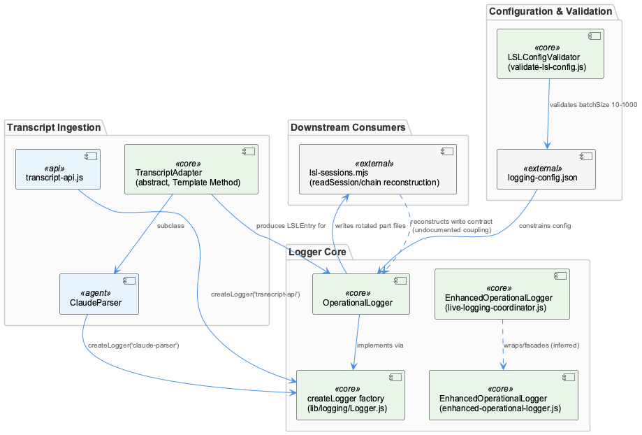
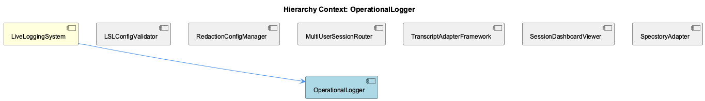

# OperationalLogger

**Type:** SubComponent

[LLM] Although the code graph places OperationalLogger and EnhancedOperationalLogger as the concrete implementation classes, none of the provided code files contain their bodies — the actual source (OperationalLogger.js, enhanced-operational-logger.js, live-logging-coordinator.js) is absent from this excerpt. What is visible instead is the surrounding ecosystem the OperationalLogger presumably feeds into: config/logging-config.json defines a category-based logging schema (health, billing, transcript, knowledge, workflow, database, api, mcp) with per-environment overrides (development/production/test), and its `_notes.constraints` field explicitly ties log-statement discipline to `no-console-log`/`no-console-error`/`no-console-warn` rules enforced by integrations/constraint-monitor. This implies OperationalLogger is very likely a consumer or implementer of the `createLogger` factory referenced in that config's `_notes.backend` (`lib/logging/Logger.js`), the same factory imported directly in lib/agent-api/transcript-api.js (`const logger = createLogger('transcript-api')`) and lib/agent-api/transcripts/claude-parser.js (`const logger = createLogger('claude-parser')`) — meaning OperationalLogger sits in the same logging-infrastructure family as these transcript adapters, not as a separate subsystem.

# OperationalLogger — Technical Insight Document

## What It Is

OperationalLogger is implemented as a base class in `OperationalLogger.js`, with what appears to be an extended variant, `EnhancedOperationalLogger`, defined in `enhanced-operational-logger.js`. Notably, the code graph also surfaces a second `EnhancedOperationalLogger` class definition in `live-logging-coordinator.js`, which invokes `initializeOperationalLogger` as part of its startup sequence. None of these three files' bodies are present in the available excerpt, so the concrete implementation (batching logic, write paths, rotation behavior) must be inferred from consumers, configuration schemas, and downstream readers rather than read directly.

As a SubComponent, OperationalLogger is contained within the parent **LiveLoggingSystem**, alongside sibling components including **LSLConfigValidator**, **RedactionConfigManager**, **MultiUserSessionRouter**, **TranscriptAdapterFramework**, and **SessionDashboardViewer**. Test coverage exists via `OperationalLoggerTests` (in `full-system-validation.test.js`), `OperationalLoggerTest` (in `operational-logger.test.js`), and a standalone validation function `validateOperationalLogger` in `simplified-system-validation.js`, indicating this component is treated as a well-defined, independently-testable unit within the broader system.

## Architecture and Design

The most architecturally significant observation is the naming collision: `EnhancedOperationalLogger` is defined identically in both `enhanced-operational-logger.js` and `live-logging-coordinator.js`. Given this project's explicit convention against parallel "enhanced"/"v2" duplication (per CLAUDE.md), the more plausible explanation is that `live-logging-coordinator.js` implements a facade or re-export of the enhanced logger rather than maintaining a genuinely separate implementation — though this cannot be confirmed without the coordinator's source.

A clean separation-of-concerns pattern governs configuration: the parent LiveLoggingSystem enforces, via `LSLConfigValidator` in `scripts/validate-lsl-config.js`, that `operationalLogger` is one of five mandatory top-level config sections, with a hard numeric invariant that `operationalLogger.batchSize` must fall between 10 and 1000. This validation lives entirely outside `OperationalLogger.js` itself — the logger class can assume any config it receives has already passed this bound check, decoupling "how the logger behaves" from "whether its configuration is valid."

Category-based log routing appears as a shared factory pattern (`createLogger(category)`, backed by `lib/logging/Logger.js` per `config/logging-config.json`'s `_notes.backend`), used identically in `lib/agent-api/transcript-api.js` (`createLogger('transcript-api')`) and `lib/agent-api/transcripts/claude-parser.js` (`createLogger('claude-parser')`). This places OperationalLogger within the same logging-infrastructure family as these transcript adapters rather than as an isolated subsystem.

## Implementation Details

Because the core class bodies are absent from this excerpt, implementation detail must be pieced together from adjacent code. The sibling **TranscriptAdapterFramework** is exemplified by `TranscriptAdapter` in `lib/agent-api/transcript-api.js`, an abstract base class using a `new.target === TranscriptAdapter` guard to block direct instantiation, with abstract methods (`getAgentType`, `getTranscriptDirectory`, `readTranscripts`, `convertToLSL`, `getCurrentSession`) that throw if unoverridden — a textbook Template Method pattern. Its `watchTranscripts()` polls `getCurrentSession()` on an interval and dispatches new entries to registered callbacks — an operational shape (periodic read + batched dispatch) that mirrors what `operationalLogger.batchSize` presumably governs on the write side.

On the read side, `integrations/system-health-dashboard/lsl-sessions.mjs`'s `readSession()` reconstructs logical sessions from rotated part files via `groupChains()`, `concatChain()`, and `parseChain()` (from `src/live-logging/LslMarkdownParser.js`), explicitly because "a legacy -N_ markdown part is a headerless fragment split mid-token and cannot be read alone." This strongly implies OperationalLogger (or its Enhanced variant) is the writer producing these rotated, headerless continuation parts — the dashboard's reconstruction logic is effectively reverse-engineered documentation of the logger's file-rotation contract, since the two sides appear to share implicit assumptions rather than an explicit schema.

## Integration Points

OperationalLogger sits downstream of the TranscriptAdapterFramework's ingestion pipeline: adapters like `ClaudeParser` (`lib/agent-api/transcripts/claude-parser.js`) produce LSLEntry-like objects that OperationalLogger presumably batches and writes. It is upstream of **SessionDashboardViewer**, whose `lsl-sessions.mjs` module depends on understanding the logger's part-file rotation format to reconstruct sessions at read time.

Configuration-wise, OperationalLogger's runtime is bounded by `LSLConfigValidator` (sibling **LSLConfigValidator**) enforcing the `operationalLogger.batchSize` invariant (10–1000), and by `config/logging-config.json`'s category schema (health, billing, transcript, knowledge, workflow, database, api, mcp) with per-environment overrides, whose `_notes.constraints` ties logging discipline to `no-console-log`/`no-console-error`/`no-console-warn` rules enforced by `integrations/constraint-monitor`.

A privacy-relevant integration concern involves sibling **RedactionConfigManager**: `claude-parser.js`'s `parseFile()` sets `userHash: process.env.USER || 'unknown'` as a raw, unhashed username, contradicting the SHA-256-truncate-to-6-characters pseudonymization scheme documented for `validateUserEnvironment()` elsewhere in LSL. If OperationalLogger persists this `userHash` field into written entries or file paths, it represents a potential plaintext-username leak bypassing the classification/redaction schema, which the parent LiveLoggingSystem treats as a mandatory, fail-closed section.

## Usage Guidelines

Developers extending OperationalLogger should treat `batchSize` as an externally-validated contract, not a free parameter — the class should not attempt to re-validate or silently clamp values outside 10–1000, since `LSLConfigValidator` already fails closed before the logger runs. Any refactor of write-buffering or rotation logic must preserve compatibility with the part-file chaining format that `lsl-sessions.mjs` depends on for reconstruction, since that coupling is currently undocumented and implicit rather than schema-enforced.

Given the naming collision between the two `EnhancedOperationalLogger` definitions, contributors should verify whether `live-logging-coordinator.js`'s version is a genuine re-export/facade over `enhanced-operational-logger.js` before modifying either — introducing true duplicate logic would violate the project's stated no-parallel-versions convention. Finally, anyone touching the logger's write path for user/session metadata should reconcile the `userHash` inconsistency surfaced in `claude-parser.js` against the documented hash-and-truncate pseudonymization scheme before persisting that field further downstream.

## Code Evidence

Key code artifacts grounding this entity's analysis:

**Structural:**
- OperationalLogger (class) in OperationalLogger.js
- EnhancedOperationalLogger (class) in enhanced-operational-logger.js
- EnhancedOperationalLogger (class) in live-logging-coordinator.js
- initializeOperationalLogger (method) in live-logging-coordinator.js
- OperationalLoggerTests (class) in full-system-validation.test.js
- OperationalLoggerTest (class) in operational-logger.test.js
- validateOperationalLogger (function) in simplified-system-validation.js

**Relationships:**
- Calls: log

**Other:**
- OperationalLogger.js (module) in OperationalLogger.js
- The code graph surfaces two separate classes named EnhancedOperationalLogger — one in enhanced-operational-logger.js and one in live-logging-coordinator.js — alongside a base OperationalLogger in OperationalLogger.js. This naming collision across files is architecturally significant: it suggests either (a) live-logging-coordinator.js re-exports or locally wraps the enhanced-operational-logger.js implementation under the same name to keep call sites agnostic of which module they imported from, or (b) two independently-evolved implementations have drifted into naming overlap, which would be a maintenance hazard given this project's explicit 'no parallel versions' convention (CLAUDE.md forbids 'enhanced'/'v2'-style duplication). Given the strictness of that project-wide rule, the more likely explanation is a coordinator-level facade that composes or re-exports the enhanced logger rather than a genuine duplicate implementation, but this cannot be confirmed without the source of live-logging-coordinator.js itself.

## Hierarchy Context

### Parent
- [LiveLoggingSystem](./LiveLoggingSystem.md) -- [LLM] The LiveLoggingSystem's configuration validation is centralized in scripts/validate-lsl-config.js through the LSLConfigValidator class, which acts as a schema enforcement gatekeeper for two distinct config artifacts: .specstory/config/lsl-config.json (structural/behavioral settings) and .specstory/config/redaction-config.yaml (privacy/classification rules). This separation reflects a deliberate architectural decision to decouple 'how the logger behaves' from 'what the logger is allowed to record', allowing redaction policy to be iterated on independently from file-management or session-windowing logic. The initializeSchemas() method enumerates five required top-level sections (version, multiUser, fileManager, operationalLogger, classification), meaning any config missing even one of these fails validation outright—this is a strict fail-closed design rather than a permissive fail-open one, which is notable for a system handling potentially sensitive session transcripts.

### Siblings
- [LSLConfigValidator](./LSLConfigValidator.md) -- [CGR] LSLConfigValidator (class) in validate-lsl-config.js
- [RedactionConfigManager](./RedactionConfigManager.md) -- [LLM] lib/agent-api/transcripts/claude-parser.js:parseFile() sets session metadata `userHash: process.env.USER || 'unknown'` — this is the RAW, unhashed OS username, not a SHA-256 truncated hash. This directly contradicts the pseudonymization pattern described for LSL's `validateUserEnvironment()` (hash+truncate to 6 chars) referenced in the parent LiveLoggingSystem context. If ClaudeParser's output metadata is persisted or surfaced without passing back through a redaction/hashing step, this is a plaintext-username leak in exactly the kind of session transcript metadata the classification schema is meant to guard, and is worth verifying against whatever RedactionConfigManager rules apply downstream of this adapter.
- [MultiUserSessionRouter](./MultiUserSessionRouter.md) -- [LLM] [object Object]
- [TranscriptAdapterFramework](./TranscriptAdapterFramework.md) -- [LLM] [object Object]
- [SessionDashboardViewer](./SessionDashboardViewer.md) -- [LLM] [object Object]
- [SpecstoryAdapter](./SpecstoryAdapter.md) -- [CGR] SpecstoryAdapter (class) in specstory-adapter.js

---

*Generated from 18 observations*
