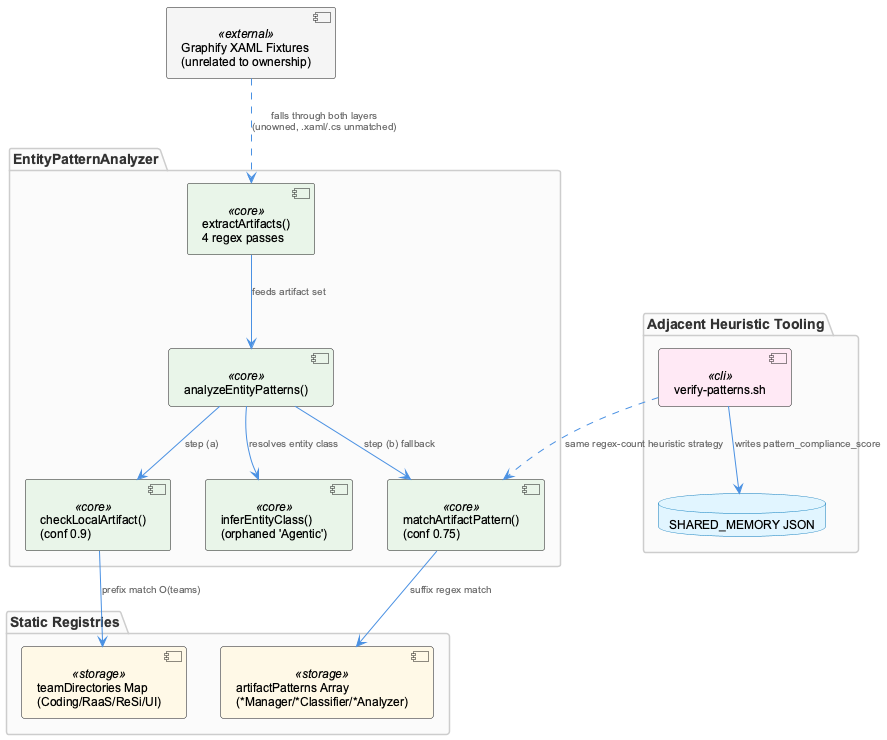
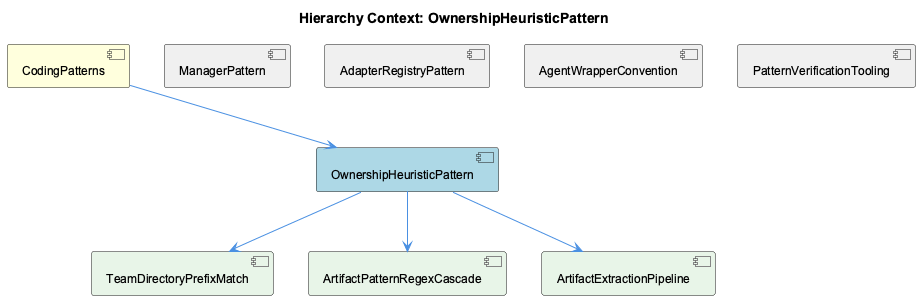

# OwnershipHeuristicPattern

**Type:** SubComponent

# OwnershipHeuristicPattern

## What It Is

OwnershipHeuristicPattern is implemented entirely within `src/ontology/heuristics/EntityPatternAnalyzer.ts`, and describes a fast, regex/prefix-based heuristic for inferring which team "owns" a given artifact (file path, class name, npm scope, or directory prefix) mentioned in free-text knowledge content. It is not a learned or statistical model — it is a deterministic, table-driven classifier that trades precision for speed, explicitly targeting a "<1ms response time" design goal. As a member of `CodingPatterns`, it sits alongside `ManagerPattern`, `AdapterRegistryPattern`, `AgentWrapperConvention`, and `PatternVerificationTooling` as one of several codified conventions for how this codebase organizes cross-cutting logic; its own internal structure is decomposed into three child components — `TeamDirectoryPrefixMatch`, `ArtifactPatternRegexCascade`, and `ArtifactExtractionPipeline`.

## Architecture and Design

The core of the pattern is a two-layer cascading heuristic inside `analyzeEntityPatterns()`: step (a), realized as `TeamDirectoryPrefixMatch` (`checkLocalArtifact()`), performs an O(teams) prefix scan against a hardcoded `teamDirectories` Map; only on a miss does step (b), `ArtifactPatternRegexCascade` (`matchArtifactPattern()`), fall back to per-team `RegExp` arrays keyed on class-name suffixes (`*Manager`, `*Classifier`, `*Analyzer`). This ordering encodes an explicit confidence hierarchy — 0.9 for a direct path hit versus 0.75 for a naming-convention hit — reflecting the design belief that directory placement (enforced by repo structure) is more trustworthy than naming convention (which can drift).

Feeding both layers is `ArtifactExtractionPipeline` (`extractArtifacts()`), which runs four independent regex passes — file paths, npm scopes, suffix-based class names, and bare directory prefixes — merging everything into a single deduplicated `Set<string>` with no provenance tracking. Both downstream matchers then treat every string in that set identically, whether it originated as a path fragment or a class name.

Structurally, this is a "data-driven registry" variant of the `AdapterRegistryPattern` documented at the parent level: `teamDirectories` and `artifactPatterns` are plain Map/array literals rather than instantiated adapter objects. It also diverges from the `ManagerPattern` sibling — despite resembling a Manager in its registry-building constructor, `EntityPatternAnalyzer` exposes no init/start/stop lifecycle and owns no mutable state, making it a pure, stateless classifier rather than a lifecycle-owning Manager.

## Implementation Details

`extractArtifacts()`'s class-name regex — `/[A-Z][a-zA-Z]+(Service|Agent|Manager|Engine|Handler|Analyzer|Classifier|Filter|Monitor)/g` — is the same suffix vocabulary as the parent's documented Manager-suffix naming convention, effectively re-implementing that human idiom as an executable detector. Notably, this regex is a strict superset of what `matchArtifactPattern()` actually checks: the per-team `artifactPatterns` look for narrow, enumerated compounds (`LSL(Session|Monitor|Classifier)`, `Kubernetes(Cluster|Pod|Service)`, `React(Component)?|Redux`), so a large share of extracted candidates are silently discarded with no logging, as detailed under `ArtifactPatternRegexCascade`.

`checkLocalArtifact()`'s prefix scan iterates `teamDirectories` in Map insertion order (Coding, RaaS, ReSi, UI); because the four directory sets currently share no overlapping prefixes this is a non-issue, but it is a latent ordering dependency — a future generic prefix could silently misattribute ownership to whichever team was inserted first, a risk flagged explicitly for `TeamDirectoryPrefixMatch`.

Confidence values (0.9, 0.75) are hardcoded numeric literals duplicated across `analyzeEntityPatterns()`, `checkLocalArtifact()`, and `matchArtifactPattern()`'s returned `ArtifactMatch` objects, rather than centralized configuration. The truncated `inferEntityClass()` method also contains an orphaned fifth team key, `'Agentic'` (Agent→AgentFramework, RAG→RAGSystem, LLM→LLMProvider, Vector→VectorStore), absent from the four active teams in `teamDirectories`/`artifactPatterns` — likely dead code from a merged/renamed team, and effectively unreachable via local-path matches since `checkLocalArtifact()` resolves first.

## Integration Points

Within `CodingPatterns`, this component is conceptually adjacent to `PatternVerificationTooling`'s `scripts/knowledge-management/verify-patterns.sh`, which independently applies the same "count occurrences of a naming/API convention" philosophy — using ripgrep counts (e.g., `console.log` vs `Logger.*`) and `jq` against a SHARED_MEMORY JSON file to score pattern compliance (`ConditionalLoggingPattern`, `ReduxStateManagementPattern`). Both are text/regex heuristics rather than AST-level static analysis, a project-wide preference favoring speed and zero dependencies over precision.

Notably, unrelated fixture files (`integrations/graphify/tests/fixtures/xaml_viewmodel/ViewModels/DesignViewModel.cs` and `.../Views/DesignView.xaml`) exist near this bundle for graphify's own XAML parser tests — but since none of `EntityPatternAnalyzer`'s regexes target `.xaml`/`.cs` extensions, these files fall through both detection layers entirely and are unrelated to ownership classification.

This pattern also stands in contrast to the codebase's config-driven classifiers (`SensitivityClassifier`/`OntologyClassifier`, `prompt-classifier.yaml`), which externalize thresholds and categories as YAML data — a philosophy this component notably does not follow.

## Usage Guidelines

Developers extending team coverage must edit `EntityPatternAnalyzer`'s constructor directly — onboarding a fifth team requires a TypeScript source change and redeploy, not a config update, unlike the YAML-driven classifiers elsewhere. Anyone renaming a `*Manager`/`*Classifier`/`*Analyzer` class should recognize this will silently degrade extraction recall with no compile-time warning, since the regex vocabulary is a hardcoded mirror of the naming convention. Confidence tuning requires touching three duplicated hardcoded sites, so retuning thresholds should be done consistently across `analyzeEntityPatterns()`, `checkLocalArtifact()`, and `matchArtifactPattern()`. Finally, the orphaned `Agentic` mapping should be investigated and either removed or properly wired in before it causes confusion, and developers should not rely on artifact provenance (path vs. class name) since `ArtifactExtractionPipeline` discards that distinction before matching occurs.

## Hierarchy Context

### Parent
- [CodingPatterns](./CodingPatterns.md) -- [LLM] The Manager-suffix naming convention observed across LLMServiceProvider, MockModeManager, CachingMechanism, CircuitBreakerManager, and BudgetTracker reflects a deliberate architectural choice to encapsulate stateful, cross-cutting concerns behind a consistent interface shape. New developers should expect any class named *Manager to expose lifecycle methods (init/start/stop or similar), own some internal mutable state (cache entries, circuit state, budget counters), and be instantiated once per service boundary rather than per-request. This convention makes it easy to locate resilience and resource-control logic by grep'ing for 'Manager' across the codebase, and it implies that when adding a new cross-cutting concern (e.g., rate limiting), the idiomatic approach is to add a RateLimitManager sibling rather than embedding the logic inline in provider code.

### Children
- [TeamDirectoryPrefixMatch](./TeamDirectoryPrefixMatch.md) -- [LLM] TeamDirectoryPrefixMatch corresponds to the private `checkLocalArtifact()` method in `src/ontology/heuristics/EntityPatternAnalyzer.ts`, which is invoked as step (a) inside `analyzeEntityPatterns()`. Its implementation is a simple O(teams × dirs-per-team) nested scan: for each `[team, dirs]` entry in the `teamDirectories` Map, it calls `dirs.some((dir) => artifact.startsWith(dir))`. Because JavaScript `Map` iteration order is insertion order, and the Map is constructed with `Coding` first, `RaaS` second, `ReSi` third, `UI` fourth, any artifact string whose prefix could theoretically satisfy more than one team's directory list would always resolve to whichever team was inserted first — in practice a non-issue today since the four directory lists (`src/ontology`/`src/knowledge-management`/... vs `raas-service`/... vs `virtual-target`/... vs `curriculum-alignment`/...) do not share prefixes, but it is a latent ordering dependency that a naive future edit (e.g. adding a short/generic prefix like `src/` to a second team) could silently break.
- [ArtifactPatternRegexCascade](./ArtifactPatternRegexCascade.md) -- [LLM] The class-name extraction regex in extractArtifacts() (src/ontology/heuristics/EntityPatternAnalyzer.ts) — `/[A-Z][a-zA-Z]+(Service|Agent|Manager|Engine|Handler|Analyzer|Classifier|Filter|Monitor)/g` — is a strict superset of the suffix vocabulary actually consumed downstream: matchArtifactPattern() only ever tests the per-team `artifactPatterns` arrays, which look for far narrower, team-specific compounds like `LSL(Session|Monitor|Classifier)`, `Kubernetes(Cluster|Pod|Service)`, or `React(Component)?|Redux`. This means the extraction pass is deliberately over-broad (it will happily capture `FooEngine` or `BarFilter` with no team affiliation at all) while the matching pass is narrow and enumerated, so a large fraction of extracted 'artifacts' are silently discarded in matchArtifactPattern()'s loop with no logging or telemetry — the two regex layers are not vocabulary-aligned even though they look like they should be from the class comment.
- [ArtifactExtractionPipeline](./ArtifactExtractionPipeline.md) -- [LLM] The `extractArtifacts()` method in `src/ontology/heuristics/EntityPatternAnalyzer.ts` runs four separate `content.match()` regex passes (file paths, npm scopes, suffix-based class names, bare directory prefixes) and unions the results into a single `Set<string>`, discarding any information about *which* regex produced a given match. This means `analyzeEntityPatterns()` cannot distinguish 'this looked like a file path' from 'this looked like a class name' once it starts iterating `artifacts` — both `checkLocalArtifact()` (a `startsWith` prefix test) and `matchArtifactPattern()` (a full `RegExp.test`) are applied uniformly to every string in the set regardless of its origin, so a bare directory-prefix match like `src/ontology/` and a class-name match like `KnowledgeExtractor` are treated as interchangeable candidates in the same loop.

### Siblings
- [ManagerPattern](./ManagerPattern.md) -- [LLM] EntityPatternAnalyzer (src/ontology/heuristics/EntityPatternAnalyzer.ts) is suffixed 'Analyzer', not 'Manager', yet it structurally resembles the Manager convention described for the parent: it builds two readonly, immutable collections in its constructor — `teamDirectories` (a `Map<string, string[]>`) and `artifactPatterns` (an array of `{team, patterns: RegExp[], entityClassMap}` objects) — and exposes exactly one lifecycle-free public method, `analyzeEntityPatterns()`. Unlike the CircuitBreakerManager/BudgetTracker pattern described in the parent observations, there is no init/start/stop, no mutable counters, and no connect/disconnect semantics; the class is effectively a stateless classifier over data frozen at construction time. This is evidence the 'Manager' suffix convention is NOT universal — naming diverges for components whose job is pure classification rather than owning a stateful external resource.
- [AdapterRegistryPattern](./AdapterRegistryPattern.md) -- [LLM] EntityPatternAnalyzer (src/ontology/heuristics/EntityPatternAnalyzer.ts) is the concrete implementation of the 'registry + adapter' idiom described at the parent (CodingPatterns) level: `teamDirectories` is a Map acting as a lightweight registry keying team names to directory prefixes, and `artifactPatterns` is an array-of-records registry keying team names to arrays of RegExp + an `entityClassMap`. Rather than a class-per-adapter registry (as implied by ProviderRegistryManager or SpecstoryAdapter/TranscriptAdapter), this component implements the same conceptual pattern with plain data structures (Map and array literals) instead of instantiated adapter objects — a 'data-driven registry' variant of the adapter-registry idiom rather than an object-oriented one.
- [AgentWrapperConvention](./AgentWrapperConvention.md) -- [LLM] src/ontology/heuristics/EntityPatternAnalyzer.ts implements a two-step, confidence-scored team-attribution heuristic: analyzeEntityPatterns() first calls extractArtifacts() to pull file paths, npm scopes, class names (via a Service|Agent|Manager|Engine|Handler|Analyzer|Classifier|Filter|Monitor suffix regex), and bare directory prefixes out of free-text knowledge content, then tries checkLocalArtifact() (directory-prefix match against the teamDirectories Map, confidence 0.9) before falling back to matchArtifactPattern() (regex match against artifactPatterns, confidence 0.75). This mirrors the parent's documented Classifier-suffix convention (<AWS_SECRET_REDACTED>) but is notably NOT YAML-driven — the team directories and regex patterns are hardcoded TypeScript literals in the constructor, contradicting the 'classification thresholds and categories are treated as data, not code' philosophy described for prompt-classifier.yaml elsewhere in the system.
- [PatternVerificationTooling](./PatternVerificationTooling.md) -- [LLM] EntityPatternAnalyzer (src/ontology/heuristics/EntityPatternAnalyzer.ts) implements the PatternVerificationTooling component's core classification logic as a two-step, two-layer detector: `checkLocalArtifact` performs a direct team-directory prefix match (via the `teamDirectories` Map, confidence 0.9) before falling back to `matchArtifactPattern`, which runs a table of per-team regexes (`artifactPatterns`, confidence 0.75) against extracted artifact strings. This mirrors the 'Manager wraps external resource lifecycle' and 'registry + adapter' idioms noted in the parent context: rather than a single monolithic dispatcher, ownership resolution is data-driven (the `entityClassMap` and `teamDirectories` tables) so adding a new team means appending to a table, not editing `analyzeEntityPatterns`'s control flow — the same config-over-code philosophy attributed to <AWS_SECRET_REDACTED> in the parent observations.

---

*Generated from 10 observations*
