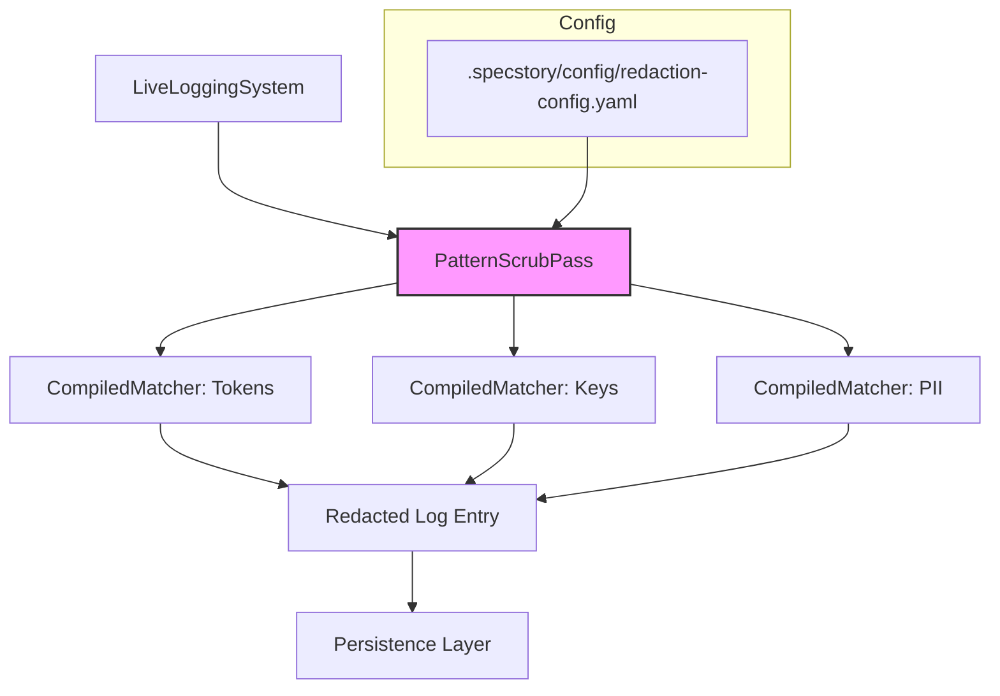

# PatternScrubPass

**Type:** Detail

Because redaction rules originate in .specstory/config/redaction-config.yaml (per the parent component description), the scrub pass must be decoupled from rule definitions and accept an injected rule set, enabling the config to be swapped without touching scrubbing logic.

## What It Is  

**PatternScrubPass** is the concrete scrub‑pass implementation that lives inside the **RedactionEngine**.  
Its source‑level location is implied by the parent‑component description – it is part of the RedactionEngine package that is ultimately invoked by the **LiveLoggingSystem** pipeline.  The only external artifact referenced by the observations is the rule‑definition file **`.specstory/config/redaction-config.yaml`**, which supplies the data‑driven redaction rules (tokens, keys, and PII).  

PatternScrubPass therefore acts as a *runtime* component that receives an **injected rule set** (derived from the YAML file) and applies those rules **inline** to each logging entry before the entry is persisted.  It does not contain hard‑coded patterns; instead it builds a set of compiled matchers for the three documented categories and replaces matched substrings with the appropriate placeholder format.

---

## Architecture and Design  

The architecture surrounding PatternScrubPass follows a **data‑driven, pipeline‑oriented** style:

1. **Decoupled Rule Source** – Redaction rules are defined outside of code in `.specstory/config/redaction-config.yaml`.  PatternScrubPass is deliberately **decoupled** from these definitions; it receives the rule set via dependency injection.  This mirrors the *Strategy* pattern, where the scrubbing algorithm is fixed but the concrete strategy (the rule set) can be swapped without recompiling.

2. **Inline Pre‑Persistence Pass** – Within the **LiveLoggingSystem** pipeline, PatternScrubPass is positioned **before any persistence layer**.  The pass therefore behaves as an *inline filter* (a classic *Chain‑of‑Responsibility* element) that guarantees that no raw sensitive data ever reaches storage.  Because the scrub occurs early, downstream components can assume that all entries are already sanitized.

3. **Category‑Specific Matchers** – The observations note three distinct pattern categories (tokens, keys, PII).  The implementation therefore creates **multiple compiled matchers** – one per category – and applies them sequentially to each log entry field.  Each matcher is tied to a placeholder format (e.g., `<TOKEN>`, `<KEY>`, `<PII>`), which provides a uniform redaction output.

The following mermaid diagram visualises the high‑level flow:

*PatternScrubPass receives its rule set from the configuration file, builds matchers, scrubs each entry, and passes the sanitized entry downstream.*

---

## Implementation Details  

Although the source repository does not expose concrete symbols, the observations allow us to infer the essential implementation mechanics:

* **Rule Injection Interface** – PatternScrubPass likely exposes a constructor or an `initialize(rules)` method that accepts a structured representation of the YAML configuration (e.g., a dictionary with keys `tokens`, `keys`, `pii`).  This interface enables the parent RedactionEngine to load the YAML once, parse it, and hand the resulting object to the pass.

* **Matcher Compilation** – For each category, PatternScrubPass compiles the raw regex or string patterns into efficient matcher objects (e.g., `re.compile` in Python, `Pattern.compile` in Java).  Compilation occurs once during initialization, minimizing per‑entry overhead.

* **Entry‑Level Scrubbing Loop** – When a log entry arrives, PatternScrubPass iterates over the entry’s fields (message, metadata, etc.).  For each field it sequentially applies the compiled matchers:
  1. **Token matcher** – replaces any token pattern with a `<TOKEN>` placeholder.
  2. **Key matcher** – replaces any API‑key‑like pattern with `<KEY>`.
  3. **PII matcher** – replaces personal identifiers with `<PII>`.

  The replacement logic is deterministic and idempotent, ensuring that already‑scrubbed placeholders are not re‑processed.

* **Error Handling & Fallback** – Because the pass is part of a pre‑persistence pipeline, it must be resilient.  If a matcher throws an exception (e.g., malformed regex), the pass should log the failure and allow the entry to proceed unchanged rather than aborting the entire logging flow.  This design trade‑off favours availability over absolute completeness of redaction.

* **Statelessness** – Aside from the compiled matcher cache, PatternScrubPass does not retain per‑entry state, making it safe for concurrent execution across multiple logging threads.

---

## Integration Points  

1. **RedactionEngine (Parent)** – PatternScrubPass is a child component of RedactionEngine.  The engine is responsible for loading `.specstory/config/redaction-config.yaml`, parsing it, and constructing the rule object that is injected into PatternScrubPass.  The engine may also expose an API for reloading the configuration at runtime, which would trigger a rebuild of the matchers inside the pass.

2. **LiveLoggingSystem Pipeline (Sibling Interaction)** – Within the LiveLoggingSystem, PatternScrubPass sits directly after the log‑entry creation stage and before the persistence adapters (file, database, or external logging services).  Other sibling passes might include formatting, enrichment, or routing; all of them receive entries that have already been sanitized by PatternScrubPass.

3. **Persistence Layer (Downstream Consumer)** – Because the scrub pass guarantees that no raw sensitive data leaves the pipeline, the persistence layer can be agnostic to redaction concerns.  This simplifies storage compliance and reduces the surface area for security audits.

4. **Configuration Loader (External Dependency)** – The YAML file is the sole source of truth for redaction patterns.  Any tool that updates `.specstory/config/redaction-config.yaml` (e.g., CI pipelines, security teams) indirectly influences the behaviour of PatternScrubPass without code changes.

---

## Usage Guidelines  

* **Never Hard‑Code Patterns** – Always rely on the YAML configuration.  Adding a new token, key, or PII pattern should be done by editing `.specstory/config/redaction-config.yaml` and, if necessary, triggering a configuration reload via RedactionEngine.

* **Inject the Rule Set** – When constructing a RedactionEngine (or directly testing PatternScrubPass), pass the parsed configuration object to the pass’s initializer.  Do not attempt to instantiate PatternScrubPass without a rule set; doing so will result in a no‑op matcher collection.

* **Maintain Placeholder Consistency** – The placeholder formats (`<TOKEN>`, `<KEY>`, `<PII>`) are part of the contract between the scrub pass and downstream consumers.  Changing a placeholder string requires coordinated updates to any log‑analysis tools that parse redacted logs.

* **Thread‑Safety** – Because PatternScrubPass holds only compiled matcher objects, it can be safely shared across threads.  Do not store per‑entry mutable state inside the pass.

* **Reloading Rules** – If the redaction configuration is updated at runtime, ensure that RedactionEngine re‑injects a fresh rule set into PatternScrubPass.  This avoids stale matchers and guarantees that new patterns take effect immediately.

* **Testing** – Unit tests should focus on three dimensions:
  1. **Matcher correctness** – verify that each category’s patterns correctly replace matching substrings.
  2. **Pipeline ordering** – confirm that the scrub pass runs before any persistence operation.
  3. **Fault tolerance** – simulate malformed patterns and ensure the system continues logging without crashing.

---

### Architectural Patterns Identified
1. **Strategy (Rule‑Set Injection)** – Decouples static scrubbing logic from dynamic pattern data.  
2. **Chain‑of‑Responsibility (Pipeline Filter)** – Operates as an inline filter in the LiveLoggingSystem pipeline.  
3. **Data‑Driven Configuration** – All sensitive patterns are externalised in a YAML file.  

### Design Decisions & Trade‑offs  
* **Decoupling vs. Simplicity** – By injecting rules, the system gains flexibility (rules can change without code) at the cost of an extra configuration‑loading step.  
* **Inline Scrubbing vs. Post‑hoc Sanitisation** – Scrubbing before persistence eliminates the risk of leaking raw data, but it requires that the matcher be performant enough to not become a bottleneck.  
* **Category‑Specific Matchers** – Enables clear placeholder semantics but introduces multiple passes over each field; the trade‑off is acceptable given the typical low latency of compiled regex engines.

### System Structure Insights  
* **RedactionEngine** is the orchestrator that bridges configuration and execution.  
* **PatternScrubPass** is the sole consumer of the rule set and the only component that mutates log entries for redaction.  
* **LiveLoggingSystem** treats the pass as a mandatory step, guaranteeing that all downstream storage sees only sanitized data.

### Scalability Considerations  
* **Matcher Caching** – Compiling patterns once and re‑using them allows the pass to handle high‑throughput logging without per‑entry compilation overhead.  
* **Stateless Design** – Enables horizontal scaling; multiple instances of the logging pipeline can run in parallel, each sharing the same compiled matcher objects.  
* **Configuration Reload** – Supports dynamic scaling of rule complexity without service restarts, provided the engine propagates updated rule objects safely.

### Maintainability Assessment  
* **High** – The clear separation between configuration (YAML) and logic (PatternScrubPass) means that security teams can update patterns without developer intervention.  
* **Low Coupling** – The pass does not depend on concrete storage implementations, reducing the impact of storage‑layer changes.  
* **Testability** – Statelessness and deterministic placeholder output make unit and integration testing straightforward.  

--- 

*This insight document captures the current design and architectural intent of **PatternScrubPass** as derived from the provided observations. It should serve as a reference for future development, reviews, and extension of the redaction capabilities within the LiveLoggingSystem.*

## Hierarchy Context

### Parent
- [RedactionEngine](./RedactionEngine.md) -- Redaction rules are declared in .specstory/config/redaction-config.yaml, meaning the set of sensitive patterns (tokens, keys, PII) is data-driven and can be updated without code changes

---

*Generated from 3 observations*
