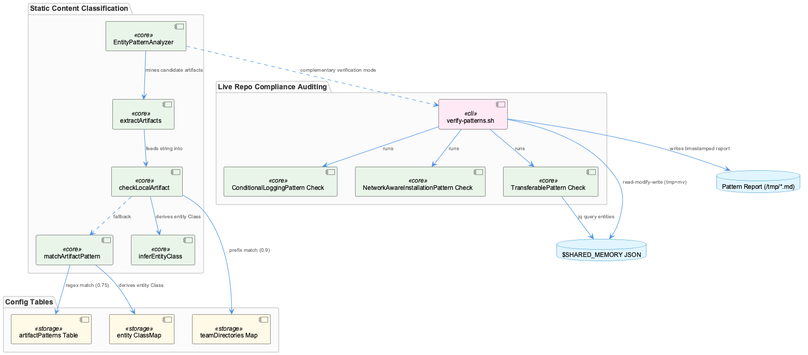
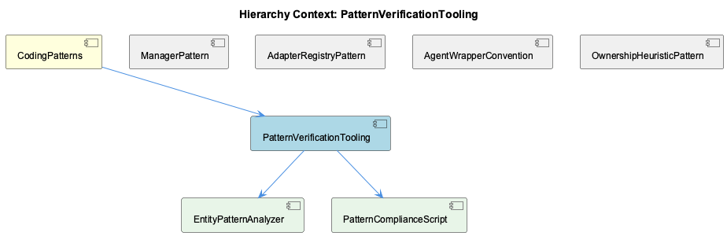

# PatternVerificationTooling

**Type:** SubComponent

# PatternVerificationTooling — Technical Insight Document

## What It Is

PatternVerificationTooling is a two-mode verification subsystem living under CodingPatterns, composed of two child components with fundamentally different execution models: `EntityPatternAnalyzer` (src/ontology/heuristics/EntityPatternAnalyzer.ts) and `PatternComplianceScript` (scripts/knowledge-management/verify-patterns.sh). The former is a pure, in-process TypeScript classifier that attributes free-text knowledge-content artifacts to owning teams; the latter is a shell-level auditor that inspects actual repository state (source files, install scripts, and a shared JSON memory store) for adherence to named architectural patterns. Together they cover both static content classification and live repo-compliance auditing — two complementary verification postures rolled up under one subcomponent.

## Architecture and Design

EntityPatternAnalyzer implements a two-step, confidence-tiered cascade: `analyzeEntityPatterns` (lines 60-96) first calls `extractArtifacts` to mine candidate artifact strings from free text, then attempts `checkLocalArtifact` (a direct team-directory prefix match against the `teamDirectories` Map, confidence 0.9) before falling back to `matchArtifactPattern` (a regex sweep over `artifactPatterns`, confidence 0.75). This ordering encodes a deliberate epistemic hierarchy, as detailed in the sibling OwnershipHeuristicPattern: directory placement is enforced by repo structure and therefore trusted more than class-naming conventions, which can drift.

Both `teamDirectories` and `artifactPatterns` are config-as-data tables rather than branching logic — consistent with the sibling AdapterRegistryPattern's "data-driven registry" characterization and the <AWS_SECRET_REDACTED> config-over-code philosophy referenced at the CodingPatterns parent level. Adding a new team is a table-append operation, not a rewrite of control flow. Notably, per the sibling AgentWrapperConvention, this is hardcoded TypeScript literal data, not YAML — a partial departure from the "classification as data" ideal seen elsewhere in the system.

PatternComplianceScript operates orthogonally: it greps the tree for `console.log` vs `Logger.*` calls (lines 34-51) to police the ConditionalLoggingPattern, checks `install.sh` for `check_network|detect_network|timeout` tokens (lines 87-100) to verify NetworkAwareInstallationPattern, and queries `$SHARED_MEMORY` via `jq` (lines 120-145) for TransferablePattern entities with `significance>=8`. It then computes a naive `PASSED_CHECKS/TOTAL_CHECKS` compliance ratio.

## Implementation Details

EntityPatternAnalyzer's `extractArtifacts` (lines 106-127) runs four independent regexes — file-path, npm-scope, class-suffix (`Service|Agent|Manager|Engine|Handler|Analyzer|Classifier|Filter|Monitor`), and bare-directory — deduplicating results via a `Set`. The class-suffix regex is significant: it operationalizes the Manager-suffix naming convention documented at the CodingPatterns parent level, turning any newly-named `XxxManager` or `XxxClassifier` string in ingested knowledge into a live detection signal — a feedback loop where naming convention becomes machine-readable classification input.

Downstream, `inferEntityClass` and `inferEntityClassFromPattern` (lines 180-210) hard-code team→prefix→entityClass tables (e.g., Coding: LSL→LSLSession; RaaS: Kubernetes→KubernetesCluster). These tables are duplicated in shape but not necessarily content between the two confidence tiers, creating a maintenance seam: extending `teamDirectories`-driven inference doesn't automatically propagate to the `matchArtifactPattern`/`entityClassMap` path, and vice versa.

PatternComplianceScript's arithmetic contains a portability landmine: `((PASSED_CHECKS++))` under `set -euo pipefail` (lines 170-190) returns the pre-increment value as exit status, so incrementing from 0 evaluates falsy — tripping `errexit` on bash 5/Linux while silently working on macOS's bash 3.2. This is flagged explicitly in the child PatternComplianceScript notes as a fragility that hits hardest exactly where automated enforcement matters most (Linux CI). The script also performs a read-modify-write on `$SHARED_MEMORY` via `jq ... > $SHARED_MEMORY.tmp && mv` (lines 196-205), atomically updating `metadata.last_pattern_verification` and `metadata.pattern_compliance_score`, and writes a timestamped report to `/tmp/pattern-verification-$(date +%Y%m%d_%H%M%S).md`.

## Integration Points

EntityPatternAnalyzer has no external dependencies beyond `../types.js` (`LayerResult`, `ArtifactMatch`), making it a pure, side-effect-free classifier callable in under 1ms per its own doc comment — a stark contrast to the stateful Manager idiom described in ManagerPattern for sibling components like CircuitBreakerManager or BudgetTracker. As ManagerPattern notes, EntityPatternAnalyzer builds two readonly, immutable collections at construction time and exposes a single lifecycle-free method, making it structurally more like a frozen lookup table than a resource-owning manager.

PatternComplianceScript integrates with the filesystem and a shared JSON knowledge base whose schema (`.entities[].entityType`, `.significance`, `.metadata.*`) is assumed but never validated before use. Its repo-root resolution via `dirname "$(dirname "$SCRIPT_DIR")")` assumes a fixed two-levels-up path from `scripts/knowledge-management/`, overridable via `CODING_TOOLS_PATH`/`CODING_REPO` env vars but otherwise fragile to relocation.

## Usage Guidelines

Developers extending team ownership rules in EntityPatternAnalyzer must update both the `teamDirectories`-linked `inferEntityClass` table and the `artifactPatterns`-linked `entityClassMap` simultaneously to avoid divergence between the two confidence tiers. Because the class-suffix extraction regex directly encodes the Manager/Classifier/Analyzer naming convention, maintaining that naming discipline elsewhere in the codebase has a direct, automatic payoff in artifact detection accuracy here.

For PatternComplianceScript, the script must be invoked from its canonical location under `scripts/knowledge-management/` — moving it without adjusting directory-depth assumptions will silently corrupt `KNOWLEDGE_EXPORT_DIR` resolution. Given the known `((PASSED_CHECKS++))` under `errexit` failure mode, this script should be treated as unreliable on Linux CI runners until the arithmetic is rewritten (e.g., `PASSED_CHECKS=$((PASSED_CHECKS + 1))`), and its unweighted ratio-based compliance score should be interpreted cautiously since a single missing check (e.g., no `install.sh`) shifts the denominator rather than being excluded transparently.

## Hierarchy Context

### Parent
- [CodingPatterns](./CodingPatterns.md) -- [LLM] The Manager-suffix naming convention observed across LLMServiceProvider, MockModeManager, CachingMechanism, CircuitBreakerManager, and BudgetTracker reflects a deliberate architectural choice to encapsulate stateful, cross-cutting concerns behind a consistent interface shape. New developers should expect any class named *Manager to expose lifecycle methods (init/start/stop or similar), own some internal mutable state (cache entries, circuit state, budget counters), and be instantiated once per service boundary rather than per-request. This convention makes it easy to locate resilience and resource-control logic by grep'ing for 'Manager' across the codebase, and it implies that when adding a new cross-cutting concern (e.g., rate limiting), the idiomatic approach is to add a RateLimitManager sibling rather than embedding the logic inline in provider code.

### Children
- [EntityPatternAnalyzer](./EntityPatternAnalyzer.md) -- checkLocalArtifact performs a prefix lookup against the teamDirectories Map (e.g. 'src/ontology' mapped to 'Coding') and returns confidence 0.9 on match, called first in analyzeEntityPatterns.
- [PatternComplianceScript](./PatternComplianceScript.md) -- [LLM] scripts/knowledge-management/verify-patterns.sh contains a latent portability bug at the compliance-score computation block: `TOTAL_CHECKS=$((TOTAL_CHECKS + 1))` followed by `[ "$CONSOLE_LOG_COUNT" -eq 0 ] && ((PASSED_CHECKS++))`, repeated for the Redux, NetworkAwareInstallationPattern, and Documentation checks. Under `set -euo pipefail`, `((PASSED_CHECKS++))` returns the PRE-increment value as its exit status, so incrementing from 0 evaluates to `((0))` which bash treats as a failing (non-zero) status. On bash 5 (the default on Linux and modern macOS via Homebrew), this trips `errexit` and kills the script silently the very first time a check passes from a fresh `PASSED_CHECKS=0` — meaning the script's SUCCESS path is fragile in exactly the environments (Linux CI) where automated pattern-compliance enforcement matters most, while working by accident on legacy bash 3.2 (<COMPANY_NAME_REDACTED>'s shipped default) where the same construct doesn't errexit.

### Siblings
- [ManagerPattern](./ManagerPattern.md) -- [LLM] EntityPatternAnalyzer (src/ontology/heuristics/EntityPatternAnalyzer.ts) is suffixed 'Analyzer', not 'Manager', yet it structurally resembles the Manager convention described for the parent: it builds two readonly, immutable collections in its constructor — `teamDirectories` (a `Map<string, string[]>`) and `artifactPatterns` (an array of `{team, patterns: RegExp[], entityClassMap}` objects) — and exposes exactly one lifecycle-free public method, `analyzeEntityPatterns()`. Unlike the CircuitBreakerManager/BudgetTracker pattern described in the parent observations, there is no init/start/stop, no mutable counters, and no connect/disconnect semantics; the class is effectively a stateless classifier over data frozen at construction time. This is evidence the 'Manager' suffix convention is NOT universal — naming diverges for components whose job is pure classification rather than owning a stateful external resource.
- [AdapterRegistryPattern](./AdapterRegistryPattern.md) -- [LLM] EntityPatternAnalyzer (src/ontology/heuristics/EntityPatternAnalyzer.ts) is the concrete implementation of the 'registry + adapter' idiom described at the parent (CodingPatterns) level: `teamDirectories` is a Map acting as a lightweight registry keying team names to directory prefixes, and `artifactPatterns` is an array-of-records registry keying team names to arrays of RegExp + an `entityClassMap`. Rather than a class-per-adapter registry (as implied by ProviderRegistryManager or SpecstoryAdapter/TranscriptAdapter), this component implements the same conceptual pattern with plain data structures (Map and array literals) instead of instantiated adapter objects — a 'data-driven registry' variant of the adapter-registry idiom rather than an object-oriented one.
- [AgentWrapperConvention](./AgentWrapperConvention.md) -- [LLM] src/ontology/heuristics/EntityPatternAnalyzer.ts implements a two-step, confidence-scored team-attribution heuristic: analyzeEntityPatterns() first calls extractArtifacts() to pull file paths, npm scopes, class names (via a Service|Agent|Manager|Engine|Handler|Analyzer|Classifier|Filter|Monitor suffix regex), and bare directory prefixes out of free-text knowledge content, then tries checkLocalArtifact() (directory-prefix match against the teamDirectories Map, confidence 0.9) before falling back to matchArtifactPattern() (regex match against artifactPatterns, confidence 0.75). This mirrors the parent's documented Classifier-suffix convention (<AWS_SECRET_REDACTED>) but is notably NOT YAML-driven — the team directories and regex patterns are hardcoded TypeScript literals in the constructor, contradicting the 'classification thresholds and categories are treated as data, not code' philosophy described for prompt-classifier.yaml elsewhere in the system.
- [OwnershipHeuristicPattern](./OwnershipHeuristicPattern.md) -- [LLM] EntityPatternAnalyzer (src/ontology/heuristics/EntityPatternAnalyzer.ts) implements the ownership heuristic as a two-step cascade inside analyzeEntityPatterns(): step (a) checkLocalArtifact() does an O(teams) prefix match against a hardcoded teamDirectories Map (e.g. 'src/ontology', 'src/knowledge-management', 'src/live-logging', 'scripts', '.specstory' → 'Coding'), and only if that misses does step (b) matchArtifactPattern() fall back to a set of per-team RegExp arrays (artifactPatterns) keyed on class-name suffixes like *Manager, *Classifier, *Analyzer. This ordering encodes an explicit confidence hierarchy: a direct path match returns confidence 0.9 while a naming-convention match returns 0.75, meaning the heuristic trusts 'where a file lives' strictly more than 'what a class is called' — a defensible choice given that directory placement is enforced by repo structure while naming conventions can drift.

---

*Generated from 9 observations*
