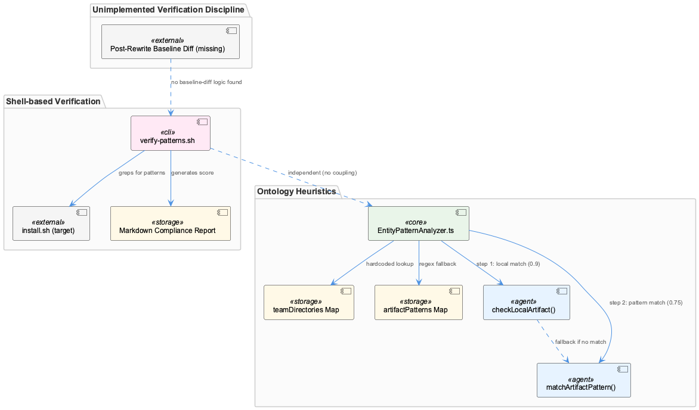
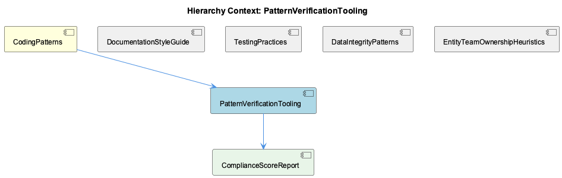

# PatternVerificationTooling

**Type:** SubComponent

## What It Is

PatternVerificationTooling, as evidenced by the supplied files, is a loosely bundled conceptual umbrella rather than a single cohesive module. It comprises two independent verification mechanisms: `scripts/knowledge-management/verify-patterns.sh`, a shell-based heuristic scanner that greps for compliance signals (console.log usage, useState counts, network-check keywords) against `install.sh` and produces a markdown score report, and `src/ontology/heuristics/EntityPatternAnalyzer.ts`, a TypeScript classifier that determines artifact-to-team ownership. Both live under the parent CodingPatterns component, but observations explicitly note they are "two independent 'verification' mechanisms bundled under the same conceptual umbrella rather than a single cohesive module." Notably, the Post-Rewrite Render Error Triage discipline that motivated this component's naming — verifying render errors against a pre-rewrite baseline — has no corresponding baseline-diffing code among the retrieved files.

## Architecture and Design

The dominant pattern here is rule-based/regex heuristic classification with graduated confidence scoring, rather than semantic analysis. `verify-patterns.sh` derives compliance purely from threshold counts (e.g., `USESTATE_COUNT > 20`, `CONSOLE_LOG_COUNT`), producing a `SCORE` from `PASSED_CHECKS/TOTAL_CHECKS`. This is a static, gameable analysis approach — false positives/negatives depend on comment formatting or file coverage. Its `UNDOCUMENTED_FUNCTIONS` check uses a fragile ripgrep `-B1` pipeline as a crude proxy for JSDoc coverage, misfiring on multi-line comments or decorators.

`EntityPatternAnalyzer.ts` implements a two-step classifier: `checkLocalArtifact()` matches file paths against hardcoded `teamDirectories` (confidence 0.9), falling back to `matchArtifactPattern()`'s regex-based class-name conventions like `LSL(Session|Monitor|Classifier)` (confidence 0.75). This "known location beats plausible name" ordering is a deliberate design decision suggesting the analyzer feeds a larger ontology/routing pipeline rather than serving as final authority — this exact mechanism is also documented under sibling EntityTeamOwnershipHeuristics as "Layer 1: File/Artifact Detection."

## Implementation Details

`extractArtifacts()` harvests candidate artifacts from free-text knowledge content using four separate regexes covering file paths, npm packages, class-suffix names, and directory-only paths. Classification quality is bounded by how well these patterns match unseen naming conventions — a new team's layout or class-naming style silently fails to route until `teamDirectories`/`artifactPatterns` maps are manually updated in code, since these are hardcoded data structures, not externally configured.

On the shell-script side, `verify-patterns.sh` computes compliance checks like `CONSOLE_LOG_COUNT` via ripgrep and derives a percentage score, producing markdown output. The child component ComplianceScoreReport is described as "not implemented anywhere in the supplied files" as a distinct module — what exists instead is this scoring logic embedded directly in the shell script, meaning ComplianceScoreReport is effectively an artifact/output of verify-patterns.sh rather than a separate class or file.

## Integration Points

Within the CodingPatterns hierarchy, PatternVerificationTooling sits alongside DocumentationStyleGuide, TestingPractices, DataIntegrityPatterns, and EntityTeamOwnershipHeuristics. It shares conceptual kinship with TestingPractices' Test Suite Exclusion Enforcement (suiteOwnership() Guard), which observations describe as "a pattern-verification convention analogous in spirit to verify-patterns.sh's compliance scoring but implemented in different tooling not present in this file set" — indicating parallel but non-integrated verification philosophies across the codebase. EntityTeamOwnershipHeuristics is essentially the same underlying code (`EntityPatternAnalyzer.ts`) viewed from a different angle, confirming this file serves double duty across sibling documentation. The DesignViewModel.cs/DesignView.xaml fixture pair under `integrations/graphify/tests/fixtures/xaml_viewmodel` is flagged as an unrelated retrieval artifact, not a genuine dependency.

## Usage Guidelines

Developers should treat `verify-patterns.sh`'s compliance score as a heuristic signal, not ground truth — thresholds can be gamed and are sensitive to comment style and file coverage gaps. When extending `EntityPatternAnalyzer.ts` for new teams or artifact conventions, expect to modify hardcoded maps (`teamDirectories`, `artifactPatterns`) directly in code rather than through configuration, and preserve the "local directory match beats regex pattern" confidence ordering (0.9 vs 0.75) to avoid misrouting artifacts. Given the lack of baseline-diffing logic for the Post-Rewrite Render Error Triage discipline, any future work implementing that verification should recognize it as a genuine gap, not an oversight in retrieval.

## Work Record

What working sessions recorded about this entity — decisions taken, problems hit, and why things are the way they are:

- Post-Rewrite Render Error Triage: establishes the verification discipline for distinguishing pre-existing render errors from regressions after a large rewrite, so fixes are prioritized correctly.
- Post-Rewrite Render Error Triage (parent observation) establishes that after large rewrites, render errors must be checked against a pre-rewrite baseline before being classified as regressions — this is the verification discipline this PatternVerificationTooling component is named for, but no corresponding rendering-diff or baseline-comparison code appears among the supplied files.
- Test Suite Exclusion Enforcement — suiteOwnership() Guard establishes that test exclusions must be explicit and machine-verified rather than silently accepted, a pattern-verification convention analogous in spirit to verify-patterns.sh's compliance scoring but implemented in different tooling not present in this file set.

## Hierarchy Context

### Parent
- [CodingPatterns](./CodingPatterns.md) -- [SESSION] Documentation Style Guide for Diagrams and Markdown establishes that .puml source files must live in docs/puml/ and generated diagram artifacts have defined placement rules, enforcing a convention for the docs pipeline to render correctly.

### Children
- [ComplianceScoreReport](./ComplianceScoreReport.md) -- [LLM] The 'ComplianceScoreReport' component is not implemented anywhere in the supplied files. What exists instead is verify-patterns.sh, which produces a markdown report with a numeric compliance score (SCORE=PASSED_CHECKS*100/TOTAL_CHECKS), but this is a shell script artifact, not a distinct ComplianceScoreReport module, class, or file.

### Siblings
- [DocumentationStyleGuide](./DocumentationStyleGuide.md) -- [SESSION] Documentation Style Guide for Diagrams and Markdown: .puml source files must live in docs/puml/, establishing a single canonical location for diagram source control.
- [TestingPractices](./TestingPractices.md) -- [SESSION] Test Inventory Discovery — node:test Compatibility: ensures test files using node:test imports are recognized by the project's test-inventory tooling so they are executed rather than silently skipped.
- [DataIntegrityPatterns](./DataIntegrityPatterns.md) -- [SESSION] Metadata Merge Bug — Destructive Overwrite Pattern: tracks a multi-stage effort to keep manifest-level and graph-level parent entity descriptions in sync.
- [EntityTeamOwnershipHeuristics](./EntityTeamOwnershipHeuristics.md) -- [LLM] src/ontology/heuristics/EntityPatternAnalyzer.ts implements the actual 'Layer 1: File/Artifact Detection' stage of EntityTeamOwnershipHeuristics, per its own header comment. analyzeEntityPatterns() runs a two-step check per extracted artifact: checkLocalArtifact() first looks for a direct prefix match against a hardcoded teamDirectories Map (Coding → src/ontology, src/knowledge-management, src/live-logging, scripts, .specstory; RaaS → raas-service, orchestration-engine, event-mesh; ReSi → virtual-target, embedded-functions, reprocessing-engine; UI → curriculum-alignment, aws-lambda, multi-agent-system), returning confidence 0.9. Only if that fails does matchArtifactPattern() fall back to a per-team array of naming-convention regexes (e.g. /LSL(Session|Monitor|Classifier)/i for Coding, /Kubernetes(Cluster|Pod|Service)/i for RaaS) at confidence 0.75 — a deliberate 'known location beats plausible name' ordering.

---

*Generated from 11 observations*
