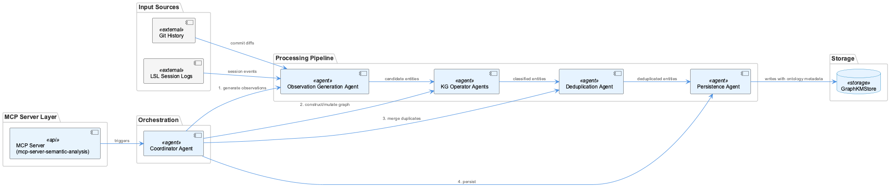

# Pipeline

**Type:** SubComponent

The coordinator agent drives the batch-analysis workflow by sequencing downstream agents (observation generation, KG operators, deduplication, persistence) with explicit dependency ordering, consistent with the DAG-based step model documented in docs/architecture/system-overview.md

# Pipeline — Technical Insight Document

## What It Is

Pipeline is a sub-component of SemanticAnalysis, hosted within `integrations/mcp-server-semantic-analysis`. It represents the orchestration backbone of the multi-agent batch-analysis workflow — a directed, dependency-ordered sequence of specialized agents that collectively transform raw git history and LSL session logs into enriched, classified, and persisted knowledge entities. Rather than exposing pipeline logic as an internal library, Pipeline surfaces its control interface outward through McpToolEndpointExposure, making pipeline execution callable by orchestrating agents via the MCP (Model Context Protocol) tool endpoint pattern.

The Pipeline does not itself perform semantic analysis — it coordinates agents that do. Its value is structural: it defines the order, the handoffs, and the contracts between the observation layer, the graph construction layer, the deduplication layer, and the persistence layer.

---

## Architecture and Design

Pipeline follows a **DAG-based step model** (explicitly referenced in `docs/architecture/system-overview.md`), where each agent stage has declared dependencies, preventing any stage from executing before its upstream producers have completed. This is a deliberate design decision that trades the flexibility of dynamic scheduling for the predictability of explicit dependency ordering — a sound trade-off in a batch-analysis context where correctness of intermediate state matters more than throughput elasticity.

The coordinator agent sits at the top of this DAG, driving the sequencing of four downstream agent classes: observation generation, KG operators, deduplication, and persistence. Each represents a distinct semantic tier — raw input transformation, graph mutation, entity resolution, and durable storage — and each is isolated enough to be reasoned about independently. This clean tiering means that failures or changes in one layer have bounded blast radius on adjacent layers.

The decision to host Pipeline inside an MCP server (`integrations/mcp-server-semantic-analysis`) rather than as a directly invoked library is architecturally significant. It means pipeline execution is mediated through McpToolEndpointExposure, which wraps pipeline control logic as callable tools. This creates a clean boundary between the orchestrating agent (which drives the workflow) and the pipeline implementation (which executes it), allowing the pipeline to be invoked remotely, tested independently, and versioned without coupling to the caller's deployment.

Siblings such as OntologyConfigManager reinforce the pipeline's consistency guarantees: by operating as a singleton, OntologyConfigManager ensures that the classifier and validator agents running within the pipeline share identical ontology configuration throughout a single batch run, eliminating the risk of mid-run config drift that would corrupt entity classification across stages.

---

## Implementation Details

The pipeline's agent sequence is the primary implementation artifact. **Observation generation agents** sit at the entry point, consuming git commit diffs and LSL session events as raw input and producing candidate knowledge entities. These agents operate before any semantic enrichment — their responsibility is extraction and structuring, not classification. This separation ensures that the classification tier (handled by KG operators and informed by the Ontology component's two-level hierarchy) operates on clean, pre-normalized input.

**KG operator agents** occupy the middle tier, constructing and mutating the graph representation of extracted entities. They bridge the raw observation layer and the persistence layer, which means they carry the dual responsibility of faithfully representing what was extracted while also expressing it in the graph model expected by GraphKMStore. Their position in the DAG means they only execute after observation generation has completed.

**The deduplication agent** runs post-classification, merging semantically equivalent entities before they reach persistence. Per `docs/architecture/memory-systems.md`, this prevents redundant nodes in the graph knowledge store. The placement of deduplication *after* classification but *before* persistence is a deliberate design decision: merging based on semantic equivalence requires classified entities (so the agent knows what it's comparing), but must occur before write time to avoid polluting the graph with duplicates that are expensive to resolve after the fact.

**PersistenceAgent** closes the pipeline by pre-populating ontology metadata fields — specifically `entityType` and `metadata.ontologyClass` — on each entity before writing to GraphKMStore. This is a meaningful optimization: by stamping classification at write time, the system avoids redundant LLM re-classification at read time. This decision encodes a read-heavy access pattern assumption — entities will be read (and their ontology class consumed) far more often than they are written, making the write-time enrichment cost worth paying.

The LegacyOntologyAdapter sibling is worth noting here: it wraps km-core's OntologyRegistry behind a legacy-compatible interface so that OntologyValidator and OntologyClassifier continue to function within the pipeline without modification during the ongoing Phase 42-03 migration. This means the pipeline's agent stages are currently insulated from the underlying ontology registry migration, a clean isolation of the migration boundary.

---

## Integration Points

Pipeline's most direct structural relationship is with its parent, SemanticAnalysis, which provides the overall multi-agent MCP server context. Pipeline is the execution engine that SemanticAnalysis exposes — the parent defines *what* the system is, while Pipeline defines *how* it runs.

Downward, McpToolEndpointExposure is Pipeline's child component, responsible for wrapping pipeline control as MCP-callable tools. This is the public interface through which orchestrating agents invoke pipeline execution. The design implies that all external interaction with Pipeline flows through this endpoint layer, keeping the internal agent sequencing logic encapsulated.

Sideways, Pipeline depends on the Ontology component's two-level hierarchy (upper/lower ontology definitions managed by OntologyConfigManager) to drive classification within KG operator and persistence stages. The Insights sibling contributes LLM-driven insight generation, operating within token budget constraints configured in OntologyConfigManager — meaning the depth of insight produced per batch run is a tunable parameter at the configuration level, not hardcoded in pipeline logic. The LegacyOntologyAdapter sibling provides the migration shim that keeps OntologyValidator and OntologyClassifier functional against the evolving km-core registry.

GraphKMStore is the terminal dependency — all pipeline work ultimately lands there via PersistenceAgent, and the pre-population of ontology metadata at write time represents the pipeline's primary contract with the store.

---

## Usage Guidelines

**Respect the DAG ordering.** The pipeline's correctness depends on the dependency ordering between agent stages. Observation generation must complete before KG operators run; deduplication must complete before persistence writes. Introducing new agent stages requires explicit declaration of their dependencies in the DAG definition, not implicit sequencing assumptions.

**Do not bypass McpToolEndpointExposure.** Pipeline control should be invoked through the MCP tool endpoints that McpToolEndpointExposure exposes. Directly invoking internal agent stages breaks the isolation boundary between the orchestrating layer and the pipeline implementation, and undermines the ability to test or version pipeline behavior independently.

**Ontology configuration is batch-scoped.** Because OntologyConfigManager is a singleton, ontology configuration is fixed at the start of a batch run. Developers should not attempt to mutate ontology paths mid-run, as this will not propagate consistently to classifier and validator instances already initialized within the pipeline.

**Entity enrichment happens at write time, not read time.** The PersistenceAgent's pre-population of `entityType` and `metadata.ontologyClass` is the canonical enrichment point. Consumers reading from GraphKMStore should rely on these fields being populated at write time rather than performing their own classification on retrieval. Any changes to the classification logic must be reflected in the PersistenceAgent's write path to remain consistent.

**Deduplication is semantic, not syntactic.** The deduplication agent merges entities based on semantic equivalence post-classification. Developers extending the entity model should ensure that their entity representations are classification-ready before the deduplication stage, or semantically equivalent entities may pass through as distinct nodes and create graph pollution that is difficult to remediate after persistence.

---

### Architectural Patterns Identified

| Pattern | Where Applied |
|---|---|
| DAG-based step execution | Coordinator agent → downstream agent sequencing |
| MCP tool endpoint exposure | Pipeline control surfaced via McpToolEndpointExposure |
| Singleton configuration | OntologyConfigManager across all pipeline agents |
| Write-time enrichment | PersistenceAgent pre-populates ontology metadata |
| Migration isolation shim | LegacyOntologyAdapter insulates agent stages from registry changes |

**Key trade-off:** Explicit DAG dependency ordering over dynamic scheduling — correct by construction, less flexible under partial failure recovery scenarios, but appropriate for a batch-analysis context where intermediate state integrity is paramount.

## Hierarchy Context

### Parent
- [SemanticAnalysis](./SemanticAnalysis.md) -- The SemanticAnalysis component is a multi-agent MCP server (`integrations/mcp-server-semantic-analysis`) that orchestrates a pipeline of specialized agents to extract, classify, validate, and persist structured knowledge from git history and LSL (Live Session Log) sessions. It combines AST-based code graph construction, LLM-powered semantic insight generation, ontology classification, and content validation into a coordinated batch-analysis workflow. The pipeline produces structured knowledge entities enriched with ontology metadata before persisting them to a graph-based knowledge store.

### Children
- [McpToolEndpointExposure](./McpToolEndpointExposure.md) -- Based on parent context, the sub-component is hosted in `integrations/mcp-server-semantic-analysis`, establishing it as an MCP server that wraps pipeline control logic as callable tools.

### Siblings
- [Ontology](./Ontology.md) -- The system maintains a two-level ontology hierarchy (upper/lower) with separate definition files, paths to which are managed by OntologyConfigManager, allowing the classification tier to be reconfigured without code changes
- [Insights](./Insights.md) -- Insight generation is LLM-driven, operating within the LLM budget constraints configured in OntologyConfigManager, meaning insight depth scales with available token budget per batch run
- [OntologyConfigManager](./OntologyConfigManager.md) -- Implemented as a singleton to ensure all pipeline agents share identical ontology configuration throughout a batch run, preventing mid-run config drift between classifier and validator instances
- [LegacyOntologyAdapter](./LegacyOntologyAdapter.md) -- Wraps km-core's OntologyRegistry behind a legacy-compatible interface, isolating the migration boundary so that OntologyValidator and OntologyClassifier continue to function without modification during Phase 42-03

---

*Generated from 6 observations*
