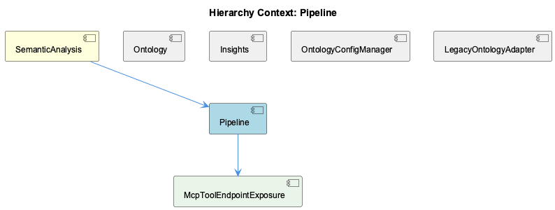

# Pipeline

**Type:** SubComponent

The KG operators in the pipeline perform knowledge graph operations, such as entity resolution and link prediction, as defined in integrations/mcp-server-semantic-analysis/src/agents/kg-operators-agent.ts.

## What It Is  

The **Pipeline** sub‑component lives inside the *SemanticAnalysis* service and is realised by a collection of specialised agents under the `integrations/mcp-server-semantic-analysis/src/agents/` directory.  The core agents are:

* `coordinator-agent.ts` – orchestrates task execution.  
* `observation-generation-agent.ts` – creates raw observations from the incoming data set.  
* `kg-operators-agent.ts` – runs Knowledge‑Graph (KG) operations such as entity resolution and link prediction.  
* `deduplication-agent.ts` – removes duplicate observations before they are persisted.  
* `persistence-agent.ts` – writes the final, cleaned results to the backing store.  

All of these agents are driven by a **DAG‑based execution model** whose topology is declared in `batch-analysis.yaml`.  Each step in the DAG lists a `depends_on` array, allowing the pipeline runtime to resolve ordering constraints automatically.  The DAG is resolved by the child component **DAGDependencyResolver**, which lives inside the Pipeline package.

The runtime employs a **work‑stealing scheduler** implemented inside the `PipelineAgent` (not directly listed but referenced by the observation “utilizes a work‑stealing approach via a shared `nextIndex` counter”).  Idle worker threads pull the next available task index from this shared counter, guaranteeing high utilisation without a central queue bottleneck.

Together, these pieces form a modular, agent‑centric batch processing pipeline that can be extended by adding new agents that follow the same BaseAgent contract used throughout the broader *SemanticAnalysis* component.

---

## Architecture and Design  

### Agent‑Centric Modularity  
The pipeline follows the **agent pattern** that is also used by its siblings—*OntologyClassificationAgent*, *InsightGenerationAgent*, etc.—and by the parent *SemanticAnalysis* component.  Each functional piece (observation generation, KG operations, deduplication, persistence) is encapsulated in its own agent class (e.g., `observation-generation-agent.ts`).  All agents inherit from the common `BaseAgent` defined in `integrations/mcp-server-semantic-analysis/src/agents/base-agent.ts`, giving them a uniform lifecycle (`init`, `run`, `shutdown`) and a shared configuration surface.  This design promotes reuse and makes the addition of new processing stages straightforward.

### DAG‑Based Dependency Resolution  
The **DAGDependencyResolver** interprets the `depends_on` edges defined in `batch-analysis.yaml`.  By constructing a directed acyclic graph of pipeline steps, the resolver can compute a topological order and expose ready‑to‑run nodes to the scheduler.  Because dependencies are explicit, the system can parallelise any steps that have no mutual constraints, while still honouring required sequencing (e.g., deduplication must run after observation generation).

### Work‑Stealing Scheduler (PipelineAgent)  
Execution is driven by a **coordinator‑worker model**.  The `coordinator-agent.ts` owns the global DAG state and publishes ready task indices.  Workers (the internal threads of `PipelineAgent`) share a monotonic `nextIndex` counter; when a worker finishes its current job it atomically increments the counter and immediately claims the next pending task.  This **work‑stealing** approach eliminates the need for a central work queue, reduces contention, and scales well with the number of CPU cores.

### Separation of Concerns  
Each agent focuses on a single responsibility:

* **ObservationGenerationAgent** – transforms raw input into domain‑specific observations.  
* **KgOperatorsAgent** – performs graph‑centric analytics (entity resolution, link prediction).  
* **DeduplicationAgent** – filters out duplicate observations, ensuring idempotent downstream processing.  
* **PersistenceAgent** – abstracts the storage backend (database, file store, etc.) and writes the final payload.

The clear boundary between agents mirrors the **single‑responsibility principle**, making the pipeline easier to test and evolve.

---

## Implementation Details  

### Coordinator Agent (`coordinator-agent.ts`)  
The coordinator reads `batch-analysis.yaml`, builds the DAG via `DAGDependencyResolver`, and tracks node states (pending, running, completed).  It exposes an API (`getReadyTasks()`) that returns the indices of nodes whose dependencies have all completed.  The coordinator also reacts to task completion events emitted by workers, updating the DAG state and unlocking downstream nodes.

### Observation Generation Agent (`observation-generation-agent.ts`)  
This agent implements a `run()` method that iterates over the input data slice assigned by the scheduler.  For each record it creates an `Observation` object, populating fields required by downstream KG operators.  The implementation follows the BaseAgent contract, handling errors locally and reporting status back to the coordinator via a shared `TaskResult` channel.

### KG Operators Agent (`kg-operators-agent.ts`)  
The KG operator encapsulates two primary functions: **entity resolution** (matching observations to existing KG nodes) and **link prediction** (inferring new relationships).  Internally it calls out to the Knowledge‑Graph service layer, passing batches of observations.  Because KG operations can be computationally heavy, the agent processes its assigned slice in configurable batch sizes, allowing the work‑stealing scheduler to keep CPUs busy.

### Deduplication Agent (`deduplication-agent.ts`)  
Deduplication is performed using an in‑memory hash set keyed by a deterministic observation fingerprint.  The agent scans the incoming observation list, discarding any entry whose fingerprint already exists.  The design assumes that the volume of observations per task fits comfortably in memory; for larger workloads the agent could be swapped for a streaming deduplication strategy.

### Persistence Agent (`persistence-agent.ts`)  
The persistence agent receives a clean list of observations and writes them to the configured datastore.  The datastore abstraction is hidden behind an interface (`IDataStore`) that the agent injects at construction time, enabling the same agent to target a relational database, a NoSQL store, or a flat file without code changes.

### Work‑Stealing Mechanics  
All worker threads share a `nextIndex` atomic integer.  The typical loop inside `PipelineAgent` looks like:

```ts
while (true) {
  const idx = Atomics.add(nextIndex, 0, 1);
  const task = coordinator.getTaskByIndex(idx);
  if (!task) break; // no more work
  const agent = agentFactory.create(task.type);
  agent.run(task.payload);
  coordinator.reportCompletion(idx);
}
```

Because `nextIndex` is atomically incremented, any idle worker can instantly claim the next pending task, achieving near‑optimal CPU utilisation.

---

## Integration Points  

* **SemanticAnalysis (Parent)** – The Pipeline is a child of the `SemanticAnalysis` component, which supplies the overall orchestration framework and the `BaseAgent` definition.  The parent also provides configuration (e.g., batch sizes, KG service endpoints) that the pipeline agents consume.  
* **Ontology & Insights (Siblings)** – While the Pipeline focuses on raw observation processing, the *OntologyClassificationAgent* (sibling) later consumes the persisted observations to align them with the ontology.  The *InsightGenerationAgent* reads the same persisted data to extract higher‑level insights.  This creates a natural data‑flow pipeline: **Pipeline → Ontology → Insights**.  
* **ConstraintMonitor (Sibling)** – The ConstraintMonitor dashboard can query the persisted observations to surface any violations detected during pipeline execution, offering a runtime validation loop.  
* **DAGDependencyResolver (Child)** – The resolver is invoked by the coordinator to compute execution order; any change to `batch-analysis.yaml` instantly propagates to the scheduler without code modification.  
* **External KG Service** – The KG operators agent calls out to an external knowledge‑graph service via a client library, meaning the pipeline’s correctness depends on the service’s contract and latency characteristics.  
* **Data Store** – The persistence agent’s `IDataStore` implementation is injected by the SemanticAnalysis bootstrapping code, allowing the pipeline to be reused across environments (dev, test, prod) with different storage back‑ends.

---

## Usage Guidelines  

1. **Define DAG Steps Explicitly** – Add or modify pipeline stages only by editing `batch-analysis.yaml`.  Each step must list its `depends_on` identifiers; missing dependencies will cause the DAG resolver to reject the configuration.  
2. **Respect the BaseAgent Contract** – New agents should extend `BaseAgent` and implement the required lifecycle methods.  This ensures the coordinator can instantiate and manage them uniformly.  
3. **Tune Batch Sizes for KG Operations** – Because KG operators are the most CPU‑intensive stage, adjust the `kgBatchSize` configuration (exposed via the parent component) to balance memory usage against throughput.  
4. **Monitor Work‑Stealing Health** – If workers appear idle for extended periods, verify that the `nextIndex` counter is being incremented correctly and that no task is stuck in a “running” state without reporting completion.  
5. **Stateless Agents Preferred** – Agents should avoid retaining mutable state between runs; any required context must be passed through the task payload.  This maximises the effectiveness of the work‑stealing scheduler and simplifies testing.  
6. **Testing Strategy** – Unit‑test each agent in isolation using mock implementations of the KG client and the datastore.  End‑to‑end tests should construct a minimal `batch-analysis.yaml` DAG and assert that the final persisted observations match expectations.  

---

### Architectural Patterns Identified  

* **Agent Pattern** – Modular agents each encapsulating a distinct processing step.  
* **BaseAgent Template** – A shared abstract class providing a uniform lifecycle.  
* **DAG‑Based Dependency Resolution** – Explicit `depends_on` edges in `batch-analysis.yaml` interpreted by `DAGDependencyResolver`.  
* **Coordinator‑Worker (Work‑Stealing) Scheduler** – Central coordinator with distributed workers pulling tasks via a shared atomic counter.  

### Design Decisions and Trade‑offs  

* **Explicit DAG vs. Implicit Scheduling** – Choosing a declarative DAG gives developers fine‑grained control over ordering but requires careful maintenance of the YAML file.  
* **Work‑Stealing Scheduler** – Provides high CPU utilisation without a central queue, at the cost of a slightly more complex concurrency model (need for atomic counters and careful task completion signalling).  
* **Agent Granularity** – Fine‑grained agents improve testability and replaceability but introduce more inter‑agent communication overhead.  

### System Structure Insights  

The Pipeline sits as a child of *SemanticAnalysis*, reusing the BaseAgent infrastructure shared with its siblings.  Its child component, **DAGDependencyResolver**, isolates the graph‑processing logic, allowing the coordinator to focus on orchestration.  The sibling agents (Ontology, Insights) consume the Pipeline’s persisted output, forming a downstream processing chain.

### Scalability Considerations  

* **Horizontal Scaling** – Because workers are lightweight threads sharing only the `nextIndex` counter, the pipeline can scale to the number of logical cores on a machine.  Scaling beyond a single host would require a distributed coordination layer, which is not present in the current design.  
* **KG Operator Load** – KG operations dominate runtime; scaling out the KG service or batching more aggressively can improve throughput.  
* **Memory Footprint** – Deduplication currently holds a hash set for each task in memory; very large observation sets may need a spill‑to‑disk or external deduplication service.  

### Maintainability Assessment  

The use of a common `BaseAgent` and the clear separation of responsibilities make the codebase approachable for new developers.  The declarative DAG keeps execution logic out of code, reducing the risk of regression when adding new steps.  However, the reliance on a shared atomic counter for work‑stealing introduces subtle concurrency bugs if not carefully guarded, and the in‑memory deduplication may require future refactoring for massive data volumes.  Overall, the architecture balances extensibility with performance, and the explicit file‑based DAG provides a single source of truth for execution ordering.

## Diagrams

### Relationship




## Architecture Diagrams


## Hierarchy Context

### Parent
- [SemanticAnalysis](./SemanticAnalysis.md) -- [LLM] The SemanticAnalysis component utilizes a modular architecture with multiple agents, each responsible for a specific task, such as the OntologyClassificationAgent, SemanticAnalysisAgent, and ContentValidationAgent. For instance, the OntologyClassificationAgent, defined in integrations/mcp-server-semantic-analysis/src/agents/ontology-classification-agent.ts, is used for classifying observations against the ontology system. This agent follows the BaseAgent pattern, providing a standardized structure for agent development, as seen in integrations/mcp-server-semantic-analysis/src/agents/base-agent.ts. The use of this pattern enables easier modification and extension of the agent's functionality, as demonstrated in the implementation of the SemanticAnalysisAgent in integrations/mcp-server-semantic-analysis/src/agents/semantic-analysis-agent.ts.

### Children
- [DAGDependencyResolver](./DAGDependencyResolver.md) -- The Pipeline sub-component follows a DAG-based execution model, with each step declaring explicit depends_on edges in batch-analysis.yaml, as described in the parent context.

### Siblings
- [Ontology](./Ontology.md) -- The OntologyClassificationAgent uses a BaseAgent pattern, providing a standardized structure for agent development, as seen in integrations/mcp-server-semantic-analysis/src/agents/base-agent.ts.
- [Insights](./Insights.md) -- The insight generation system uses a pattern catalog to extract insights, as implemented in integrations/mcp-server-semantic-analysis/src/agents/insight-generation-agent.ts.
- [ConstraintMonitor](./ConstraintMonitor.md) -- The constraint monitoring system uses a dashboard to display constraint violations, as seen in integrations/mcp-constraint-monitor/dashboard/README.md.


---

*Generated from 7 observations*
