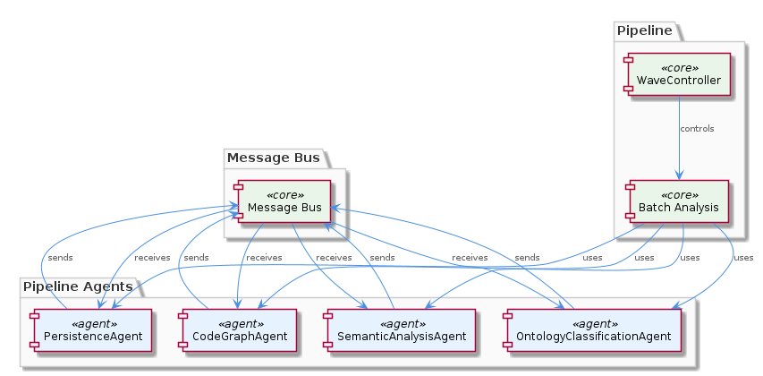
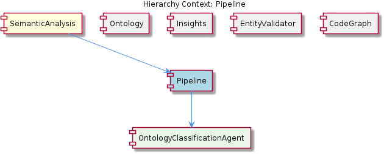

# Pipeline

**Type:** SubComponent

The PersistenceAgent.mapEntityToSharedMemory() pre-populates ontology metadata fields (entityType, metadata.ontologyClass) to prevent redundant LLM re-classification, as seen in the integrations/mcp-server-semantic-analysis/src/agents/persistence-agent.ts file.

## What It Is  

The **Pipeline** lives inside the **SemanticAnalysis** sub‑component and is realized by a collection of agents that cooperate to turn raw git history and LSL sessions into structured semantic insights. Its concrete implementation is scattered across several files in the `integrations/mcp-server-semantic-analysis/src` tree:

* `agents/ontology-classification-agent.ts` – defines the **OntologyClassificationAgent** that classifies entities against the ontology.  
* `agents/semantic-analysis-agent.ts` – hosts the **SemanticAnalysisAgent**, the core driver of the pipeline’s analysis logic.  
* `agents/code-graph-agent.ts` – contains the **CodeGraphAgent**, which builds a code‑graph used later in the flow.  
* `agents/persistence-agent.ts` – implements the **PersistenceAgent** that pre‑populates ontology metadata to avoid redundant LLM calls.  
* `message-bus.ts` – provides the shared message bus through which agents exchange work items.  

Together these files compose a **modular, agent‑based pipeline** that orchestrates batch processing using a DAG‑defined workflow (`batch-analysis.yaml`) and a work‑stealing scheduler (`WaveController.runWithConcurrency`).  



---

## Architecture and Design  

The Pipeline follows a **modular, multi‑agent architecture**. Each agent encapsulates a single responsibility (ontology classification, semantic analysis, code‑graph generation, persistence) and is wired together via a **shared message bus** (`integrations/mcp-server-semantic-analysis/src/message-bus.ts`). This decouples the agents, allowing them to be developed, tested, and replaced independently while still participating in the same processing flow.

Execution is driven by a **DAG‑based model** defined in `batch-analysis.yaml`. Each step lists explicit `depends_on` edges, enabling a **topological sort** that guarantees correct ordering and parallelism where possible. The DAG approach makes the pipeline deterministic and easy to extend with new steps because dependencies are declaratively expressed.

Concurrency is achieved through a **work‑stealing scheduler** in `WaveController.runWithConcurrency()`. A shared `nextIndex` counter acts as a lightweight load‑balancer: idle workers atomically increment the counter and pull the next task, which maximizes CPU utilization without a central dispatcher bottleneck. This design choice trades a small amount of synchronization overhead for high throughput on large batches.

The **PersistenceAgent** adds a caching layer: `mapEntityToSharedMemory()` writes ontology metadata (`entityType`, `metadata.ontologyClass`) into shared memory before any LLM classification occurs. This prevents unnecessary LLM invocations, reducing latency and cost—a clear performance‑oriented decision.



---

## Implementation Details  

At the heart of the Pipeline is the **SemanticAnalysisAgent** (`semantic-analysis-agent.ts`). It reads the DAG steps, subscribes to messages on the bus, and dispatches work to the other agents. When a batch of entities is ready, it enqueues a message that the **OntologyClassificationAgent** (`ontology-classification-agent.ts`) consumes. This agent invokes the ontology service to assign an `ontologyClass` to each entity, then calls `PersistenceAgent.mapEntityToSharedMemory()` to cache the result.

The **CodeGraphAgent** (`code-graph-agent.ts`) runs after classification. It receives the enriched entities, builds a graph representation of the code base, and publishes the graph back onto the bus. Downstream components—such as the **InsightGenerator** (a sibling in the `Insights` component) and the **EntityValidator**—listen for the graph to perform validation and insight extraction.

Concurrency is managed by `WaveController.runWithConcurrency()`. The method spawns a configurable number of worker promises. Each worker repeatedly executes:

```ts
const taskIdx = Atomics.add(nextIndex, 0, 1);
if (taskIdx >= totalTasks) break;
processTask(taskIdx);
```

This pattern ensures that any worker that finishes early can immediately “steal” the next pending task, keeping all CPU cores busy. The design deliberately avoids a master‑worker queue to reduce contention.

The **PersistenceAgent** (`persistence-agent.ts`) writes to a shared in‑memory store that is also visible to the **SemanticAnalysisAgent**. By pre‑populating fields like `entityType` and `metadata.ontologyClass`, the pipeline sidesteps repeated LLM calls for entities that have already been classified, achieving both cost savings and deterministic results across runs.

---

## Integration Points  

The Pipeline is a child of the broader **SemanticAnalysis** component, which itself sits alongside sibling sub‑components **Ontology**, **Insights**, **EntityValidator**, and **CodeGraph**. The agents within the Pipeline consume outputs from the **CodeGraphGenerator** (found in `integrations/code-graph-rag/src/code-graph-generator.ts`) and feed enriched entities into the **InsightGenerator** (`insights/insight-generator.ts`).  

Communication across these boundaries relies on the **message bus** (`message-bus.ts`). Agents publish typed messages (e.g., `ClassificationCompleted`, `CodeGraphReady`) that any interested sibling can subscribe to. This loosely‑coupled contract allows the **EntityValidator** to validate entities without needing direct references to the classification logic, and enables the **Insights** module to generate higher‑level observations once the code graph is available.

The DAG definition (`batch-analysis.yaml`) references steps that may invoke external services, such as the LLM used for classification. The **PersistenceAgent** acts as a guardrail, ensuring that repeated calls to those services are avoided when metadata is already present. Thus, the Pipeline integrates with both internal agents and external AI services in a controlled, cache‑aware manner.

---

## Usage Guidelines  

1. **Add New Steps via the DAG** – To extend the pipeline, edit `batch-analysis.yaml` and declare a new step with appropriate `depends_on` edges. The topological sorter will automatically place the step in the correct execution order.  
2. **Respect the Message Bus Contract** – When creating a new agent, publish messages using the types defined in `message-bus.ts` and subscribe only to the events you need. This preserves the decoupled nature of the system and prevents circular dependencies.  
3. **Leverage Persistence Caching** – Before invoking any expensive LLM operation, check whether `entityType` or `metadata.ontologyClass` already exist in shared memory. Use `PersistenceAgent.mapEntityToSharedMemory()` to write back any newly computed values.  
4. **Configure Concurrency Thoughtfully** – The `WaveController.runWithConcurrency()` method accepts a concurrency level. Choose a value that matches the host’s CPU core count; overly high values can increase contention on the `nextIndex` counter without delivering throughput gains.  
5. **Unit‑Test Agents in Isolation** – Because each agent is a self‑contained class (`*Agent.ts`), you can mock the message bus and verify behavior without spinning up the full pipeline. This promotes maintainability and fast feedback during development.

---

### Summary of Insights  

1. **Architectural patterns identified** – Modular agent‑based design, DAG‑driven workflow, work‑stealing concurrency, shared message bus, cache‑first persistence.  
2. **Design decisions and trade‑offs** – Decoupling via message bus improves extensibility at the cost of runtime indirection; work‑stealing maximizes CPU usage but introduces atomic counter contention; pre‑populating ontology metadata reduces LLM calls but adds memory overhead.  
3. **System structure insights** – The Pipeline sits under **SemanticAnalysis**, orchestrates sibling components through the bus, and delegates specialized tasks to child agents such as **OntologyClassificationAgent**.  
4. **Scalability considerations** – DAG parallelism and work‑stealing enable horizontal scaling across many cores; caching in the PersistenceAgent mitigates external service throttling; the message bus can become a bottleneck if message volume grows dramatically, suggesting future sharding if needed.  
5. **Maintainability assessment** – Clear separation of concerns and explicit DAG dependencies make the codebase approachable; however, reliance on shared mutable state (nextIndex, in‑memory cache) requires careful synchronization and thorough testing to avoid race conditions.


## Hierarchy Context

### Parent
- [SemanticAnalysis](./SemanticAnalysis.md) -- [LLM] The SemanticAnalysis component utilizes a multi-agent system architecture, with agents such as OntologyClassificationAgent, SemanticAnalysisAgent, and CodeGraphAgent, to process git history and LSL sessions. This is evident in the code files, such as integrations/mcp-server-semantic-analysis/src/agents/ontology-classification-agent.ts, integrations/mcp-server-semantic-analysis/src/agents/semantic-analysis-agent.ts, and integrations/mcp-server-semantic-analysis/src/agents/code-graph-agent.ts, which define the respective agents and their responsibilities. The use of multiple agents allows for a modular and scalable design, enabling the processing of large amounts of data and the integration of new agents as needed.

### Children
- [OntologyClassificationAgent](./OntologyClassificationAgent.md) -- The OntologyClassificationAgent is defined in integrations/mcp-server-semantic-analysis/src/agents/ontology-classification-agent.ts, which outlines the responsibilities of the agent.

### Siblings
- [Ontology](./Ontology.md) -- The OntologyClassificationAgent in integrations/mcp-server-semantic-analysis/src/agents/ontology-classification-agent.ts is responsible for classifying entities based on the ontology.
- [Insights](./Insights.md) -- The insight generation is performed by the InsightGenerator class in integrations/mcp-server-semantic-analysis/src/insights/insight-generator.ts.
- [EntityValidator](./EntityValidator.md) -- The entity validation is performed by the EntityValidator class in integrations/mcp-server-semantic-analysis/src/entity-validator.ts.
- [CodeGraph](./CodeGraph.md) -- The code graph generation is performed by the CodeGraphGenerator class in integrations/code-graph-rag/src/code-graph-generator.ts.


---

*Generated from 7 observations*
