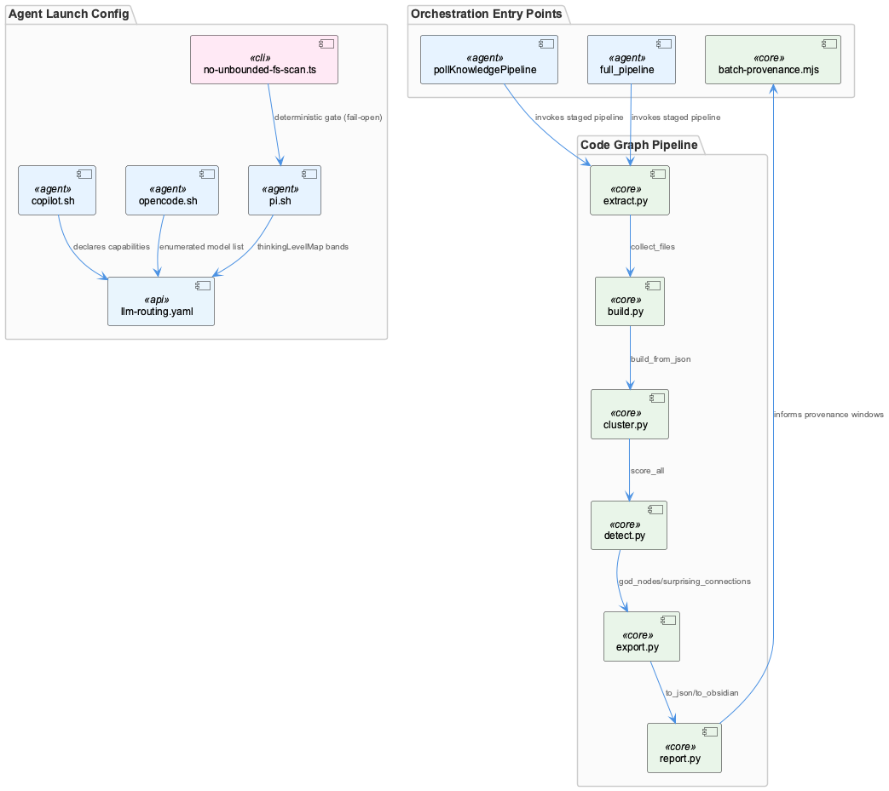
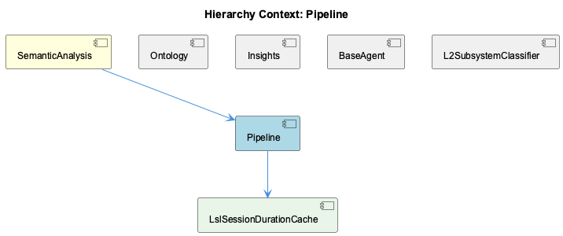

# Pipeline

**Type:** SubComponent

Pipeline stages include a coordinator agent that sequences execution across semantic-analysis-agent.ts and ontology-classification-agent.ts, matching the two-stage extraction/classification split described for SemanticAnalysis

# Pipeline: Technical Insight Document

## What It Is

Pipeline is the orchestration layer of the SemanticAnalysis subsystem, responsible for sequencing a multi-stage batch-analysis workflow. It does not perform extraction or classification itself; rather, it coordinates execution across `semantic-analysis-agent.ts` and `ontology-classification-agent.ts`, along with additional stages for observation generation, deduplication, and persistence. As the parent SemanticAnalysis component describes, the underlying workflow extracts raw entities and relationships from git history and LSL (session log) data, then maps them into a hierarchical ontology — Pipeline is the mechanism that ties these steps together in the correct order.

## Architecture and Design

The central architectural pattern is coordinator-driven staged execution. A dedicated CoordinatorAgent (Pipeline's child component) sequences execution across the semantic-analysis-agent.ts and ontology-classification-agent.ts stages, explicitly implementing the two-stage extraction/classification split defined at the SemanticAnalysis level. This is a deliberate separation-of-concerns design: each stage — extraction, classification, observation generation, deduplication, knowledge-graph (KG) writes, and persistence — is isolated so it can be independently developed, tuned, and tested.

Beyond the two primary agents, the pipeline introduces additional intermediate stages not visible at the SemanticAnalysis level alone: an observation-generation stage that runs prior to KG operator invocation (producing an intermediate representation before any graph writes occur), a deduplication stage that runs as a distinct step rather than being folded into extraction, and a persistence stage that decouples in-memory KG operator results from durable storage. This yields a clear staged pipeline: extract → classify → generate observations → deduplicate → write to KG (in-memory) → persist (durable). Each boundary represents a conscious decoupling decision favoring modularity over a monolithic, tightly-coupled extraction-to-storage flow.

## Implementation Details

The coordinator agent pattern is the mechanical backbone of Pipeline: it invokes semantic-analysis-agent.ts to extract raw entities/relationships from git and LSL data, then hands the extracted output to ontology-classification-agent.ts for hierarchical classification. Because these agents are coordinated rather than directly chained, they function as independently swappable stages — the coordinator mediates data flow rather than the stages calling each other directly.

Following classification, a separate observation-generation stage produces an intermediate representation of the analyzed data. This representation exists specifically to precede KG operator invocation, implying that raw classified entities are transformed into an observation format suitable for graph construction before any write operations touch the knowledge graph.

Deduplication is implemented as its own stage, operating on entities merged from both git history and LSL session data after extraction — meaning duplicate detection is a cross-source concern handled post-hoc rather than during per-source extraction. Finally, persistence is isolated as a dedicated agent stage, separating the in-memory results produced by KG operator invocation from the actual durable write. This split allows KG operations to be validated or manipulated in memory before committing to storage.

## Integration Points

Pipeline sits directly beneath SemanticAnalysis, which supplies the conceptual two-stage extraction/classification design that Pipeline operationalizes via its CoordinatorAgent. Its sibling Ontology component depends on the output of the classification stage coordinated here — ontology-classification-agent.ts consumes entities produced by semantic-analysis-agent.ts and positions them within the upper/lower ontology hierarchy that Ontology governs. Its other sibling, Insights, sits further downstream, consuming ontology-classified entities (themselves dependent on Pipeline's staged output) rather than raw extraction data — meaning Pipeline's staging decisions directly determine the shape of data available for insight generation.

Internally, Pipeline's only explicit child is CoordinatorAgent, which implements the sequencing logic described above. The KG operator is another key integration point: the observation-generation stage feeds it an intermediate representation, and the persistence stage handles its durable output — making the KG operator a pivot around which two of Pipeline's stages are organized.

## Usage Guidelines

Developers extending Pipeline should preserve the staged, coordinator-mediated structure rather than introducing direct calls between agents — the value of this design is that semantic-analysis-agent.ts and ontology-classification-agent.ts (and other stages) remain independently swappable. New extraction or classification logic should be added as alternate implementations behind the existing stage boundaries rather than embedded into the coordinator itself.

When modifying deduplication logic, keep it as a distinct post-extraction stage rather than reintroducing inline merging within semantic-analysis-agent.ts, since the current design assumes deduplication operates across merged git and LSL-derived entities. Similarly, changes to persistence should respect the separation from in-memory KG operator results — persistence should remain a durable-write concern distinct from KG construction, ensuring in-memory KG state can be inspected or modified before commit. Any new stage inserted into the pipeline should be evaluated against this observation-generation-before-KG-write ordering to avoid violating the intermediate-representation contract that downstream stages (KG operator, persistence) rely on.

## Hierarchy Context

### Parent
- [SemanticAnalysis](./SemanticAnalysis.md) -- [LLM] The batch-analysis workflow is structured as a multi-stage pipeline where semantic-analysis-agent.ts is responsible for extracting raw entities and relationships from git history and LSL (likely 'Language/Session Log') session data, while ontology-classification-agent.ts takes those extracted entities and maps them into a hierarchical ontology structure. This separation of concerns means the extraction logic (identifying what something is—a function, a decision, a bug fix) is decoupled from the classification logic (determining where that entity fits in a broader knowledge hierarchy), allowing each agent to be independently tuned, tested, and potentially swapped out without affecting the other stage's implementation.

### Children
- [CoordinatorAgent](./CoordinatorAgent.md) -- The L2 Pipeline description explicitly states a coordinator agent sequences execution across semantic-analysis-agent.ts and ontology-classification-agent.ts

### Siblings
- [Ontology](./Ontology.md) -- ontology-classification-agent.ts consumes entities produced by semantic-analysis-agent.ts and assigns them positions within an upper/lower ontology hierarchy
- [Insights](./Insights.md) -- Insight generation consumes ontology-classified entities to derive higher-order patterns, rather than operating directly on raw git/LSL extraction output

---

*Generated from 5 observations*
