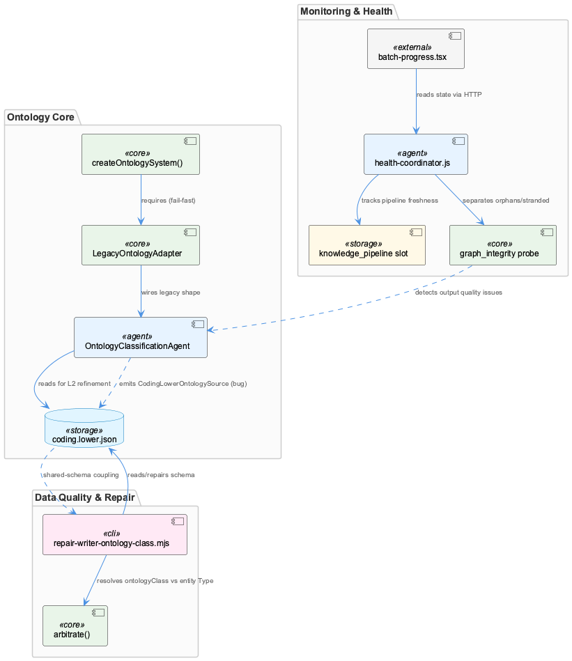
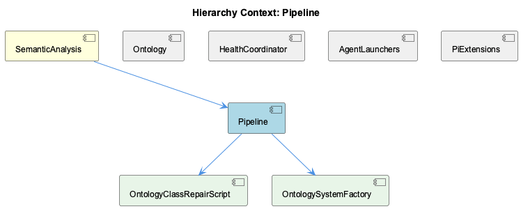

# Pipeline

**Type:** SubComponent

# Pipeline — Technical Insight Document

## What It Is

Pipeline is a SubComponent of SemanticAnalysis, representing the L2 refinement and ontology-classification machinery through which coding entities and knowledge-base insights are classified, tracked for health, and (as needed) repaired. It is not a single file or class but a cross-cutting concern spanning `src/ontology/index.ts` (the `createOntologySystem()` factory), `scripts/repair-writer-ontology-class.mjs` (offline repair tooling), `scripts/health-coordinator.js` (freshness/health polling via `pollKnowledgePipeline` and the `currentState.knowledge_pipeline` slot), and `integrations/system-health-dashboard/src/components/batch-progress.tsx` (the operator-stage visualization). Its two formally modeled children, OntologySystemFactory and OntologyClassRepairScript, capture the construction and repair halves of this machinery, while sibling components (Ontology, OntologyClassificationAgent, L2SubsystemClassifier, SemanticAnalysisAgent, Insights) cover adjacent classification, taxonomy, and insight-writing concerns that Pipeline coordinates with but does not own outright.

## Architecture and Design

The dominant pattern is a migration-seam adapter: `createOntologySystem()` in `src/ontology/index.ts` hard-requires a real `inferenceEngine` and a `LegacyOntologyAdapter`, throwing distinct errors rather than defaulting, and wires them into `OntologyValidator`/`OntologyClassifier` in a shape explicitly preserved "identical to the pre-Phase-42-03 shape" so downstream consumers like `persistence-agent.ts` require no changes. This is a deliberate trade-off: an extra indirection layer in exchange for keeping battle-tested classification logic untouched during a storage-layer refactor.

A second pattern is edge-arbitrated conflict resolution: `repair-writer-ontology-class.mjs`'s `arbitrate()` function resolves disagreements between `entityType` and `ontologyClass` using the attaching graph edge (`contains`/`parent-child` vs `has_insight`) rather than `metadata.hierarchyLevel`, based on empirical evidence (13/36 vs 3/36 agreement) — the script's own comment frames hierarchyLevel as "a claim" versus the edge as "a fact." This script is also a thin HTTP client: it never opens the km-core LevelDB directly, working exclusively through obs-api's `/api/v1/entities` and `/api/v1/relations` endpoints, consistent with a single-owner storage model.

A third pattern is polling-based state propagation rather than push events: `batch-progress.tsx` polls `http://localhost:3033/api/batch/progress` every 3s and `/api/batch/history` every 10s, while `health-coordinator.js` centralizes pipeline health in an in-memory `knowledge_pipeline` state slot (status values 'unknown'|'healthy'|'stale'|'stalled'|'unreachable'|'disabled') updated via a 5s tick — deliberately separated from the heavier `graph_integrity` scan (~2k entities, ~28k relations) which the code explicitly says is "far too heavy for the 5s tick."

## Implementation Details

`pollKnowledgePipeline` in `health-coordinator.js` maintains `lastObservationAt`, `lastDigestAt`, `lastInsightAt`, and `totals`, replacing a legacy `knowledgeExtraction` file-based per-project signal that the ETM stopped writing at the Phase 33 cutover — freshness monitoring moved from per-project files to a single coordinator-owned poll driving the dashboard's `[📚]` statusline badge. The dashboard's six-stage operator DAG (`conv, aggr, embed, dedup, pred, merge` in the `OPERATORS` array) renders tiered (fast/standard/premium) stages via `TIER_COLORS`; a documented prior bug had the tier badge inferring a model name that could misrepresent actual router decisions, since fixed to render tier only, deliberately avoiding client-side inference of routing state.

`OntologyClassRepairScript` operates in explicit dry-run/`--apply`/`--all` modes against `WRITER_OWNED`/`ARTIFACT_CLASSES` sets, functioning as offline post-hoc repair rather than an in-band fix to the legacy writer bug. `OntologySystemFactory`'s `createOntologySystem()` is fail-loud by design, forcing callers to construct a real `UnifiedInferenceEngine` and `LegacyOntologyAdapter` beforehand. Test coverage in `test_pipeline.py` exercises related pipeline behaviors end-to-end (`run_pipeline`, `test_pipeline_graph_has_edges`, `test_pipeline_all_nodes_have_community`, `test_pipeline_incremental_update`, `test_pipeline_detection_finds_code_and_docs`), calling into `graphify/analyze.py`, `graphify/build.py`, and `graphify/cluster.py` (`god_nodes`, `surprising_connections`, `build_from_json`, `cluster`, `score_all`).

## Integration Points

Pipeline sits under SemanticAnalysis and is the locus of the unresolved CodingLowerOntologySource emission bug: production output surfaces this source type despite documentation and L2SubsystemClassifier design saying it should never be produced — a genuine gap between the coding.lower.json → OntologyRegistry → classification contract and actual emission behavior. It intersects with SemanticAnalysisAgent's taxonomy stability validation (disjoint-sample re-derivation) but that work is explicitly distinct from the L1/L2 ontology classification this Pipeline performs — downstream code should not conflate the two guarantees. It also relates to Ontology's Intent class addition and Insights' embedding-based dedup work as parallel, not overlapping, efforts. Structurally, health-coordinator.js integrates Pipeline's freshness signal alongside `graph_integrity`, `sub_agent_capture`, and `classifier` in one in-memory source of truth, and batch-progress.tsx remains fully decoupled from pipeline internals, knowing only the coordinator's REST shape on port 3033.

## Usage Guidelines

Anyone investigating L2 refinement output must not assume documented emission contracts match current behavior given the open CodingLowerOntologySource defect. Callers of `createOntologySystem()` must supply real collaborators — no mock fallback exists. Repairs via `repair-writer-ontology-class.mjs` should trust graph edges over `metadata.hierarchyLevel` and be run in dry-run before `--apply`/`--all`. Dashboard consumers should treat tier badges as purely descriptive, never inferring actual routing choice client-side. Finally, taxonomy-spine consumers (viewer/dashboard) should keep SemanticAnalysisAgent's stability validation separate from this Pipeline's classification guarantees.

## Code Evidence

Key code artifacts grounding this entity's analysis:

**Structural:**
- pollKnowledgePipeline (function) in health-coordinator.js
- full_pipeline (method) in sample_calls.py
- run_pipeline (function) in test_pipeline.py
- test_pipeline_runs_end_to_end (function) in test_pipeline.py
- test_pipeline_graph_has_edges (function) in test_pipeline.py
- test_pipeline_all_nodes_have_community (function) in test_pipeline.py
- test_pipeline_report_mentions_top_god_node (function) in test_pipeline.py
- test_pipeline_detection_finds_code_and_docs (function) in test_pipeline.py
- test_pipeline_incremental_update (function) in test_pipeline.py

**Relationships:**
- Calls: log, noteObsApiBusy, obsApiBusyNow, obsApiBusyExhausted, clearObsApiBusyEpisode, userActiveNow, evaluateObsApiAutoHeal, normalize, score, god_nodes (+10 more)
- Imports: graphify/analyze.py, god_nodes, surprising_connections, suggest_questions, graphify/build.py, build_from_json, graphify/cluster.py, cluster, score_all, detect.py (+10 more)

**Other:**
- test_pipeline.py (module) in test_pipeline.py
- The code graph lists `pollKnowledgePipeline` as a function defined in health-coordinator.js, consistent with the `knowledge_pipeline` state block and its 'unknown before first probe' status semantics documented inline — the coordinator's 5s tick scheduler is the mechanism by which this poll function keeps that slot current, separately from the heavier `graph_integrity` check (also in this file) which walks the whole graph (~2k entities, ~28k relations) on its own slower interval rather than the 5s tick, because the file explicitly says that scan is 'far too heavy for the 5s tick'.

## Work Record

What working sessions recorded about this entity — decisions taken, problems hit, and why things are the way they are:

- Pipeline CodingLowerOntologySource Emission Bug tracks an unresolved defect where the pipeline emits a CodingLowerOntologySource reference in output despite documentation stating this source type should never be produced, indicating a gap between L2 refinement design and current emission behavior.
- The Intent Spine Derivation Pipeline record notes a single consolidated producer script folds five prior ad-hoc scripts into one, changing how insights are clustered into Intent entities via aggregate edges.
- The 'Pipeline CodingLowerOntologySource Emission Bug' work record documents a live, unresolved discrepancy: production output contains a `CodingLowerOntologySource` reference despite project documentation stating this source type should never be produced. The record frames this as a genuine gap between the intended L2 refinement source model (coding.lower.json → OntologyRegistry → classification) and what the emission path in production actually surfaces — flagged explicitly as a real defect, not a documentation error, so anyone investigating L2 refinement output should not assume current emission behavior matches the documented contract.
- The 'Taxonomy Stability Validation via Disjoint Sample Re-derivation' work record establishes that intent-derived taxonomy stability for the knowledge-base layer is treated as an empirically measured property — validated by independently re-deriving the taxonomy from disjoint data samples and measuring agreement — rather than assumed from the clustering algorithm's design. This validation step is run against output that SemanticAnalysisAgent helps produce but is explicitly distinct from the L1/L2 ontology classification pipeline in OntologyClassificationAgent, meaning code relying on a 'fixed taxonomy spine' downstream (viewer/dashboard) should not conflate the two pipelines' guarantees.

## Hierarchy Context

### Parent
- [SemanticAnalysis](./SemanticAnalysis.md) -- [SESSION] Pipeline CodingLowerOntologySource Emission Bug documents an unresolved defect where the pipeline emits a CodingLowerOntologySource reference in output despite documentation stating this source type should never be produced, indicating a gap between the L2 refinement design and current emission behavior

### Children
- [OntologySystemFactory](./OntologySystemFactory.md) -- [LLM] src/ontology/index.ts's createOntologySystem() function is effectively 'OntologySystemFactory' — it hard-requires both inferenceEngine and adapter parameters, throwing distinct errors for each missing dependency rather than falling back to defaults, which forces every caller to have already constructed a real UnifiedInferenceEngine and LegacyOntologyAdapter before invoking the factory.
- [OntologyClassRepairScript](./OntologyClassRepairScript.md) -- [LLM] The core of the script is `arbitrate()` in scripts/repair-writer-ontology-class.mjs, which resolves rows where both `entityType` and `ontologyClass` name valid artifact classes but disagree. It deliberately uses the attaching graph edge (`contains`/`parent-child` for hierarchy membership vs `has_insight` for learning artifacts) rather than `metadata.hierarchyLevel`, and the code comment reports the empirical basis: on 36 rows where level and class disagreed, actual `contains`-tree depth backed the resolved class 13 times versus `metadata.hierarchyLevel` only 3 times — hierarchyLevel is explicitly called 'a claim' while the edge is 'a fact'.

### Siblings
- [Ontology](./Ontology.md) -- [SESSION] Coding Ontology — Intent Class Addition explores adding a new Intent class to the coding ontology so entities can be classified by session intent, distinct from the KB's separate intent-spine taxonomy work.
- [Insights](./Insights.md) -- [SESSION] writeInsight Embedding-Based Dedup Integration tracks embedding-based near-duplicate detection being wired into the writeInsight path behind a dry-run flag so live writes are unaffected until latency/precision are validated.
- [OntologyClassificationAgent](./OntologyClassificationAgent.md) -- [SESSION] Coding Ontology — Intent Class Addition is scoped as a distinct ontology-file investigation, separate from classification agent logic but affects what classes this agent can assign.
- [SemanticAnalysisAgent](./SemanticAnalysisAgent.md) -- [SESSION] Taxonomy Stability Validation via Disjoint Sample Re-derivation validates that an intent-derived taxonomy is stable enough to serve as a fixed spine by re-deriving it independently from disjoint data samples and measuring agreement.
- [L2SubsystemClassifier](./L2SubsystemClassifier.md) -- [SESSION] Pipeline CodingLowerOntologySource Emission Bug is the unresolved defect most directly attributable to this component's L2 refinement design, since the classifier is meant to prevent CodingLowerOntologySource from ever being emitted.

---

*Generated from 24 observations*
