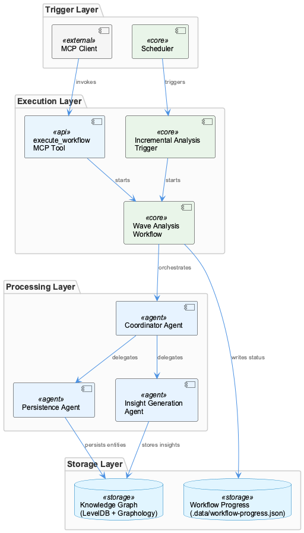
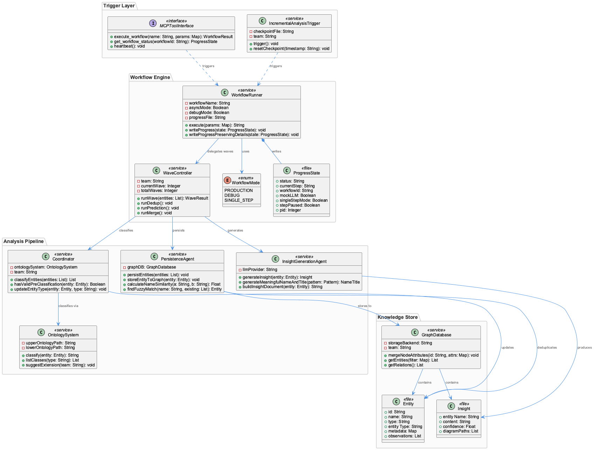
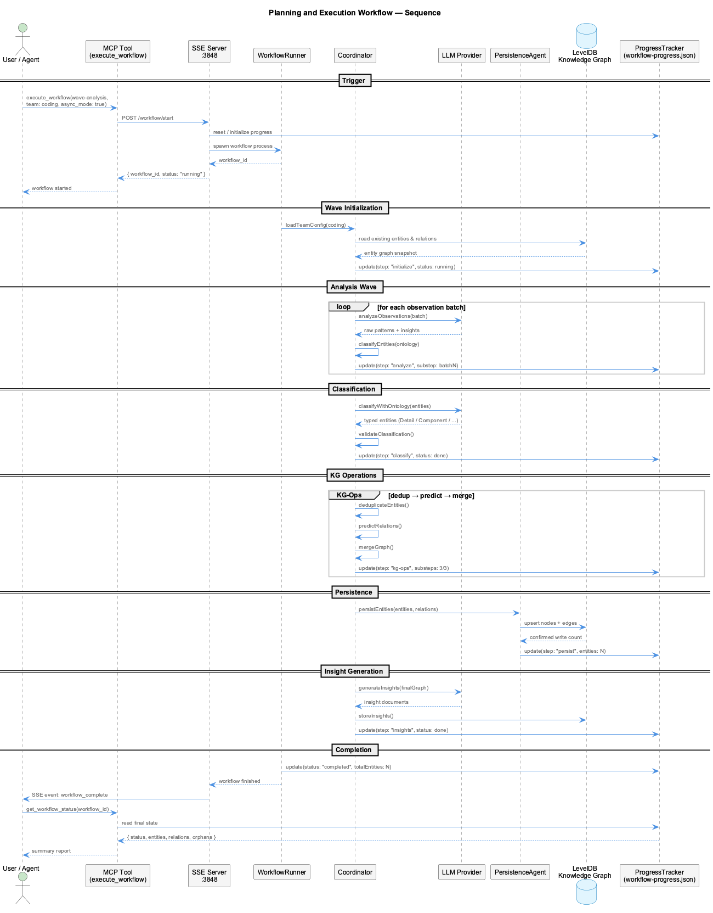
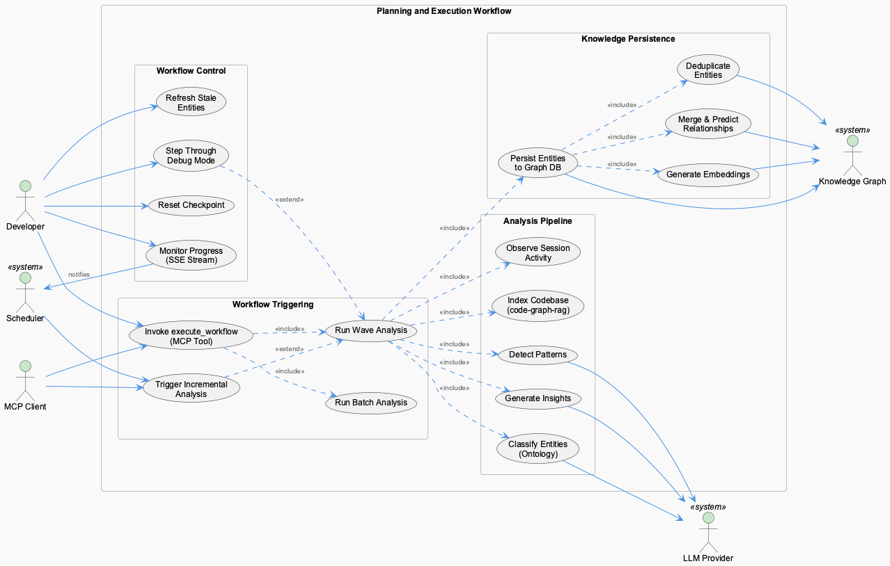

# Planning and Execution Workflow

**Type:** File

Workflow is triggered via MCP tools (execute_workflow) or automatic incremental analysis

# Planning and Execution Workflow

## What It Is

The Planning and Execution Workflow is a coordinated process for triggering and running analysis workflows in this system. Based on the available observations, it has two entry paths: explicit invocation through MCP tools (specifically the `execute_workflow` tool) and automatic invocation via incremental analysis. The workflow itself is the unit of orchestration that ties a caller's intent (manual or scheduled) to a concrete analysis run.

Beyond the trigger surface, the observations supplied for this insight do not describe the internal stages, queues, or state machine of the workflow. The remainder of this document therefore stays close to the trigger model — the one mechanism the observations actually attest to — and flags where deeper claims would require additional grounding.

## Architecture and Design

The architecture revealed by the observations is a dual-entry workflow with one programmatic surface (`execute_workflow` exposed via MCP) and one automatic surface (incremental analysis). This shape implies a separation between *who decides a workflow should run* and *what the workflow does*: callers — whether a user-driven MCP client or the incremental analysis scheduler — converge on a common execution entry point rather than each implementing their own pipeline.

The MCP-tool path implies a request/response contract: a client invokes `execute_workflow` with parameters, and the workflow runner takes ownership of execution. The incremental path implies a polling or event-driven trigger inside the system that does not require an external client. Both must funnel through the same execution mechanism for the workflow concept to be coherent, but the observations do not name the specific class, function, or module that performs that funneling, so this is inferred shape rather than asserted implementation.

## Implementation Details

The single concrete implementation detail supported by observations is the existence of an `execute_workflow` MCP tool as the manual trigger. The observations do not enumerate the workflow's internal steps, the data structures it operates on, or the runtime that hosts it. Rather than invent these, this section limits itself to what can be said: a caller using the MCP integration invokes `execute_workflow`, and a separate automatic-incremental-analysis trigger reaches the same logical workflow without that MCP call.

The sequence diagram above is the most useful reference for the trigger-to-execution flow; the class diagram captures the structural roles. A fuller implementation deep-dive — covering step orchestration, persistence of progress, error handling, and concurrency — would need to be grounded in additional observations or source files not provided here.

## Integration Points

Two integration points are evident from the observations. First, the **MCP tooling layer** exposes `execute_workflow`, which means any MCP-capable client (including Claude-based agents) can drive the workflow on demand. Second, the **incremental analysis subsystem** integrates with the workflow as an automatic caller, removing the need for human or external trigger when work has accumulated.

The use-cases diagram captures both actors — the MCP client and the incremental analysis trigger — converging on the workflow. The observations do not describe downstream integrations (such as where workflow results are persisted, which knowledge stores are updated, or which dashboards consume the output), so those connections are out of scope for this document.

## Usage Guidelines

For developers and operators, the observation-grounded guidance is straightforward: use the `execute_workflow` MCP tool to start a workflow explicitly, and rely on the incremental analysis path to keep the system current without manual intervention. Both routes are legitimate; the choice depends on whether the trigger is event-driven from a human/agent decision or part of the background analysis cadence.

Because both paths share the same workflow concept, callers should expect equivalent semantics regardless of trigger origin — i.e., a workflow run started by `execute_workflow` should not differ in correctness from one started by incremental analysis. When debugging an unexpected workflow run, the first diagnostic question is therefore *which trigger fired*, since the answer determines whether to inspect MCP client logs or the incremental scheduler.

---

### Requested Summaries

1. **Architectural patterns identified** — Dual-entry trigger model (manual MCP tool + automatic incremental analysis) converging on a shared workflow execution path. No further patterns are asserted because the observations do not support them.
2. **Design decisions and trade-offs** — Exposing the workflow through MCP makes it agent-driven and scriptable; coupling it to incremental analysis makes it self-maintaining. The trade-off (not stated in observations, only implied) is that two trigger sources require a single, well-defined execution contract to remain consistent.
3. **System structure insights** — One execution surface, two callers. Diagrams above depict the structural and behavioral shape.
4. **Scalability considerations** — Not addressed by the supplied observations. Any claim about throughput, concurrency, or queueing would be unfounded.
5. **Maintainability assessment** — Not addressed by the supplied observations. The single-observation grounding limits this to noting that maintainability hinges on keeping the two trigger paths semantically equivalent.

---

*Generated from 1 observations*
