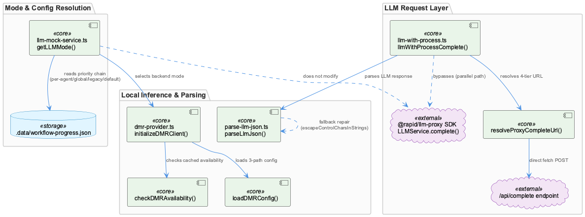
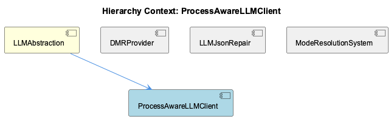

# ProcessAwareLLMClient

**Type:** SubComponent

# ProcessAwareLLMClient — Technical Insight Document

## What It Is

ProcessAwareLLMClient is implemented in `llm-with-process.ts` as a subcomponent of the broader `LLMAbstraction` layer. Its core responsibility is narrow but specific: injecting a required `process` telemetry field into LLM completion requests so that token-usage can be correctly attributed. Rather than extending or monkey-patching the `@rapid/llm-proxy` SDK's `LLMService.complete()`, the module's central function, `llmWithProcessComplete()`, reimplements the HTTP call as a direct `fetch` to `/api/complete`. This is a deliberate parallel-path strategy — the SDK's request shape simply has no slot for the `process` field, and rather than modifying the SDK, ProcessAwareLLMClient exists alongside it.

## Architecture and Design

The defining pattern here is decorator/parallel-path wrapping: `llmWithProcessComplete()` sits beside `LLMService.complete()` rather than replacing it, which is the same "wrap and extend, never rewrite" philosophy that characterizes its siblings — DMRProvider's singleton client, LLMJsonRepair's narrow repair pass, and ModeResolutionSystem's layered mode chain. Within `LLMAbstraction`, this establishes a consistent architectural signature: additive, narrowly-scoped patches layered on top of an underlying SDK and config system, each solving one specific gap without altering the semantics of the system it augments.

A second notable design decision is `resolveProxyCompleteUrl()`'s 4-tier URL resolution order: `RAPID_LLM_PROXY_URL` > `LLM_CLI_PROXY_URL` > `LLM_PROXY_URL` > localhost default. This duplicates configuration logic that presumably already exists inside the SDK client itself, creating two places that must independently track proxy endpoint changes.

## Implementation Details

`llmWithProcessComplete()` constructs and issues the HTTP POST directly, bypassing the SDK entirely for this call path. Because it reimplements the request rather than composing with the SDK, it must also independently replicate whatever contract details the SDK would otherwise absorb transparently — authentication headers, retry semantics, and error response shapes. `resolveProxyCompleteUrl()` performs the tiered environment-variable lookup described above, falling back to a localhost default when none of the three environment variables are set. This is a pragmatic, low-risk mechanism, but one whose correctness now depends on the module's own hardcoded knowledge of proxy conventions rather than a shared source of truth.

## Integration Points

ProcessAwareLLMClient is a direct child of `LLMAbstraction`, which also houses `DMRProvider`, `LLMJsonRepair`, and `ModeResolutionSystem`. It depends implicitly on the `@rapid/llm-proxy` SDK's request/response conventions (which it must mirror without directly importing), and on environment configuration (`RAPID_LLM_PROXY_URL`, `LLM_CLI_PROXY_URL`, `LLM_PROXY_URL`) for endpoint resolution. Unlike `ModeResolutionSystem`, which centralizes state in `.data/workflow-progress.json`, ProcessAwareLLMClient's configuration is purely environment-variable driven. It shares the parent's general philosophy — visible also in `DMRProvider` and `LLMJsonRepair` — of adding narrowly-scoped satellite modules around a shared SDK rather than modifying that SDK's core behavior.

## Usage Guidelines

Anyone modifying the proxy's request/response contract (auth headers, retry logic, error shapes) must remember to update `llm-with-process.ts` in lockstep, since this path does not benefit from SDK-level fixes. Similarly, any change to proxy endpoint conventions must be mirrored in `resolveProxyCompleteUrl()`'s tier list, not just in the SDK's own configuration resolution. Developers debugging LLM call behavior end-to-end should be aware that this bypass path exists as one of several independent satellite modules (alongside DMRProvider, LLMJsonRepair, ModeResolutionSystem) each with its own failure/fallback logic — there is no single unified code path to trace. This design minimizes blast radius for the specific telemetry-attribution fix but increases the total surface area that must be understood when reasoning about LLM request handling as a whole.

## Hierarchy Context

### Parent
- [LLMAbstraction](./LLMAbstraction.md) -- LLMAbstraction provides a provider-agnostic layer for interacting with multiple LLM backends (Anthropic, OpenAI, Groq, and local Docker Model Runner), enabling mode-switching between mock, local, and public inference without changing call-site code. It centers on a mode-resolution system stored in workflow-progress.json (llm-mock-service.ts) that supports global and per-agent overrides, allowing tests and specific agents to run against mock data while others hit real providers. This lets the broader system's wave-agents and analysis pipelines be developed and tested without incurring real API costs or requiring live credentials.

The component also handles local inference via DMR (dmr-provider.ts), which wraps Docker Desktop's Model Runner using an OpenAI-compatible client, with YAML-based configuration loading, environment variable expansion, and cached health checks to avoid excessive availability polling. A separate direct-fetch wrapper (llm-with-process.ts) bypasses the SDK's LLMService.complete() to inject a required 'process' telemetry field into proxy requests, addressing a specific attribution gap in token-usage telemetry — demonstrating the abstraction layer's willingness to parallel rather than replace the underlying SDK when the SDK lacks needed fields.

Robustness is a recurring theme: parse-llm-json.ts implements a narrow, well-tested JSON repair routine (escapeControlCharsInStrings) that fixes a specific documented failure mode (raw control characters like newlines inside LLM-generated JSON string values) without becoming a general-purpose lenient parser, preserving the invariant that genuinely malformed replies still fail loudly rather than being silently misinterpreted.

### Siblings
- [DMRProvider](./DMRProvider.md) -- [LLM] DMRProvider (dmr-provider.ts) implements a module-level singleton for its OpenAI-compatible client: a `dmrClient` variable initialized lazily via `initializeDMRClient()` rather than a class instance passed around by dependency injection. This is a pragmatic choice for a Node module that is imported once per process, but it means the client's lifecycle is tied to module load order and there is no explicit teardown/reset hook visible — a long-running process (e.g. the semantic-analysis service) that needs to reconnect after Docker Desktop restarts would have to either restart the process or add an explicit invalidation path, since nothing in the described API resets `dmrClient` to null on failure.
- [LLMJsonRepair](./LLMJsonRepair.md) -- [LLM] The LLMJsonRepair component (parse-llm-json.ts) implements a deliberately two-stage parseLlmJson() strategy: attempt a raw JSON.parse() first, and only fall back to a repair pass (escapeControlCharsInStrings()) on failure. This ordering matters architecturally — it means well-formed LLM output pays zero repair cost, and the repair logic is only ever exercised on the narrow, empirically-observed failure mode of unescaped control characters (literal newlines/tabs) appearing inside string literals of otherwise-valid JSON. The design explicitly rejects becoming a general lenient/fuzzy JSON parser, which is a conscious trade-off: it will not silently 'fix' truncated JSON, trailing commas, or unquoted keys, and a genuinely malformed response still throws.
- [ModeResolutionSystem](./ModeResolutionSystem.md) -- [LLM] getLLMMode() in llm-mock-service.ts implements a strict priority chain (per-agent override > global mode > legacy mockLLM flag > 'public' default) sourced from .data/workflow-progress.json. This is a classic layered-config-resolution pattern: rather than a single boolean flag, it supports fine-grained per-agent testing (e.g. one wave-agent can be forced to mock while siblings hit real providers) while still honoring a global kill-switch and a deprecated legacy flag for backward compatibility. The trade-off is that debugging 'why is this agent using mode X' requires walking four resolution tiers rather than reading one value, but the alternative (a single flag) would prevent the mixed mock/live testing scenarios the parent LLMAbstraction is designed to support.

---

*Generated from 9 observations*
