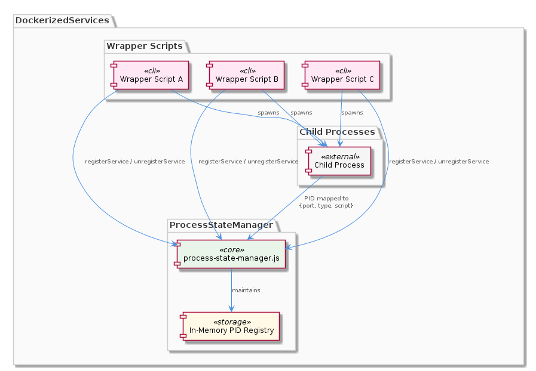
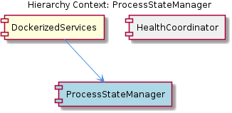

# ProcessStateManager

**Type:** SubComponent

All wrapper scripts within the DockerizedServices layer call `unregisterService` in their cleanup/teardown handlers to ensure stale PID entries are purged from the `process-state-manager.js` registry when child processes terminate.

## What It Is

ProcessStateManager is a singleton module implemented in `process-state-manager.js` within the DockerizedServices layer. It serves as a centralized in-memory registry that tracks all active child processes by mapping their PIDs to structured metadata.

## Architecture and Design

ProcessStateManager uses a simple singleton pattern to maintain a single authoritative process inventory across the DockerizedServices runtime. This centralized approach ensures all components query one consistent source of truth for active process state.

The design deliberately keeps state in-memory rather than persisting it, which aligns with the ephemeral nature of containerized processes—if the parent dies, the registry is irrelevant anyway.

## Implementation Details

The module exposes a `registerService` function that accepts a child PID and associates it with a metadata object containing `port`, `type`, and `script` fields. This structured metadata allows other components to look up not just whether a process exists, but what role it plays and how to reach it.

All wrapper scripts in the DockerizedServices layer call `unregisterService` during their cleanup/teardown handlers when child processes terminate. This ensures the registry never contains stale entries for dead processes.

## Integration Points

ProcessStateManager sits alongside its sibling HealthCoordinator within DockerizedServices. The port information stored in the registry is likely consumed by health-probing logic—HealthCoordinator needs to know which ports to probe, and ProcessStateManager holds that mapping. The `type` field in registered metadata could inform which probe strategy (HTTP vs TCP) applies to a given process.

Every wrapper script in the DockerizedServices layer integrates with this module by calling `registerService` at spawn time and `unregisterService` at teardown.

## Usage Guidelines

- Always call `unregisterService` in cleanup handlers—failing to do so leaves stale PIDs that could confuse health checks or port allocation.
- Since this is a singleton, do not instantiate multiple copies; import the shared module directly.
- The registry is in-memory only; do not rely on it surviving process restarts.

## Hierarchy Context

### Parent
- [DockerizedServices](./DockerizedServices.md) -- [LLM] The DockerizedServices component enforces a strict probe-result invariant called SPEC R6, implemented in `lib/utils/service-probe.js`, which mandates that both `probeHttpHealth()` and `probeTcpPort()` may only return the string values `'running'`, `'stopped'`, or `'unknown'` — never `'healthy'`. This design decision is architecturally significant because it prevents a class of silent-degradation bugs where a container that technically responds to a health endpoint (e.g., returning HTTP 200 with an incomplete initialization state) could be incorrectly classified as production-ready. The distinction between 'running' (process is alive and responding) and 'healthy' (fully initialized, all dependencies satisfied) is deliberately kept outside the probe layer and left to higher-level orchestration logic.

This invariant is consumed by `scripts/health-coordinator.js`, which polls on 5-second ticks and evaluates probe results against rules defined in `config/health-verification-rules.json`. By separating the probe vocabulary from the health-verdict vocabulary, the system avoids conflating network-layer liveness (can I reach the port?) with application-layer readiness (is this service actually functioning correctly?). A new developer reading the codebase should understand that if they ever modify `service-probe.js` to return `'healthy'`, they risk corrupting the health-coordinator's decision logic, which presumably maps probe results to actions like alerting, restart scheduling, or dependency unblocking.

### Siblings
- [HealthCoordinator](./HealthCoordinator.md) -- HealthCoordinator is a sub-component of DockerizedServices

---

*Generated from 3 observations*
