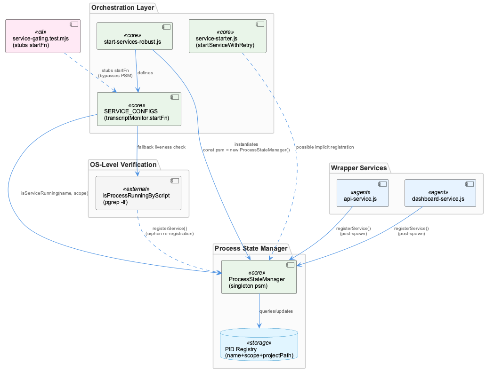
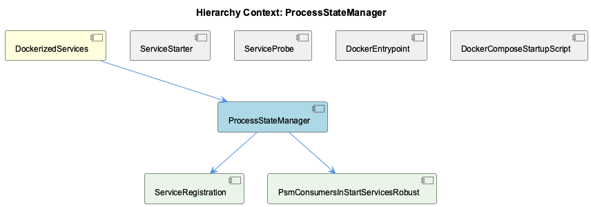

# ProcessStateManager

**Type:** SubComponent

Tracks metadata (PID, service name, start time) across both Docker-contained and standalone Node process contexts, unifying visibility under the Global Service Coordinator

# ProcessStateManager — Technical Insight Document

## What It Is

ProcessStateManager is implemented in `scripts/process-state-manager.js` and serves as the centralized lifecycle-tracking facility for services managed within the DockerizedServices layer. It exposes register/unregister operations that are invoked asynchronously by wrapper scripts such as `api-service.js` and `dashboard-service.js`. Its core responsibility is to track metadata — PID, service name, and start time — across both Docker-contained and standalone Node process contexts, unifying visibility of running services under the Global Service Coordinator. As the sibling component `ServiceWrapperScripts` handles path resolution and process spawning, ProcessStateManager (PSM) is the downstream ledger that records what those wrappers actually launched.

## Architecture and Design

The architectural approach is that of a lightweight, asynchronous state registry decoupled from the actual process supervision logic. Rather than owning process lifecycle itself, PSM is called out to reactively — registration occurs only *after* the underlying real process is spawned, ensuring that PSM's records reflect actual running processes rather than merely intended ones. This reflects a deliberate design trade-off: correctness/accuracy of state over eagerness, avoiding the false-positive problem where a service is presumed running before it truly exists.

Symmetrically, unregistration is triggered on process exit or signal forwarding, so when wrapper scripts forward SIGTERM/SIGINT to their spawned child processes, PSM state is kept consistent with reality. This mirrors the "avoid false positives" philosophy also seen in sibling `HealthCoordinator`'s SPEC R6 invariant, though PSM addresses process *existence* rather than *health*.

Structurally, PSM sits beneath `DockerizedServices` and above its own child, `RegistrationAPI`, which is the concrete registration/unregistration interface exposed by `process-state-manager.js`. This parent-child relationship indicates PSM itself is largely a thin orchestrating concept, with RegistrationAPI carrying the actual operational surface.

## Implementation Details

The implementation centers on register/unregister functions in `scripts/process-state-manager.js`, called asynchronously so as not to block the wrapper scripts' primary responsibilities (spawning, path resolution, signal forwarding). Each registration call carries metadata: PID, service name, and start time — the minimal fields needed to answer "is this service alive, and since when." Because wrapper scripts run in both Docker-contained and standalone Node contexts, PSM's data model must remain agnostic to execution environment, tracking processes uniformly regardless of whether they run inside a container or directly on the host.

The register call is placed strictly after process spawn succeeds, and the unregister call is tied to the exit/signal-forwarding pathway in the wrapper scripts — meaning PSM's accuracy is entirely dependent on wrapper scripts correctly invoking these hooks at the right lifecycle moments.

## Integration Points

PSM's primary integration points are its callers: `api-service.js` and `dashboard-service.js` (part of sibling `ServiceWrapperScripts`), which invoke register/unregister asynchronously around process spawn and signal-forwarding events. Its child, `RegistrationAPI`, is effectively the interface contract these callers use.

More broadly, PSM acts as the source of truth queried elsewhere in the coordinator ecosystem to determine which services are currently alive — implying other components (e.g., the Global Service Coordinator, and potentially `HealthCoordinator`) consult PSM state rather than probing processes directly for liveness/identity information.

Within its parent `DockerizedServices`, PSM complements `ServiceStarter`'s retry/backoff startup logic and `ServiceProbe`/`HealthCoordinator`'s health polling: where those components answer "is the service healthy," PSM answers "is the service registered as running, and what is it."

## Usage Guidelines

Developers adding new wrapper scripts should follow the established pattern: spawn the real process first, then asynchronously register with PSM — never register speculatively before spawn success. Correspondingly, unregistration must be wired into the same signal-forwarding path (SIGTERM/SIGINT) used to terminate the child process, ensuring no orphaned PSM entries persist after a service exits. Because PSM is treated as the ecosystem's source of truth for "which services are alive," any component querying service liveness should prefer PSM state over ad hoc process checks, and any new wrapper script integrated into DockerizedServices should conform to the same register/unregister contract exposed by RegistrationAPI to keep the Global Service Coordinator's view accurate.

## Hierarchy Context

### Parent
- [DockerizedServices](./DockerizedServices.md) -- DockerizedServices provides the containerization and process-management layer that wraps Coding's various services (semantic analysis MCP, constraint monitor API/dashboard, graphify, LLM services) so they can run reliably both inside Docker containers and as standalone Node processes managed by a Global Service Coordinator. The layer combines Docker artifacts (docker-compose.yml, Dockerfile.coding-services, supervisord.conf, entrypoint.sh) with a set of Node.js wrapper scripts (api-service.js, dashboard-service.js) that spawn actual backend processes, forward signals, and register/unregister with a ProcessStateManager (PSM) for lifecycle tracking.

A core architectural pattern is robust startup with retry/backoff and health verification, implemented in lib/service-starter.js's startServiceWithRetry(), which wraps a start function and a health-check function with timeouts (via withDeadline) and exponential backoff, distinguishing required vs optional services for graceful degradation. Complementing this, lib/utils/service-probe.js implements liveness probes (probeHttpHealth, probeTcpPort) used by scripts/health-coordinator.js to poll services every 5 seconds per config/health-verification-rules.json, strictly avoiding false-positive 'healthy' states per its SPEC R6 invariant.

Service wrappers such as api-service.js and dashboard-service.js follow a consistent pattern: resolve CODING_REPO-relative paths, verify target files/directories exist, spawn the real process with stdio inherited, forward SIGTERM/SIGINT, and asynchronously register/unregister with ProcessStateManager for centralized process tracking across the dockerized/global service fleet. Mock-mode support (llm-mock-service.ts) allows service behavior (LLM calls) to be swapped for deterministic mocks driven by a shared workflow-progress.json state file, aiding testing inside containers where CODING_ROOT may differ from host paths.

### Children
- [RegistrationAPI](./RegistrationAPI.md) -- The L2 description explicitly states process-state-manager.js exposes register/unregister operations called asynchronously by wrapper scripts like api-service.js and dashboard-service.js.

### Siblings
- [ServiceStarter](./ServiceStarter.md) -- startServiceWithRetry() in lib/service-starter.js wraps a caller-supplied start function and health-check function, retrying with exponential backoff on failure
- [ServiceProbe](./ServiceProbe.md) -- probeHttpHealth() in lib/utils/service-probe.js issues HTTP requests to a service's health endpoint and interprets response codes/timeouts
- [LLMMockService](./LLMMockService.md) -- integrations/semantic-analysis/src/mock/llm-mock-service.ts implements mode management supporting 'mock', 'local', and 'public' LLM call routing
- [HealthCoordinator](./HealthCoordinator.md) -- scripts/health-coordinator.js polls services every 5 seconds, using probeHttpHealth() and probeTcpPort() from lib/utils/service-probe.js
- [ServiceWrapperScripts](./ServiceWrapperScripts.md) -- api-service.js and dashboard-service.js resolve CODING_REPO-relative paths before spawning target processes, supporting both container and host execution

---

*Generated from 5 observations*
