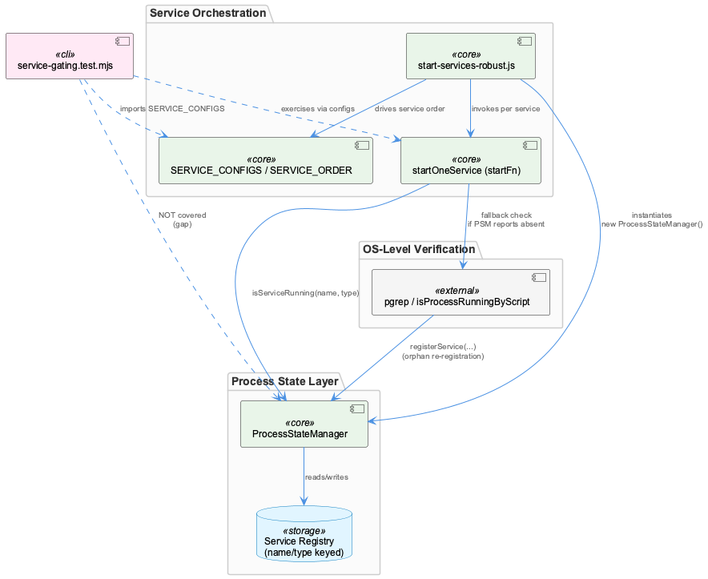
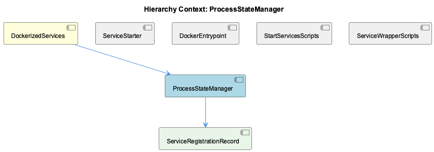

# ProcessStateManager

**Type:** SubComponent

## What It Is

ProcessStateManager (PSM) is a class defined in `process-state-manager.js`, confirmed by the code graph as the canonical registry of "which named services are already alive" within the DockerizedServices subsystem. It is not observed in isolation — all evidence of its behavior comes from its call sites in `scripts/start-services-robust.js`, where it is instantiated once at module scope (`const psm = new ProcessStateManager();`, line 38) and threaded through every service's startup logic. Notably, no observation exposes PSM's own internal implementation (the body of `registerService` or `isServiceRunning`); its contract is inferred entirely from how it is queried and updated by its consumer.

## Architecture and Design

PSM embodies a Registry/Singleton pattern: a single instantiated authority that tracks running services by a `name`/`type` key pair rather than by PID or port alone. The `type` dimension distinguishes `global` services (e.g., `transcript-monitor`) from `per-project` variants (e.g., `enhanced-transcript-monitor`), a distinction that recurs throughout `SERVICE_CONFIGS`. Critically, PSM is treated as authoritative but not fully trusted — the surrounding code implements a Defense-in-depth liveness checking pattern, layering a PSM registry check ahead of an OS-level `pgrep`-based fallback (`isProcessRunningByScript`). This reflects a deliberate design trade-off: registries are fast and structured but can go stale after an orphaned shutdown, while OS-level scans are slower but ground-truth. When the OS check discovers a live but unregistered process, it is explicitly re-registered via `psm.registerService(...)`, forming a Self-healing registry pattern rather than treating registry emptiness as failure.

This mirrors, at the process level, the same discipline enforced at the container level by parent DockerizedServices: the Health Verification Workflow requires operators to confirm existing container/service state before re-invoking docker-compose, avoiding restarts atop orphaned state. PSM's two-tier check is the Node-level analog of that same "never assume liveness" principle.

## Implementation Details

The clearest instance of PSM usage is `transcriptMonitor.startFn` in `start-services-robust.js`. Before spawning `enhanced-transcript-monitor.js`, it calls `psm.isServiceRunning('transcript-monitor', 'global')` (or the per-project variant with a `projectPath` parameter). Only if PSM reports nothing does the code fall back to `isProcessRunningByScript` (pgrep-based). If that fallback finds an orphaned process, it heals the registry via `psm.registerService({name, pid, type, script})` — an inline object literal, e.g. `{name: 'transcript-monitor', pid: osCheck.pid, type: 'global', script: 'scripts/enhanced-transcript-monitor.js'}`. This call-site shape is the de facto schema for PSM entries, referenced structurally as the child component ServiceRegistrationRecord — though no observation shows a formally declared type, class, or schema for it; it exists only as this ad hoc argument shape passed into `registerService`.

## Integration Points

PSM's only observed consumer is `start-services-robust.js`, part of sibling component ServiceWrapperScripts, which couples to it tightly by instantiating it once at module scope and passing it into every service's `startFn`. It sits under DockerizedServices alongside siblings ServiceStarter, DockerEntrypoint, and StartServicesScripts. StartServicesScripts (`start-services.sh`) defers to `start-services-robust.js` (and thus to PSM) whenever `ROBUST_MODE` is true, its default. DockerEntrypoint's `wait_for_service()` operates at an earlier, coarser layer — a fail-open TCP readiness gate for Qdrant/Redis — while PSM operates after that point, at the granularity of individual named Node services.

## Usage Guidelines

Developers extending `SERVICE_CONFIGS` entries should follow the `transcriptMonitor` pattern: never trust `psm.isServiceRunning` alone as a gate for spawning a new process — pair it with an OS-level fallback check, and re-register any orphan found via `psm.registerService`. Registrations must include `name`, `pid`, `type` (`global` vs `per-project`), and `script`, consistent with existing entries. Be aware that `tests/features/service-gating.test.mjs` exercises `startOneService`/`SERVICE_CONFIGS`/`SERVICE_ORDER` but does not test PSM's duplicate-detection logic directly — this is a known coverage gap, meaning changes to PSM's registration/query behavior are not protected by the existing feature-gating suite and should be verified manually or via new targeted tests.

## Code Evidence

Key code artifacts grounding this entity's analysis:

**Structural:**
- ProcessStateManager (class) in process-state-manager.js

**Relationships:**
- The code graph confirms ProcessStateManager as a class in process-state-manager.js, and scripts/start-services-robust.js instantiates it directly as `const psm = new ProcessStateManager()` and calls methods like `psm.isServiceRunning('transcript-monitor', 'global')` and `psm.registerService({...})`, indicating PSM's role as the runtime source of truth for which named services are already alive before a new one is spawned.

## Work Record

What working sessions recorded about this entity — decisions taken, problems hit, and why things are the way they are:

- The Coding-Services Docker Container — Health Verification Workflow record establishes a 'Docker Container Restart Verification Baseline' requiring operators to check existing container/service state before invoking docker-compose again, to avoid restarting atop orphaned or stale service state left by a prior incomplete shutdown — this is the same failure mode that start-services-robust.js's PSM-plus-pgrep double-check is designed to detect and repair at the process level rather than the container level.
- The same Health Verification Workflow record treats health confirmation as a hard gate rather than an assumption after any rebuild — this operational discipline parallels how start-services-robust.js does not simply trust PSM's registry after a restart but re-verifies via OS-level pgrep before deciding a service is genuinely running, extending the 'never assume liveness' principle down from the container/supervisord layer to individual Node service wrappers.

## Hierarchy Context

### Parent
- [DockerizedServices](./DockerizedServices.md) -- [SESSION] Coding-Services Docker Container — Health Verification Workflow establishes that rebuild is performed via docker-compose and all supervised processes/health endpoints must be confirmed live before relying on downstream pipelines like wave-analysis

### Children
- [ServiceRegistrationRecord](./ServiceRegistrationRecord.md) -- [LLM] None of the supplied files define a type, class, schema, or database table named `ServiceRegistrationRecord`. The closest artifact is the plain object literal passed to `psm.registerService()` in scripts/start-services-robust.js — e.g. `{ name: 'transcript-monitor', pid: osCheck.pid, type: 'global', script: 'scripts/enhanced-transcript-monitor.js' }` inside the `transcriptMonitor.startFn` — but this is an inline call-site argument, not a named record type declared anywhere in the retrieved code.

### Siblings
- [ServiceStarter](./ServiceStarter.md) -- [SESSION] Coding-Services Docker Container — Health Verification Workflow establishes that after docker-compose rebuild, all supervised processes/health endpoints must be confirmed live before relying on downstream pipelines like wave-analysis
- [DockerEntrypoint](./DockerEntrypoint.md) -- [LLM] docker/entrypoint.sh's `wait_for_service()` (lines ~13-31) is a deliberately fail-open readiness gate: it polls a TCP connection via bash's `/dev/tcp/$host/$port` pseudo-device wrapped in `timeout 2`, retries up to `max_attempts` (default 30) with a 2s sleep, but on exhaustion prints a WARNING and still `return 0` — the comment explicitly states 'Don't fail — let supervisord handle it'. This means the entrypoint never blocks container startup on Qdrant or Redis being slow; it only front-loads a wait so the first supervisord-managed process is less likely to race a cold dependency, while ultimate liveness is left to whatever the individual service's own retry logic does once supervisord starts it.
- [StartServicesScripts](./StartServicesScripts.md) -- [LLM] start-services.sh is a dual-mode dispatcher: with ROBUST_MODE (default true, overridable via env var) it simply execs `node scripts/start-services-robust.js` and exits immediately, deferring all real orchestration to that Node script; the remainder of the bash file (roughly 200+ lines of legacy port-killing, docker-compose invocation for Qdrant/Redis, and manual `docker run` fallbacks for constraint-monitor) only executes when ROBUST_MODE=false. This is a live-but-deprecated code path — it still constructs CONSTRAINT_MONITOR_STATUS/CONSTRAINT_MONITOR_WARNING strings and calls `check_docker`, `check_port`, `kill_port` — kept explicitly for backward compatibility rather than deleted.
- [ServiceWrapperScripts](./ServiceWrapperScripts.md) -- [LLM] scripts/start-services-robust.js defines SERVICE_CONFIGS as a map of per-service descriptors (transcriptMonitor, liveLoggingCoordinator, and others truncated below them) each carrying a `feature` id, `startFn`, `healthCheckFn`, `required`, and `maxRetries`/`timeout`. The `transcriptMonitor.startFn` is the clearest instance of the 'thin wrapper' pattern described for the parent DockerizedServices entity: before spawning anything it checks PSM (`psm.isServiceRunning('transcript-monitor', 'global')`) and an OS-level `pgrep` fallback (`isProcessRunningByScript`) to avoid double-starting an orphaned process, then spawns `enhanced-transcript-monitor.js` detached with stdio redirected to `.data/etm.log`, injects `OBS_API_URL` into the child's env, and calls `child.unref()` so the wrapper process itself can exit without keeping the child alive as a dependent.

---

*Generated from 10 observations*
