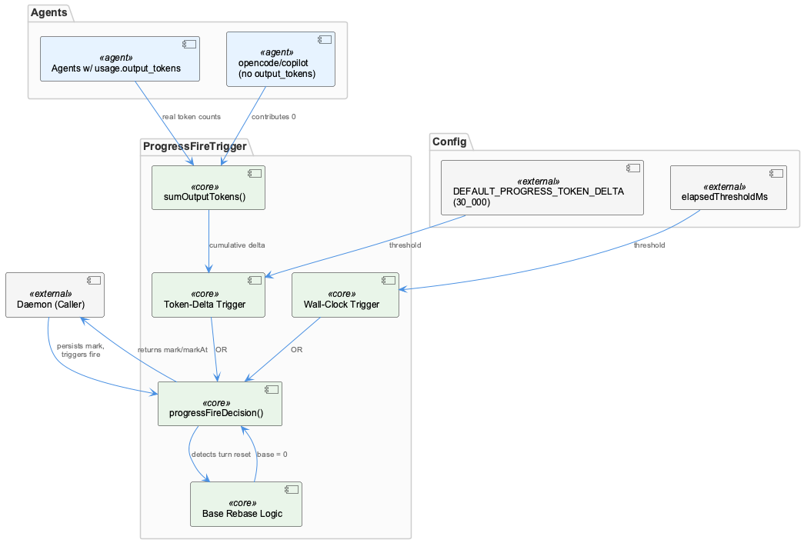
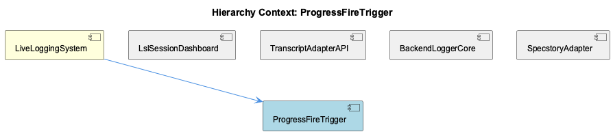

# ProgressFireTrigger

**Type:** SubComponent

progressFireDecision() rebases 'base' to 0 when setOutputTokens < firedOutputTokens, detecting that a new turn started and the per-cursor token accumulator reset rather than waiting to exceed the previous turn's larger mark

# ProgressFireTrigger — Technical Insight Document

## What It Is

ProgressFireTrigger is a decision-logic module within the LiveLoggingSystem responsible for determining when a "progress snapshot" should fire during a long-running turn. Its core exported behavior is exposed through `progressFireDecision()`, a function that evaluates whether enough output has accumulated or enough time has elapsed to warrant emitting a progress mark. As a SubComponent of LiveLoggingSystem, it operates downstream of the session/transcript capture responsibilities owned by `logging.ts` (the parent's authoritative ingestion point), but it is narrowly scoped: it does not perform any I/O, session windowing, or file routing itself — it purely computes a boolean/decision outcome from numeric inputs.

## Architecture and Design

The defining architectural trait of ProgressFireTrigger is its dual-trigger decision model: `progressFireDecision()` fires on **either** of two independent conditions — a token-delta trigger (cumulative output tokens grown by at least `thresholdTokens` since the last mark) or a wall-clock trigger (elapsed milliseconds at or above `elapsedThresholdMs`). This OR-based composition is a deliberate design choice that guarantees progress is reported even in degenerate cases where one signal is unavailable or uninformative.

That degenerate case is explicitly handled: `sumOutputTokens()` treats agents lacking a `usage.output_tokens` field (observed for opencode and copilot) as contributing 0 tokens. Rather than causing an error or requiring per-agent branching logic, this design makes the token trigger naturally inert for those agents, while the wall-clock trigger silently becomes the sole fallback mechanism. This is a graceful-degradation pattern rather than an explicit agent-type conditional, keeping the trigger logic agent-agnostic.

The module is explicitly documented as side-effect-free and deterministic, a strong architectural constraint that enables unit testing without invoking the daemon or any live logging infrastructure. This mirrors the abstraction discipline seen in sibling component TranscriptAdapterAPI, where `TranscriptAdapter` enforces subclassing via a `new.target` check — both components favor strict separation between decision/interface logic and actual runtime side effects (fire, persistence, connection).

## Implementation Details

The central function, `progressFireDecision()`, accepts cumulative state (current output token count, last-fired mark, elapsed time) and threshold configuration, returning a decision without mutating anything itself — the caller owns the responsibility of "firing" and persisting the returned mark and `markAt` timestamp. This push-computation-to-caller pattern keeps the trigger logic reusable across different invocation contexts (daemon loop, tests, etc.).

A key implementation nuance is turn-boundary detection: when `setOutputTokens < firedOutputTokens`, the function rebases the accumulator `base` to 0. This detects that a new turn has started and the per-cursor token count has reset, rather than incorrectly waiting for the new turn's token count to exceed the previous (larger) turn's mark — which would otherwise starve the token trigger for an entire turn.

The default threshold, `DEFAULT_PROGRESS_TOKEN_DELTA = 30_000`, is not an arbitrary constant — it was tuned against real calibration-session data showing 80k–135k output tokens per long turn, targeting roughly 3–4 snapshots across the longest turns. This reflects a deliberate trade-off between snapshot granularity (usefulness for live monitoring) and overhead/noise (avoiding excessive firing).

## Integration Points

ProgressFireTrigger is a subcomponent of LiveLoggingSystem, sitting alongside siblings LslSessionDashboard, TranscriptAdapterAPI, BackendLoggerCore, and SpecstoryAdapter. While it does not directly depend on these siblings based on the observations, it shares the broader system's reliance on data captured upstream by `logging.ts`. Its output-token accounting depends indirectly on how each agent's transcript adapter (per TranscriptAdapterAPI's `getAgentType`/`readTranscripts` contract) reports usage — the fact that opencode/copilot lack `usage.output_tokens` is a direct consequence of adapter-level data availability differences.

Because the module is deterministic and side-effect-free, its integration point with the daemon is a simple call/return contract: callers pass current counters and thresholds, receive a decision plus updated mark/markAt, and are responsible for persisting that state and executing the actual fire action.

## Usage Guidelines

Developers extending or configuring ProgressFireTrigger should preserve its side-effect-free contract — any actual firing, logging, or persistence must remain the caller's responsibility, not be folded into `progressFireDecision()`. When adjusting `DEFAULT_PROGRESS_TOKEN_DELTA` or `elapsedThresholdMs`, reference real calibration-session token distributions rather than guessing, since the current default was empirically derived from 80k–135k token turns. When adding support for new agents, verify whether `usage.output_tokens` is populated; if absent, understand that the token trigger will be inert and wall-clock firing becomes the effective mechanism — no special-casing is needed in the trigger itself. Finally, because the module is unit-testable in isolation, new logic (e.g., additional trigger conditions) should be covered by tests that exercise `progressFireDecision()` directly, without requiring the daemon.

## Hierarchy Context

### Parent
- [LiveLoggingSystem](./LiveLoggingSystem.md) -- [LLM] The LiveLoggingSystem centers around logging.ts, which owns the core responsibilities of session windowing, file routing, and transcript capture. This module acts as the single ingestion point for live Claude Code conversation data, meaning any change to session lifecycle semantics (e.g., how a 'session window' is defined or when it rolls over to a new file) has cascading effects on downstream consumers like the classification agent and config validation tooling. New developers should treat logging.ts as the authoritative source of truth for how raw conversation events are structured before they are persisted to disk.

### Siblings
- [LslSessionDashboard](./LslSessionDashboard.md) -- lsl-sessions.mjs defines a chain as an hourly tranche including rotation parts, not a single file, because legacy '-N_' markdown parts are headerless fragments split mid-token and pi-format parts are linked via parentSession
- [TranscriptAdapterAPI](./TranscriptAdapterAPI.md) -- TranscriptAdapter is an abstract base class in transcript-api.js that throws on direct instantiation via `new.target === TranscriptAdapter` check, forcing agent-specific subclasses to implement getAgentType, readTranscripts, convertToLSL, getCurrentSession
- [BackendLoggerCore](./BackendLoggerCore.md) -- Logger.js loads config/logging-config.json once via loadConfig(), caching it in module-level sharedConfig and exposing reloadConfig() to force a refresh
- [SpecstoryAdapter](./SpecstoryAdapter.md) -- SpecstoryAdapter.initialize() tries three connection methods in fallback order: connectViaHTTP(), then connectViaIPC(), then connectViaFileWatch()

---

*Generated from 5 observations*
