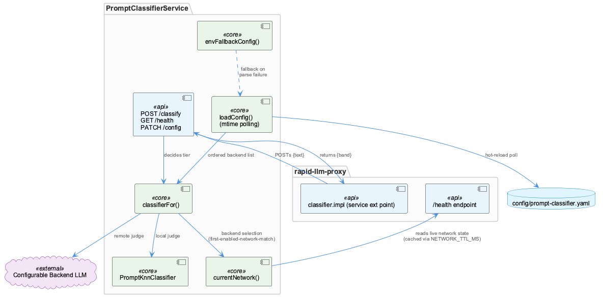
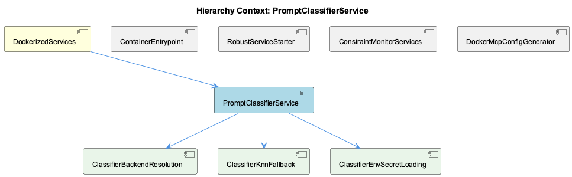

# PromptClassifierService

**Type:** SubComponent

## What It Is

PromptClassifierService is implemented directly in `scripts/prompt-classifier-service.mjs` as a standalone HTTP microservice, not a library called in-process by the proxy. It exposes three endpoints — `POST /classify`, `GET /health`, and `PATCH /config` — and its core job is to decide a model tier (small/medium/high) for a given prompt text, delegating that decision either to a configurable backend LLM or to a local KNN classifier (`PromptKnnClassifier`, from `./lib/prompt-classifier-knn.mjs`). It sits within the DockerizedServices hierarchy as a sibling to ContainerEntrypoint, RobustServiceStarter, ConstraintMonitorServices, and DockerMcpConfigGenerator, though observations explicitly note it is not shown to be hosted inside the same docker/entrypoint.sh supervisord topology that manages semantic-analysis and constraint-monitor processes.

## Architecture and Design

The central architectural decision is a strict separation of "routing" from "judging": rapid-llm-proxy owns routing mechanics via its `classifier.impl: service` extension point, POSTing `{text}` and reading back `{band}`, while this service owns the judgment policy and holds no knowledge of which calling agent (claude/opencode/copilot/pi) issued the request. This keeps a single classifier verdict reusable across all agents and couples the two components purely through an HTTP contract rather than shared code.

A second recurring pattern is fail-open/fail-toward-what-worked handling of uncertain external state. `loadConfig()` hot-reloads `config/prompt-classifier.yaml` via mtime polling (mirroring the llm-routing.yaml convention elsewhere), but on parse failure it keeps the last good config and records `configError` rather than dropping to no judge or adopting a broken one. Network detection defaults to "public" when uncertain, and backend failures surface as HTTP 502 rather than a guessed classification band — consistent with the same fail-open philosophy documented in docker/entrypoint.sh's feature-gating logic.

Backend selection follows a data-driven, ordered-list pattern: `config/prompt-classifier.yaml` declares backends with first-enabled-network-match semantics, mirroring llm-routing.yaml's offload-target pattern. This resolution logic is delegated to the child component ClassifierBackendResolution, split between `currentNetwork()` (the "where are we" answer, cached via `NETWORK_TTL_MS` against the proxy's `/health` endpoint) and `candidatesForNetwork()` in `./lib/prompt-classifier-config.mjs` (the "what can serve that network" answer) — deliberately avoiding a second, possibly disagreeing source of network truth alongside proxy-bridge/egress-decision.mjs.

## Implementation Details

`classifierFor(cfg)` is the key dispatch function, choosing between backend-LLM and KNN paths and caching a `PromptKnnClassifier` instance keyed by `JSON.stringify(resolveKnnPaths(REPO, cfg.knn))`, so hot-reloaded config that doesn't change KNN model/cache paths avoids rebuilding the index — this caching contract is the substance of the child component ClassifierKnnFallback, whose actual abstain/fallback decision logic lives in the not-yet-supplied `lib/prompt-classifier-knn.mjs`.

Secret loading, covered by child component ClassifierEnvSecretLoading, happens inline at module load, before PORT/CONFIG_PATH are read: `ENV_FILE` resolves from `CLASSIFIER_ENV_FILE` or `.env`, a pre-pass deletes any empty-string environment variables (preventing an `export FOO="$FOO"` on an unset FOO from silently defeating the mechanism — a failure mode discovered via a live incident with `QWEN_LOCAL_API_KEY not set`), and `process.loadEnvFile(ENV_FILE)` runs in a try/catch that sets `envFileLoaded`. This ordering guarantees `askBackend()`'s later reads of `process.env[apiKeyEnv]` see loaded values, though malformed `.env` files fail silently since no logger exists yet at that point.

`envFallbackConfig()` provides an environment-variable-derived backend configuration as a fallback to the YAML-driven config, and `currentNetwork()` and `loadConfig()` together give the service its live-reconfiguration behavior without restart.

## Integration Points

The service's primary integration is with rapid-llm-proxy via the `classifier.impl: service` HTTP contract, and secondarily with the proxy's own `/health` endpoint (`LLM_CLI_PROXY_URL`, default `http://<CONNECTION_STRING_REDACTED> meaning the container's supervised process tree (feeding into service-probe/service-starter health checks described in the parent) only begins after database reachability is confirmed at the raw TCP level — a weaker guarantee than the HTTP health-endpoint polling the parent describes, since a TCP-open Qdrant/Redis could still be mid-cold-start.
- [RobustServiceStarter](./RobustServiceStarter.md) -- [LLM] scripts/start-services-robust.js implements the actual RobustServiceStarter logic: SERVICE_CONFIGS declares each service (transcriptMonitor, liveLoggingCoordinator, etc.) with required/optional classification, maxRetries, timeout, a startFn, and a healthCheckFn, and startOneService (referenced in tests/features/service-gating.test.mjs) drives feature-gated startup with blocking semantics for required services. This confirms the parent's description of retry-with-timeout and graceful degradation is concretely realized here rather than being aspirational documentation.
- [ConstraintMonitorServices](./ConstraintMonitorServices.md) -- [LLM] start-services.sh's legacy path (invoked when ROBUST_MODE=false) contains the only executable logic for provisioning constraint-monitor in this file set: it conditionally `git clone`s `github.com/fwornle/constraint-monitor.git` into `integrations/constraint-monitor` if absent, runs `npm install --production`, then either `docker-compose up -d` (preferred, checking for `qdrant`/`redis` containers reporting `Up.*healthy`) or falls back to raw `docker run` for `constraint-monitor-qdrant` (ports 6333/6334) and `constraint-monitor-redis` (port 6379). It further starts `constraint-monitor`'s own dashboard (`PORT=3030 npm run dashboard`) and API (`npm run api`, implicitly port 3031) as background shell jobs when the docker-compose path isn't used, with success/failure captured only in shell-local `CONSTRAINT_MONITOR_STATUS`/`_WARNING` variables printed to console — there is no structured health object returned to a caller.
- [DockerMcpConfigGenerator](./DockerMcpConfigGenerator.md) -- [LLM] No file among the supplied sources — docker/entrypoint.sh, scripts/prompt-classifier-service.mjs, scripts/start-services-robust.js, start-services.sh, tests/features/service-gating.test.mjs — defines, imports, or references a class, function, or module named 'DockerMcpConfigGenerator'. The closest thematic neighbors are docker/entrypoint.sh's feature-gating block (lines building /etc/supervisor/features.d/disabled.conf from a features.json snapshot) and lib/service-starter.js (referenced by start-services-robust.js), neither of which generates MCP configuration.

---

*Generated from 12 observations*
