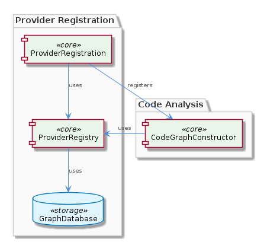
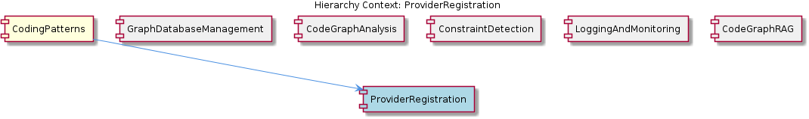

# ProviderRegistration

**Type:** SubComponent

The ProviderRegistration sub-component provides a method for registering new providers, which is used by the CodeGraphConstructor for constructing and analyzing code graphs.

## What It Is  

The **ProviderRegistration** sub‑component lives inside the **CodingPatterns** component and is the entry point for adding new provider implementations to the system. Its core logic is implemented through the `ProviderRegistry` class, which can be found in the code base wherever the provider‑registration logic is referenced (the exact file path is not listed, but the class is documented in *integrations/copi/docs/USAGE.md*).  

ProviderRegistration’s responsibility is to expose a **method for registering new providers**. This method is invoked by higher‑level consumers such as the **CodeGraphConstructor** (see `integrations/mcp-server-semantic-analysis/src/agent/code-graph-agent.ts`). By funneling every new provider through a single registry, the system gains a consistent, searchable catalogue of providers that can be queried or iterated over by other components.

> 

---

## Architecture and Design  

The design of ProviderRegistration is centred on a **registry pattern**. `ProviderRegistry` acts as a central catalogue that stores provider metadata and runtime instances. This pattern gives the system a **flexible and extensible** way to add providers without needing to modify downstream consumers.

ProviderRegistration does not manage persistence directly; instead it delegates graph‑oriented storage to the **GraphDatabaseAdapter** (`storage/graph-database-adapter.ts`). This adapter abstracts the underlying Graphology‑LevelDB stack, allowing the registry to focus on business logic while the adapter handles creation, reading, and mutation of graph nodes that represent providers. The relationship between `ProviderRegistry` and `GraphDatabaseAdapter` is an **Adapter pattern** – the registry calls a stable API (e.g., `addNode`, `linkEdge`) without caring about the concrete graph implementation.

Interaction flow:

1. A caller (e.g., `CodeGraphConstructor`) invokes the ProviderRegistration method to register a new provider.  
2. ProviderRegistration forwards the request to `ProviderRegistry`.  
3. `ProviderRegistry` uses `GraphDatabaseAdapter` to persist the provider as a graph node, linking it to relevant entities (e.g., capabilities, constraints).  
4. The newly stored provider becomes immediately visible to any component that queries the graph, enabling downstream analysis such as constraint detection or RAG retrieval.

> 

The sub‑component shares this graph‑centric approach with its siblings **GraphDatabaseManagement**, **CodeGraphAnalysis**, and **CodeGraphRAG**, all of which also rely on the same `GraphDatabaseAdapter`. This common dependency creates a **tight coupling** around the graph layer, which simplifies data consistency but also means that changes to the adapter ripple through the entire family of components.

---

## Implementation Details  

### Core Class – `ProviderRegistry`  
*Location:* referenced in *integrations/copi/docs/USAGE.md*.  
*Key responsibilities*  
- **registerProvider(providerDescriptor)** – validates the descriptor, creates a graph node, and records any relationships (e.g., provider‑to‑capability edges).  
- **listProviders()** – traverses the graph to return all registered providers.  
- **findProvider(id)** – fetches a specific provider node by its unique identifier.

The class is deliberately **flexible**: the descriptor can contain arbitrary metadata, and the underlying graph schema can be extended without touching the registry code. This extensibility is highlighted in the USAGE documentation, which shows how developers can plug in custom fields.

### Dependency – `GraphDatabaseAdapter`  
*Location:* `storage/graph-database-adapter.ts`.  
- Provides a thin wrapper around **Graphology** for node/edge operations and uses **LevelDB** for persistence.  
- Exposes methods such as `addNode`, `addEdge`, `getNode`, and `query`.  
- By abstracting these operations, `ProviderRegistry` stays agnostic of storage details, allowing future swaps (e.g., moving from LevelDB to another KV store) with minimal impact.

### Consumer – `CodeGraphConstructor`  
*Location:* `integrations/mcp-server-semantic-analysis/src/agent/code-graph-agent.ts`.  
- Calls the ProviderRegistration API during the code‑graph build phase to ensure that any newly discovered provider implementations are recorded before the graph analysis begins.  
- This tight integration guarantees that provider‑related constraints are considered early in the pipeline.

Overall, the implementation follows a **separation‑of‑concerns** discipline: registration logic lives in `ProviderRegistry`, persistence lives in `GraphDatabaseAdapter`, and usage lives in consuming agents such as `CodeGraphConstructor`.

---

## Integration Points  

1. **Upstream Consumers** – The primary caller is the **CodeGraphConstructor**. When the constructor parses source files and discovers provider definitions, it registers them through ProviderRegistration. This ensures that the provider graph is up‑to‑date before any analysis (e.g., constraint detection) runs.  

2. **Sibling Components** –  
   - **GraphDatabaseManagement** provides the underlying storage engine; any change to its schema or performance characteristics directly affects ProviderRegistration latency.  
   - **CodeGraphAnalysis** and **CodeGraphRAG** query the same provider nodes when building higher‑level representations or performing retrieval‑augmented generation.  
   - **ConstraintDetection** may read provider metadata to enforce rules (e.g., required capabilities).  

3. **External Documentation** – The usage guide in *integrations/copi/docs/USAGE.md* demonstrates how external developers can invoke the registration method, showing the intended public contract.  

4. **Potential Extension Points** – Because the registry stores providers as graph nodes, new relationships (e.g., provider → version, provider → environment) can be added without altering the registry API. Consumers that need richer data simply query the additional edges.

---

## Usage Guidelines  

- **Always register through the provided method** (`ProviderRegistry.registerProvider`). Direct manipulation of the graph is discouraged to preserve invariants such as unique identifiers and required relationship edges.  
- **Validate provider descriptors** before calling the registration API. The registry expects a minimal set of fields (e.g., `id`, `type`, `metadata`). Missing fields will cause runtime validation errors.  
- **Prefer immutable descriptors**. Once a provider is registered, treat its descriptor as read‑only; updates should be performed via a dedicated “update” path (if added in the future) rather than by re‑registering.  
- **Leverage the USAGE documentation** (*integrations/copi/docs/USAGE.md*) for examples of correct registration calls, especially when extending the descriptor with custom fields.  
- **Be aware of graph transaction boundaries**. If you need to register multiple providers atomically, batch the calls and rely on the `GraphDatabaseAdapter`’s transaction support (if available) to avoid partial state.  

---

### Summary of Architectural Insights  

| Item | Insight |
|------|---------|
| **Architectural patterns identified** | Registry pattern (`ProviderRegistry`), Adapter pattern (`GraphDatabaseAdapter`), Graph‑centric data model shared across siblings. |
| **Design decisions and trade‑offs** | Centralizing provider metadata simplifies lookup and enforces consistency, but introduces tight coupling to the graph layer; using an adapter isolates storage specifics at the cost of an extra abstraction layer. |
| **System structure insights** | ProviderRegistration sits under **CodingPatterns**, acting as the bridge between provider discovery (CodeGraphConstructor) and persistent graph storage (GraphDatabaseAdapter). All sibling components depend on the same graph backbone, creating a unified data surface. |
| **Scalability considerations** | Graphology + LevelDB scale well for read‑heavy workloads; however, bulk registration bursts could pressure LevelDB write throughput. The registry’s thin logic means scaling is largely a function of the underlying adapter’s performance. |
| **Maintainability assessment** | High maintainability: registration logic is isolated, documentation is explicit, and the graph schema can evolve without breaking the API. The main maintenance risk lies in the shared graph adapter—any breaking change there ripples across all siblings. |

By grounding the analysis in the observed classes, file paths, and documented usage, this insight document clarifies how **ProviderRegistration** fits into the broader **CodingPatterns** ecosystem, the design rationales that shaped it, and the practical guidelines developers should follow when extending or interacting with it.

## Hierarchy Context

### Parent
- [CodingPatterns](./CodingPatterns.md) -- [LLM] The CodingPatterns component's architecture is heavily influenced by the GraphDatabaseAdapter class in storage/graph-database-adapter.ts, which provides methods for creating, reading, and manipulating graph data. This class utilizes Graphology and LevelDB for persistence, ensuring efficient data storage and retrieval. The CodeGraphConstructor sub-component, as seen in integrations/mcp-server-semantic-analysis/src/agent/code-graph-agent.ts, relies on the GraphDatabaseAdapter for constructing and analyzing code graphs. This tightly coupled relationship between the GraphDatabaseAdapter and CodeGraphConstructor enables the efficient creation and analysis of code graphs.

### Siblings
- [GraphDatabaseManagement](./GraphDatabaseManagement.md) -- GraphDatabaseAdapter in storage/graph-database-adapter.ts utilizes Graphology and LevelDB for persistence, ensuring efficient data storage and retrieval.
- [CodeGraphAnalysis](./CodeGraphAnalysis.md) -- The CodeGraphConstructor in integrations/mcp-server-semantic-analysis/src/agent/code-graph-agent.ts relies on the GraphDatabaseAdapter for constructing and analyzing code graphs.
- [ConstraintDetection](./ConstraintDetection.md) -- The ConstraintDetection sub-component uses the execute(input, context) pattern for detecting and monitoring constraints.
- [LoggingAndMonitoring](./LoggingAndMonitoring.md) -- The LoggingAndMonitoring sub-component uses async log buffering and flushing for logging and monitoring.
- [CodeGraphRAG](./CodeGraphRAG.md) -- The CodeGraphRAG sub-component is a graph-based RAG system for any codebases, as seen in integrations/code-graph-rag/README.md.

---

*Generated from 7 observations*
