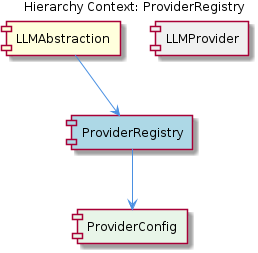

# ProviderRegistry

**Type:** SubComponent

The ProviderRegistry utilizes the AnthropicProvider class (lib/llm/providers/anthropic-provider.ts) and the DMRProvider class (lib/llm/providers/dmr-provider.ts) to register providers.

## What It Is  

`ProviderRegistry` lives in **`lib/llm/provider-registry.js`**.  It is a small but pivotal sub‑component of the larger **LLMAbstraction** component.  Its sole responsibility is to maintain a collection of LLM‑provider implementations and expose a simple lookup mechanism that other parts of the system – most notably **`LLMService`** (found in `lib/llm/llm-service.ts`) – can use to route a request to the correct provider.  The registry is populated with concrete provider classes such as **`AnthropicProvider`** (`lib/llm/providers/anthropic-provider.ts`) and **`DMRProvider`** (`lib/llm/providers/dmr-provider.ts`).  Because the registry lives in its own file and is referenced by both the parent **LLMAbstraction** component and sibling components like **BudgetTracker**, it acts as the single source of truth for “what providers are available” within the code base.

## Architecture and Design  

The design follows a **registry pattern**: a central map (or similar collection) holds provider identifiers together with instantiated provider objects.  This pattern enables **provider‑agnostic** routing – the rest of the system never needs to know which concrete class implements a given LLM; it simply asks the registry for the provider that matches a requested name or capability.  The registry is **decoupled** from the request‑handling logic; `LLMService` imports the registry and delegates the selection of a provider to it, preserving a clear separation of concerns.  

The component hierarchy reinforces this separation.  `ProviderRegistry` is a child of **LLMAbstraction**, which defines the overall abstraction layer for language‑model interactions.  Its sibling **BudgetTracker** also consumes the registry, using it to attribute usage costs to the correct provider.  This shared dependency illustrates a **composition** relationship: multiple higher‑level services compose the same low‑level registry rather than each building its own provider list.

Although the observations do not explicitly name a pattern beyond the registry, the way providers are registered (via direct imports of `AnthropicProvider` and `DMRProvider`) suggests a **plug‑in style** approach: adding a new provider only requires creating a class that conforms to the provider interface and inserting it into the registry file.  No other part of the system needs to be altered, which is a classic **open/closed** design principle.

## Implementation Details  

The core of the implementation resides in **`lib/llm/provider-registry.js`**.  While the exact code is not shown, the file’s purpose is clear from the observations: it imports concrete provider classes (`AnthropicProvider` from `lib/llm/providers/anthropic-provider.ts` and `DMRProvider` from `lib/llm/providers/dmr-provider.ts`) and registers them, likely in a JavaScript object or `Map` keyed by a provider identifier (e.g., `"anthropic"` or `"dmr"`).  The registry probably exposes at least two public functions:

1. **`register(name, providerInstance)`** – used internally when the file is first evaluated to add the built‑in providers, and potentially available for runtime extension.
2. **`getProvider(name)`** – queried by `LLMService` (in `lib/llm/llm-service.ts`) to retrieve the appropriate provider for a given request.

`LLMService` acts as the façade for all LLM operations.  When a caller asks for a completion, chat, or other LLM service, `LLMService` consults the registry, obtains the matching provider, and forwards the request.  Because the registry is a singleton module (a common Node.js pattern), both `LLMService` and `BudgetTracker` see the same provider instances, ensuring consistent configuration and state.

The observations also hint at **environment‑variable driven integration**: variables such as `CODE_GRAPH_RAG_SSE_PORT` and `BROWSER_ACCESS_SSE_URL` may be read by providers during registration to configure external services (e.g., a Code Graph Retrieval‑Augmented Generation pipeline or a browser‑access SSE endpoint).  While the registry itself probably does not parse these variables, the provider classes it instantiates likely do, meaning the registry indirectly participates in wiring together external systems.

## Integration Points  

`ProviderRegistry` sits at the intersection of several system boundaries:

* **LLMAbstraction** – as a child component, the registry provides the concrete implementations that satisfy the abstract LLM interface defined by the parent.
* **LLMService** (`lib/llm/llm-service.ts`) – the primary consumer; it queries the registry for a provider and then calls the provider’s methods (`generate`, `chat`, etc.).
* **BudgetTracker** – a sibling that also imports the registry to map usage metrics (tokens, API calls) back to the specific provider, enabling cost accounting.
* **External configuration files** – the registry’s provider list may be informed by documentation such as `integrations/copi/INSTALL.md` (for installation steps) and `integrations/mcp-constraint-monitor/docs/semantic-constraint-detection.md` (for semantic constraint handling).  These files are not code, but they likely describe required environment variables or runtime flags that providers read during construction.
* **Environment variables** – `CODE_GRAPH_RAG_SSE_PORT` and `BROWSER_ACCESS_SSE_URL` are referenced as possible inputs that providers need.  The registry, by virtue of creating provider instances, ensures these values are passed where required.

Because the registry is a plain JavaScript module, integration is straightforward: any module that needs provider information simply imports `lib/llm/provider-registry.js` and calls its public API.  No additional service discovery or dependency‑injection framework is required.

## Usage Guidelines  

1. **Add a New Provider** – Create a class that implements the same public interface as `AnthropicProvider` and `DMRProvider`.  Place the file under `lib/llm/providers/` and import it in `lib/llm/provider-registry.js`.  Register it by adding an entry to the internal map (e.g., `registry.register('myProvider', new MyProvider(config))`).  No changes to `LLMService` or other consumers are needed.  
2. **Reference Providers Consistently** – When invoking LLM functionality through `LLMService`, always specify the provider name exactly as it appears in the registry.  This avoids mismatches and ensures the correct cost‑tracking path in `BudgetTracker`.  
3. **Configure External Dependencies** – If a provider relies on external services (Code Graph RAG, browser SSE, etc.), ensure the corresponding environment variables (`CODE_GRAPH_RAG_SSE_PORT`, `BROWSER_ACCESS_SSE_URL`) are defined before the application starts.  The provider’s constructor will read them; the registry merely passes the instantiated object onward.  
4. **Do Not Mutate the Registry at Runtime Unless Intended** – The registry is designed for static registration at module load time.  Dynamically adding or removing providers after startup can lead to inconsistent state between `LLMService` and `BudgetTracker`.  If runtime flexibility is required, expose a controlled `register` API and document its usage clearly.  
5. **Keep Provider Implementations Side‑Effect Free** – Providers should encapsulate all external calls (API keys, network clients) within themselves.  This keeps the registry lightweight and prevents it from becoming a hidden source of side effects.

---

### Architectural Patterns Identified
* **Registry / Service Locator** – central map of provider identifiers to concrete instances.
* **Plug‑in / Open‑Closed** – new providers can be added without modifying existing routing logic.
* **Composition** – multiple higher‑level components (LLMService, BudgetTracker) compose the same registry.

### Design Decisions and Trade‑offs
* **Simplicity vs. Flexibility** – Using a plain module‑level registry is easy to understand and has minimal runtime overhead, but it limits dynamic reconfiguration unless an explicit API is added.
* **Single Source of Truth** – Centralizing provider information reduces duplication but creates a hard coupling; any change to provider registration propagates to all consumers.
* **Environment‑Variable Configuration** – Delegating external configuration to providers keeps the registry thin, yet it requires developers to be aware of the required variables for each provider.

### System Structure Insights
* **Parent‑Child Relationship** – ProviderRegistry is a child of LLMAbstraction, providing concrete implementations for the abstract LLM contract.
* **Sibling Interaction** – Both LLMService and BudgetTracker depend on the registry, illustrating a shared‑service model within the same abstraction layer.
* **External Documentation Links** – Integration guides (`INSTALL.md`, `semantic-constraint-detection.md`) serve as operational references for providers, indicating that provider onboarding is documented outside the code but closely tied to the registry’s purpose.

### Scalability Considerations
* Adding more providers scales linearly: each new provider adds one entry to the registry and a corresponding class file.  
* Because provider lookup is a simple map access, request routing remains O(1) even with dozens of providers.  
* If the number of providers grows dramatically, consider namespacing or grouping them to avoid identifier collisions, but the current design already supports that via unique keys.

### Maintainability Assessment
* **High maintainability** – The registry’s thin footprint and clear import‑register pattern make it easy for developers to audit which providers are available.  
* **Low coupling** – Consumers interact only through the registry’s public API, so changes to provider internals rarely affect callers.  
* **Potential risk** – Since the registry is a shared mutable module, inadvertent runtime mutations could cause hard‑to‑debug bugs; enforcing immutability or exposing a read‑only interface would further improve robustness.

## Diagrams

### Relationship

## Architecture Diagrams

## Hierarchy Context

### Parent
- [LLMAbstraction](./LLMAbstraction.md) -- [LLM] The LLMAbstraction component is designed with a provider-agnostic approach, allowing for seamless integration of multiple Large Language Model (LLM) providers. This is evident in the lib/llm/provider-registry.js file, where a registry of providers is maintained, enabling easy addition or removal of providers. For instance, the AnthropicProvider class (lib/llm/providers/anthropic-provider.ts) and the DMRProvider class (lib/llm/providers/dmr-provider.ts) are both registered in this registry, demonstrating the flexibility of the component's architecture. The LLMService class (lib/llm/llm-service.ts) serves as the main entry point for all LLM operations, routing requests to the appropriate provider based on the registry. This design decision enables the component to adapt to changing requirements and new provider additions without significant modifications to the existing codebase.

### Siblings
- [BudgetTracker](./BudgetTracker.md) -- The lib/llm/provider-registry.js file maintains a registry of providers, enabling easy addition or removal of providers, which is used by the BudgetTracker to track costs.
- [LLMService](./LLMService.md) -- The LLMService class (lib/llm/llm-service.ts) serves as the main entry point for all LLM operations, routing requests to the appropriate provider based on the registry.

---

*Generated from 7 observations*
