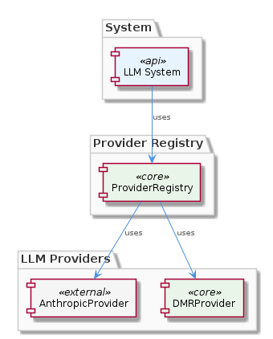

# ProviderRegistry

**Type:** SubComponent

The ProviderRegistry enables the component to be highly flexible and scalable, as new providers can be easily added or removed without affecting the overall architecture.

## What It Is  

The **ProviderRegistry** lives in the file `lib/llm/provider-registry.js`. It is the central registry that holds the concrete LLM provider implementations used by the **LLMAbstraction** component. By design it is *provider‑agnostic*: the registry does not contain any provider‑specific logic, only the mappings between a **ProviderConfig** (e.g., an API key) and a concrete provider class such as `AnthropicProvider` (`lib/llm/providers/anthropic-provider.ts`) or `DMRProvider` (`lib/llm/providers/dmr-provider.ts`). Because the registry is a child of **LLMAbstraction**, any consumer of the abstraction interacts with the registry indirectly—asking the abstraction for a provider instance rather than instantiating a provider itself. This decoupling lets the system add, replace, or remove providers without touching the rest of the codebase.

---

## Architecture and Design  

The overall architecture follows a **registry‑based composition** model. The **ProviderRegistry** acts as a **Registry pattern** hub that stores and resolves provider instances based on configuration data supplied through **ProviderConfig**. This registry is consulted by **LLMAbstraction**, which serves as the façade for the rest of the application.  

Each concrete provider (e.g., `AnthropicProvider`, `DMRProvider`) extends the shared **LLMProvider** base class, a classic **Strategy pattern** arrangement: the abstraction defines the required interface, while the concrete strategies implement the specifics of calling the Anthropic API or performing local inference. The registry therefore enables **Strategy selection at runtime** based on the active configuration.  

The design is deliberately **decoupled**: the registry does not import any business‑logic modules other than the provider classes themselves, and providers do not reference the registry. This one‑way dependency keeps the system modular and simplifies testing—providers can be instantiated in isolation, and the registry can be swapped with a mock during unit tests.

---

## Implementation Details  

* **ProviderRegistry (`lib/llm/provider-registry.js`)** – Exposes methods such as `register(providerName, providerClass)`, `getProvider(providerName)`, and `loadConfig(configObject)`. Internally it maintains a map (`Map<string, LLMProvider>`) keyed by provider identifiers. When `loadConfig` is called, the registry reads the **ProviderConfig** (e.g., the presence of `ANTHROPIC_API_KEY`) and instantiates the appropriate provider class, storing the ready‑to‑use instance in the map.

* **ProviderConfig** – Though not shown in code, the observations indicate that this child entity holds configuration values like API keys, endpoint URLs, and any provider‑specific flags. The registry reads these values to decide which provider to instantiate and how to initialise it (e.g., passing the Anthropic API key to the `AnthropicProvider` constructor).

* **AnthropicProvider (`lib/llm/providers/anthropic-provider.ts`)** – Implements the LLMProvider interface for the Anthropic service. It expects an API key (supplied via ProviderConfig) and encapsulates HTTP request logic, response parsing, and error handling specific to Anthropic’s API contract.

* **DMRProvider (`lib/llm/providers/dmr-provider.ts`)** – Implements the same interface but targets a local inference engine (DMR). Its constructor likely receives paths to model files or runtime options from ProviderConfig, and it handles the local execution workflow.

* **LLMAbstraction** – Holds a reference to the ProviderRegistry. When a higher‑level component asks for a model completion, LLMAbstraction delegates the request to the provider instance returned by `registry.getProvider(<name>)`. This indirection guarantees that the calling code never needs to know which concrete provider is in use.

The registry’s implementation is lightweight: it does not perform heavy logic beyond instantiation and lookup, which keeps the overhead low and makes the component easy to reason about.

---

## Integration Points  

1. **Configuration Layer** – The system’s configuration files (environment variables, JSON/YAML config) feed into **ProviderConfig**. For example, setting `ANTHROPIC_API_KEY` enables the Anthropic provider; omitting it may cause the registry to fall back to `DMRProvider` or raise a clear error.

2. **LLMAbstraction** – Acts as the primary consumer of the registry. Any module that needs LLM capabilities imports **LLMAbstraction** and, through it, indirectly accesses the selected provider.

3. **Provider Implementations** – Each concrete provider may depend on external SDKs or libraries (e.g., an HTTP client for Anthropic, a native binding for DMR). Those dependencies are isolated within the provider’s own directory (`lib/llm/providers/`), preventing them from leaking into the rest of the codebase.

4. **Testing Harnesses** – Because the registry can be populated programmatically, test suites can register mock providers that implement the same LLMProvider interface, allowing deterministic unit tests without hitting external APIs.

5. **Future Extensions** – Adding a new provider only requires creating a class that extends **LLMProvider**, adding its registration call (e.g., `registry.register('newProvider', NewProviderClass)`), and supplying any required configuration keys. No changes to **LLMAbstraction** or other consumers are needed.

---

## Usage Guidelines  

* **Register Early** – During application bootstrap, invoke `ProviderRegistry.loadConfig()` or explicit `register()` calls before any component requests a provider. This guarantees that `LLMAbstraction` always receives a fully initialised instance.

* **Keep ProviderConfig Minimal** – Only expose the keys that a provider truly needs (e.g., `ANTHROPIC_API_KEY`). Unused configuration values should be omitted to avoid accidental mis‑configuration.

* **Prefer Interface Over Implementation** – When writing new code that interacts with LLM capabilities, depend on the **LLMAbstraction** façade rather than directly importing a provider class. This preserves the decoupling benefits of the registry.

* **Handle Missing Providers Gracefully** – If `registry.getProvider(name)` returns `undefined` because a provider was not registered, surface a clear error message that references the missing configuration key. This aids debugging in environments where some providers are optional.

* **Testing** – In unit tests, replace the real registry with a mock that registers lightweight stub providers. This isolates tests from network calls and heavyweight local inference engines.

* **Extending the Registry** – When adding a new provider, follow the existing pattern: create a file under `lib/llm/providers/`, extend the shared **LLMProvider** base, and add a registration entry in `provider-registry.js`. Document any new configuration keys in the project’s README so that downstream developers know how to enable the provider.

---

### Architectural patterns identified
1. **Registry Pattern** – Centralised storage and lookup of provider instances.  
2. **Strategy Pattern** – Providers implement a common interface, allowing runtime selection.  
3. **Facade Pattern** – `LLMAbstraction` provides a simplified entry point that hides provider details.

### Design decisions and trade‑offs
* **Provider‑agnostic registry** – Gains flexibility and easy extensibility but adds an indirection layer that developers must understand.  
* **Separate ProviderConfig** – Keeps secret material (API keys) out of provider code, improving security; however, it requires disciplined configuration management.  
* **Sibling inheritance from LLMProvider** – Encourages code reuse and consistent API surface, at the cost of a shallow inheritance hierarchy that may need refactoring if providers diverge significantly.

### System structure insights
* The hierarchy is **LLMAbstraction → ProviderRegistry → ProviderConfig → Concrete Providers**.  
* Providers are siblings under the `lib/llm/providers/` namespace, all sharing the same base class.  
* The registry is the sole bridge between the abstraction and the concrete implementations, ensuring a clean separation of concerns.

### Scalability considerations
* Adding new providers is O(1): create a class, register it, and supply config.  
* The map‑based lookup in `ProviderRegistry` scales efficiently even with dozens of providers.  
* Because providers are instantiated once and reused, memory overhead remains predictable.  
* External scaling (e.g., handling high request volume) is delegated to each provider implementation, allowing independent optimisation (e.g., connection pooling for Anthropic, GPU allocation for DMR).

### Maintainability assessment
* **High** – The registry centralises provider wiring, reducing duplication.  
* Clear file boundaries (`provider-registry.js`, `providers/`) make it straightforward to locate and modify code.  
* Decoupling via interfaces limits ripple effects when a provider changes internally.  
* The only maintenance risk is ensuring that **ProviderConfig** stays in sync with provider requirements; automated validation of config keys can mitigate this.

## Hierarchy Context

### Parent
- [LLMAbstraction](./LLMAbstraction.md) -- [LLM] The LLMAbstraction component uses a provider-agnostic approach, allowing for easy switching between different LLM providers. This is achieved through the ProviderRegistry class (lib/llm/provider-registry.js), which manages the different LLM providers and their configurations. For instance, the AnthropicProvider class (lib/llm/providers/anthropic-provider.ts) is used to interact with the Anthropic API, while the DMRProvider class (lib/llm/providers/dmr-provider.ts) is used for local LLM inference. The use of a provider registry enables the component to be highly flexible and scalable, as new providers can be easily added or removed without affecting the overall architecture.

### Children
- [ProviderConfig](./ProviderConfig.md) -- The presence of ANTHROPIC_API_KEY in the project documentation implies that the ProviderConfig would handle such API keys for the Anthropic provider.

### Siblings
- [LLMProvider](./LLMProvider.md) -- The AnthropicProvider class (lib/llm/providers/anthropic-provider.ts) extends the LLMProvider class.

---

*Generated from 5 observations*
