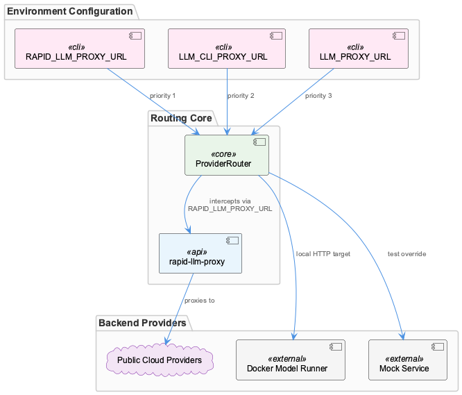
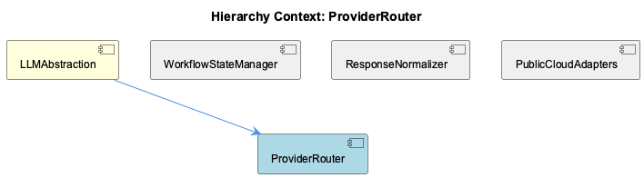

# ProviderRouter

**Type:** SubComponent

Provider selection follows a defined priority chain across three environment variables—RAPID_LLM_PROXY_URL, LLM_CLI_PROXY_URL, and LLM_PROXY_URL—meaning the first set variable wins, as documented in docs/architecture/system-overview.md

# ProviderRouter — Technical Insight Document

## What It Is

ProviderRouter is a SubComponent of LLMAbstraction responsible for directing outbound LLM requests to the correct backend at runtime. It operates as the decision-making core of the routing layer, sitting between the higher-level LLMAbstraction interface and a heterogeneous set of backends that includes public cloud providers (Anthropic, OpenAI), a local Docker Model Runner (DMR), a rapid-llm-proxy middleware, and a mock service for testing. The routing logic is driven entirely by environment variables and runtime state, with no code changes required to switch targets. The priority chain governing provider selection is documented in `docs/architecture/system-overview.md`.

## Architecture and Design

The defining architectural decision in ProviderRouter is the use of a **priority-ordered environment variable chain** as the sole mechanism for provider selection. Three variables are evaluated in sequence — `RAPID_LLM_PROXY_URL`, `LLM_CLI_PROXY_URL`, and `LLM_PROXY_URL` — with the first set variable winning. This design places all routing configuration at the infrastructure level, keeping the router itself stateless with respect to provider identity. The consequence is a clean separation: operators and CI pipelines can redirect traffic without touching application code.

A second key design decision is treating all backends as peers in the routing table. Docker Model Runner, a local HTTP target, is registered alongside remote API endpoints for Anthropic and OpenAI. This symmetry means ProviderRouter does not encode assumptions about whether a backend is local or remote — it simply resolves a URL and delegates. The rapid-llm-proxy middleware follows the same pattern: it is addressed via `RAPID_LLM_PROXY_URL` and intercepts traffic transparently, functioning as an optional layer between ProviderRouter and the public cloud adapters without requiring special routing logic.

The mock service backend occupies a formal slot in the routing table rather than being a test-only code path. This means test environments achieve isolation by setting an environment variable, not by patching or branching the router's logic. This decision preserves production code paths during testing, which is a meaningful correctness guarantee.

The router's design must be understood in relation to its siblings. WorkflowStateManager owns the `workflow-progress.json` state file, which carries global and per-agent LLM mode overrides (`mock`, `local`, `public`). ProviderRouter consumes this state to make its final backend selection — the environment variable chain establishes which URL to use, while the workflow state determines the mode. ResponseNormalizer and PublicCloudAdapters sit downstream: once ProviderRouter has dispatched a request, the relevant adapter normalizes the response to the four-field contract (`content`, `model`, `provider`, token usage) before it surfaces to the caller.

## Implementation Details

ProviderRouter evaluates `RAPID_LLM_PROXY_URL` first. When set, all requests are directed through the rapid-llm-proxy middleware, which acts as an intercepting layer. This allows proxy-level features (logging, rate limiting, cost controls) to be applied without any change to the router's dispatch logic. When `RAPID_LLM_PROXY_URL` is absent, the router falls through to `LLM_CLI_PROXY_URL`, then to `LLM_PROXY_URL`. The fallthrough behavior means each variable in the chain can be thought of as overriding the ones below it.

For backends that require distinct authentication and request schemas — specifically Anthropic (`ANTHROPIC_API_KEY`) and OpenAI (`OPENAI_API_KEY`) — ProviderRouter delegates to the PublicCloudAdapters sibling rather than encoding per-provider HTTP logic itself. This keeps the router's concern narrowly focused on *which* target to send to, while adapters own *how* to speak to that target. Docker Model Runner, being a local HTTP endpoint, presumably requires no special authentication header, though the routing table treats it uniformly as a URL-addressed backend.

The mock service registration in the routing table is significant from an implementation standpoint: it implies ProviderRouter has a lookup or registry structure that maps mode/URL values to backend handlers, and that this registry is populated at initialization time to include the mock entry unconditionally. Test environments activate it purely through environment state.

## Integration Points

ProviderRouter is contained within LLMAbstraction, which presents a provider-agnostic interface to the rest of the system. Internally, ProviderRouter depends on WorkflowStateManager to read the current LLM mode (global or per-agent override from `workflow-progress.json`), and on the environment variable chain documented in `docs/architecture/system-overview.md` to resolve backend URLs. It dispatches to PublicCloudAdapters for Anthropic and OpenAI targets, to the DMR HTTP endpoint for local inference, to the rapid-llm-proxy when `RAPID_LLM_PROXY_URL` is set, and to the mock service for test isolation. ResponseNormalizer sits at the output boundary, normalizing whatever the selected backend returns before the response leaves LLMAbstraction.

The rapid-llm-proxy integration point is particularly notable because it is purely additive — it introduces no new branching logic in ProviderRouter itself. Setting `RAPID_LLM_PROXY_URL` simply changes the resolved target URL, and the proxy handles interception transparently.

## Usage Guidelines

Developers configuring a new environment should be aware that `RAPID_LLM_PROXY_URL` takes unconditional precedence. If this variable is set — even unintentionally — all traffic will route through the proxy regardless of other variables. Auditing the full three-variable chain is the correct diagnostic approach when unexpected routing occurs.

For test environments, the correct mechanism for activating the mock backend is setting the appropriate environment variable to the mock service's registered address, not modifying routing code. This convention ensures the production routing path remains exercised up to the final dispatch step.

When adding a new backend, the routing table registration, environment variable mapping, and a corresponding adapter (to satisfy ResponseNormalizer's four-field contract) should be treated as a single atomic change. A backend registered in the router but missing a normalizing adapter will produce malformed responses upstream.

The per-agent override capability in `workflow-progress.json`, managed by WorkflowStateManager, means ProviderRouter may resolve to different backends for different agents within the same process invocation. Developers should not assume a single resolved provider for the lifetime of a workflow execution.

**Scalability considerations:** The stateless, URL-resolution design scales horizontally without coordination — each process reads environment variables and state independently. The principal scaling constraint is the upstream backends themselves, not the router. The rapid-llm-proxy layer provides a natural insertion point for cross-cutting concerns (caching, throttling) that would otherwise require changes to ProviderRouter directly.

**Maintainability assessment:** The environment-variable-driven priority chain is simple and auditable, but the implicit precedence order requires clear documentation (which `docs/architecture/system-overview.md` provides). The peer-backend routing table and the delegation of format concerns to PublicCloudAdapters and ResponseNormalizer keep ProviderRouter's scope narrow, which supports long-term maintainability. The primary maintenance risk is undocumented additions to the routing table that lack corresponding adapter and normalization coverage.

## Hierarchy Context

### Parent
- [LLMAbstraction](./LLMAbstraction.md) -- LLMAbstraction is the provider-agnostic layer that routes LLM calls across multiple backends: public cloud providers (Anthropic, OpenAI), a local Docker Model Runner (DMR), a rapid-llm-proxy middleware, and a mock service for testing. The architecture centers on a workflow-progress.json state file that stores global and per-agent LLM mode overrides (mock/local/public), enabling dynamic runtime switching without code changes. Provider selection flows through environment variables (RAPID_LLM_PROXY_URL, LLM_CLI_PROXY_URL, LLM_PROXY_URL) with a defined priority chain, and all providers normalize their responses to a shared shape containing content, model, provider, and token usage fields.

### Siblings
- [WorkflowStateManager](./WorkflowStateManager.md) -- workflow-progress.json acts as the single source of truth for LLM mode state, storing both a global override and per-agent overrides, as described in the LLMAbstraction parent component description
- [ResponseNormalizer](./ResponseNormalizer.md) -- The normalized response schema carries four fields—content, model, provider, and token usage—as specified in the LLMAbstraction description, meaning every backend adapter must map its native response to this contract
- [PublicCloudAdapters](./PublicCloudAdapters.md) -- Anthropic and OpenAI are listed as distinct backends, requiring separate adapters because their request schemas, authentication headers (ANTHROPIC_API_KEY vs OPENAI_API_KEY as documented), and response envelopes differ

---

*Generated from 4 observations*
