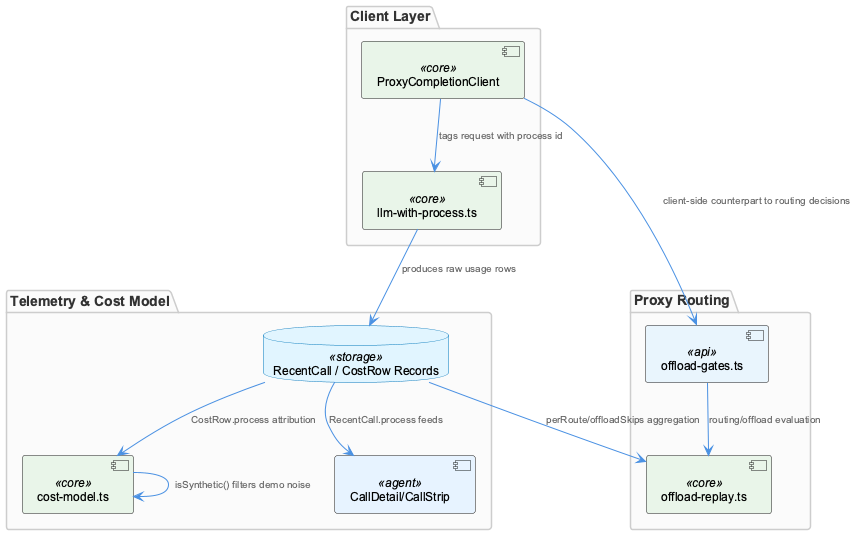
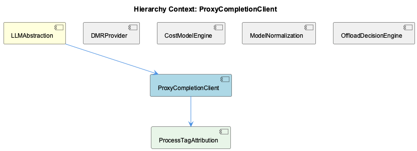

# ProxyCompletionClient

**Type:** SubComponent

llm-with-process.ts tags each completion request with a process identifier, which downstream shows up as CostRow.process in cost-model.ts

# ProxyCompletionClient — Technical Insight Document

## What It Is

ProxyCompletionClient is implemented in `llm-with-process.ts`, where it wraps LLM completion requests with a process identifier before they are dispatched. This tagging behavior is the defining characteristic of the component: every completion request that flows through it carries a process attribution that persists downstream into the system's telemetry and cost-accounting infrastructure. As a member of the LLMAbstraction parent component, it sits alongside siblings like DMRProvider, CostModelEngine, ModelNormalization, and OffloadDecisionEngine as one of the concrete pieces that give the LLM abstraction layer its operational shape — specifically, the piece responsible for client-side identification of *why* or *in what context* a given call was made.

## Architecture and Design

The core architectural decision embodied by ProxyCompletionClient is tagging-at-the-source: rather than reconstructing call context after the fact, the process identifier is attached at the point of request in `llm-with-process.ts` and threaded through the rest of the pipeline as data. This is evident in how `CostRow.process` in `cost-model.ts` exists purely as a pass-through field populated from this upstream tagging, and how `RecentCall.process` in the telemetry pipeline is fed by the same recorded call rows. This design avoids inference or heuristic reconstruction of call purpose elsewhere in the system — attribution is decided once, close to the request origin, and trusted everywhere downstream.

Architecturally, ProxyCompletionClient acts as the client-side counterpart to server-side routing decisions evaluated by OffloadDecisionEngine's `evaluateOffload()` in `offload-gates.ts`. The sibling's gate-ordered evaluation (considered→route-allows→band→target→target-band→scope→transport→offloaded) determines *what* decision was made about a call; ProxyCompletionClient's tagging determines *how that call is later categorized* for reporting. This split of concerns — decision logic on one side, attribution labeling on the other — lets each subsystem evolve independently while still producing coherent, joinable data.

## Implementation Details

The mechanical contribution of ProxyCompletionClient is narrow but structurally important: it tags each completion request with a process identifier at request time in `llm-with-process.ts`. This single act ripples into several downstream data structures. Its own child component, ProcessTagAttribution, formalizes the resulting contract — the `CostRow` interface in `cost-model.ts` declares a `process: string` field alongside `provider`/`model`/`subscription`, and the module's header comment confirms data is grouped "by month × provider × model × process." ProcessTagAttribution is thus not a separate mechanism but the schema-level manifestation of what ProxyCompletionClient produces.

Because this tagging happens uniformly across requests, aggregation logic in `offload-replay.ts` — specifically `perRoute` and `offloadSkips` breakdowns — can rely on the process dimension to produce meaningful segmentation rather than aggregate, undifferentiated totals. Similarly, the raw usage rows produced by ProxyCompletionClient are the same rows later filtered by `isSynthetic()` in `cost-model.ts` to strip synthetic/demo noise, meaning the client is the ultimate source of truth for both real and synthetic usage data before any cleaning occurs.

## Integration Points

ProxyCompletionClient integrates most directly downstream into `cost-model.ts` (via `CostRow.process`) and into the call-detail UI layer, feeding `CallDetail`/`CallStrip` components through recorded call rows (`RecentCall.process`). It also supplies the `offload-replay.ts` aggregation logic with the process dimension needed for `perRoute` and `offloadSkips` breakdowns. Upstream/conceptually, it pairs with OffloadDecisionEngine's `offload-gates.ts` evaluation as the client-side half of the routing/offload decision story — one determines the outcome, the other labels the resulting call. Within its own hierarchy, it contains ProcessTagAttribution, which is effectively the data-contract expression of its tagging behavior in `CostRow`.

## Usage Guidelines

Developers modifying or extending completion-request flows should treat the process tag applied in `llm-with-process.ts` as a load-bearing field, not a cosmetic label — it is consumed by cost aggregation, offload-replay breakdowns, call-detail UI, and synthetic-data filtering. Any change to how or when tags are assigned should be validated against all of these consumers, particularly `cost-model.ts`'s `CostRow`/`isSynthetic()` logic and `offload-replay.ts`'s `perRoute`/`offloadSkips` grouping. Because this component's output is joined against OffloadDecisionEngine's gate decisions, changes to process semantics should be coordinated with `offload-gates.ts` to keep attribution and routing decisions mutually interpretable.

## Hierarchy Context

### Parent
- [LLMAbstraction](./LLMAbstraction.md) -- [LLM] The mode-resolution logic in getLLMMode() (llm-mock-service.ts) establishes a clear precedence chain that new developers must understand before debugging unexpected LLM behavior: per-agent overrides in workflow-progress.json take precedence over a global mode setting, which in turn overrides a legacy mockLLM boolean flag, with 'public' as the ultimate fallback. This four-tier resolution means that a developer trying to force mock mode for testing might set the global mode but be silently overridden by a stale per-agent override left in workflow-progress.json from a previous run. The dual-checking of both llmState (new) and mockLLM (legacy) shapes in isMockLLMEnabled() and getLLMState() is a deliberate backward-compatibility shim, indicating the config schema evolved over time but old state files or tooling that only write the legacy flag must continue to work without breaking the mock system.

### Children
- [ProcessTagAttribution](./ProcessTagAttribution.md) -- CostRow interface in cost-model.ts declares a `process: string` field alongside provider/model/subscription, populated from data grouped 'by month × provider × model × process' per the module's header comment.

### Siblings
- [DMRProvider](./DMRProvider.md) -- DMRProvider (dmr-provider.ts) implements an OpenAI-compatible client interface so it can be substituted for remote providers without changing call sites
- [CostModelEngine](./CostModelEngine.md) -- priceForModel() implements a three-tier resolution: exact model key match, family-representative fallback via FAMILY_REPRESENTATIVE, then generic family match, defaulting to a zero-priced 'none' source
- [ModelNormalization](./ModelNormalization.md) -- Model identifiers normalized here feed directly into CostConfig.modelPrices keys consumed by priceForModel() in cost-model.ts
- [OffloadDecisionEngine](./OffloadDecisionEngine.md) -- evaluateOffload() in offload-gates.ts reproduces the proxy's short-circuit gate order exactly (considered→route-allows→band→target→target-band→scope→transport→offloaded), because gate order determines which reason string is attributed to a call

---

*Generated from 5 observations*
