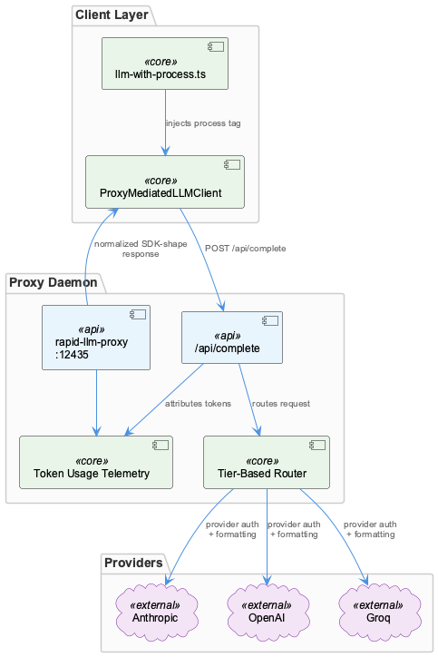
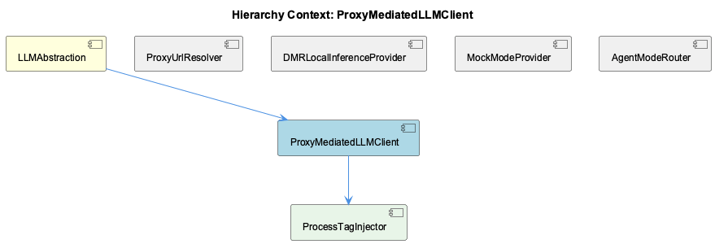

# ProxyMediatedLLMClient

**Type:** SubComponent

The llm-with-process.ts module exists specifically to inject a process tag into proxy requests, filling a gap in LLMService.complete() that caused wave-analysis calls to appear as process='unknown' in token-usage telemetry

# ProxyMediatedLLMClient — Technical Reference

## What It Is

ProxyMediatedLLMClient is the sub-component within LLMAbstraction responsible for routing LLM requests through the local `rapid-llm-proxy` daemon. It targets `/api/complete` on the proxy (default port 12435, resolved by ProxyUrlResolver) and handles the full request lifecycle: process-tag injection, provider-agnostic request dispatch, and SDK-shape response normalization. The key implementation artifact is `llm-with-process.ts`, which exists specifically to close the telemetry gap left by the base `LLMService.complete()` method — without this module, all wave-analysis calls appeared as `process='unknown'` in token-usage tracking.

Within the three execution paths of LLMAbstraction (mock, DMR, cloud), ProxyMediatedLLMClient owns the cloud path and serves as the primary production path for Anthropic, OpenAI, and Groq providers. Provider-specific authentication and request formatting are handled inside the proxy daemon itself, meaning this client remains provider-agnostic by design.

## Architecture and Design

The central architectural decision is **proxy mediation over direct provider calls**. Rather than instantiating provider-specific SDK clients and managing per-provider auth, ProxyMediatedLLMClient issues a uniform HTTP request to `/api/complete` on the local daemon. This collapses provider diversity (Anthropic, OpenAI, Groq) into a single call shape, pushing all provider differentiation behind the proxy boundary. The trade-off is a runtime dependency on the daemon's availability, but the benefit is that individual call sites — and this client module — require no changes when providers are added, swapped, or reconfigured.

The second major design decision is **process-tag injection as a first-class concern**. Rather than patching `LLMService.complete()` or accepting degraded telemetry, the architecture introduces ProcessTagInjector (implemented in `llm-with-process.ts`) as a dedicated child component. This represents a deliberate separation: the base SDK handles generic completion mechanics, while `llm-with-process.ts` handles the proxy-specific metadata contract. The design acknowledges that telemetry attribution is a structural requirement, not an optional enhancement.

Response normalization completes the architecture: regardless of which provider the proxy selected internally, downstream consumers receive an SDK-shaped response object. This means AgentModeRouter's routing decision — mock, DMR, or proxy — is invisible to callers, and the three sibling providers (MockModeProvider, DMRLocalInferenceProvider, ProxyMediatedLLMClient) are genuinely interchangeable from the consumer's perspective.

## Implementation Details

The `llm-with-process.ts` module is the functional core of this sub-component. Its role is to wrap proxy calls with a `process` tag field that the base `LLMService.complete()` does not surface. Without this wrapper, all calls — including wave-analysis workflows — were attributed to `process='unknown'` in telemetry aggregation on the proxy side, making token-usage dashboards unactionable. ProcessTagInjector solves this by injecting the tag into the request payload before dispatch.

The proxy endpoint `/api/complete` is the single integration surface. ProxyUrlResolver (a sibling component) handles URL resolution through a priority chain: `RAPID_LLM_PROXY_URL` → `LLM_CLI_PROXY_URL` → `LLM_PROXY_URL` → `localhost:12435`. ProxyMediatedLLMClient consumes this resolved URL rather than hardcoding it, making the component portable across Docker and host environments without modification.

Provider-specific concerns — API key management, request schema differences between Anthropic, OpenAI, and Groq — are entirely absent from this client's implementation. That boundary is enforced architecturally: everything provider-specific lives inside the `rapid-llm-proxy` daemon. This is a meaningful implementation constraint, not just a design preference; it means this module cannot and should not grow provider-specific branching logic.

## Integration Points

ProxyMediatedLLMClient sits inside LLMAbstraction and is activated when AgentModeRouter resolves a call to the cloud/proxy path — i.e., when neither mock mode nor DMR mode is selected for the calling agent. The mode resolution priority (per-agent override → global mode → legacy flags) is owned by AgentModeRouter, so ProxyMediatedLLMClient has no awareness of why it was selected; it simply executes.

The daemon at port 12435 is the critical external dependency. It serves as the aggregation point for token tracking and tier-based routing across all agents and workflows — not just calls from this client. This means telemetry correctness for the entire system depends on the `process` tag being reliably injected, which is why ProcessTagInjector exists as a named, discrete child component rather than an inline concern.

Downstream consumers interact with normalized SDK-shape responses, the same shape returned by MockModeProvider and DMRLocalInferenceProvider. This normalization contract is what allows LLMAbstraction's callers to remain unchanged across provider paths.

## Usage Guidelines

Developers adding new call sites that route through the proxy **must** use the `llm-with-process.ts` wrapper rather than calling `LLMService.complete()` directly. The base SDK method is insufficient because it cannot attach the `process` tag; calls made without the wrapper will appear as `process='unknown'` in token-usage telemetry and cannot be attributed to the correct workflow or agent.

The proxy endpoint should always be resolved through ProxyUrlResolver's environment-variable chain rather than hardcoded. Port 12435 is a default fallback, not a contract; Docker deployments in particular may override it via `RAPID_LLM_PROXY_URL`.

Provider selection (Anthropic vs. OpenAI vs. Groq) should not be handled at this layer. If provider-specific behavior is needed, the correct place to introduce it is inside the `rapid-llm-proxy` configuration — this preserves the client's provider-agnostic contract and avoids duplicating auth logic across the codebase. Similarly, adding a new provider to the system should not require changes to ProxyMediatedLLMClient.

## Hierarchy Context

### Parent
- [LLMAbstraction](./LLMAbstraction.md) -- LLMAbstraction is a multi-layered abstraction over LLM providers that enables provider-agnostic model calls through three distinct execution paths: mock mode (for testing), local inference via Docker Model Runner (DMR), and public cloud providers (Anthropic, OpenAI, Groq) routed through a rapid-llm-proxy. The system supports per-agent and global mode switching stored in `.data/workflow-progress.json`, allowing runtime toggling between modes without code changes. Provider selection follows a priority chain from per-agent overrides to global mode to legacy flags.

The architecture centers on a proxy-mediated request pattern where most LLM calls route through a local rapid-llm-proxy daemon (default port 12435) via `/api/complete`, enabling centralized token tracking, tier-based routing, and telemetry attribution. The `llm-with-process.ts` module exists specifically to inject a `process` tag into proxy requests — a gap in the SDK's `LLMService.complete()` that caused all wave-analysis calls to appear as `process='unknown'` in token-usage telemetry. DMR provider uses an OpenAI-compatible API at `localhost:${DMR_PORT}/engines/v1` for fully local inference.

Key patterns include: environment-variable-driven URL resolution with multiple fallback levels, singleton client instances with health-check caching, YAML-based provider configuration with env-var expansion, and SDK-shape response normalization ensuring downstream consumers work unchanged regardless of which provider path was taken.

### Children
- [ProcessTagInjector](./ProcessTagInjector.md) -- The parent component description explicitly names llm-with-process.ts as the module responsible for injecting the process tag into proxy requests, filling a gap left by LLMService.complete()

### Siblings
- [ProxyUrlResolver](./ProxyUrlResolver.md) -- Resolves proxy endpoint by checking environment variables RAPID_LLM_PROXY_URL, LLM_CLI_PROXY_URL, and LLM_PROXY_URL in priority order, falling back to localhost:12435 as the default, ensuring compatibility across Docker and host environments
- [DMRLocalInferenceProvider](./DMRLocalInferenceProvider.md) -- DMR provider targets an OpenAI-compatible API at localhost:${DMR_PORT}/engines/v1, allowing reuse of OpenAI SDK request formatting without modification
- [MockModeProvider](./MockModeProvider.md) -- Mock mode is one of three named execution paths in LLMAbstraction, activated via per-agent or global mode flags stored in .data/workflow-progress.json
- [AgentModeRouter](./AgentModeRouter.md) -- Priority chain resolves in order: per-agent override → global mode → legacy flags, meaning a per-agent mock setting overrides a global DMR mode without affecting other agents

---

*Generated from 5 observations*
