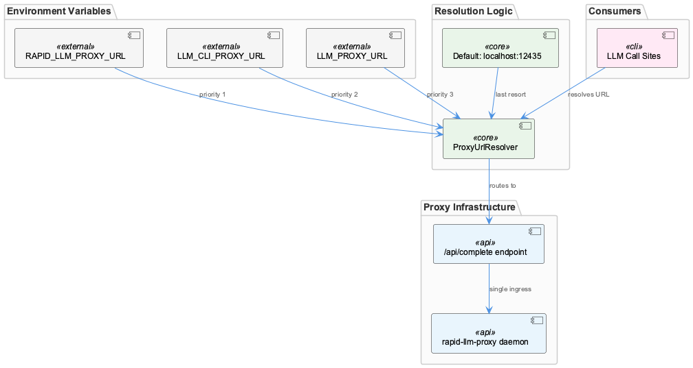
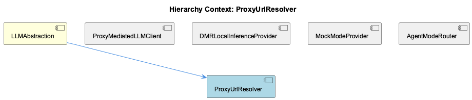

# ProxyUrlResolver

**Type:** SubComponent

Resolves proxy endpoint by checking environment variables RAPID_LLM_PROXY_URL, LLM_CLI_PROXY_URL, and LLM_PROXY_URL in priority order, falling back to localhost:12435 as the default, ensuring compatibility across Docker and host environments

# ProxyUrlResolver — Technical Insight Document

## What It Is

ProxyUrlResolver is a SubComponent of LLMAbstraction responsible for a single, focused task: determining the correct base URL for the rapid-llm-proxy daemon at runtime. It is the entry point for all proxy-bound LLM calls before they reach the `/api/complete` endpoint, and it shields every call site in the system from needing any knowledge of deployment topology.

The resolver operates by inspecting three environment variables in a defined priority order — `RAPID_LLM_PROXY_URL`, `LLM_CLI_PROXY_URL`, and `LLM_PROXY_URL` — before falling back to the hardcoded default of `localhost:12435`. This makes it the canonical authority on "where is the proxy right now?" within LLMAbstraction.

## Architecture and Design

The defining architectural decision in ProxyUrlResolver is the **priority-ordered environment variable chain**. Rather than accepting a single configuration variable, the resolver encodes a compatibility hierarchy directly into its lookup logic. `RAPID_LLM_PROXY_URL` is the primary override, designed explicitly for Docker deployments where the proxy is reachable via a container-internal hostname rather than `localhost`. `LLM_CLI_PROXY_URL` and `LLM_PROXY_URL` follow as legacy fallbacks, preserving backward compatibility with older deployment configurations without requiring those environments to be updated.

This design reflects a deliberate trade-off: the resolver absorbs configuration complexity so that no call site in the broader LLMAbstraction system needs to reason about deployment context. The ProxyMediatedLLMClient, which routes requests through this resolved URL to `/api/complete`, can remain agnostic about whether it's running inside Docker, on a developer's host machine, or in a CI environment. The AgentModeRouter similarly benefits — when it determines that a given agent should use the proxy path (rather than DMRLocalInferenceProvider or MockModeProvider), it can hand off to proxy-bound execution without any URL negotiation.

The fallback default of `localhost:12435` is not arbitrary — it is the canonical local proxy port referenced throughout the parent LLMAbstraction description, making it a system-wide convention rather than a local constant. This port serves as the last-resort value and also acts as an implicit documentation anchor: any developer searching for the proxy port across the codebase will converge on this value.

## Implementation Details

The resolver's logic is straightforward by design: it evaluates `RAPID_LLM_PROXY_URL` first, then `LLM_CLI_PROXY_URL`, then `LLM_PROXY_URL`, returning the first defined value or defaulting to `localhost:12435`. The resolved URL is then used to construct the full proxy endpoint by appending `/api/complete`, which is the single ingress point into the rapid-llm-proxy daemon for centralized token tracking and tier-based routing.

The priority chain encodes an explicit deprecation gradient. `RAPID_LLM_PROXY_URL` is the documented primary variable — its name is specific to the rapid-llm-proxy service, signaling intentional, current-generation configuration. `LLM_PROXY_URL` and `LLM_CLI_PROXY_URL` carry no such specificity, marking them as legacy surfaces that the system continues to honor without promoting. This naming convention communicates to operators which variable they should be setting in new deployments.

The resolver pattern also means that the `llm-with-process.ts` module (ProxyMediatedLLMClient) — which exists specifically to inject a `process` tag into proxy requests to fix telemetry attribution — does not need its own URL resolution logic. It consumes the resolved URL from ProxyUrlResolver, keeping the separation of concerns clean: one component resolves location, another handles request shaping.

## Integration Points

ProxyUrlResolver sits at the base of the proxy execution path within LLMAbstraction. Its primary consumer is ProxyMediatedLLMClient, which uses the resolved URL to direct requests to `/api/complete` on the rapid-llm-proxy daemon. The AgentModeRouter determines *whether* the proxy path is taken at all — but once that routing decision is made, ProxyUrlResolver is the first thing invoked to establish *where* the proxy is.

The resolver's output also implicitly affects telemetry. Because all proxy-routed LLM calls converge on the URL it produces, misconfiguration here would silently redirect traffic away from the rapid-llm-proxy's token-tracking and tier-based routing infrastructure — making ProxyUrlResolver a quiet but critical dependency for observability correctness. The `process` tag injection that ProxyMediatedLLMClient performs only has value if requests actually reach the rapid-llm-proxy, which depends on ProxyUrlResolver producing the correct address.

DMRLocalInferenceProvider and MockModeProvider are unaffected by ProxyUrlResolver — DMR has its own URL construction logic targeting `localhost:${DMR_PORT}/engines/v1`, and mock mode bypasses network calls entirely. ProxyUrlResolver is exclusively in scope for the proxy-mediated path.

## Usage Guidelines

**Environment variable discipline is the primary operational concern.** In Docker deployments, `RAPID_LLM_PROXY_URL` must be set to the container-internal hostname of the rapid-llm-proxy service. Relying on the `localhost:12435` default inside a container will cause requests to target the container's own loopback interface rather than the proxy service, silently failing or misdirecting traffic. `RAPID_LLM_PROXY_URL` is the correct and current variable to set; `LLM_PROXY_URL` and `LLM_CLI_PROXY_URL` should be treated as read-only legacy surfaces in new infrastructure.

**No code changes are needed to reconfigure the proxy address.** The resolver pattern was designed specifically to make environment-level reconfiguration sufficient. If the proxy moves to a different host or port, updating the appropriate environment variable is the complete remediation — no call sites, no redeployment of logic, no configuration files need to change.

**The default port `12435` should be treated as a system constant.** It appears in the LLMAbstraction parent description and in the resolver's fallback, making it the canonical local proxy port for the entire system. If you encounter this port referenced elsewhere in the codebase, it is referring to the same rapid-llm-proxy daemon. Avoid using this port for other services in the same environment to prevent silent conflicts with the fallback default.

## Hierarchy Context

### Parent
- [LLMAbstraction](./LLMAbstraction.md) -- LLMAbstraction is a multi-layered abstraction over LLM providers that enables provider-agnostic model calls through three distinct execution paths: mock mode (for testing), local inference via Docker Model Runner (DMR), and public cloud providers (Anthropic, OpenAI, Groq) routed through a rapid-llm-proxy. The system supports per-agent and global mode switching stored in `.data/workflow-progress.json`, allowing runtime toggling between modes without code changes. Provider selection follows a priority chain from per-agent overrides to global mode to legacy flags.

The architecture centers on a proxy-mediated request pattern where most LLM calls route through a local rapid-llm-proxy daemon (default port 12435) via `/api/complete`, enabling centralized token tracking, tier-based routing, and telemetry attribution. The `llm-with-process.ts` module exists specifically to inject a `process` tag into proxy requests — a gap in the SDK's `LLMService.complete()` that caused all wave-analysis calls to appear as `process='unknown'` in token-usage telemetry. DMR provider uses an OpenAI-compatible API at `localhost:${DMR_PORT}/engines/v1` for fully local inference.

Key patterns include: environment-variable-driven URL resolution with multiple fallback levels, singleton client instances with health-check caching, YAML-based provider configuration with env-var expansion, and SDK-shape response normalization ensuring downstream consumers work unchanged regardless of which provider path was taken.

### Siblings
- [ProxyMediatedLLMClient](./ProxyMediatedLLMClient.md) -- The llm-with-process.ts module exists specifically to inject a process tag into proxy requests, filling a gap in LLMService.complete() that caused wave-analysis calls to appear as process='unknown' in token-usage telemetry
- [DMRLocalInferenceProvider](./DMRLocalInferenceProvider.md) -- DMR provider targets an OpenAI-compatible API at localhost:${DMR_PORT}/engines/v1, allowing reuse of OpenAI SDK request formatting without modification
- [MockModeProvider](./MockModeProvider.md) -- Mock mode is one of three named execution paths in LLMAbstraction, activated via per-agent or global mode flags stored in .data/workflow-progress.json
- [AgentModeRouter](./AgentModeRouter.md) -- Priority chain resolves in order: per-agent override → global mode → legacy flags, meaning a per-agent mock setting overrides a global DMR mode without affecting other agents

---

*Generated from 6 observations*
