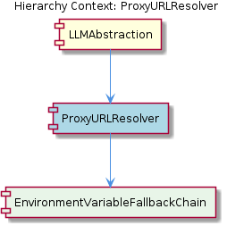
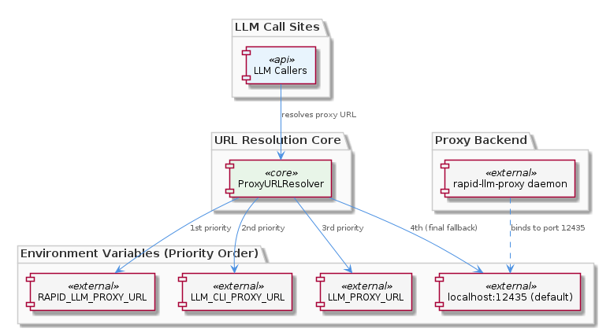

# ProxyURLResolver

**Type:** SubComponent

ProxyURLResolver implements a prioritized fallback chain checking RAPID_LLM_PROXY_URL, then LLM_CLI_PROXY_URL, then LLM_PROXY_URL, and finally defaulting to a port-based localhost address (port 12435) when no environment variable is set

# ProxyURLResolver — Technical Reference

## What It Is

ProxyURLResolver is a SubComponent housed within LLMAbstraction, responsible for one narrowly scoped but critical task: resolving the network address of the rapid-llm-proxy daemon at runtime. Rather than allowing individual LLM call sites to hardcode proxy URLs, the system delegates all address resolution to this single module. It contains one child component, EnvironmentVariableFallbackChain, which implements the ordered lookup logic across environment variables.

The component's reason for existence is rooted in LLMAbstraction's multi-environment design. Because LLMAbstraction must route requests through the rapid-llm-proxy daemon across CI pipelines, local developer machines, Docker environments, and production deployments, no single hardcoded address can serve all contexts. ProxyURLResolver solves this by making the address a runtime decision, not a compile-time constant.

## Architecture and Design

The core architectural pattern is a **prioritized fallback chain** — a ranked sequence of resolution strategies tried in order until one succeeds. EnvironmentVariableFallbackChain implements this as four discrete levels: `RAPID_LLM_PROXY_URL` (highest priority), then `LLM_CLI_PROXY_URL`, then `LLM_PROXY_URL`, and finally a hardcoded localhost default on port 12435.

The design decision to use four levels rather than one canonical variable reflects a deliberate accommodation of deployment heterogeneity. `RAPID_LLM_PROXY_URL` serves contexts where the proxy identity is explicit and unambiguous. `LLM_CLI_PROXY_URL` and `LLM_PROXY_URL` appear to serve legacy or tooling-specific naming conventions, allowing existing configurations to continue working without migration. The localhost default at port 12435 is not a generic fallback — it is tightly coupled to the rapid-llm-proxy daemon's expected default binding, meaning it is only valid when the daemon is running locally. This makes the default meaningful for local development while being intentionally unsuitable for production without explicit override.

The trade-off in this design is clarity versus flexibility. Four environment variable names that can influence the same behavior can create confusion about which one is "canonical." However, the strict priority ordering enforced by EnvironmentVariableFallbackChain means the behavior is deterministic once the environment is understood — higher-priority variables always win.

## Implementation Details

The resolution logic is entirely encapsulated within EnvironmentVariableFallbackChain. The chain checks each variable in sequence and returns the first non-empty value found. If all three environment variables are absent or empty, the resolver emits the hardcoded default `http://localhost:12435` (or equivalent), which directly corresponds to the rapid-llm-proxy daemon's default binding port.

Port 12435 is a meaningful constant within this system — it is the specific port that LLMAbstraction's parent architecture designates for the proxy daemon. This tight coupling between the default and the daemon's actual binding means the default is not arbitrary; it works correctly in any standard local setup without any configuration. However, it also means that if the daemon's default port changes, ProxyURLResolver is the single file that requires updating — by design, as noted in the observations.

No code symbols were identified in the analysis, which suggests the component may be implemented as a small utility module or function rather than a class-heavy structure. The simplicity is intentional: the component's value is in its centralization, not its complexity.

## Integration Points

ProxyURLResolver sits at the boundary between LLMAbstraction's internal routing logic and the external rapid-llm-proxy daemon. Every LLM call routed through the proxy — whether targeting Anthropic, OpenAI, Groq, or the local Docker Model Runner — depends on ProxyURLResolver to supply the correct daemon address. This makes it a universal dependency within LLMAbstraction's call path.

The relationship with LLMAbstraction is one of containment and delegation: LLMAbstraction owns the component and invokes it wherever a proxy URL is needed, but ProxyURLResolver itself has no knowledge of which provider or mode is being targeted. It answers only one question: *where is the proxy?* This separation keeps routing logic (LLMAbstraction's concern) cleanly decoupled from address resolution (ProxyURLResolver's concern).

The environment variables `RAPID_LLM_PROXY_URL`, `LLM_CLI_PROXY_URL`, and `LLM_PROXY_URL` represent the external interface through which deployment infrastructure communicates the proxy location to this component. CI pipelines, Docker Compose configurations, and developer dotfiles are all valid sources for these variables.

## Usage Guidelines

**Setting the proxy address:** Prefer `RAPID_LLM_PROXY_URL` as the canonical variable in new configurations. The lower-priority variables (`LLM_CLI_PROXY_URL`, `LLM_PROXY_URL`) exist for compatibility and should be treated as legacy entry points rather than preferred configuration keys.

**Local development:** No configuration is required if the rapid-llm-proxy daemon is running on its default port (12435) on localhost. The fallback default handles this case automatically. Developers should be aware that any test or call that appears to succeed without configuration is implicitly using this localhost default.

**Changing the daemon port or host:** Because ProxyURLResolver is the single mutation point for proxy address logic, any change to the daemon's binding (port or hostname) should be made here and only here. Call sites throughout LLMAbstraction should never reference proxy addresses directly.

**Environment isolation:** Each deployment context (CI, staging, production, Docker) should set exactly one of the supported environment variables to avoid ambiguity. While the priority order ensures determinism, having multiple variables set in the same environment can mask misconfiguration. Treat the fallback chain as a compatibility mechanism, not a multi-source merging tool.

**Scalability and maintainability:** The component's design scales well for configuration-space growth — adding a new deployment context requires only setting the appropriate environment variable, with no code changes. Maintainability is high precisely because of centralization: there is no risk of URL drift across call sites. The primary maintenance risk is the undocumented relationship between port 12435 and the daemon's default, which should be kept explicitly noted wherever the default value appears in the source.

## Hierarchy Context

### Parent
- [LLMAbstraction](./LLMAbstraction.md) -- LLMAbstraction is a multi-layered abstraction over LLM providers that enables provider-agnostic model calls across public APIs (Anthropic, OpenAI, Groq), a local Docker Model Runner (DMR), and a mock mode for testing. The system routes requests through a rapid-llm-proxy daemon (port 12435) that handles provider selection, tier-based routing, and per-call telemetry attribution. Mode selection is dynamic and per-agent, stored in workflow-progress.json, supporting global and per-agent overrides across three modes: 'mock', 'local' (DMR), and 'public' (cloud APIs).

### Children
- [EnvironmentVariableFallbackChain](./EnvironmentVariableFallbackChain.md) -- Based on the ProxyURLResolver sub-component description, the resolver checks three distinct environment variables in priority order before falling back to a hardcoded default, enabling deployment-specific overrides without code changes.

---

*Generated from 5 observations*
