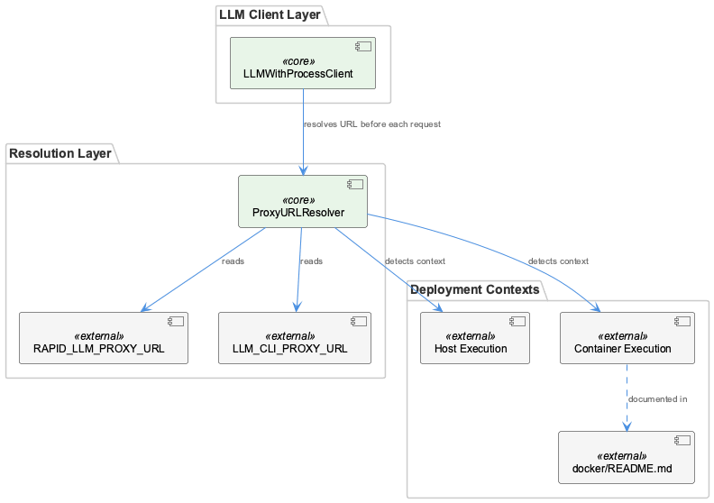
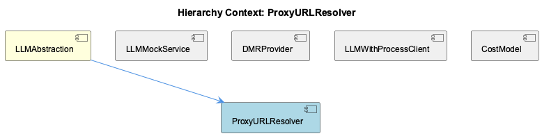

# ProxyURLResolver

**Type:** SubComponent

LLMWithProcessClient calls into ProxyURLResolver before every request rather than caching a single resolved URL, allowing dynamic environment changes to take effect

# ProxyURLResolver — Technical Insight Document

## What It Is

ProxyURLResolver is a SubComponent of LLMAbstraction responsible for determining, at runtime, which proxy endpoint should be used to reach the LLM infrastructure. It operates by reading environment variables — specifically `RAPID_LLM_PROXY_URL` and `LLM_CLI_PROXY_URL` — and using their presence/values to select the correct endpoint for the current execution context. Its core responsibility is context-awareness: distinguishing between host-based execution and containerized (Docker) execution so that the rest of the system never has to hardcode environment-specific URLs like `localhost`.

## Architecture and Design

The defining architectural pattern here is **environment-driven configuration resolution** rather than static or compile-time configuration. Instead of baking a proxy URL into the codebase or a single config file, ProxyURLResolver treats environment variables as the source of truth, which allows the same codebase to run unmodified across host and Dockerized deployments — a deployment concern documented in `docker/README.md`.

A second important design decision is that resolution happens **on-demand rather than once at startup**. LLMWithProcessClient — a sibling component under LLMAbstraction — calls into ProxyURLResolver before every request instead of caching a resolved URL. This is a deliberate trade-off: it sacrifices a small amount of per-request efficiency (an extra resolution step) in exchange for dynamic responsiveness to environment changes, which is valuable in development/debugging scenarios or orchestrated environments where proxy targets may shift without a full process restart.

Within LLMAbstraction, ProxyURLResolver plays a supporting, infrastructure-facing role distinct from its siblings: LLMMockService governs *mode* resolution (mock/local/public), DMRProvider adapts to Docker Model Runner's API surface, and CostModel computes pricing — ProxyURLResolver's concern is purely *where* requests physically go, orthogonal to *how* they're shaped or priced.

## Implementation Details

The resolver's logic centers on inspecting environment variables at call time. `RAPID_LLM_PROXY_URL` and `LLM_CLI_PROXY_URL` act as explicit overrides/signals indicating the intended target proxy; their presence or absence — combined with detection of the execution context (host vs. container) — determines the returned URL. This avoids hardcoded `localhost` references that would silently break once code is moved into a Docker container, where `localhost` no longer refers to the host machine's services.

Because the resolution function is invoked repeatedly (once per request from LLMWithProcessClient) rather than memoized, the implementation implicitly favors simplicity and correctness over micro-optimization — there is no cache invalidation logic to reason about.

## Integration Points

ProxyURLResolver is contained within LLMAbstraction, alongside LLMMockService, DMRProvider, LLMWithProcessClient, and CostModel. Its most direct consumer is **LLMWithProcessClient**, which bypasses higher-level SDK abstractions in favor of a direct `fetch()` call to `/api/complete` on `rapid-llm-proxy` — ProxyURLResolver is precisely what supplies the target URL for that fetch call. This tight coupling means any change to ProxyURLResolver's resolution logic has an immediate, direct effect on how LLMWithProcessClient reaches the proxy.

More broadly, ProxyURLResolver's environment-variable contract is part of the Docker deployment model described in `docker/README.md`, making it a key integration seam between application code and deployment/orchestration configuration.

## Usage Guidelines

Developers should ensure `RAPID_LLM_PROXY_URL` and `LLM_CLI_PROXY_URL` are correctly set for the target execution context (host vs. container) — misconfiguration here is a likely root cause if requests silently fail or connect to the wrong endpoint. Because resolution is not cached, changing these environment variables at runtime (e.g., in orchestrated or multi-environment setups) will take effect on the next request without requiring a restart — a useful property to leverage during debugging or environment migration.

Developers should never reintroduce hardcoded `localhost` URLs into request paths that rely on ProxyURLResolver's logic, as doing so would defeat its purpose and reintroduce the Docker-context fragility it was designed to eliminate. Finally, when tracing unexpected proxy behavior, check both environment variables together with LLMWithProcessClient's call site, since resolution and consumption are tightly coupled but implemented in separate components.

## Hierarchy Context

### Parent
- [LLMAbstraction](./LLMAbstraction.md) -- [LLM] The LLMAbstraction component implements a mode-resolution hierarchy that is critical for understanding how any given agent call is actually dispatched. getLLMMode() in llm-mock-service.ts checks, in strict order: a per-agent override (allowing individual agents to be pinned to mock/local/public independently of global state), then a global mode setting, then a legacy mockLLM boolean flag (retained for backward compatibility with older config schemas), and finally falls back to 'public' as the safe default. This layered precedence means a developer debugging unexpected LLM behavior for a specific agent must check all four levels rather than assuming the global setting applies uniformly—per-agent overrides silently win even if the global mode says otherwise, which is a common source of confusion during multi-agent experiments.

### Siblings
- [LLMMockService](./LLMMockService.md) -- getLLMMode() in llm-mock-service.ts implements a strict precedence chain: per-agent override, then global mode, then legacy mockLLM boolean, then 'public' default
- [DMRProvider](./DMRProvider.md) -- DMRProvider wraps Docker Model Runner's OpenAI-compatible API surface, letting existing OpenAI-style request/response code reuse the same client shape
- [LLMWithProcessClient](./LLMWithProcessClient.md) -- LLMWithProcessClient bypasses higher-level SDK abstractions in favor of a direct fetch() call to /api/complete on rapid-llm-proxy
- [CostModel](./CostModel.md) -- CostModel contains pure functions mapping token counts to €/$ costs based on per-provider pricing tables

---

*Generated from 4 observations*
