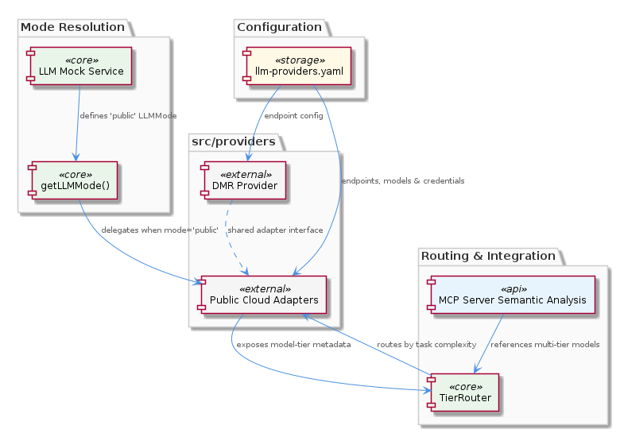
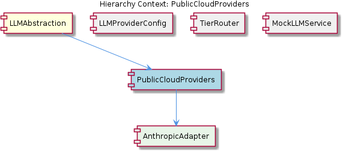

# PublicCloudProviders

**Type:** SubComponent

The LLMMode union type 'public' in src/mock/llm-mock-service.ts maps specifically to these cloud adapters, meaning getLLMMode() returning 'public' causes the runtime to delegate to this sub-component

# PublicCloudProviders — Technical Insight Document

## What It Is

`PublicCloudProviders` is a SubComponent of `LLMAbstraction` that groups together the adapter modules for third-party hosted LLM services. The adapters live in `src/providers/` alongside the `DMR` provider module, following a one-file-per-provider convention within that directory. The most explicitly named child adapter is `AnthropicAdapter`, which sits beside at least two other concrete adapters (OpenAI and Groq are referenced from the parent analysis) — all of which normalize their behavior to a single shared interface.

This sub-component is selected at runtime when the resolved LLM mode equals the string literal `'public'`. The `LLMMode` union type (`'mock' | 'local' | 'public'`) is declared in `src/mock/llm-mock-service.ts`, and the `'public'` member of that union maps directly to this sub-component. Because the four-level resolution chain inside `getLLMMode()` falls back to a hardcoded `'public'` default when no per-agent override, no global mode, and no legacy `mockLLM` boolean are set, `PublicCloudProviders` is effectively the system's *default* execution path.

## Architecture and Design

The architecture is a classic **adapter pattern** layered on top of a **registry-driven configuration model**. Each cloud vendor is encapsulated as a standalone module in `src/providers/`, and each adapter is required to expose a uniform interface so that upstream callers — most notably `TierRouter` — can invoke any provider without branching on vendor identity. Vendor-specific concerns such as authentication headers, request/response schemas, and message shape live entirely behind that interface. As the parent `LLMAbstraction` analysis notes, this means provider-specific quirks contained inside `AnthropicAdapter` (and its siblings) are invisible to callers.

Configuration is intentionally externalized. Endpoints, model catalogs, and credential references are declared in `config/llm-providers.yaml`, which is owned by the sibling `LLMProviderConfig` component. This separation means that adding a new public cloud provider is a two-step act: first register the provider in the YAML registry, then implement the adapter module under `src/providers/`. Hardcoding endpoint URLs or model names inside adapter code would violate this design.

The routing layer sits above the adapters. The sibling `TierRouter` consults the tier strategy described in `integrations/mcp-server-semantic-analysis/docs/TIERED-MODEL-PROPOSAL.md` and dispatches each call to whichever provider/model pair matches the task's complexity. For this to work, every adapter under `PublicCloudProviders` must surface **model-tier metadata** that `TierRouter` can read uniformly — meaning each adapter declares not just *which* models it can call, but *what tier* each model belongs to.

## Implementation Details

The runtime entry point is `getLLMMode()` in `src/mock/llm-mock-service.ts`. When that function returns `'public'`, the LLM abstraction layer delegates request handling to one of the adapter modules grouped under this sub-component. Because `'public'` is also the hardcoded default at the end of the four-level resolution chain (per-agent override → global mode → legacy `mockLLM` boolean → `'public'`), the public cloud path is exercised whenever the system runs in an unconfigured state — making correctness of these adapters a baseline operational requirement, not an optional feature.

Each adapter module reads its configuration from `config/llm-providers.yaml` at initialization. The YAML provides the per-provider endpoint, model list, and credential identifiers; the adapter is responsible for translating an internal request representation into the vendor's wire format and translating the vendor's response back into the shared shape that callers expect. `AnthropicAdapter` is the canonical example of this pattern — it handles the Anthropic-specific message schema and authentication headers internally, exposing only the shared interface outward.

Because adapters coexist with the `DMR` provider in `src/providers/`, the directory does not enforce a `public/` vs `local/` physical separation. The logical distinction between local and public providers is enforced by the `LLMMode` resolution in `getLLMMode()` and by the routing logic in `TierRouter`, not by directory structure. New developers should not assume that "everything in `src/providers/`" is a public cloud adapter — `DMR` lives there too but does not belong to this sub-component.

## Integration Points

`PublicCloudProviders` integrates with three sibling components and one parent:

- **Parent `LLMAbstraction`** invokes this sub-component whenever `getLLMMode()` resolves to `'public'`. The parent owns mode resolution; this sub-component owns the actual remote calls.
- **`LLMProviderConfig`** (sibling) supplies the canonical provider registry via `config/llm-providers.yaml`. Each adapter is a *consumer* of this registry. A provider entry must exist in the YAML before any adapter code can successfully initialize.
- **`TierRouter`** (sibling) is the primary upstream caller. It picks a provider+model based on task complexity using the strategy in `integrations/mcp-server-semantic-analysis/docs/TIERED-MODEL-PROPOSAL.md`. The contract here is bidirectional: adapters expose tier metadata, and `TierRouter` reads it to route.
- **`MockLLMService`** (sibling) is *not* called in `'public'` mode, but it owns the `LLMMode` type definition that determines whether this sub-component is invoked at all. This is a type-level dependency rather than a runtime one.

The single child component, `AnthropicAdapter`, is one of several concrete adapter implementations grouped here. Adding OpenAI, Groq, or any future provider follows the same shape: a module in `src/providers/`, a YAML entry in `config/llm-providers.yaml`, and conformance to the shared adapter interface so `TierRouter` can dispatch to it.

## Usage Guidelines

When working with this sub-component, treat `config/llm-providers.yaml` as the source of truth for endpoint and model information. Do not hardcode URLs, model IDs, or credentials inside adapter modules — these belong in the YAML registry owned by `LLMProviderConfig`. When introducing a new public cloud provider, first add its entry to the YAML, then create a new adapter file in `src/providers/` that conforms to the same interface used by `AnthropicAdapter`.

Always preserve the uniform interface contract. `TierRouter` calls every adapter through the same shape, so any new adapter must (a) accept the same request representation as its siblings and (b) emit responses in the same normalized form. Equally important, each adapter must publish model-tier metadata in the format `TierRouter` expects; without this, tier-based routing cannot select the new provider's models.

Be aware that this sub-component is the **default fallback path**. Because the fourth and final tier of `getLLMMode()` resolution is a hardcoded `'public'`, any environment that fails to set a per-agent override, a global mode, or the legacy `mockLLM` boolean will land here. This makes correctness, error handling, and credential availability for these adapters a baseline concern — failures here surface as failures in the "default" experience, not as failures in an opt-in path.

Finally, when debugging unexpected provider selection, follow the chain in order: confirm `getLLMMode()` is actually returning `'public'` (check per-agent overrides in `llmState.perAgentOverrides[agentId]` and `llmState.globalMode` first), then confirm `TierRouter` is selecting the expected provider per the tier proposal document, and only then dive into adapter-specific behavior. Provider-specific quirks belong inside the adapter; if a bug manifests across multiple providers, it almost certainly lives upstream in `TierRouter` or `LLMAbstraction`, not here.

---

### Summary of Architectural Findings

1. **Architectural patterns identified**: Adapter pattern (per-vendor modules in `src/providers/`), registry-driven configuration (`config/llm-providers.yaml`), strategy-based dispatch (`TierRouter` selecting adapters by tier metadata), and a chain-of-responsibility for mode resolution in the parent `LLMAbstraction`.

2. **Design decisions and trade-offs**: Externalizing provider configuration to YAML decouples deployment from code but introduces a two-step process for onboarding new providers. Using `'public'` as the hardcoded default makes the system "work out of the box" but means misconfiguration silently triggers real (and potentially billable) cloud calls rather than failing loudly. Co-locating `DMR` with public adapters in `src/providers/` simplifies the directory layout but blurs the logical boundary between local and public providers.

3. **System structure insights**: The sub-component is a thin grouping layer — the real work lives in individual adapters like `AnthropicAdapter`, while contracts are enforced by the uniform interface that `TierRouter` consumes. The `LLMMode` type in `src/mock/llm-mock-service.ts` is the type-level switch that activates this entire sub-component.

4. **Scalability considerations**: Horizontal scalability across providers is excellent — adding a new vendor is a localized change (one YAML entry plus one adapter module). The bottleneck is the shared interface: if a new provider needs a capability not expressible in the current contract, the change propagates to every sibling adapter and to `TierRouter`.

5. **Maintainability assessment**: Maintainability is strong because vendor-specific code is fully encapsulated and configuration is externalized. The main maintainability risk is the dispersion of canonical definitions: `LLMMode` lives in a file named `llm-mock-service.ts`, which misleads navigation, and the logical "public vs local" distinction is not reflected in directory structure. New developers benefit from being explicitly told to treat `src/mock/llm-mock-service.ts` as a core types file despite its name.

## Hierarchy Context

### Parent
- [LLMAbstraction](./LLMAbstraction.md) -- [LLM] The LLMAbstraction component implements a strict, four-level priority chain for mode resolution that is critical to understand when debugging unexpected model behavior. Defined canonically in `src/mock/llm-mock-service.ts`, the resolution order is: (1) per-agent override stored in `llmState.perAgentOverrides[agentId]`, (2) global mode stored in `llmState.globalMode`, (3) legacy `mockLLM` boolean fallback for backward compatibility, and (4) a hardcoded default of `'public'`. This means that if a developer sets a global mode to `'local'` but an earlier agent run left a per-agent override in the progress file, that agent will silently continue using the override rather than the global setting. The `getLLMMode()` function is the entry point for this resolution logic and should be consulted first whenever a mode appears to be ignored. New developers should note that the `LLMMode` union type (`'mock' | 'local' | 'public'`) and `LLMState` interface are both defined in the mock service file rather than in a shared types module, which means the canonical type definitions live in a file whose name suggests it is only relevant to mocking — this can cause confusion when navigating the codebase.

### Children
- [AnthropicAdapter](./AnthropicAdapter.md) -- The parent LLMAbstraction analysis identifies AnthropicAdapter as one of at least three concrete public cloud provider adapters (alongside OpenAI and Groq), all normalizing to a shared interface — meaning any provider-specific quirks (auth headers, message schema, response shape) are contained here and invisible to callers

### Siblings
- [LLMProviderConfig](./LLMProviderConfig.md) -- config/llm-providers.yaml serves as the canonical registry of provider definitions, meaning adding a new provider requires an entry here before any adapter code is wired up
- [TierRouter](./TierRouter.md) -- integrations/mcp-server-semantic-analysis/docs/TIERED-MODEL-PROPOSAL.md is the authoritative design document for tier selection strategy, making it the first place to read when understanding why a request lands on a specific model
- [MockLLMService](./MockLLMService.md) -- src/mock/llm-mock-service.ts is the single source of truth for LLMMode ('mock' | 'local' | 'public') and LLMState, despite its filename implying it is only a test utility — new developers should treat it as a core types file

---

*Generated from 6 observations*
