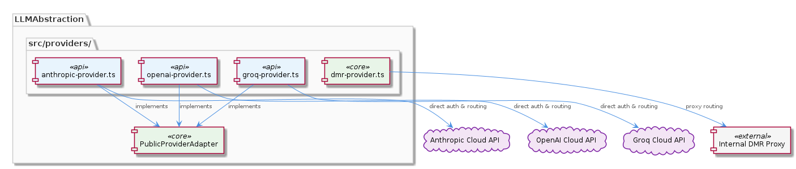
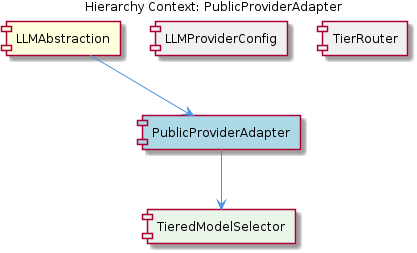

# PublicProviderAdapter

**Type:** SubComponent

The PublicProviderAdapter implementations for Anthropic, OpenAI, and Groq are expected to reside as sibling files to `src/providers/dmr-provider.ts`, following a per-provider file convention (e.g., `src/providers/anthropic-provider.ts`, `src/providers/openai-provider.ts`, `src/providers/groq-provider.ts`) within the LLMAbstraction layer.

## What It Is

PublicProviderAdapter is a sub-component of LLMAbstraction responsible for direct cloud LLM API communication. Implementations reside as per-provider files under `src/providers/` — specifically `src/providers/anthropic-provider.ts`, `src/providers/openai-provider.ts`, and `src/providers/groq-provider.ts`, sibling to `src/providers/dmr-provider.ts`. Each adapter operates in 'public' mode, handling authentication and request routing directly to the respective cloud endpoint without proxying through the DMR layer.

## Architecture and Design

The design follows a per-provider file convention where each cloud LLM vendor gets a dedicated adapter class. This contrasts with `dmr-provider.ts` which handles local Docker Model Runner inference. The separation ensures that 'public' mode instantiation bypasses any internal proxy, connecting directly to Anthropic, OpenAI, or Groq APIs.

PublicProviderAdapter contains TieredModelSelector, meaning each provider adapter doesn't target a single fixed model but resolves which tier (as documented in `integrations/mcp-server-semantic-analysis/docs/TIERED-MODEL-PROPOSAL.md`) to invoke per request. This makes the adapter a composition of routing logic (which model tier) atop transport logic (which API endpoint).

Its sibling TierRouter likely determines *when* public mode is selected, while LLMProviderConfig supplies credentials and endpoint configuration. PublicProviderAdapter consumes both to execute the actual cloud call.

## Implementation Details

Each provider file implements a normalized response interface dictated by the parent LLMAbstraction's mode-agnostic contract. Agents never instantiate these adapters directly — they receive responses through the abstraction layer regardless of whether 'mock', 'local', or 'public' mode is active. The adapter must handle provider-specific authentication (API keys), request serialization, and response normalization internally.

TieredModelSelector as a child component means model selection logic (e.g., choosing Claude Haiku vs Sonnet, or GPT-4o-mini vs GPT-4o) is embedded within the adapter rather than being an external concern.

## Integration Points

- **Parent (LLMAbstraction):** Provides the mode-switching runtime that activates PublicProviderAdapter when `getLLMMode()` returns `'public'`
- **Sibling (LLMProviderConfig):** Supplies API keys, endpoints, rate limits
- **Sibling (TierRouter):** Routes requests to appropriate mode/provider
- **Child (TieredModelSelector):** Resolves which model tier within a given provider to use per request

## Usage Guidelines

Developers should never directly instantiate provider adapters — all access flows through LLMAbstraction's mode system. When adding a new public provider, create a new file following the `src/providers/{vendor}-provider.ts` convention, implement the normalized response interface, and integrate TieredModelSelector for model resolution. Provider-specific concerns (auth, retries, rate limiting) stay encapsulated within the adapter file.

## Hierarchy Context

### Parent
- [LLMAbstraction](./LLMAbstraction.md) -- [LLM] **Three-Tier Mode System and Runtime Switchability**

The `LLMAbstraction` component defines a `LLMMode` type (`'mock' | 'local' | 'public'`) in `integrations/mcp-server-semantic-analysis/src/mock/llm-mock-service.ts` that maps to three fundamentally different execution paths: deterministic mock responses (zero-cost, no network), local Docker Model Runner inference (offline-capable, GPU-optional), and cloud API calls to Anthropic/OpenAI/Groq. These are not environment-level flags but a first-class runtime concept — the mode can be changed mid-session without restarting any process.

This design directly solves a pain point common in LLM-integrated systems: the inability to cheaply validate agent orchestration logic without burning API tokens or requiring network access. By making 'mock' a first-class mode rather than a test-only stub, developers can run full multi-agent workflows during CI, iterate on prompt logic locally, and only graduate to 'public' when cloud validation is needed. The architectural implication is that every agent must be mode-agnostic — none may directly instantiate an LLM client; all must go through the abstraction layer's `getLLMMode()` query and receive a normalized response structure regardless of provider.

### Children
- [TieredModelSelector](./TieredModelSelector.md) -- The project-level document integrations/mcp-server-semantic-analysis/docs/TIERED-MODEL-PROPOSAL.md ('Tiered Model Selection Proposal') explicitly documents a tiered model strategy, indicating the LLMAbstraction layer — and by extension PublicProviderAdapter — must resolve which public provider tier to invoke rather than targeting a single fixed model.

### Siblings
- [LLMProviderConfig](./LLMProviderConfig.md) -- LLMProviderConfig is a sub-component of LLMAbstraction
- [TierRouter](./TierRouter.md) -- TierRouter is a sub-component of LLMAbstraction

---

*Generated from 3 observations*
