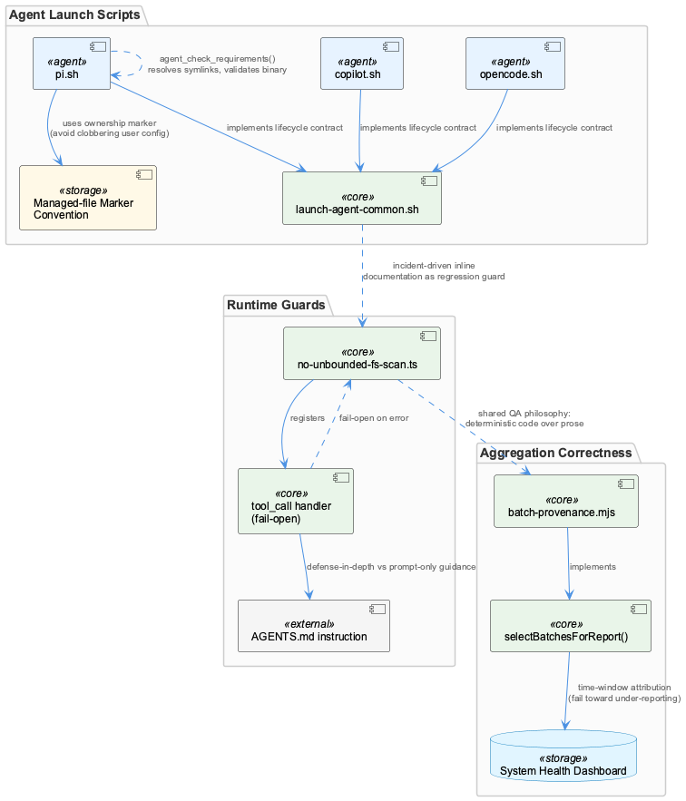
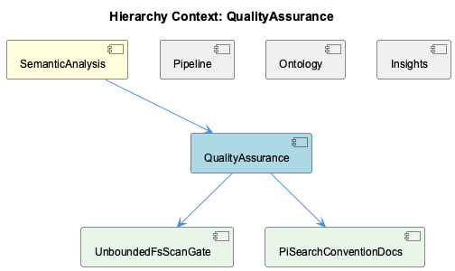

# QualityAssurance

**Type:** SubComponent

# QualityAssurance — Technical Insight Document

## What It Is

QualityAssurance, as a SubComponent under the parent SemanticAnalysis component, is not a single centralized module but a distributed philosophy of validation enforced across several concrete artifacts: `config/agents/pi-extensions/no-unbounded-fs-scan.ts`, `integrations/system-health-dashboard/batch-provenance.mjs`, and the family of agent launch scripts `config/agents/copilot.sh`, `config/agents/opencode.sh`, and `config/agents/pi.sh`. Its two named children, UnboundedFsScanGate and PiSearchConventionDocs, represent the clearest, most self-contained instance of this philosophy: a deterministic runtime gate paired with a redundant prose-level instruction, both aimed at preventing unbounded filesystem scans. Rather than living as a separate QA layer bolted onto the pipeline, quality assurance here is embedded directly at the point of risk — inside tool-call hooks, inside batch-attribution logic, and inside shell pre-flight checks.

## Architecture and Design

The dominant architectural pattern is the deterministic runtime guard: rather than trusting a prompt-level instruction to shape model behavior, `no-unbounded-fs-scan.ts` implements `offendingRoot()`, `findRoots()`, and `unboundedRoots()` as code that inspects shell command strings for `find` invocations rooted at whole-machine paths. The design rationale, recorded directly in the file's comments, is explicit: a prompt-level instruction competes with the model's own reasoning exactly when the model is improvising — and loses. This is why the child UnboundedFsScanGate exists as enforcement, while PiSearchConventionDocs captures the complementary prose layer written into `APPEND_SYSTEM.md` by `pi.sh`'s `_pi_write_append_system()` — a cost optimization intended to help the model avoid triggering the gate in the first place, since "a blocked call costs a round trip; a model that never tries costs nothing."

A second major design decision is the differentiated treatment of failure modes. The `tool_call` handler in `no-unbounded-fs-scan.ts` wraps its logic in a try/catch that fails open, explicitly prioritizing availability: the worst case of under-enforcement is a slow command, whereas the worst case of throwing is an agent that cannot run anything. This stands in deliberate contrast to the parent SemanticAnalysis component's hierarchy-roots validation strategy, which is treated as a required, fail-closed checkpoint against silent ontology corruption. QualityAssurance therefore encodes a general architectural principle: fail-open for latency/availability guards, fail-closed for data-integrity checkpoints — a distinction applied consciously per-guard rather than as a blanket rule.

## Implementation Details

`offendingRoot()` parses shell command strings by splitting on operators (`||`, `&&`, `;`, `|`, `$(`, backticks) and inspecting each resulting segment for a `find` call rooted in an unbounded path. `findRoots()` is careful to stop consuming argv tokens at the first `-`-prefixed predicate, preventing a flag's value from being misinterpreted as a search root — a subtle correctness detail that matters because shell parsing is inherently ambiguous.

In `batch-provenance.mjs`, `selectBatchesForReport()` replaces a fragile substring match (`workflowName.includes('batch')`) with a `[startTime, endTime]` window comparison against `completedAt` via the `toEpoch()` helper, plus optional team/checkpointTeam matching. The function is explicitly written to fail toward under-reporting rather than over-crediting, mirroring the parent's emphasis on rejecting rather than silently misattributing data — here applied to dashboard/report attribution instead of ontology classification.

The agent scripts each implement `agent_check_requirements()` with rigor scaled to risk. `copilot.sh` and `opencode.sh` merely check `command -v`, while `pi.sh` resolves symlinks via an inline Python `os.path.realpath`, checks for `@earendil-works/pi-coding-agent` in the resolved path, and falls back to grepping the `--help` banner — because `pi` is "the most collision-prone" binary name among the agents. `pi.sh` also implements a managed-file convention via `_PI_EXTENSION_MARKER` and `_PI_APPEND_MARKER`, checked in `_pi_install_extensions()` and `_pi_write_append_system()` before overwriting config, plus a `cmp -s` check before `cp` to avoid spurious mtime changes that would invalidate pi's path-based extension cache.

## Integration Points

QualityAssurance sits beneath SemanticAnalysis, and its fail-open/fail-closed distinction is explicitly framed in contrast to the parent's hierarchy-roots validation approach. Among siblings — Pipeline, Ontology, and Insights — QualityAssurance doesn't directly integrate but shares the broader semantic-analysis ecosystem's concern for correctness under noisy inputs (echoing Pipeline's staged `kg_operators` sub-steps and Ontology's classification concerns). Its children, UnboundedFsScanGate and PiSearchConventionDocs, integrate as two independent enforcement layers targeting the same policy — one in code, one in the system prompt — demonstrating defense-in-depth within a single concern. The agent launch scripts share a common lifecycle contract (`agent_check_requirements`, `agent_pre_launch`, `agent_cleanup`) sourced from `launch-agent-common.sh`, though each script implements its own validation depth rather than inheriting from a shared validator.

## Usage Guidelines

Developers extending this area should treat fail-open vs. fail-closed as a conscious per-guard decision, not a default: safety/latency guards like the fs-scan gate should fail open, while data-integrity logic like `batch-provenance.mjs`'s attribution should fail closed or under-report. When adding new `find`/shell-parsing guards, follow `findRoots()`'s pattern of halting at `-`-prefixed tokens to avoid misparsing flags as paths. New agent scripts should implement `agent_check_requirements()` proportional to binary-name collision risk, following `pi.sh`'s symlink-resolution and banner-grep approach where ambiguity is likely. Any config-mutating code should respect the marker-based ownership convention (`_PI_EXTENSION_MARKER`, `_PI_APPEND_MARKER`) rather than assuming directory scoping is sufficient, and should avoid unnecessary file rewrites when caching is path-sensitive. Finally, this codebase strongly favors incident-driven inline documentation (WR-02/WR-05/D-03, D-07, the 2026-09-02 incident writeup) over external docs — new QA logic should carry its rationale and incident history directly in code comments to prevent regression.

## Hierarchy Context

### Parent
- [SemanticAnalysis](./SemanticAnalysis.md) -- [LLM] The SemanticAnalysis component is organized around a batch-analysis workflow that ingests two distinct data sources — git commit history and LSL (Live Session Log) session transcripts — and normalizes them into a common representation before extraction. This dual-source design means the pipeline must handle very different input shapes (structured commit metadata + diffs vs. freeform conversational/session logs) through a shared downstream agent chain, which implies an early normalization or adapter layer feeds into semantic-analysis-agent.ts. New developers should look for the ingestion/adapter code that converts these two source types into whatever intermediate format the agents expect, since bugs in either adapter would silently corrupt entity extraction for only one data source.

### Children
- [UnboundedFsScanGate](./UnboundedFsScanGate.md) -- offendingRoot() in config/agents/pi-extensions/no-unbounded-fs-scan.ts splits a shell command on operators (||, &&, ;, |, $(, backtick) and checks each segment for a `find` invocation rooted in unboundedRoots() (/, /Users, /home, $HOME, etc.)
- [PiSearchConventionDocs](./PiSearchConventionDocs.md) -- [LLM] The `no-unbounded-fs-scan.ts` extension and `pi.sh`'s `_pi_write_append_system()` implement the same search-boundary convention through two independent enforcement layers rather than one. `offendingRoot()` (in the extension) is the deterministic runtime gate that blocks a `find` call rooted at `/`, `/Users`, `$HOME`, etc., while `_pi_write_append_system()` writes an `APPEND_SYSTEM.md` heredoc into `$cfg_dir` stating the same rule in prose ('Never search from `/`, `~`, `/Users`...'). The code comment in `_pi_write_append_system()` explicitly frames this redundancy as intentional: the prose layer exists 'to stop the model SPENDING a tool call to discover the gate' — i.e., the extension is the enforcement backstop and the system-prompt text is a cost optimization that tries to make the backstop unnecessary in the common case, since 'a blocked call costs a round trip; a model that never tries costs nothing.'

### Siblings
- [Pipeline](./Pipeline.md) -- multi-agent-graph.tsx defines AGENT_SUBSTEPS['kg_operators'] with sub-steps conv/aggr/embed/dedup/pred/merge, each tagged with an llmUsage tier (none/fast/standard/premium) indicating which pipeline steps invoke an LLM
- [Ontology](./Ontology.md) -- [CGR] ontology (variable) in knowledge-management.json
- [Insights](./Insights.md) -- [CGR] INSIGHTS (class) in kb-ab-sample-tasks.mjs

---

*Generated from 9 observations*
