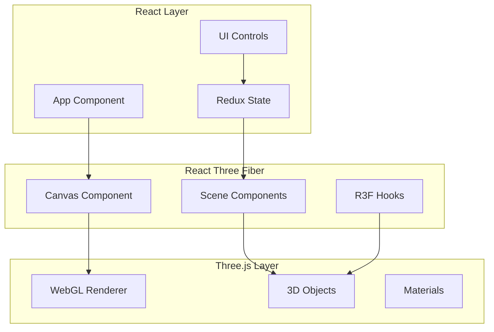

# React Three Fiber Integration Pattern

## Table of Contents

- [Overview](#overview)
- [Architecture](#architecture)
- [Implementation](#implementation)
  - [Basic Setup](#basic-setup)
  - [Component-Based 3D Objects](#component-based-3d-objects)
  - [Custom Hooks for 3D Logic](#custom-hooks-for-3d-logic)
  - [State Integration](#state-integration)
- [Key Patterns](#key-patterns)
- [Benefits](#benefits)
- [Common Pitfalls](#common-pitfalls)
- [Advanced Techniques](#advanced-techniques)
- [References](#references)
- [Related Patterns](#related-patterns)

## Overview

**Problem:** Integrating Three.js with React requires imperative code that conflicts with React's declarative paradigm. Managing 3D object lifecycles, event handling, and state synchronization becomes complex.

**Solution:** Use React Three Fiber (R3F) to write Three.js scenes declaratively with React components, hooks, and props.

**Significance:** 8/10 - Essential pattern for React-based 3D applications

## Architecture



## Implementation

### Basic Setup

```typescript
// src/components/three/TimelineScene.tsx
import { Canvas } from '@react-three/fiber';
import { OrbitControls, PerspectiveCamera } from '@react-three/drei';

export function TimelineScene({ events }) {
  return (
    <Canvas
      camera={{ position: [0, 50, 100], fov: 45 }}
      gl={{ antialias: true, alpha: true }}
      onCreated={({ gl }) => {
        gl.shadowMap.enabled = true;
        gl.shadowMap.type = THREE.PCFSoftShadowMap;
      }}
    >
      <color attach="background" args={['#0a0a0a']} />
      <fog attach="fog" args={['#0a0a0a', 100, 1000]} />
      
      <ambientLight intensity={0.5} />
      <directionalLight position={[10, 10, 5]} intensity={1} />
      
      <TimelineContent events={events} />
      <OrbitControls enableDamping dampingFactor={0.05} />
    </Canvas>
  );
}
```

### Component-Based 3D Objects

```typescript
// src/components/three/TimelineCard.tsx
import { useRef, useState } from 'react';
import { useFrame, useThree } from '@react-three/fiber';
import { animated, useSpring } from '@react-spring/three';

export function TimelineCard({ event, position }) {
  const meshRef = useRef();
  const [hovered, setHovered] = useState(false);
  const [clicked, setClicked] = useState(false);
  
  const { camera } = useThree();
  
  // Declarative animations
  const { scale, color } = useSpring({
    scale: clicked ? 1.5 : hovered ? 1.2 : 1,
    color: hovered ? '#ff6b6b' : '#4099ff',
  });
  
  // Frame-based updates
  useFrame((state, delta) => {
    if (meshRef.current && hovered) {
      meshRef.current.rotation.y += delta * 0.5;
    }
  });
  
  return (
    <animated.mesh
      ref={meshRef}
      position={position}
      scale={scale}
      onClick={(e) => {
        e.stopPropagation();
        setClicked(!clicked);
      }}
      onPointerOver={(e) => {
        e.stopPropagation();
        setHovered(true);
      }}
      onPointerOut={() => setHovered(false)}
    >
      <boxGeometry args={[2, 3, 0.5]} />
      <animated.meshStandardMaterial color={color} />
    </animated.mesh>
  );
}
```

### Custom Hooks for 3D Logic

```typescript
// src/hooks/useTimelineCamera.ts
import { useThree, useFrame } from '@react-three/fiber';
import { useRef } from 'react';
import * as THREE from 'three';

export function useTimelineCamera(targetPosition: THREE.Vector3) {
  const { camera } = useThree();
  const targetRef = useRef(targetPosition);
  
  useFrame((state, delta) => {
    // Smooth camera movement
    camera.position.lerp(targetRef.current, delta * 2);
    camera.lookAt(0, 0, targetRef.current.z);
    camera.updateProjectionMatrix();
  });
  
  return {
    setTarget: (newTarget: THREE.Vector3) => {
      targetRef.current = newTarget;
    },
  };
}
```

### State Integration

```typescript
// src/components/three/TimelineVisualization.tsx
import { useAppSelector, useAppDispatch } from '../../store';
import { Canvas } from '@react-three/fiber';
import { EffectComposer, Bloom } from '@react-three/postprocessing';

export function TimelineVisualization() {
  const events = useAppSelector(state => state.timeline.events);
  const cameraState = useAppSelector(state => state.ui.cameraState);
  const dispatch = useAppDispatch();
  
  return (
    <Canvas>
      <TimelineCamera state={cameraState} />
      <TimelineEvents events={events} />
      
      <EffectComposer>
        <Bloom luminanceThreshold={0.8} luminanceSmoothing={0.9} />
      </EffectComposer>
    </Canvas>
  );
}
```

## Key Patterns

### 1. Ref Management
```typescript
// Direct Three.js object access when needed
const meshRef = useRef<THREE.Mesh>();

useEffect(() => {
  if (meshRef.current) {
    // Direct Three.js API access
    meshRef.current.geometry.computeBoundingBox();
  }
}, []);
```

### 2. Event Handling
```typescript
// R3F provides React-style event handlers
<mesh
  onClick={(e) => {
    e.stopPropagation(); // Prevent event bubbling
    handleClick(e.object);
  }}
  onPointerMove={(e) => {
    // Includes intersection data
    console.log(e.point, e.face, e.distance);
  }}
/>
```

### 3. Performance Optimization
```typescript
// Instanced rendering for many objects
<instancedMesh ref={ref} args={[null, null, events.length]}>
  <boxGeometry />
  <meshStandardMaterial />
</instancedMesh>
```

## Benefits

1. **Declarative 3D**: Write Three.js like React components
2. **Automatic Lifecycle**: R3F handles mounting/unmounting
3. **React Ecosystem**: Use hooks, context, suspense
4. **Event System**: Built-in raycasting and event handling
5. **Performance**: Automatic disposal and optimization

## Common Pitfalls

1. **State in useFrame**: Causes stale closures
   ```typescript
   // ❌ Bad
   useFrame(() => {
     mesh.position.x = state.x; // Stale state
   });
   
   // ✅ Good
   const stateRef = useRef(state);
   useEffect(() => { stateRef.current = state; }, [state]);
   ```

2. **Creating objects in render**: Causes memory leaks
   ```typescript
   // ❌ Bad
   <mesh geometry={new THREE.BoxGeometry()} />
   
   // ✅ Good
   <mesh>
     <boxGeometry />
   </mesh>
   ```

## Advanced Techniques

### Portal Rendering
```typescript
import { createPortal } from '@react-three/fiber';

function RenderToTexture({ children }) {
  const target = useFBO(1024, 1024);
  const scene = useRef();
  
  useFrame((state) => {
    state.gl.setRenderTarget(target);
    state.gl.render(scene.current, state.camera);
    state.gl.setRenderTarget(null);
  });
  
  return createPortal(
    <scene ref={scene}>{children}</scene>,
    scene.current
  );
}
```

### Custom Materials
```typescript
import { shaderMaterial } from '@react-three/drei';
import { extend } from '@react-three/fiber';

const TimelineMaterial = shaderMaterial(
  { time: 0, color: new THREE.Color(0x0099ff) },
  vertexShader,
  fragmentShader
);

extend({ TimelineMaterial });

// Use in JSX
<mesh>
  <timelineMaterial time={clock.elapsedTime} />
</mesh>
```

## References

- [React Three Fiber Documentation](https://docs.pmnd.rs/react-three-fiber)
- [Three.js Fundamentals](https://threejs.org/manual/)
- [R3F Examples](https://github.com/pmndrs/react-three-fiber/tree/master/examples)

## Related Patterns

- [Three.js React State Coordination Pattern](./ThreeJSReactStateCoordinationPattern.md)
- [Three.js Camera Control Pattern](./ThreeJSCameraControlPattern.md)
- [Component Orchestration Pattern](./ComponentOrchestrationPattern.md)