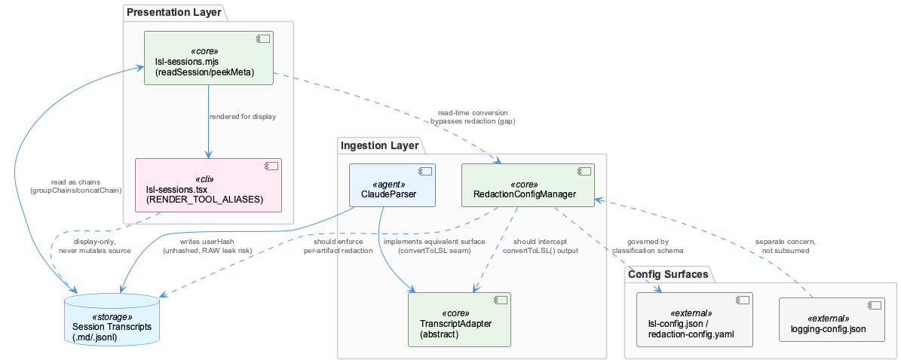
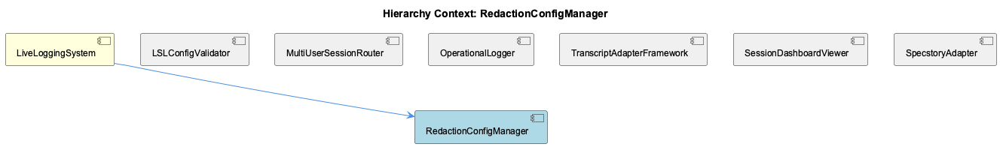

# RedactionConfigManager

**Type:** SubComponent

[Architecture Notes] TranscriptAdapter enforces a strict abstract-class contract (throws on direct instantiation and on unimplemented abstract methods) — a fail-closed extension pattern echoing LSLConfigValidator's fail-closed schema validation described in the parent context; ClaudeParser's userHash assignment (`process.env.USER || 'unknown'`) appears to bypass the SHA-256 hashing convention used elsewhere in LSL user-identification, a potential inconsistency between this ingestion path and the redaction/pseudonymization guarantees claimed for the system as a whole; lsl-sessions.mjs deliberately decouples session identity (chain key) from filesystem layout (individual files/parts), trading some read-time CPU (re-parsing/re-converting on each request) for a single unified rendering code path across mixed pi/markdown corpora; No RedactionConfigManager-specific source was present in the supplied code excerpts; observations here are inferred from adjacent ingestion (claude-parser.js, transcript-api.js) and presentation (lsl-sessions.mjs/tsx) code that would sit upstream/downstream of such a component

# RedactionConfigManager — Technical Insight Document

## What It Is

RedactionConfigManager is a SubComponent of LiveLoggingSystem, and importantly, no source file implementing it directly appears in the current codebase excerpts examined. Its presence is inferred entirely from adjacent ingestion and presentation code that would logically sit upstream or downstream of such a component: `lib/agent-api/transcripts/claude-parser.js`, `lib/agent-api/transcript-api.js`, `integrations/system-health-dashboard/lsl-sessions.mjs`, and `integrations/system-health-dashboard/src/pages/lsl-sessions.tsx`. Per the parent LiveLoggingSystem context, redaction/classification policy is governed by `.specstory/config/redaction-config.yaml`, validated through the sibling `LSLConfigValidator` class in `scripts/validate-lsl-config.js`. RedactionConfigManager is thus best understood, given current evidence, as the runtime counterpart to that validated schema — the component responsible for applying classification rules at the point data enters or is presented by the system, though its actual enforcement point is not yet visible in the observed code.

## Architecture and Design

The surrounding architecture establishes a clear separation between "how the logger behaves" and "what the logger is allowed to record," per the parent LiveLoggingSystem's config-schema split (`lsl-config.json` vs. `redaction-config.yaml`). RedactionConfigManager conceptually belongs to the latter concern. The natural integration seam is `TranscriptAdapter`, the abstract base in `transcript-api.js` that enforces a fail-closed contract: its constructor throws when `new.target === TranscriptAdapter`, and it mandates five abstract methods (`getAgentType()`, `getTranscriptDirectory()`, `readTranscripts()`, `convertToLSL()`, `getCurrentSession()`). This fail-closed extension pattern echoes `LSLConfigValidator`'s own fail-closed schema validation, suggesting a system-wide convention of rejecting incomplete implementations rather than degrading gracefully.

`convertToLSL()` is the specific method most likely to be the interception point for a RedactionConfigManager, since it's the seam through which any adapter's raw entries must pass before being considered LSL-compliant. Notably, `ClaudeParser` (in `claude-parser.js`) implements an equivalent surface — `getTranscriptDirectory`, `parseFile`, `parseMultiple` — without explicitly extending `TranscriptAdapter` in the shown excerpt, which is architecturally significant: if redaction enforcement is meant to be guaranteed by the abstract contract, an adapter that duck-types the interface rather than inheriting it could bypass that guarantee entirely.

## Implementation Details

The clearest concrete evidence bearing on RedactionConfigManager's domain is a likely gap: `claude-parser.js`'s `parseFile()` sets `userHash: process.env.USER || 'unknown'` — the raw, unhashed OS username — directly contradicting the pseudonymization pattern described for LSL's `validateUserEnvironment()` (hash+truncate to 6 characters). If this metadata is persisted or surfaced without passing back through a redaction/hashing step, it constitutes a plaintext-username leak in exactly the session transcript metadata the classification schema exists to guard.

A second implementation detail relevant to redaction scope is `lsl-sessions.mjs`'s session model: sessions are chains of files (`groupChains`, `concatChain`, `parseChain` from `LslMarkdownParser.js`), not single files, because legacy `-N_` markdown parts are headerless mid-token fragments, and pi-format parts link via `parentSession`. `readSession()` re-converts these chains through the same parser/writer used by backfill at read time — meaning any redaction applied at write-time to original `.md`/`.jsonl` files is NOT re-applied during this read-time conversion, a potential enforcement gap if redaction must be guaranteed per-artifact rather than assumed from the pipeline.

Separately, `peekMeta()` performs a cheap string pre-filter (`line.indexOf('"custom"') === -1`) before attempting `JSON.parse`, deliberately scoped to keep listing ~20k files proportional to bytes scanned. This is explicitly a metadata-listing heuristic (agent name, prompt-set count) — it does not parse or inspect message content, so it cannot serve as a redaction/classification checkpoint despite superficially resembling one.

## Integration Points

RedactionConfigManager's most direct sibling relationship is with `LSLConfigValidator`, which validates the `redaction-config.yaml` schema that RedactionConfigManager presumably consumes at runtime. It is also distinct from, and should not be confused with, `config/logging-config.json`, which governs operational log-level verbosity per category (health, billing, transcript, knowledge, workflow, database, api, mcp) and is enforced separately via `integrations/constraint-monitor/constraints.yaml` for `no-console-log`/`no-console-error`/`no-console-warn` rules. The project thus maintains at least two independently-validated configuration systems, and RedactionConfigManager belongs only to the recording/classification one.

On the ingest side, `TranscriptAdapterFramework` (via `TranscriptAdapter` and concrete adapters like `ClaudeParser`) is the natural upstream dependency — `convertToLSL()` is where redaction would need to be applied before data is considered LSL-compliant. On the presentation side, `SessionDashboardViewer`'s `lsl-sessions.tsx` demonstrates the opposite boundary: `RENDER_TOOL_ALIASES` and `aliasToolNames()` rewrite tool names for display only, explicitly "leaving the source data untouched." This reinforces that redaction enforcement belongs at the write/ingest boundary, not the render layer.

## Usage Guidelines

Given the fail-closed conventions established by both `TranscriptAdapter` and `LSLConfigValidator`, any RedactionConfigManager implementation should adopt the same posture — rejecting or refusing to emit data rather than silently passing through unredacted content. Developers extending `TranscriptAdapterFramework` with new adapters should ensure they genuinely subclass `TranscriptAdapter` rather than duck-typing its interface, so that any future redaction hook attached to `convertToLSL()` cannot be bypassed, as ClaudeParser's current structure risks.

The `userHash` inconsistency in `claude-parser.js` should be treated as a priority verification item: confirm whether RedactionConfigManager rules apply downstream of this adapter, or whether the raw `process.env.USER` value is leaking into persisted transcript metadata. Additionally, because `lsl-sessions.mjs`'s `readSession()` re-converts markdown chains at read time rather than reusing pre-redacted output, any redaction guarantee should be verified against this read-time path specifically, not assumed from write-time processing alone. Finally, `peekMeta()`'s string pre-filter should never be treated as a redaction or classification checkpoint — it is a throughput optimization for file listing only, with no content inspection.

## Hierarchy Context

### Parent
- [LiveLoggingSystem](./LiveLoggingSystem.md) -- [LLM] The LiveLoggingSystem's configuration validation is centralized in scripts/validate-lsl-config.js through the LSLConfigValidator class, which acts as a schema enforcement gatekeeper for two distinct config artifacts: .specstory/config/lsl-config.json (structural/behavioral settings) and .specstory/config/redaction-config.yaml (privacy/classification rules). This separation reflects a deliberate architectural decision to decouple 'how the logger behaves' from 'what the logger is allowed to record', allowing redaction policy to be iterated on independently from file-management or session-windowing logic. The initializeSchemas() method enumerates five required top-level sections (version, multiUser, fileManager, operationalLogger, classification), meaning any config missing even one of these fails validation outright—this is a strict fail-closed design rather than a permissive fail-open one, which is notable for a system handling potentially sensitive session transcripts.

### Siblings
- [LSLConfigValidator](./LSLConfigValidator.md) -- [CGR] LSLConfigValidator (class) in validate-lsl-config.js
- [MultiUserSessionRouter](./MultiUserSessionRouter.md) -- [LLM] [object Object]
- [OperationalLogger](./OperationalLogger.md) -- [CGR] OperationalLogger (class) in OperationalLogger.js
- [TranscriptAdapterFramework](./TranscriptAdapterFramework.md) -- [LLM] [object Object]
- [SessionDashboardViewer](./SessionDashboardViewer.md) -- [LLM] [object Object]
- [SpecstoryAdapter](./SpecstoryAdapter.md) -- [CGR] SpecstoryAdapter (class) in specstory-adapter.js

---

*Generated from 9 observations*
