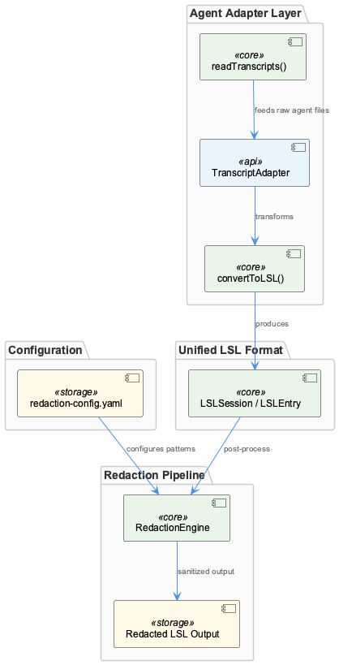
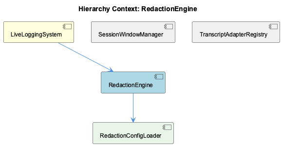

# RedactionEngine

**Type:** SubComponent

Because the TranscriptAdapter pipeline in `lib/agent-api/transcript-api.js` requires `convertToLSL()` to produce unified LSLSession/LSLEntry objects before persistence, redaction must occur either at the end of `convertToLSL()` or as a post-processing step on the LSL output, making it a cross-cutting concern over the unified format rather than agent-specific raw data

## What It Is

RedactionEngine is a SubComponent of LiveLoggingSystem responsible for sanitizing sensitive data from transcript content before persistence. Its configuration lives at `.specstory/config/redaction-config.yaml`, a project-local file that serves as the authoritative pattern registry defining what constitutes sensitive data. RedactionEngine owns a child component, RedactionConfigLoader, which is responsible for reading and surfacing those patterns to the engine at runtime. No source code symbols were directly observed, but the surrounding pipeline and configuration topology make its role and placement unambiguous.

## Architecture and Design

RedactionEngine is deliberately positioned as a **downstream, post-conversion pipeline stage** within LiveLoggingSystem rather than as logic embedded inside any individual agent adapter. This is its central architectural decision.

The TranscriptAdapter contract defined in `lib/agent-api/transcript-api.js` requires all agent adapters to implement `convertToLSL()`, which transforms agent-native transcript formats into unified `LSLSession`/`LSLEntry` objects before anything downstream — including persistence — acts on the data. Because all agent types converge on this single, normalized format, RedactionEngine can apply one redaction pass over LSL-structured content and achieve uniform coverage regardless of which TranscriptAdapter subclass produced it. The alternative — redacting inside each adapter against raw, agent-native data — would require duplicating or specializing redaction logic across every adapter implementation, a maintenance burden that grows linearly with the number of supported agents. The current design avoids this entirely.

This makes RedactionEngine a **cross-cutting concern over the unified LSL format**, not over any agent-specific representation. It sits after `convertToLSL()` in the pipeline and before persistence, functioning as a mandatory sanitization gate. Its sibling components — SessionWindowManager and TranscriptAdapterRegistry — operate at the adapter/ingestion layer and are unaffected by redaction logic. SessionWindowManager handles `timeWindow` bucketing (e.g., `'0800-0900'`) at ingestion time, while TranscriptAdapterRegistry manages adapter discovery and dispatch. Neither interacts with RedactionEngine directly; the separation of concerns is clean.

## Implementation Details

The configuration backbone is `.specstory/config/redaction-config.yaml`. Scoping this file under `.specstory/config/` rather than in shared pipeline code (`lib/`) is a deliberate design decision: it makes the pattern registry **project-local**, allowing each repository to define its own sensitive-data patterns — API keys, tokens, proprietary identifiers — without touching the shared `lib/agent-api/` pipeline code. This is the mechanism by which RedactionEngine achieves per-repository customization without coupling configuration to implementation.

RedactionConfigLoader, as RedactionEngine's sole child component, is responsible for loading and parsing this YAML file, making the pattern definitions available to the engine. The separation of config loading into a discrete subcomponent follows a clean single-responsibility split: RedactionConfigLoader owns the I/O and parsing concern, while RedactionEngine owns the application of those patterns against LSL content.

The redaction pass itself operates on the output of `convertToLSL()` — meaning it works against `LSLSession` and `LSLEntry` objects as defined by the unified format. The `readTranscripts()` method in `lib/agent-api/transcript-api.js` reads raw agent-native files, and `convertToLSL()` transforms them; RedactionEngine never touches the raw pre-conversion data. This ordering is significant: redaction benefits from the structured, normalized shape of LSL objects rather than having to parse heterogeneous raw formats.

## Integration Points

RedactionEngine's primary upstream dependency is the output of `convertToLSL()` in `lib/agent-api/transcript-api.js`. Any TranscriptAdapter subclass registered via TranscriptAdapterRegistry — whether for Claude, Copilot, or a future Cursor or Gemini CLI adapter — feeds into this same pipeline, and therefore all adapter output passes through RedactionEngine before reaching persistent storage. This is a strong integration guarantee: new agent adapters automatically inherit redaction coverage by virtue of satisfying the adapter interface contract documented in `docs/architecture/agent-abstraction-api.md`.

RedactionConfigLoader is RedactionEngine's only child dependency, and `.specstory/config/redaction-config.yaml` is that loader's sole external input. The engine has no observed direct coupling to SessionWindowManager or TranscriptAdapterRegistry.

## Usage Guidelines

**Configuration is the primary extension point.** Developers adding new sensitive-data patterns should modify `.specstory/config/redaction-config.yaml` rather than touching any code in `lib/`. The project-local scoping of this file means changes are repository-contained and do not affect shared pipeline infrastructure.

**Never introduce redaction logic inside a TranscriptAdapter subclass.** The architectural intent is that adapter implementations remain agent-specific and format-conversion-focused; they should not carry sanitization responsibilities. Redaction belongs in the downstream RedactionEngine stage, after `convertToLSL()` has produced normalized LSL output.

**Redaction operates on LSL-structured data, not raw transcripts.** Any debugging or extension work should assume `LSLSession`/`LSLEntry` objects as the input domain — the engine never sees agent-native raw formats. When validating that a new pattern defined in `redaction-config.yaml` fires correctly, test it against LSL-structured content, not raw source files.

**Adding a new agent type does not require redaction changes.** Because RedactionEngine operates downstream of the adapter layer and against the unified LSL format, onboarding a new agent (implementing the five-method adapter contract) automatically brings its output under the existing redaction regime. The architecture's cross-cutting design makes this a zero-touch concern for adapter authors.

## Hierarchy Context

### Parent
- [LiveLoggingSystem](./LiveLoggingSystem.md) -- [LLM] The TranscriptAdapter abstract class in `lib/agent-api/transcript-api.js` enforces a strict interface contract that all agent-specific adapters must satisfy. Subclasses must implement five methods: `getAgentType()` (returns a string identifier like 'claude' or 'copilot'), `getTranscriptDirectory()` (returns the filesystem path where native transcripts are stored), `readTranscripts()` (reads raw agent-native files), `convertToLSL()` (transforms them into the unified LSLSession/LSLEntry format), and `getCurrentSession()` (returns the active session for live ingestion). This adapter pattern means that adding a new agent source — say, a Cursor or Gemini CLI — requires only implementing this interface without touching any downstream pipeline code. The LSLMetadata type includes a `timeWindow` field (formatted as e.g. '0800-0900') that the adapter is responsible for populating, meaning the adapter layer also owns the hourly-bucketing logic that drives file routing downstream.

### Children
- [RedactionConfigLoader](./RedactionConfigLoader.md) -- The authoritative pattern registry lives at `.specstory/config/redaction-config.yaml`, as established by the RedactionEngine sub-component context; all agent adapters rely on this single config file for consistent sensitive-data definitions.

### Siblings
- [SessionWindowManager](./SessionWindowManager.md) -- The LSLMetadata type defined in the transcript pipeline includes a `timeWindow` field (formatted as e.g. '0800-0900'), and the TranscriptAdapter contract in `lib/agent-api/transcript-api.js` assigns responsibility for populating this field to the adapter layer, meaning window computation happens at ingestion time
- [TranscriptAdapterRegistry](./TranscriptAdapterRegistry.md) -- The TranscriptAdapter abstract class in `lib/agent-api/transcript-api.js` enforces five mandatory methods — `getAgentType()`, `getTranscriptDirectory()`, `readTranscripts()`, `convertToLSL()`, `getCurrentSession()` — forming a strict interface contract all agent adapters must satisfy

---

*Generated from 5 observations*
