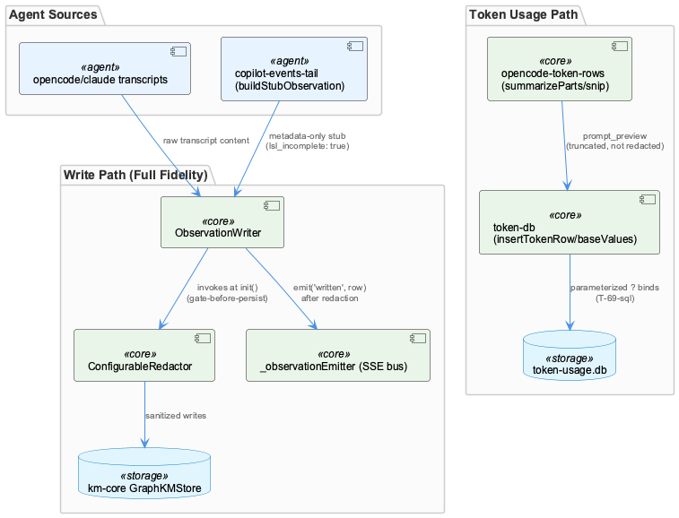
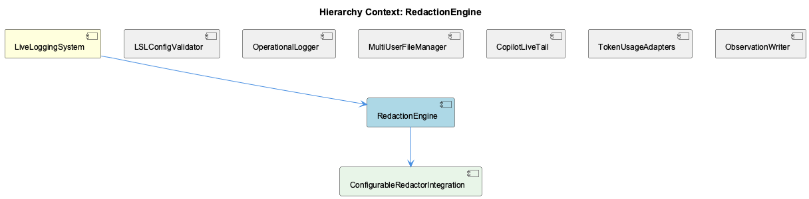

# RedactionEngine

**Type:** SubComponent

[LLM] None of the code excerpts supplied for this analysis (lib/lsl/live/copilot-events-tail.mjs, lib/lsl/token/opencode-token-rows.mjs, lib/lsl/token/token-db.mjs, src/live-logging/ObservationWriter.js, tests/agents/copilot-session-command.test.mjs) contain the RedactionEngine's own implementation — no class or module literally named RedactionEngine appears. The only concrete evidence of a redaction component is the import `import ConfigurableRedactor from './ConfigurableRedactor.js';` at src/live-logging/ObservationWriter.js:19 and the constructor comment noting `this.dbPath` is retained specifically 'as a path string used to derive `projectRoot` for the redactor' (ObservationWriter.js, Phase 44 Plan 13 comment block). This means the redaction subsystem is consumed, not defined, inside the files under review — any deeper architectural claim about RedactionEngine's internals (rule sets, regex patterns, PII categories) cannot be grounded in this evidence set and should be treated as external to what was reviewed.

# RedactionEngine — Technical Insight Document

## What It Is

RedactionEngine, as a SubComponent of LiveLoggingSystem, is not present in its own right within the reviewed file set — no class or module literally named `RedactionEngine` appears in any of the examined files (`lib/lsl/live/copilot-events-tail.mjs`, `lib/lsl/token/opencode-token-rows.mjs`, `lib/lsl/token/token-db.mjs`, `src/live-logging/ObservationWriter.js`, `tests/agents/copilot-session-command.test.mjs`). What is visible is its consumption point: `src/live-logging/ObservationWriter.js:19` imports `ConfigurableRedactor` (`import ConfigurableRedactor from './ConfigurableRedactor.js';`), and this concrete integration is modeled as the child component `ConfigurableRedactorIntegration`. The engine's true implementation — rule sets, PII categories, regex patterns — lives outside this evidence set. This document therefore describes RedactionEngine primarily through its externally observable contract: a gate invoked during `ObservationWriter.init()`, parameterized by `projectRoot` (derived from `this.dbPath`), that sits between raw session content and the canonical km-core store.

## Architecture and Design

The dominant pattern is **gate-before-persist**: the `init()` docstring in `ObservationWriter.js` states it "opens the km-core GraphKMStore ... and the PII/secret redactor," positioning ConfigurableRedactor in the mandatory hot path for every Observation, Digest, and Insight persisted via `writeObservation`. Since the Phase 44 Plan 12/13 SQLite→km-core cutover eliminated the dual-write window (per the file's CONTEXT R-4 reference), km-core is now the single canonical write target — meaning there is no secondary filter downstream of ObservationWriter. Any bypass or failure at this single gate leaks directly into the dashboard-visible knowledge store.

This design is reinforced by adjacent defense-in-depth conventions rather than a single centralized enforcement point. `token-db.mjs`'s `insertTokenRow`/`baseValues` coerce fields through `text()`/`num()` coalescers and bind exclusively via `?` placeholders (explicitly tagged "V5 / SQL-injection (T-69-sql)"), and `ObservationWriter`'s constructor enforces `if (retentionDays < 1) throw new Error(...)`. These "fail loud at construction" idioms are structurally analogous to what a redaction gate should enforce, suggesting the codebase treats sanitization — SQL, retention math, and PII — as a cross-cutting concern rather than one centralized subsystem, echoed by sibling MultiUserFileManager's convention-based (not class-based) ownership checks (`isOwnedByMe()`, `ownedDbPath()`).

## Implementation Details

The only concrete wiring evidence is the import statement and a docstring claim; no call site (`new ConfigurableRedactor(...)` or `.redact(...)`) is visible in the reviewed excerpt, so whether redaction runs synchronously, can throw, or is instantiated per-writer versus per-write remains unverified — this uncertainty is captured explicitly in child component `ConfigurableRedactorIntegration`. What is verifiable is that `this.dbPath` is deliberately retained in the constructor specifically "to derive `projectRoot` for the redactor," indicating redaction behavior is parameterized per-project rather than globally configured — a tight coupling between writer construction and redactor configuration.

Downstream of persistence, `ObservationWriter.js` maintains a module-level `_observationEmitter` EventEmitter (`setMaxListeners(32)`) that broadcasts a `written` event to SSE subscribers (e.g., `/api/coding/observations/stream`) via `_observationEmitter.emit('written', row)`. Because this emission occurs after km-core persistence — and thus after the redactor runs inside `init()`'s pipeline — every broadcast row is implicitly assumed already-redacted. This is a critical trust boundary: any reordering bug, or a test path using `_emitObservationWrittenForTests` that skips the redactor, would push unredacted content straight to live SSE clients with no further gate.

## Integration Points

RedactionEngine's scope is asymmetric across sibling components. CopilotLiveTail's `buildStubObservation()` constructs synthetic stub observations purely from lifecycle metadata (`agentName`, `agentDescription`, `started_at`/`completed_at`, `completion_status`), because Copilot CLI never persists inner reasoning to `events.jsonl`. These stubs, stamped `lsl_incomplete: true`, structurally cannot leak conversational PII since there's no inner content — sidestepping rather than solving the redaction problem for that agent, in contrast to full-fidelity opencode/claude-derived observations that carry raw transcript content requiring redaction.

A second, likely-unredacted surface exists in sibling TokenUsageAdapters: `opencode-token-rows.mjs`'s `summarizeParts()` builds a `prompt_preview` field from `p.text`, `input.filePath`, `input.description`, `input.pattern`, `input.command`, and `input.url`, relying only on `snip()` truncation (240/140/52-char caps) — not redaction. Since file paths, URLs, and commands can carry usernames, hostnames, or secrets, this appears to be a gap independent of ConfigurableRedactor's coverage, worth confirming against the engine's actual scope. This inconsistency is a key architectural note: redaction guarantees applied to observations/digests/insights via ObservationWriter may not extend to `token-usage.db`.

## Usage Guidelines

Developers should treat the ObservationWriter → RedactionEngine linkage as the single point of enforcement for the full-fidelity write path — any new write path into km-core must route through the same `init()`-established redactor rather than assuming a downstream filter exists, since none does post-cutover. When modifying `_observationEmitter` subscribers or test helpers (`_emitObservationWrittenForTests`), preserve ordering guarantees so redaction always precedes emission. When extending token-usage capture (`summarizeParts`/`snip`), evaluate whether `prompt_preview` content should route through the same redactor rather than relying on truncation alone. Finally, because `projectRoot` (derived from `dbPath`) parameterizes redactor configuration, any change to how ObservationWriter is constructed across projects should be checked against redaction config assumptions — particularly since LSLConfigValidator's `redaction-config.yaml` validation is a decoupled preflight check, not a runtime guarantee, per the parent LiveLoggingSystem's validator/runtime separation.

## Hierarchy Context

### Parent
- [LiveLoggingSystem](./LiveLoggingSystem.md) -- [LLM] The LiveLoggingSystem's validation layer (scripts/validate-lsl-config.js, LSLConfigValidator class) is architecturally decoupled from the runtime logging layer (integrations/semantic-analysis/src/logging.ts). This separation means a developer touching one file should be aware the other exists independently: the validator is a preflight/health-check tool invoked separately (likely via CLI or CI) to sanity-check `.specstory/config/lsl-config.json` and `redaction-config.yaml` before or during operation, while logging.ts is the actual hot-path code executed during live sessions. Bugs in schema validation won't crash live logging and vice versa, but a misconfigured lsl-config.json that passes validation with wrong runtime assumptions could still cause silent misbehavior in logging.ts if the two ever drift out of sync in their assumptions about field names or defaults.

### Children
- [ConfigurableRedactorIntegration](./ConfigurableRedactorIntegration.md) -- [LLM] The only concrete linkage between ObservationWriter and the redaction subsystem is a single import statement — `import ConfigurableRedactor from './ConfigurableRedactor.js';` at src/live-logging/ObservationWriter.js:19 — and a documentation claim inside the `init()` method's docstring that `init()` 'opens the km-core GraphKMStore ... and the PII/secret redactor.' No call site (e.g. `this.redactor = new ConfigurableRedactor(...)` or `redact(...)` invocation) appears in the supplied excerpt of ObservationWriter.js, meaning the integration's actual wiring — whether it runs synchronously before `putEntity`, whether it can throw, and whether it is instantiated once per writer or per write — is unverified from this evidence and rests entirely on the class-level comment's authority.

### Siblings
- [LSLConfigValidator](./LSLConfigValidator.md) -- [CGR] LSLConfigValidator (class) in validate-lsl-config.js
- [OperationalLogger](./OperationalLogger.md) -- Lives in integrations/semantic-analysis/src/logging.ts, the actual hot-path code executed during live sessions as opposed to the validator's preflight checks.
- [MultiUserFileManager](./MultiUserFileManager.md) -- [LLM] No file or class literally named `MultiUserFileManager` appears anywhere in the evidence provided (the code graph is empty and none of the four supplied files declare such a class). The responsibility implied by that name — routing file/database access safely across multiple OS users — is instead DISTRIBUTED across several independent guards: `validateUserEnvironment()` (referenced in the parent LiveLoggingSystem observations) derives a per-user hash to namespace session files, `isOwnedByMe()` in lib/lsl/live/copilot-events-tail.mjs checks file uid ownership before tailing another user's Copilot session directory, and `ownedDbPath()` in lib/lsl/token/opencode-token-rows.mjs performs the identical uid-check pattern before opening `opencode.db`. This SubComponent is therefore best understood as a cross-cutting concern realized by convention across the codebase rather than a single class — a developer looking for 'the multi-user file manager' would need to know to search for the `isOwnedByMe`/`ownedDbPath` idiom, not a single module.
- [CopilotLiveTail](./CopilotLiveTail.md) -- [LLM] The component's central architectural decision is a permanent, documented data-loss boundary rather than a bug to be fixed: copilot-events-tail.mjs states in its header that 'Copilot CLI emits ONLY subagent.started/subagent.completed/subagent.failed lifecycle events on disk' and that inner reasoning/tool calls are 'NEVER persisted to events.jsonl' — meaning 'The inner reasoning is FOREVER LOST — no live mitigation possible.' The code operationalizes this acceptance by stamping every observation with `lsl_incomplete: true` (constant `COPILOT_LSL_INCOMPLETE_REASON`) and building a synthetic two-message stub via `buildStubObservation()` instead of a real transcript, and by exposing the gap externally through a `lsl_incomplete_marker_present` heartbeat field referenced in the file's own comments. This is a deliberate degraded-parity contract, not an oversight, and any future 'fix' attempt should be redirected toward the heartbeat/health surface rather than toward trying to recover data that structurally does not exist on disk.
- [TokenUsageAdapters](./TokenUsageAdapters.md) -- [LLM] copilot-events-tail.mjs implements a poll-based file tail (tailEventsFile, TAIL_POLL_INTERVAL_MS=200) over Copilot's `~/.copilot/session-state/<uuid>/events.jsonl` rather than an fs.watch()-based approach, explicitly choosing statSync polling per RESEARCH-copilot.md Option A1. The module's own comments flag a hard architectural limitation: Copilot CLI persists only `subagent.started`/`subagent.completed`/`subagent.failed` lifecycle bookends to disk, never the sub-agent's actual messages or reasoning — so buildStubObservation() synthesizes a 2-message user/assistant exchange from spawn metadata alone, and every resulting observation is stamped `lsl_incomplete: true` with a locked note (COPILOT_LSL_INCOMPLETE_NOTE), a deliberately accepted, permanent data-loss gap rather than a bug to fix.
- [ObservationWriter](./ObservationWriter.md) -- src/live-logging/ObservationWriter.js routes all three write methods through km-core's putEntity via the legacy-ingest adapter (legacyObservationToEntity, legacyDigestToEntity, legacyInsightToEntity), per the Phase 44 hard-cutover decision (no dual-write, no feature flag).

---

*Generated from 9 observations*
