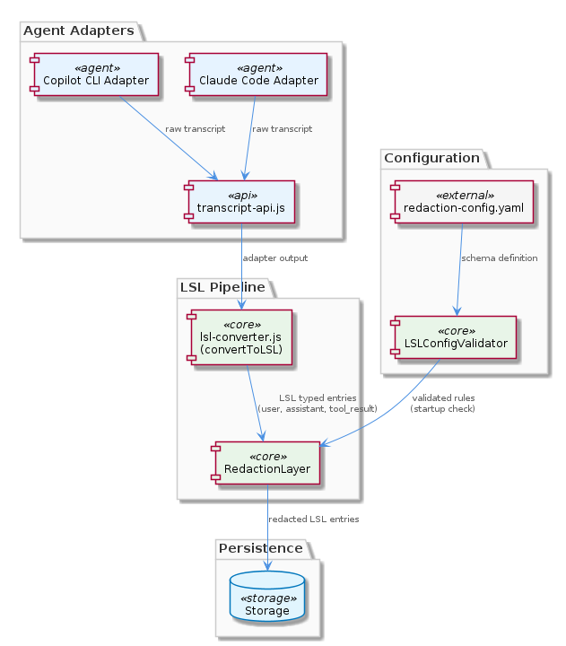
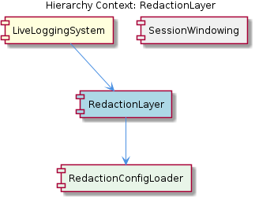

# RedactionLayer

**Type:** SubComponent

Because the redaction config is separate from agent-specific adapter code in transcript-api.js, a single redaction policy applies uniformly across all agent integrations (Claude Code, Copilot CLI, and future adapters), avoiding per-adapter privacy logic duplication.

# RedactionLayer — Deep Insight Document

## What It Is

The `RedactionLayer` is a SubComponent within the `LiveLoggingSystem` that enforces privacy policy on agent transcript data before it is persisted to storage. Its rules live in `.specstory/config/redaction-config.yaml`, a YAML artifact loaded at startup by its child `RedactionConfigLoader`. By externalizing redaction patterns into this configuration file, the layer decouples privacy policy from the converter and adapter logic, so operators can adjust patterns without touching `lib/agent-api/transcript-api.js` or the `convertToLSL()` normalization in `lsl-converter.js`.

Structurally, the `RedactionLayer` sits as a mandatory pipeline stage between `convertToLSL()` and the final write step. Once `TranscriptAdapter` subclasses (such as the Claude Code adapter reading from `~/.claude/projects/<project>/conversation.jsonl` and the Copilot CLI adapter targeting a different directory structure) produce LSL typed-entries — `user`, `assistant`, `tool_use`, `tool_result`, `system`, and `error` — the `RedactionLayer` scans each field for matches against the configured patterns and rewrites them before persistence.

This positioning makes the `RedactionLayer` a single, uniform enforcement point: regardless of which agent integration generated the entries upstream, the same redaction rules apply downstream. The layer is therefore both an operational control (governed by configuration) and a structural invariant (guaranteed by pipeline ordering).

## Architecture and Design

The architectural approach centers on **configuration-driven policy enforcement** combined with **pipeline interposition**. Rather than embed PII scrubbing logic inside each agent adapter — which would create per-adapter duplication and drift risk — the design lifts redaction into a single layer that consumes all output from `convertToLSL()`. This is a classic *separation of concerns* pattern: adapters know about *agent formats*, the converter knows about *LSL normalization*, and the `RedactionLayer` knows about *privacy policy*.

A key architectural decision is **fail-fast validation**. `LSLConfigValidator` enforces a `redactionConfig` schema, so any malformed rule (invalid regex, missing required field) raises an error at startup rather than silently failing during a live conversation. This is critical for a privacy component: a runtime failure in redaction could mean sensitive data is written unredacted before the error surfaces. By validating at boot, the system guarantees that if the pipeline starts, the redaction policy is at least syntactically sound.

The relationship between this layer and its peers reflects a layered pipeline design. Its sibling, `SessionWindowing`, operates on a different dimension of the same entries — it manages the `LSLMetadata.timeWindow` field with fixed 60-minute bucketing (`'0800-0900'` strings) — while `RedactionLayer` operates on entry *content*. The two are orthogonal concerns: windowing decides *where* entries land in time, redaction decides *what* they may contain.

The pattern-based matching strategy implies the layer iterates over every entry type emitted by `convertToLSL()` and applies the configured regex/glob patterns to relevant string fields. This is a uniform-traversal design rather than a type-specific one, which keeps the layer simple but requires that the configuration vocabulary be expressive enough to target fields differentially when needed.

## Implementation Details

The `RedactionLayer` delegates configuration loading to its child component `RedactionConfigLoader`, which targets `.specstory/config/redaction-config.yaml` as its canonical source. At pipeline startup, the loader reads this file, and `LSLConfigValidator` checks the loaded structure against the `redactionConfig` schema. Validation covers both structural correctness (required fields present) and pattern validity (regex compilation succeeds), ensuring runtime application is safe.

During the live pipeline, after a `TranscriptAdapter` subclass's `readTranscripts()` and `convertToLSL()` methods emit normalized typed-entries, the `RedactionLayer` iterates across all entry types — `user`, `assistant`, `tool_use`, `tool_result`, `system`, and `error` — and applies its compiled patterns to the textual fields of each. Because adapters share the same LSL typed-entry contract enforced by the parent `TranscriptAdapter` abstract class in `lib/agent-api/transcript-api.js`, the redaction logic can rely on a stable, uniform input shape regardless of upstream source.

The implementation is necessarily *transformational rather than filtering*: matched substrings are rewritten (typically to a placeholder), not entries dropped. This preserves the structural integrity of the LSL stream — `getCurrentSession()` and downstream session-boundary detection continue to see the entries in their original ordering — while removing the sensitive payload.

## Integration Points

The `RedactionLayer` integrates with three major surfaces. Upstream, it consumes the output of `convertToLSL()` in `lsl-converter.js`, which means it depends on the stable LSL typed-entry contract that all `TranscriptAdapter` subclasses honor. This contract is defined by the parent `LiveLoggingSystem`'s plugin model — the five abstract methods (`getAgentType()`, `getTranscriptDirectory()`, `readTranscripts()`, `convertToLSL()`, `getCurrentSession()`) that any new agent integration (e.g., Cursor, Aider) must implement.

Downstream, the `RedactionLayer` precedes the persistence step, making it the last transformation before bytes are written. This ordering is the system's guarantee that no raw PII reaches storage. Sideways, it interoperates with `SessionWindowing` (its sibling), which annotates entries with `LSLMetadata.timeWindow` values; the two transformations are independent and commutative in practice, though redaction is the one that must occur before write.

Configuration integration flows through `RedactionConfigLoader` (child) and `LSLConfigValidator` (validation peer). The loader owns the I/O against `.specstory/config/redaction-config.yaml`; the validator owns the schema gate. Because the configuration lives outside any adapter-specific code path, it forms a *single point of policy* — one file governs Claude Code, Copilot CLI, and every future adapter uniformly.

## Usage Guidelines

Operators updating redaction policy should edit `.specstory/config/redaction-config.yaml` directly and restart the pipeline; the `LSLConfigValidator` will report schema or regex errors at startup, so iterating on patterns is safe. Never embed redaction logic inside a `TranscriptAdapter` subclass — doing so would bypass the central policy and risk inconsistency across agents. The design intent is clear: agent-specific code in `transcript-api.js` handles *format*, while `.specstory/config/redaction-config.yaml` handles *policy*.

When adding a new agent integration, developers should rely on the fact that the `RedactionLayer` will uniformly process whatever typed-entries their `convertToLSL()` produces, provided those entries conform to the standard LSL types (`user`, `assistant`, `tool_use`, `tool_result`, `system`, `error`). There is no need to register a new adapter with the redaction layer or extend the configuration per-adapter — the uniform traversal handles all sources by construction.

For testing, treat the configuration file as part of the deployable artifact. Because validation occurs at startup, a misconfigured rule will prevent the pipeline from starting rather than corrupting persisted data — a deliberate trade-off favoring safety over availability. When adding new redaction patterns, prefer specific anchored regexes over broad ones to minimize false positives that could destroy useful transcript context.

---

### Synthesis Summary

1. **Architectural patterns identified**: Configuration-driven policy enforcement, pipeline interposition, separation of concerns (format vs. normalization vs. policy), fail-fast startup validation, and uniform traversal over a typed-entry contract.

2. **Design decisions and trade-offs**: Externalizing rules to YAML trades a small startup-time cost and configuration-management overhead for operator agility and avoidance of code changes for policy updates. Startup validation trades availability (pipeline refuses to start on bad config) for safety (no unredacted writes). Centralizing redaction trades per-adapter flexibility for cross-adapter consistency.

3. **System structure insights**: The `RedactionLayer` is one of two sibling transformations under `LiveLoggingSystem` (alongside `SessionWindowing`), operating on entry *content* while its sibling operates on entry *time-bucketing*. Its child `RedactionConfigLoader` isolates I/O concerns from transformation concerns.

4. **Scalability considerations**: Pattern matching is O(patterns × fields × entries) per pipeline tick; scaling depends on keeping the pattern set compact and well-anchored. Because rules are uniform across adapters, adding new agent integrations does not multiply redaction cost beyond the additional entry volume they produce.

5. **Maintainability assessment**: High. The single-file configuration, schema-validated at startup, gives a clear edit surface. The absence of per-adapter privacy code eliminates the most common drift vector. The clean contract boundary at `convertToLSL()` output means the layer's internals can evolve without affecting adapters or storage, and vice versa.

## Hierarchy Context

### Parent
- [LiveLoggingSystem](./LiveLoggingSystem.md) -- [LLM] The TranscriptAdapter class in lib/agent-api/transcript-api.js establishes a strict plugin contract for integrating new agent conversation sources into the LSL pipeline. It requires five abstract methods: getAgentType(), getTranscriptDirectory(), readTranscripts(), convertToLSL(), and getCurrentSession(). This design cleanly separates concerns — the base class owns the lifecycle and dispatch logic, while subclasses own the format-specific parsing. Claude Code transcripts live at ~/.claude/projects/<project>/conversation.jsonl, a JSONL file that grows append-only during a session; the Copilot CLI adapter targets a different directory structure. The convertToLSL() method is the normalization seam, responsible for mapping each agent's native message structure into the unified LSL typed-entry format with types: user, assistant, tool_use, tool_result, system, and error. A new developer adding a third agent integration (e.g., Cursor, Aider) only needs to subclass TranscriptAdapter and implement these five methods — no changes to the core LSL infrastructure are required. The getCurrentSession() method is particularly important: it must return the 'live' session object so the polling loop knows which entries are part of the current conversation versus a historical one, which implies adapters must implement their own session-boundary detection logic appropriate to their agent's format.

### Children
- [RedactionConfigLoader](./RedactionConfigLoader.md) -- The L2 sub-component description explicitly names .specstory/config/redaction-config.yaml as the canonical location for redaction rules, establishing a single configuration artifact that the loader must target at pipeline startup.

### Siblings
- [SessionWindowing](./SessionWindowing.md) -- The LSLMetadata.timeWindow field, referenced across transcript-api.js and lsl-converter.js, encodes session time boundaries as hour-range strings (e.g., '0800-0900'), indicating a fixed 60-minute bucketing granularity rather than variable-length sessions.

---

*Generated from 5 observations*
