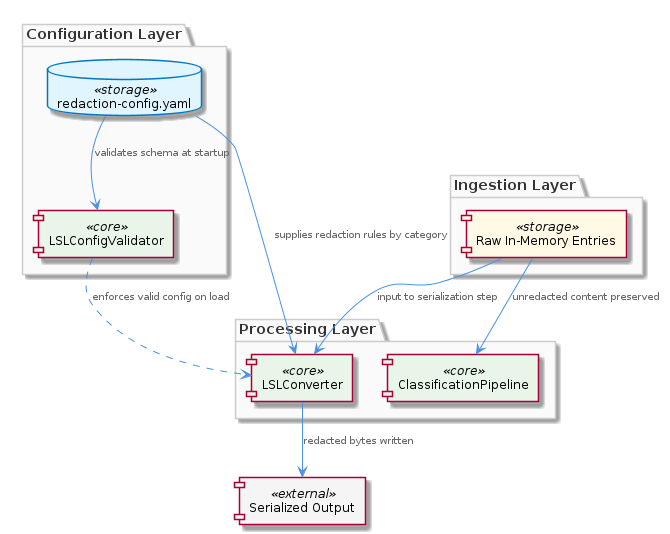
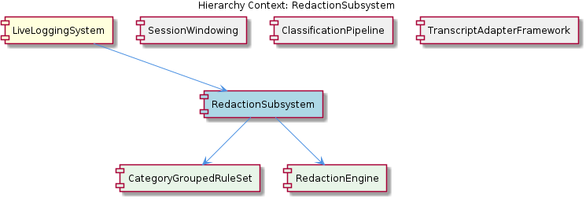

# RedactionSubsystem

**Type:** SubComponent

LSLConverter applies redaction during its serialization step, meaning redaction is the last transformation before bytes are written — raw in-memory entries retain original content for classification purposes

# RedactionSubsystem — Technical Insight Document

## What It Is

The RedactionSubsystem is a configuration-driven, category-organized sensitive-content scrubbing layer within the `LiveLoggingSystem`. Its configuration lives at `.specstory/config/redaction-config.yaml`, where redaction rules are partitioned into named category blocks rather than expressed as a flat list of patterns. Validation of that file is performed by `LSLConfigValidator` at startup, and the actual scrubbing transformation is invoked from within `LSLConverter` during its serialization step — placing redaction at the final boundary between in-memory log entries and the bytes written to disk.

Structurally, the subsystem decomposes into two child components: `CategoryGroupedRuleSet`, which encapsulates the parsed `category-name → [pattern list]` data model loaded from the YAML configuration, and `RedactionEngine`, which is invoked by `LSLConverter` to apply those patterns during serialization. Together they form a clean separation between configuration data (what to redact) and execution logic (how to redact).

## Architecture and Design

The architecture exhibits a clear **configuration-as-data** pattern: operators express policy in `redaction-config.yaml` through named category groups (likely containing regex or pattern-based rules per the per-category structure observed), and the runtime code remains policy-agnostic. This lets operators toggle entire rule groups on or off without touching individual patterns or recompiling — a deliberate ergonomic choice for security-sensitive operations where redaction policy evolves faster than code.

A second architectural decision worth highlighting is the **late-binding** placement of redaction inside `LSLConverter`'s serialization step rather than at ingestion. This is deliberate: the sibling `ClassificationPipeline` (which implements the five-layer ordered classification documented in `docs/puml/lsl-5-layer-classification.puml`) operates on the *unredacted* in-memory entries, preserving full signal <USER_ID_REDACTED> for layered classification decisions. Only at the moment of writing bytes does `RedactionEngine` strip sensitive content. The trade-off is clear: classification accuracy is prioritized over defense-in-depth, with the assumption that in-memory entries are transient and that the serialized artifact is the trust boundary.

A third pattern is **fail-loud validation**. `LSLConfigValidator` validates `redaction-config.yaml`'s schema at startup; malformed or missing category rules cause an explicit failure rather than silent pass-through of sensitive content. This is the correct safety posture for a redaction subsystem, where the consequence of a silently-broken rule is data leakage.

## Implementation Details

The `CategoryGroupedRuleSet` child component models the parsed configuration as a map of `category-name → [pattern list]`. This shape is dictated directly by the YAML structure in `.specstory/config/redaction-config.yaml`, where each top-level category block enumerates the patterns belonging to that domain. The category grouping is the unit of enable/disable control, meaning the loader and the engine must both reason in terms of categories rather than treating patterns as a global set.

The `RedactionEngine` child component performs the actual matching and substitution. It is invoked exclusively from within `LSLConverter` as part of serialization — making it the *last* transformation before bytes leave the process. This placement contrasts with sibling components like `SessionWindowing` (which manages file rotation thresholds via `lsl-config.json`) and `ClassificationPipeline` (which runs over raw, pre-redaction entries). The implication is that any code path which writes log content *must* route through `LSLConverter` to benefit from redaction; bypassing `LSLConverter` would bypass redaction entirely.

`LSLConfigValidator` is coupled tightly to the schema of `redaction-config.yaml`. Beyond startup validation, this coupling has runtime implications: any future hot-reload mechanism for redaction configuration must re-invoke `LSLConfigValidator` before swapping the active `CategoryGroupedRuleSet`, otherwise an invalid in-memory rule set could silently fail to match sensitive content.

## Integration Points

The subsystem's primary upstream integration is with `LSLConverter`, the serializer in the parent `LiveLoggingSystem`. `LSLConverter` calls into `RedactionEngine` during serialization, treating redaction as an inline transformation rather than a post-processing filter. This integration point is what guarantees sensitive data never reaches the serialized output layer.

The subsystem's configuration-side integration is with `LSLConfigValidator`, which gates the loading of `redaction-config.yaml`. This is the contract enforcement layer — any new category, any pattern schema change, must flow through the validator. The validator's startup-time invocation means misconfigured systems fail fast rather than running in a degraded redaction state.

In contrast to its peers — `TranscriptAdapterFramework` (which exposes the `TranscriptAdapter` abstract base in `lib/agent-api/transcript-api.js` with its five abstract methods), `SessionWindowing` (which manages rotation policy via `lsl-config.json`), and `ClassificationPipeline` (which operates on raw entries) — `RedactionSubsystem` is uniquely positioned at the serialization boundary. It does not interact directly with the transcript adapters or the classification layers; it sees only what `LSLConverter` hands it, after classification has already enriched the entries.

## Usage Guidelines

When adding or modifying redaction rules, operators should work within the existing category structure in `.specstory/config/redaction-config.yaml`. New patterns should be placed inside the most appropriate existing category, or a new category block should be created if no semantic match exists — this preserves the operator's ability to toggle entire groups without surgical edits. Avoid flattening patterns across categories, as this defeats the design intent of group-level enable/disable.

Developers extending the system must respect two invariants. First, **never bypass `LSLConverter` when writing log content** — redaction is applied there and only there, so any alternative serialization path would leak unredacted data. Second, **any runtime configuration refresh logic must re-invoke `LSLConfigValidator`** before swapping the active rule set. The validator-to-config coupling is a deliberate safety mechanism, and hot-reload paths that skip validation reintroduce the very silent-failure mode the startup validation was designed to prevent.

When debugging classification behavior, developers should remember that `ClassificationPipeline` sees *unredacted* content by design. If a classification layer appears to act on sensitive substrings, that is correct and intended — the redaction occurs downstream during `LSLConverter` serialization. Conversely, if redacted output appears to be missing patterns, the investigation should focus on `redaction-config.yaml` category definitions and the `LSLConfigValidator` startup logs, not on the classification layers.

Finally, recognize the architectural trade-off: in-memory log entries between ingestion and serialization contain unredacted content. Any tooling, debugging tap, or memory dump that intercepts entries before `LSLConverter` will expose sensitive data. New components that consume in-memory entries (siblings to `ClassificationPipeline`) must be reviewed for whether they themselves create new serialization paths that need to route through `RedactionEngine`.

## Hierarchy Context

### Parent
- [LiveLoggingSystem](./LiveLoggingSystem.md) -- [LLM] The TranscriptAdapter abstract base class (lib/agent-api/transcript-api.js) establishes a well-defined polymorphic contract for all agent-specific transcript integrations. The class mandates five abstract methods — getAgentType(), getTranscriptDirectory(), readTranscripts(), convertToLSL(), and getCurrentSession() — which subclasses must implement to describe their agent-specific filesystem layout and data format. Crucially, the base class contributes a concrete, shared implementation of watchTranscripts() that uses a setInterval polling loop with a lastEntryCount cursor to track new entries since the previous tick. This design decision deliberately centralizes the polling mechanism so that every adapter (e.g., one for Claude Code, potentially others for different agents) benefits from the same incremental-read logic without duplicating it. The cursor-based approach means the adapter never re-processes already-seen entries on each interval tick — it reads the full transcript list, slices from lastEntryCount onward, and updates the cursor, a lightweight but effective strategy for append-only log files. A new developer extending this system should be aware that adding a new agent integration requires only implementing the five abstract methods; the polling lifecycle and entry deduplication are inherited for free.

### Children
- [CategoryGroupedRuleSet](./CategoryGroupedRuleSet.md) -- The RedactionSubsystem's core design decision, as described in the SubComponent context, is that .specstory/config/redaction-config.yaml partitions rules into named category blocks — this means the data model the RedactionRuleLoader parses is a map of category-name → [pattern list], not a flat list of patterns.
- [RedactionEngine](./RedactionEngine.md) -- Per the parent component analysis, RedactionEngine is invoked by LSLConverter during serialization — meaning redaction is applied as a transformation step inside the log pipeline, not as a post-processing filter, ensuring sensitive data never reaches the serialized output layer.

### Siblings
- [SessionWindowing](./SessionWindowing.md) -- lsl-config.json defines fileManager rotation thresholds that trigger time-slot bucket transitions, preventing unbounded growth of individual transcript files
- [ClassificationPipeline](./ClassificationPipeline.md) -- docs/puml/lsl-5-layer-classification.puml diagrams five discrete classification layers, establishing a strict ordered pipeline where each layer's output can inform subsequent layers rather than operating independently
- [TranscriptAdapterFramework](./TranscriptAdapterFramework.md) -- TranscriptAdapter in lib/agent-api/transcript-api.js declares five abstract methods — getAgentType(), getTranscriptDirectory(), readTranscripts(), convertToLSL(), and getCurrentSession() — forming the mandatory interface for any new agent integration

---

*Generated from 6 observations*
